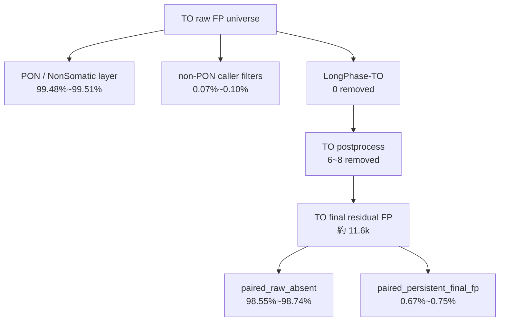

<!--
建立時間: 2026-03-22 15:45
目標: 用一頁式摘要交代 TO FP provenance、paired oracle 與 TO-only 規則驗證的結論
關聯檔案:
  - /big7_disk/liaoyoyo2001/InterSubMod/docs/reports/validated/2026/03/20260322_TO_FP來源分解與paired對照分析_01.md
  - /big7_disk/liaoyoyo2001/big7_disk_output/synthesis/observation_workspaces/20260322_to_fp_provenance_analysis/sample_level_summary.tsv
-->

<!-- PATH WARNING (2026-04-11 驗證):
本報告中部分絕對路徑已失效。類別: workspace 已重命名: 20260322_to_fp_provenance_analysis → _before_hp_fix
詳細路徑清單見 docs/data_specs/20260411_path_inventory.tsv
報告結論仍有效，但引用的外部路徑可能需要更新。
-->

# TO FP 來源分解摘要（2026-03-22）

## 一句結論

在目前 big7 的 `HCC1395` 與 `HCC1395_DORADO` TO pilot 中，**TO FP 的主清洗層是 caller 端的 PON / NonSomatic；LongPhase-TO 幾乎沒有作用；真正留到 TO final 的殘留 FP 又有超過 99% 是 paired context 可解，而且主因幾乎全是 `paired_raw_absent`。**

換句話說，TO 最難的問題不是少數有 normal alt 支持卻沒被用到的位點，而是 **沒有 normal 時，TO raw caller 本身會多長出 paired raw 根本不會吐出的候選 universe**。在這個前提下，本次沒有找到任何新的 TO-only hard rule 可以超過 current big7 TO final F1。

## 已完成

| 項目 | 結果 | 核心判讀 |
| --- | --- | --- |
| big7 observation workspace 建立 | [20260322_to_fp_provenance_analysis](/big7_disk/liaoyoyo2001/big7_disk_output/synthesis/observation_workspaces/20260322_to_fp_provenance_analysis) | 已把 `HCC1395` 與 `HCC1395_DORADO` 的 TO raw FP、paired oracle、特徵比較與 rule sweep 全部落地 |
| TO raw FP stage provenance | `HCC1395 raw FP=2,731,541`；`DORADO raw FP=2,724,904` | raw TO FP universe 幾乎都在 caller PON / NonSomatic 層就被擋掉 |
| PON 層確認 | `caller_pon_filtered` 100% 帶顯式 `PoN_1..PoN_4` tag | 這次可以直接把這層視為 `PON / NonSomatic` caller veto |
| LongPhase-TO 影響確認 | 兩個樣本 `longphase_to_removed=0` | 在目前 big7 TO pilot 上，LongPhase-TO 沒有額外清掉 FP |
| paired oracle 分解 | TO final residual FP 中 `>99%` 是 paired 可解 | 但主因不是 `normal_alt_support`，而是 `paired_raw_absent` |
| TO-only rule sweep | `HCC1395` discovery 與 `DORADO` validation 都沒有新觸發 | 目前沒有新規則超過 current TO final F1 |

## 核心數字

### 1. TO raw FP 是在哪一層被處理

| sample | PON / NonSomatic | non-PON caller filters | LongPhase-TO | TO postprocess | TO final residual FP |
| --- | ---: | ---: | ---: | ---: | ---: |
| `HCC1395` | `2,717,339` (`99.4801%`) | `2,596` (`0.0950%`) | `0` | `8` | `11,598` |
| `HCC1395_DORADO` | `2,711,492` (`99.5078%`) | `1,836` (`0.0674%`) | `0` | `6` | `11,570` |

### 2. TO final residual FP 若有 paired normal，主要會去哪裡

| sample | paired raw absent | paired raw artifact filtered | normal alt support | paired LongPhase-S removed | paired persistent final FP |
| --- | ---: | ---: | ---: | ---: | ---: |
| `HCC1395` | `11,430` (`98.5515%`) | `63` (`0.5432%`) | `0` | `18` (`0.1552%`) | `87` (`0.7501%`) |
| `HCC1395_DORADO` | `11,424` (`98.7381%`) | `64` (`0.5532%`) | `1` (`0.0086%`) | `4` (`0.0346%`) | `77` (`0.6655%`) |

### 3. 目前 TO final rule 的真實作用

| sample | baseline F1 | final F1 | 規則實際效果 |
| --- | ---: | ---: | --- |
| `HCC1395` | `0.7166` | `0.7167` | `8 FP / 4 TP`，微幅正增益 |
| `HCC1395_DORADO` | `0.7226` | `0.7224` | `6 FP / 15 TP`，微幅負增益 |

## 未完成

| 項目 | 為何還沒完成 |
| --- | --- |
| `paired_persistent_final_fp` 的更細 region-level 診斷 | 目前只先做到 workspace 級分解與特徵摘要，尚未逐位點回查 `77~87` 個真正 hard blind spots |
| annotation / ranking 落地 | `PairwiseMedianDist / hp_assign_rate / agreement_type` 仍只是在分析層，還沒接回日常 dashboard / ranking |
| TO hard rule 新增益 | 本次所有 TO-only feature family 都已驗證到 current final set 上，但還沒有找到能超過 current final 的新規則 |

## 下一輪建議

| 優先級 | 建議 | 原因 |
| --- | --- | --- |
| `P0` | 直接聚焦 `paired_persistent_final_fp` (`HCC1395=87`, `DORADO=77`) | 這才是真正補了 normal 也沒完全解掉的 hard subset |
| `P1` | 把 `PairwiseMedianDist / hp_assign_rate / agreement_type` 留在 annotation / ranking，而不是硬門檻 | 現在它們能解釋少量已刪掉的 artifact-like 位點，但不足以形成穩定新規則 |
| `P1` | 後續 TO 研究把 `paired_raw_absent` 視為「missing-normal candidate universe expansion」而不是簡化成 germline | 這樣才不會把 paired oracle 過度解讀成直接 normal 支持 |
| `P2` | 若要再做 cross-platform 規則，先用 `5kHz` 發現、`DORADO` 驗證的雙層口徑維持不變 | 這次 `5kHz` 發現規則在 `DORADO` validation 仍是 `0 trigger` |

## 參考檔案

1. [完整報告](/big7_disk/liaoyoyo2001/InterSubMod/docs/reports/validated/2026/03/20260322_TO_FP來源分解與paired對照分析_01.md)
2. [sample_level_summary.tsv](/big7_disk/liaoyoyo2001/big7_disk_output/synthesis/observation_workspaces/20260322_to_fp_provenance_analysis/sample_level_summary.tsv)
3. [fp_primary_class_summary.tsv](/big7_disk/liaoyoyo2001/big7_disk_output/synthesis/observation_workspaces/20260322_to_fp_provenance_analysis/fp_primary_class_summary.tsv)
4. [paired_oracle_resolution_summary.tsv](/big7_disk/liaoyoyo2001/big7_disk_output/synthesis/observation_workspaces/20260322_to_fp_provenance_analysis/paired_oracle_resolution_summary.tsv)
5. [tp_fp_feature_comparison.tsv](/big7_disk/liaoyoyo2001/big7_disk_output/synthesis/observation_workspaces/20260322_to_fp_provenance_analysis/tp_fp_feature_comparison.tsv)
6. [to_rule_sweep_summary.tsv](/big7_disk/liaoyoyo2001/big7_disk_output/synthesis/observation_workspaces/20260322_to_fp_provenance_analysis/to_rule_sweep_summary.tsv)
