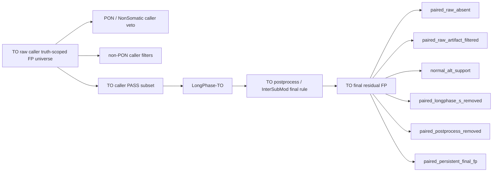

<!--
建立時間: 2026-03-22 15:45
目標: 以 big7 正式輸出為基礎，分解 TO raw FP 來源、paired oracle 可解比例、甲基特徵差異與 TO-only 規則可行性
處理範圍:
  - HCC1395 5kHz TO / paired
  - HCC1395_DORADO TO / paired
  - big7 observation workspace: 20260322_to_fp_provenance_analysis
關聯檔案:
  - /big7_disk/liaoyoyo2001/big7_disk_output/synthesis/observation_workspaces/20260322_to_fp_provenance_analysis/analysis_report.md
  - /big7_disk/liaoyoyo2001/big7_disk_output/synthesis/observation_workspaces/20260319_to_fp_normal_solved_analysis/analysis_report.md
  - /big7_disk/liaoyoyo2001/InterSubMod/docs/reports/validated/2026/03/20260311_研究主線週報_20260305_20260311_phase2_annotation整合_01.md
-->

# TO FP 來源分解與 paired 對照分析（2026-03-22）

## 重點結論

1. 在目前 big7 的 `HCC1395` 與 `HCC1395_DORADO` TO pilot 中，**TO raw caller truth-scoped FP universe 的主要清洗層其實是 caller 端的 PON / NonSomatic 層**，占比都超過 `99.48%`；而且這批 `caller_pon_filtered` 在本次 workspace 中 **100% 都帶有顯式 `PoN_1..PoN_4` tag**。
2. **LongPhase-TO 在這兩個 TO pilot 上對 FP 沒有額外過濾效果**，`longphase_to_removed=0`；真正進入 TO 最終 residual FP 的，約只占 raw TO FP universe 的 `0.4246%`。
3. 對這批 TO 最終 residual FP 再用 paired oracle 分解後，**超過 `99%` 都屬 paired context 可解**，而且幾乎全部都是 `paired_raw_absent`，不是 `normal_alt_support`。這代表 TO 困難點主要不是一群「有 normal 明確 alt 支持、但 TO 缺 normal 才漏掉」的位點，而是 **沒有 normal/context 時，TO raw caller 會額外長出大量 paired raw 根本不會吐出的候選**。
4. 目前 TO 後處理已經把最典型的 `low AF + high AlleleDelta + cluster_plus_weak_label` 小子集先拿掉，但這個子集很小：`HCC1395` 只移除 `8 FP / 4 TP`，`DORADO` 只移除 `6 FP / 15 TP`。把同類甲基 / 輸出特徵再往外推，**沒有找到任何一條 TO-only 規則可以超過目前 big7 TO final F1**。

## 1. 問題定義與分析口徑

本報告回答四個問題：

1. TO raw FP 中，哪些已在 `PON / caller filter / LongPhase-TO / TO postprocess` 各層被處理。
2. TO 最終殘留 FP 中，哪些在 paired 有 normal 資訊時可被解掉。
3. 這些 FP 的甲基與輸出特徵，是否存在可重複、可轉成 TO-only hard rule 的分布差異。
4. 若只允許使用 TO 可取得欄位，是否能在目前 big7 TO final 結果上再提升 F1。

本次固定使用兩個 universe：

- `Universe A`：TO raw caller 在 truth high-confidence BED 內的 **所有 raw FP**。
- `Universe B`：經過現有 TO 流程後仍保留的 **TO final residual FP**。

paired 只作 oracle，不作最終規則來源：

- `paired_raw_absent`
- `paired_raw_artifact_filtered`
- `normal_alt_support`
- `paired_longphase_s_removed`
- `paired_postprocess_removed`
- `paired_persistent_final_fp`

其中 `caller_pon_filtered` 在本報告中的定義是：

- caller `FILTER` 含 `NonSomatic`
- 並且 / 或 VCF `INFO` 帶有 `PoN_1..PoN_4`

本次對 master table 的再檢查結果是：`HCC1395` 與 `HCC1395_DORADO` 的 `caller_pon_filtered` **全部都帶有顯式 `PoN_1..PoN_4` tag**，因此這一層可以直接視為 `PON / NonSomatic` caller veto layer。

## 2. 資料來源與 big7 輸出確認

本次正式分析 workspace：

- [20260322_to_fp_provenance_analysis](/big7_disk/liaoyoyo2001/big7_disk_output/synthesis/observation_workspaces/20260322_to_fp_provenance_analysis)

樣本與上游來源：

| sample | TO round | paired canonical | TO raw VCF | paired raw VCF |
| --- | --- | --- | --- | --- |
| `HCC1395` | [/big7_disk/liaoyoyo2001/big7_disk_output/synthesis/research_rounds/20260315_hcc1395_to_pilot](/big7_disk/liaoyoyo2001/big7_disk_output/synthesis/research_rounds/20260315_hcc1395_to_pilot) | [/big7_disk/liaoyoyo2001/big7_disk_output/canonical/HCC1395/paired_full/20260314_HCC1395_paired_full_full_complete_matrix](/big7_disk/liaoyoyo2001/big7_disk_output/canonical/HCC1395/paired_full/20260314_HCC1395_paired_full_full_complete_matrix) | `/big8_disk/data/HCC1395/ONT/ClairS_TO_v0_3_0/snv.vcf.gz` | `/big8_disk/data/HCC1395/ONT/ClairS_v0_4_0/output.vcf.gz` |
| `HCC1395_DORADO` | [/big7_disk/liaoyoyo2001/big7_disk_output/synthesis/research_rounds/20260315_hcc1395_dorado_to_pilot](/big7_disk/liaoyoyo2001/big7_disk_output/synthesis/research_rounds/20260315_hcc1395_dorado_to_pilot) | [/big7_disk/liaoyoyo2001/big7_disk_output/canonical/HCC1395_DORADO/paired_full/20260315_HCC1395_DORADO_paired_full_full_complete_matrix](/big7_disk/liaoyoyo2001/big7_disk_output/canonical/HCC1395_DORADO/paired_full/20260315_HCC1395_DORADO_paired_full_full_complete_matrix) | `/big8_disk/data/HCC1395/ONT_Dorado/ClairS_TO_v0_3_0/snv.vcf.gz` | `/big8_disk/data/HCC1395/ONT_Dorado/ClairS_v0_4_0/output.vcf.gz` |

> 注意：本報告所有指標都以 `2026-03-22` 當下的 big7 workspace 為準，也就是 [sample_level_summary.tsv](/big7_disk/liaoyoyo2001/big7_disk_output/synthesis/observation_workspaces/20260322_to_fp_provenance_analysis/sample_level_summary.tsv) 中的現行數字。若與較早文件中提到的 `0.7130` 等數字不同，應以這次明確對應 big7 路徑的 snapshot 為準。

## 3. TO raw FP 來源分解

### 3.1 stage-level 分解

| sample | TO raw FP total | PON / NonSomatic layer | non-PON caller filters | LongPhase-TO removed | TO postprocess removed | TO final residual FP |
| --- | ---: | ---: | ---: | ---: | ---: | ---: |
| `HCC1395` | `2,731,541` | `2,717,339` (`99.4801%`) | `2,596` (`0.0950%`) | `0` (`0.0000%`) | `8` (`0.0003%`) | `11,598` (`0.4246%`) |
| `HCC1395_DORADO` | `2,724,904` | `2,711,492` (`99.5078%`) | `1,836` (`0.0674%`) | `0` (`0.0000%`) | `6` (`0.0002%`) | `11,570` (`0.4246%`) |

### 3.2 PON 層細節

| sample | caller_pon_filtered | 顯式 `PoN_1..PoN_4` tag | top filter detail 1 | top filter detail 2 |
| --- | ---: | ---: | --- | --- |
| `HCC1395` | `2,717,339` | `2,717,339` (`100%`) | `NonSomatic` `2,693,947` | `LowQual;NonSomatic` `23,392` |
| `HCC1395_DORADO` | `2,711,492` | `2,711,492` (`100%`) | `NonSomatic` `2,690,080` | `LowQual;NonSomatic` `21,412` |

**回答原始問題的第一層結論：**

1. `PON` 處理掉的 FP 是絕對主體，而且不是模糊推測；本次 master table 檢查顯示這批 caller veto 都帶有顯式 `PoN_1..PoN_4` tag。
2. 純 caller 非 PON filter 只能處理很小一群，主要是 `LowQual;VariantCluster` 及其變體。
3. `LongPhase-TO` 在這兩個 big7 TO pilot 中 **沒有額外刪掉任何 truth-scoped raw FP**。
4. 真正能走到 TO 最終殘留的 FP，只是 raw TO FP universe 的極小尾端。

## 4. TO 最終 residual FP 的 paired oracle 去向

### 4.1 paired oracle 分解（以 TO final residual FP 為母體）

| sample | TO final residual FP | paired raw absent | paired raw artifact filtered | normal alt support | paired LongPhase-S removed | paired persistent final FP |
| --- | ---: | ---: | ---: | ---: | ---: | ---: |
| `HCC1395` | `11,598` | `11,430` (`98.5515%`) | `63` (`0.5432%`) | `0` | `18` (`0.1552%`) | `87` (`0.7501%`) |
| `HCC1395_DORADO` | `11,570` | `11,424` (`98.7381%`) | `64` (`0.5532%`) | `1` (`0.0086%`) | `4` (`0.0346%`) | `77` (`0.6655%`) |

### 4.2 paired oracle 的研究意義

1. TO 最終 residual FP 中，**真正因為 normal 明確 alt 支持而能直接標成 normal-resolved 的位點幾乎沒有**：`HCC1395=0`，`DORADO=1`。
2. 主體問題其實是 `paired_raw_absent`：也就是 TO raw caller 會吐出這些位點，但 paired raw caller 根本不會吐。這是「沒有 normal/context 時不好處理」最核心的類型。
3. 真正的 hard blind spot 是 `paired_persistent_final_fp`：
   - `HCC1395=87`
   - `HCC1395_DORADO=77`
   這批位點即使到 paired final 也還是 FP，代表它們不是單純補 normal 就一定能解。
4. `paired_longphase_s_removed` 只占很小比例，表示 paired 下 phasing 確實能處理一小撮 TO 殘留 FP，但不是主體。

這也和較早的 baseline workspace [20260319_to_fp_normal_solved_analysis](/big7_disk/liaoyoyo2001/big7_disk_output/synthesis/observation_workspaces/20260319_to_fp_normal_solved_analysis) 一致：**paired 可解的主因一直都是 `paired_raw_absent`，不是大量 `normal_alt_support`。**

## 5. TO 後處理與甲基特徵

### 5.1 目前 TO postprocess 真正移掉的是什麼

| sample | TO postprocess removed FP | paired raw absent | paired raw artifact filtered | paired postprocess removed |
| --- | ---: | ---: | ---: | ---: |
| `HCC1395` | `8` | `4` (`50.0%`) | `2` (`25.0%`) | `2` (`25.0%`) |
| `HCC1395_DORADO` | `6` | `5` (`83.3%`) | `1` (`16.7%`) | `0` |

這表示目前 TO final rule 並沒有大量打到真正最難的 `paired_persistent_final_fp` 子集；它主要只是在 already paired-resolvable 的大池子裡，再清掉少量很典型的 artifact-like 位點。

### 5.2 TP / FP 甲基與輸出特徵比較

| sample | group | count | median AF | median AlleleDelta | median PairwiseMedianDist | median hp_assign_rate | top VerificationClass | top agreement_type |
| --- | --- | ---: | ---: | ---: | ---: | ---: | --- | --- |
| `HCC1395` | `to_final_tp` | `28,505` | `0.4270` | `0.0165` | `0.2000` | `0.5517` | `Noise` | `consistent_weak_or_noise` |
| `HCC1395` | `to_postprocess_removed_fp` | `8` | `0.1273` | `0.1798` | `0.2588` | `0.5843` | `Strong` | `cluster_plus_weak_label` |
| `HCC1395` | `to_residual_fp_paired_resolved` | `11,511` | `0.6538` | `0.0065` | `0.1913` | `0.6142` | `Noise` | `consistent_weak_or_noise` |
| `HCC1395` | `to_residual_fp_paired_persistent` | `87` | `0.1750` | `0.0091` | `0.2183` | `0.6757` | `Noise` | `consistent_weak_or_noise` |
| `HCC1395_DORADO` | `to_final_tp` | `28,846` | `0.4318` | `0.0157` | `0.1328` | `0.5362` | `Noise` | `consistent_weak_or_noise` |
| `HCC1395_DORADO` | `to_postprocess_removed_fp` | `6` | `0.1229` | `0.1741` | `0.1354` | `0.8386` | `Strong` | `cluster_plus_weak_label` |
| `HCC1395_DORADO` | `to_residual_fp_paired_resolved` | `11,493` | `0.6620` | `0.0034` | `0.1213` | `0.5091` | `Noise` | `consistent_weak_or_noise` |
| `HCC1395_DORADO` | `to_residual_fp_paired_persistent` | `77` | `0.1667` | `0.0102` | `0.1545` | `0.7097` | `Noise` | `consistent_weak_or_noise` |

### 5.3 特徵解讀

1. **已被 TO postprocess 移掉的那批 FP**，確實符合既有直覺：`AF` 偏低、`AlleleDelta` 偏高、`agreement_type` 偏向 `cluster_plus_weak_label`，而且 `VerificationClass` 偏 `Strong`。這正是目前 core rule 能抓到的典型 TO artifact-like 子集。
2. **真正殘留的 paired-persistent hard subset**，雖然在兩個樣本中都呈現較低 `AF`、較高 `PairwiseMedianDist / hp_assign_rate`，但它們的主導 label / agreement pattern 仍然是 `Noise + consistent_weak_or_noise + unchanged`，沒有乾淨到可以直接抽成新 hard rule。
3. `HCC1395` 與 `DORADO` 都出現相同現象：目前 rule 已經把最像 `Strong + cluster_plus_weak_label + high AlleleDelta` 的小群清掉了；**剩下的大宗殘留 FP 並沒有再留下更乾淨的新分布峰值**。

## 6. TO-only 規則驗證

### 6.1 現行 TO final rule 的實際效果

| sample | TO baseline | TO final | TO postprocess impact |
| --- | --- | --- | --- |
| `HCC1395` | `TP=28,509, FP=11,606, F1=0.7166` | `TP=28,505, FP=11,598, F1=0.7167` | `移除 8 FP / 4 TP`，小幅正增益 |
| `HCC1395_DORADO` | `TP=28,861, FP=11,576, F1=0.7226` | `TP=28,846, FP=11,570, F1=0.7224` | `移除 6 FP / 15 TP`，小幅負增益 |

### 6.2 discovery / validation 結果

| phase | sample | best rule | extra FP removed | extra TP removed | F1 after | delta vs current final |
| --- | --- | --- | ---: | ---: | ---: | ---: |
| discovery | `HCC1395` | `AF<=0.03 and AlleleDelta>=0.15` | `0` | `0` | `0.716656` | `-0.000044` |
| validation | `HCC1395_DORADO` | `AF<=0.03 and AlleleDelta>=0.15` | `0` | `0` | `0.722387` | `-0.000013` |

這裡的重點不是「第一名規則是什麼」，而是：**所有目前測試的 TO-only 規則在 current final set 上都沒有再打到任何額外位點。**

本次 sweep 已測的特徵族包括：

- `AF + AlleleDelta`
- `AF + AlleleDelta + CramersV`
- `AF + AlleleDelta + PairwiseMedianDist`
- `Strong / agreement_type / class_shift`
- `Quality_Score`

結論是：

1. 目前可被 `low AF + high AlleleDelta` 類規則抓到的 obvious 子集，已基本被現有 TO postprocess 消化。
2. 剩下的 TO final residual FP 並沒有再露出一個乾淨的第二群可用規則。
3. `5kHz` 上找不到新規則，拿去 `DORADO` validation 當然也不會變好；這次 validation 只更明確地證明 **沒有新的可攜 TO-only hard rule**。

## 7. 如何回答原始研究問題

### 7.1 哪些 FP 是 paired 有 normal 時可以篩掉的

- 以 TO final residual FP 來看：
  - `HCC1395`：`11,511 / 11,598 = 99.25%`
  - `HCC1395_DORADO`：`11,493 / 11,570 = 99.33%`
- 但這裡的 paired 可解主體不是 `normal_alt_support`，而是 `paired_raw_absent`。

### 7.2 哪些是 PON 處理的

- `HCC1395`：`2,717,339 / 2,731,541 = 99.4801%`
- `HCC1395_DORADO`：`2,711,492 / 2,724,904 = 99.5078%`
- 而且本次 master table 檢查顯示這批 **100% 有顯式 `PoN_1..PoN_4` tag**。

### 7.3 哪些是 caller 後處理篩掉的

- 非 PON caller filter：
  - `HCC1395`：`2,596` (`0.0950%`)
  - `HCC1395_DORADO`：`1,836` (`0.0674%`)
- 主要是 `LowQual;VariantCluster` 及其變體。

### 7.4 哪些是 LongPhase-S / LongPhase-TO 篩掉的

- `LongPhase-TO`：在這兩個 TO pilot 上 **是 `0`**。
- `paired LongPhase-S`：只能處理 TO final residual 中極小的一群：
  - `HCC1395`：`18` (`0.1552%`)
  - `HCC1395_DORADO`：`4` (`0.0346%`)

### 7.5 哪些是 caller 輸出後用後處理篩掉的

- 現有 TO postprocess：
  - `HCC1395`：`8`
  - `HCC1395_DORADO`：`6`
- paired oracle 再分解後可見，這一層主要在 already paired-resolvable 的池子裡清少量明顯 artifact-like 位點，並沒有大規模處理真正的 `paired_persistent_final_fp`。

## 8. 限制與後續建議

### 8.1 限制

1. `paired_raw_absent` 只能說明「paired raw caller 不會吐這個候選」，不能直接等同於 germline。
2. `caller_pon_filtered` 是根據 current big7 TO raw VCF 的 `PoN_1..PoN_4` 與 `NonSomatic` 欄位定義；若未來 caller 版本更動，這層定義也要一起重驗。
3. 本次 negative result 的意思是：**在 current big7 TO final pilots 的現有特徵族上，沒有再找到可以超越 current final 的 TO-only 硬規則**；不代表未來永遠不可能找到更細的 region-aware annotation policy。

### 8.2 下一輪建議

1. 若要繼續做 hard case 研究，重點不應再放在整個 `paired_raw_absent` 巨大母體，而應直接聚焦：
   - `HCC1395` 的 `87` 個 `paired_persistent_final_fp`
   - `HCC1395_DORADO` 的 `77` 個 `paired_persistent_final_fp`
2. 後續比較方向應優先看：
   - `paired_persistent_final_fp` vs `to_final_tp`
   - `paired_persistent_final_fp` vs `to_postprocess_removed_fp`
   而不是再對整個 final residual FP 做全域單閾值掃描。
3. 目前最合理的落地方式仍是：
   - `PON / caller-first` 當第一層
   - 既有 TO postprocess 保留為小型 artifact-like veto
   - `PairwiseMedianDist / hp_assign_rate / agreement_type` 維持 annotation / ranking，而不是硬門檻

## 9. 主要輸出檔案

- [sample_manifest.tsv](/big7_disk/liaoyoyo2001/big7_disk_output/synthesis/observation_workspaces/20260322_to_fp_provenance_analysis/sample_manifest.tsv)
- [sample_level_summary.tsv](/big7_disk/liaoyoyo2001/big7_disk_output/synthesis/observation_workspaces/20260322_to_fp_provenance_analysis/sample_level_summary.tsv)
- [fp_primary_class_summary.tsv](/big7_disk/liaoyoyo2001/big7_disk_output/synthesis/observation_workspaces/20260322_to_fp_provenance_analysis/fp_primary_class_summary.tsv)
- [paired_oracle_resolution_summary.tsv](/big7_disk/liaoyoyo2001/big7_disk_output/synthesis/observation_workspaces/20260322_to_fp_provenance_analysis/paired_oracle_resolution_summary.tsv)
- [class_by_paired_reason.tsv](/big7_disk/liaoyoyo2001/big7_disk_output/synthesis/observation_workspaces/20260322_to_fp_provenance_analysis/class_by_paired_reason.tsv)
- [tp_fp_feature_comparison.tsv](/big7_disk/liaoyoyo2001/big7_disk_output/synthesis/observation_workspaces/20260322_to_fp_provenance_analysis/tp_fp_feature_comparison.tsv)
- [to_rule_sweep_summary.tsv](/big7_disk/liaoyoyo2001/big7_disk_output/synthesis/observation_workspaces/20260322_to_fp_provenance_analysis/to_rule_sweep_summary.tsv)
- [analysis_report.md](/big7_disk/liaoyoyo2001/big7_disk_output/synthesis/observation_workspaces/20260322_to_fp_provenance_analysis/analysis_report.md)
