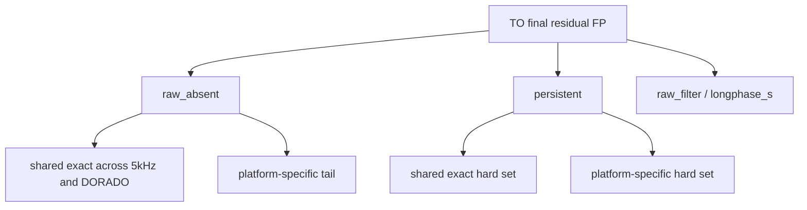

<!--
建立時間: 2026-03-23
目標: 針對 TO residual FP 進行 raw_absent 細分、cross-platform recurrence 與 paired_persistent diagnostics
資料來源:
  - /big7_disk/liaoyoyo2001/big7_disk_output/synthesis/observation_workspaces/20260322_to_fp_provenance_analysis
  - /big7_disk/liaoyoyo2001/big7_disk_output/synthesis/observation_workspaces/20260323_to_residual_fp_deep_dive
  - /big7_disk/liaoyoyo2001/InterSubMod/scripts/analysis/build_to_residual_fp_deep_dive.py
-->

<!-- PATH WARNING (2026-04-11 驗證):
本報告中部分絕對路徑已失效。類別: workspace 已重命名: 20260322_to_fp_provenance_analysis → _before_hp_fix
詳細路徑清單見 docs/data_specs/20260411_path_inventory.tsv
報告結論仍有效，但引用的外部路徑可能需要更新。
-->

# TO residual FP 深入分析：`raw_absent` 細分、cross-platform recurrence 與 `paired_persistent` diagnostics

> 研究範圍：`HCC1395 5kHz TO` 與 `HCC1395_DORADO TO` 的 final residual FP  
> 主 workspace：[20260323_to_residual_fp_deep_dive](/big7_disk/liaoyoyo2001/big7_disk_output/synthesis/observation_workspaces/20260323_to_residual_fp_deep_dive)  
> 上游 provenance：[20260322_to_fp_provenance_analysis](/big7_disk/liaoyoyo2001/big7_disk_output/synthesis/observation_workspaces/20260322_to_fp_provenance_analysis)  
> 主腳本：[build_to_residual_fp_deep_dive.py](/big7_disk/liaoyoyo2001/InterSubMod/scripts/analysis/build_to_residual_fp_deep_dive.py)

## 1. 重點結論

1. `raw_absent` 可以再細分，但**真正有辨識力的切法是「cross-platform exact recurrence」**，不是甲基或單一 caller/methylation 特徵。
2. 在 `HCC1395` 與 `HCC1395_DORADO` 中，`raw_absent` 各自有 `11,430 / 11,424` 個；其中 **`11,220` 個 exact hotspot 兩邊都同時出現**，比例都超過 `98.16%`。
3. 這批 shared `raw_absent` 的中位 `AF/GQ/QUAL` 其實偏高，不像單純 low-quality tail：
   - `HCC1395`: `AF=0.6629`, `GQ=19`, `QUAL=19.9766`
   - `DORADO`: `AF=0.6714`, `GQ=20`, `QUAL=20.0554`
4. 針對 **整個 `raw_absent` 母體**、**shared `raw_absent` 子集**、以及 **`persistent` 母體** 的同層級 rule sweep，**都沒有任何正 `delta F1`**。
5. 只有 `HCC1395 raw_absent_platform_specific` 這個小尾巴 (`210` 個) 出現一條極小正規則：`ad_alt <= 3`，可移除 `11 FP`、誤傷 `7 TP`，`delta F1 = +0.000032`；`DORADO` 不支持，不能升級成穩定規則。
6. `paired_persistent_final_fp` 的真 hard set 仍然成立，而且跨平台也有重疊：
   - `HCC1395`: `87` 個 persistent，其中 `45` 個與 `DORADO` exact shared
   - `DORADO`: `77` 個 persistent，其中 `45` 個與 `HCC1395` exact shared
7. `persistent` 不是單純 `Noise` 尾巴；它仍混有 `Strong / Weak / Subclone`：
   - `HCC1395`: `Strong=18`, `Noise=45`, `Weak=19`, `Subclone=5`
   - `DORADO`: `Strong=28`, `Noise=31`, `Weak=13`, `Subclone=5`
8. 因此目前最合理的結論是：
   - `raw_absent` 主問題是 **TO missing-normal candidate universe expansion / hotspot recurrence**
   - `persistent` 才是值得逐位點 read-level 追的真正 blind spot
   - 甲基與 label/cluster 特徵目前仍較適合 **annotation / ranking / diagnostics**，不適合升級成 TO hard filter

## 2. 研究問題與評估口徑

本輪要回答三件事：

1. `raw_absent` 是否可以再細分來處理。
2. `HCC1395` 與 `HCC1395_DORADO` 之間，是否存在可作為 strict blacklist / PON 候選的 recurrent TO FP hotspot。
3. `paired_persistent_final_fp` 是否存在可用同層級 TO 特徵抓出的子集，且能在不過度傷害 TP 的情況下改善 F1。

**評估口徑固定為同層級資料**：

- `TP` 母體：TO final kept TP
- `FP` 母體：TO final residual FP
- rule sweep 只允許使用 TO final 可得欄位：
  - caller-level：`AF/GQ/QUAL/DP/AD`
  - 甲基/annotation：`Quality_Score`, `PairwiseMedianDist`, `AlleleDelta`, `hp_assign_rate`, `VerificationClass`, `agreement_type`, `class_shift`
- paired / cross-platform 只用來做 provenance、recurrence 與 subgroup diagnostics，不直接當 deployable TO-only 規則

## 3. 方法與分解框架

主要資料流：

1. 用上輪 workspace 的 provenance master 決定每個 residual FP 屬於 `raw_absent / raw_filter / longphase_s / persistent`。
2. 從原始 TO / paired run 補回 final caller 與 methylation features。
3. 在 `raw_absent` 與 `persistent` 上做：
   - pattern summary
   - numeric + categorical rule sweep
   - cross-platform exact recurrence
4. 再把 `raw_absent` 細分為：
   - `shared_exact`
   - `platform_specific`
   並各自重新做同層級 rule sweep。

## 4. 整體結果

### 4.1 樣本摘要

| sample | TO final TP | TO final FP | TO final F1 | raw_absent | raw_filter | longphase_s | persistent | raw_absent shared exact | persistent shared exact |
| --- | --- | --- | --- | --- | --- | --- | --- | --- | --- |
| `HCC1395` | `28505` | `11598` | `0.716700` | `11430` | `63` | `18` | `87` | `11220` | `45` |
| `HCC1395_DORADO` | `28846` | `11570` | `0.722400` | `11424` | `65` | `4` | `77` | `11220` | `45` |

### 4.2 各 stage 的理論上限

| sample | stage | count | final FP 佔比 | 若完美移除的理論 `delta F1` |
| --- | --- | --- | --- | --- |
| `HCC1395` | `raw_absent` | `11430` | `98.5515%` | `+0.120205` |
| `HCC1395` | `persistent` | `87` | `0.7501%` | `+0.000741` |
| `HCC1395_DORADO` | `raw_absent` | `11424` | `98.7381%` | `+0.120570` |
| `HCC1395_DORADO` | `persistent` | `77` | `0.6655%` | `+0.000684` |

這個表很重要：  
`raw_absent` 的理論收益極大，但它不是一群容易用 feature 抓出的低品質噪音；`persistent` 雖然更值得機制診斷，但即使完美解決，F1 ceiling 也只有 `+0.0007` 級。

## 5. `raw_absent` 是否可以再細分處理

### 5.1 可以細分，但第一優先是 recurrence，不是 methylation class

| stage | sample | stage total | shared exact | shared 比例 | same-pattern shared |
| --- | --- | --- | --- | --- | --- |
| `raw_absent` | `HCC1395` | `11430` | `11220` | `0.981627` | `5070` |
| `raw_absent` | `HCC1395_DORADO` | `11424` | `11220` | `0.982143` | `5070` |

判讀：

1. `raw_absent` 幾乎整體都可被拆成 **cross-platform shared exact hotspot**。
2. 但 shared exact 中只有 `45.19% (5070/11220)` 在兩邊保持同一個 `VerificationClass + agreement_type + class_shift`。
3. 這表示真正穩定的是 **位點 recurrence**，不是 downstream methylation pattern recurrence。

### 5.2 shared exact 與 platform-specific 的 feature 對比

| sample | subgroup | count | median AF | median GQ | median QUAL | median Pairwise | median AlleleDelta |
| --- | --- | --- | --- | --- | --- | --- | --- |
| `HCC1395` | `raw_absent_shared_exact` | `11220` | `0.6629` | `19` | `19.9766` | `0.1908` | `0.0067` |
| `HCC1395` | `raw_absent_platform_specific` | `210` | `0.2882` | `12.5` | `12.9747` | `0.2115` | `0.0095` |
| `HCC1395_DORADO` | `raw_absent_shared_exact` | `11220` | `0.6714` | `20` | `20.0554` | `0.1206` | `0.0033` |
| `HCC1395_DORADO` | `raw_absent_platform_specific` | `204` | `0.3314` | `14.5` | `15.0012` | `0.1581` | `0.0158` |

判讀：

1. shared `raw_absent` 不是 low-confidence 邊角噪音；它們反而是 **高 AF / 高 GQ / 高 QUAL 的可重現 hotspot**。
2. `platform_specific` 尾巴才比較像低品質或樣本/平台特有的邊緣 call。
3. 因此 `raw_absent` 最有效的細分方式是：
   - `shared_exact`: strict blacklist / PON 候選
   - `platform_specific`: 小尾巴診斷池，才有少量 feature-based 空間

### 5.3 同層級 rule sweep：整個 `raw_absent` 與 shared `raw_absent`

| sample | subset | best rule | subset FP removed | TP removed | `delta F1` |
| --- | --- | --- | --- | --- | --- |
| `HCC1395` | `raw_absent` | `class_shift == Strong->Noise` | `2` | `7` | `-0.000139` |
| `HCC1395` | `raw_absent_shared_exact` | `class_shift == Strong->Noise` | `2` | `7` | `-0.000139` |
| `HCC1395_DORADO` | `raw_absent` | `suggest_filter == true` | `22` | `55` | `-0.000694` |
| `HCC1395_DORADO` | `raw_absent_shared_exact` | `suggest_filter == true` | `20` | `55` | `-0.000694` |

結論：  
**整個 `raw_absent` 母體與 shared `raw_absent` 母體都沒有任何正向規則。**  
這再次說明 shared `raw_absent` 不適合用 methylation / annotation 特徵硬切，主問題是 hotspot recurrence 本身。

### 5.4 `raw_absent_platform_specific` 的細分結果

| sample | subset | best rule | subset FP removed | TP removed | `delta F1` | 判讀 |
| --- | --- | --- | --- | --- | --- | --- |
| `HCC1395` | `raw_absent_platform_specific` | `ad_alt <= 3` | `11` | `7` | `+0.000032` | 極小正訊號，只在 `5kHz` 成立 |
| `HCC1395_DORADO` | `raw_absent_platform_specific` | `suggest_filter == true` | `2` | `55` | `-0.000694` | 沒有正訊號 |

這是本輪對「`raw_absent` 是否可再細分來處理」最直接的回答：

1. **可以細分**。
2. 但真正可操作的主切法不是 `VerificationClass` 或 `PairwiseMedianDist`，而是：
   - `shared_exact`：很像 strict blacklist / PON 候選
   - `platform_specific`：小型低品質尾巴
3. `platform_specific` 確實在 `HCC1395` 出現一條極小正規則，但只改善 `+0.000032`，而且 `DORADO` 不支持，不能升級成穩定規則。

## 6. cross-platform shared hotspot 的意義

若把 `shared_raw_absent_exact` 當成**同一 specimen family 內的 exact-key 診斷性 blacklist**，其理論效果如下：

| sample | shared exact raw_absent | 同 specimen family 內理論 `delta F1` |
| --- | --- | --- |
| `HCC1395` | `11220` | `+0.117677` |
| `HCC1395_DORADO` | `11220` | `+0.118077` |

但這裡要明確加粗限制：

1. 這不是 deployable TO-only 規則。
2. 這是 **基於同一 biological sample family 的 exact recurrence 診斷**，有明顯資訊洩漏風險。
3. 它可以支持一個研究推論：
   - `raw_absent` 的主體非常像 **需要更嚴格 PON / blacklist / upstream caller suppression** 的 recurrent hotspot 池。
4. 真正要升級成正式 blacklist，必須用 **獨立樣本** 驗證 recurrence，而不是只靠 `HCC1395` / `HCC1395_DORADO` 這對樣本。

## 7. `paired_persistent_final_fp` diagnostics

### 7.1 persistent 的 cross-platform overlap

| stage | sample | stage total | shared exact | shared 比例 | same-pattern shared |
| --- | --- | --- | --- | --- | --- |
| `persistent` | `HCC1395` | `87` | `45` | `0.517241` | `25` |
| `persistent` | `HCC1395_DORADO` | `77` | `45` | `0.584416` | `25` |

這代表 hard blind spot 並不是完全隨機；其中有一半以上會跨平台重複出現。

### 7.2 persistent 的特徵摘要

| sample | subgroup | count | median AF | median GQ | median QualityScore | median Pairwise | median AlleleDelta |
| --- | --- | --- | --- | --- | --- | --- | --- |
| `HCC1395` | `persistent_shared_exact` | `45` | `0.2000` | `15` | `75` | `0.2180` | `0.0050` |
| `HCC1395` | `persistent_platform_specific` | `42` | `0.1585` | `13` | `75` | `0.2187` | `0.0123` |
| `HCC1395_DORADO` | `persistent_shared_exact` | `45` | `0.1857` | `16` | `75` | `0.1545` | `0.0135` |
| `HCC1395_DORADO` | `persistent_platform_specific` | `32` | `0.1441` | `12.5` | `75` | `0.1479` | `0.0035` |

補充：

- `HCC1395 persistent`：`Strong=18`, `Noise=45`, `Weak=19`, `Subclone=5`
- `HCC1395_DORADO persistent`：`Strong=28`, `Noise=31`, `Weak=13`, `Subclone=5`

也就是說 persistent 不只是 `Noise`；它保留了不少 `Strong / Weak`，因此「直接刪 `Noise`」這類規則不夠安全。

### 7.3 persistent 的同層級 rule sweep

| sample | subset | best rule | subset FP removed | TP removed | `delta F1` |
| --- | --- | --- | --- | --- | --- |
| `HCC1395` | `persistent` | `ad_alt <= 6` | `9` | `88` | `-0.000672` |
| `HCC1395` | `persistent_shared_exact` | `ad_alt <= 5` | `3` | `53` | `-0.000287` |
| `HCC1395_DORADO` | `persistent` | `class_shift == Strong->Subclone` | `2` | `76` | `-0.001176` |
| `HCC1395_DORADO` | `persistent_shared_exact` | `af <= 0.1029` | `3` | `153` | `-0.002059` |

結論：

1. `persistent` 目前沒有任何正向規則。
2. 即使進一步切成 `shared_exact` 與 `platform_specific`，仍然全部負增益。
3. 這群位點比較適合進入：
   - IGV / samtools snapshot
   - read-level matrix review
   - local sequence context / repeat / alignment artifact 診斷

## 8. 整體判讀

### 8.1 `raw_absent` 的真正可行細分

最合理的 operational split 是：

1. `shared_exact raw_absent`
   - 主體
   - 高 recurrence
   - 高 AF / GQ / QUAL
   - 不適合用 feature hard filter
   - 最像 strict blacklist / PON candidate queue
2. `platform_specific raw_absent`
   - 小尾巴
   - 較低 GQ / QUAL
   - 在 `HCC1395` 有極小 feature-rule 空間，但無跨平台支持

### 8.2 目前不該做的事

1. 不應把 `raw_absent` 簡化成 germline。
2. 不應把 `VerificationClass / agreement_type / PairwiseMedianDist / Quality_Score` 升級成 raw_absent 主處理規則。
3. 不應因為 `shared_exact` 很大，就直接宣稱 exact-key blacklist 可以上 production；這需要獨立樣本驗證。

### 8.3 目前最值得做的事

1. 把 `11220` 個 shared `raw_absent` 當成 **blacklist / PON candidate inventory**，到獨立樣本驗證 recurrence。
2. 直接聚焦 `45` 個 cross-platform shared `persistent`，做 read-level 與 local-context hard-case 診斷。
3. 維持目前結論：
   - caller / PON layer 解決大宗 raw universe
   - TO raw_absent 主體屬 upstream candidate-universe 問題
   - methylation features 目前仍以 annotation / ranking 為主

## 9. 主要輸出檔案

- workspace README: [analysis_report.md](/big7_disk/liaoyoyo2001/big7_disk_output/synthesis/observation_workspaces/20260323_to_residual_fp_deep_dive/analysis_report.md)
- sample summary: [sample_level_summary.tsv](/big7_disk/liaoyoyo2001/big7_disk_output/synthesis/observation_workspaces/20260323_to_residual_fp_deep_dive/sample_level_summary.tsv)
- stage ceiling: [residual_stage_summary.tsv](/big7_disk/liaoyoyo2001/big7_disk_output/synthesis/observation_workspaces/20260323_to_residual_fp_deep_dive/residual_stage_summary.tsv)
- feature summary: [feature_group_summary.tsv](/big7_disk/liaoyoyo2001/big7_disk_output/synthesis/observation_workspaces/20260323_to_residual_fp_deep_dive/feature_group_summary.tsv)
- pattern summary: [stage_pattern_summary.tsv](/big7_disk/liaoyoyo2001/big7_disk_output/synthesis/observation_workspaces/20260323_to_residual_fp_deep_dive/stage_pattern_summary.tsv)
- full rule scan: [stage_rule_scan.tsv](/big7_disk/liaoyoyo2001/big7_disk_output/synthesis/observation_workspaces/20260323_to_residual_fp_deep_dive/stage_rule_scan.tsv)
- top rules: [stage_best_rules.tsv](/big7_disk/liaoyoyo2001/big7_disk_output/synthesis/observation_workspaces/20260323_to_residual_fp_deep_dive/stage_best_rules.tsv)
- cross-platform recurrence: [cross_platform_recurrence_summary.tsv](/big7_disk/liaoyoyo2001/big7_disk_output/synthesis/observation_workspaces/20260323_to_residual_fp_deep_dive/cross_platform_recurrence_summary.tsv)
- shared hotspot inventory: [cross_platform_shared_hotspots.tsv](/big7_disk/liaoyoyo2001/big7_disk_output/synthesis/observation_workspaces/20260323_to_residual_fp_deep_dive/cross_platform_shared_hotspots.tsv)
- persistent candidate list: [paired_persistent_candidate_regions.tsv](/big7_disk/liaoyoyo2001/big7_disk_output/synthesis/observation_workspaces/20260323_to_residual_fp_deep_dive/paired_persistent_candidate_regions.tsv)
