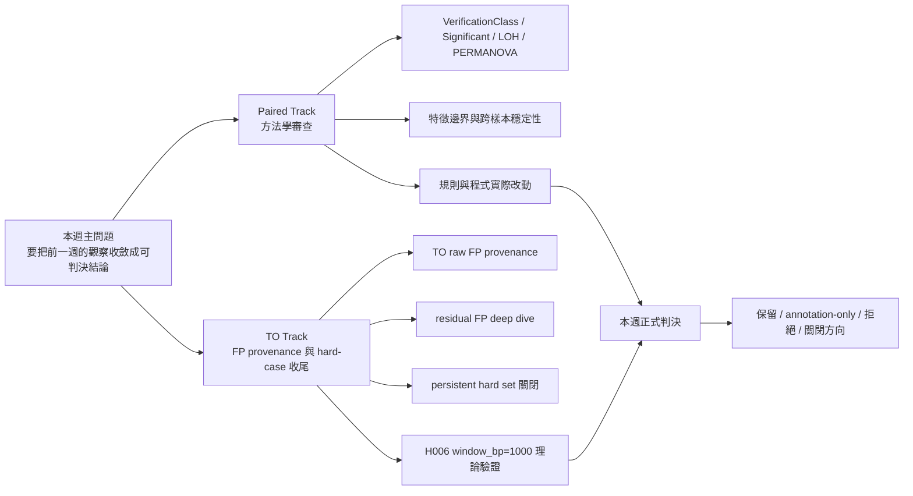
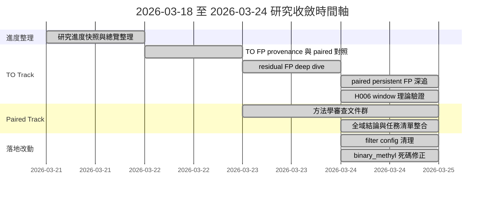
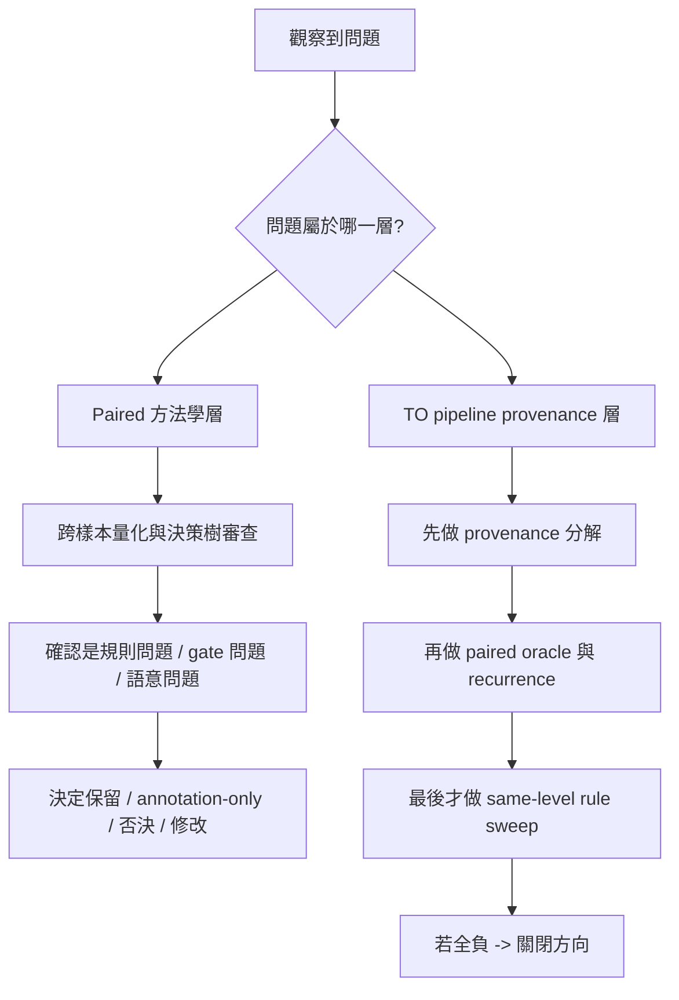
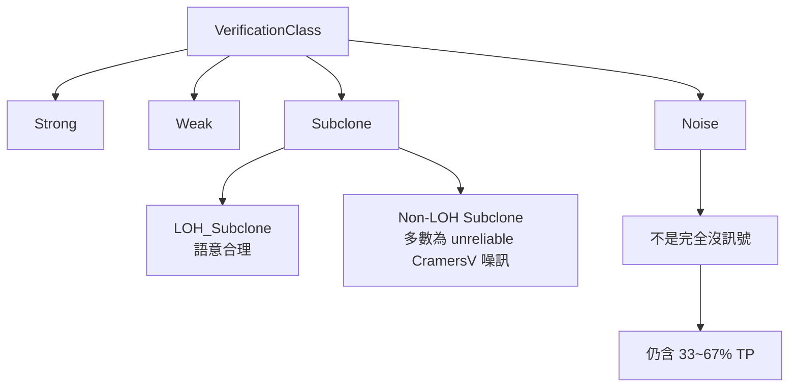
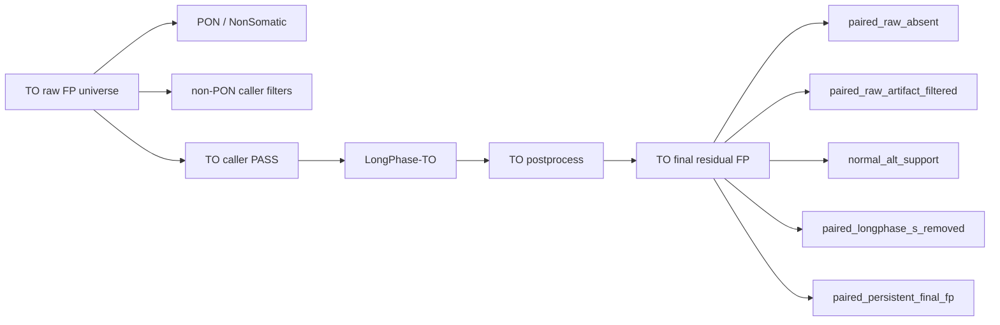
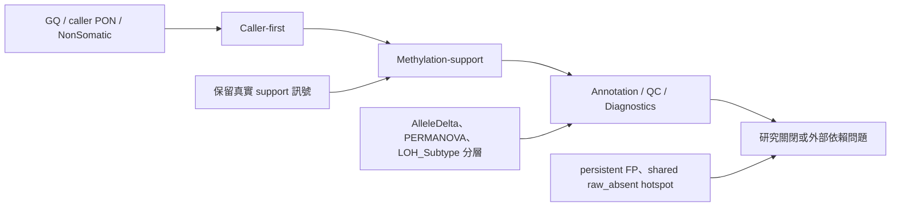

<!--
建立時間: 2026-03-24 23:59
目標: 整合 2026-03-18 至 2026-03-24 本週所有研究、嘗試方向、驗證流程、失敗方向與概念規劃，形成可追溯的正式週報
處理範圍:
  - Paired Track 方法學審查 closeout
  - TO Track FP provenance / residual FP / paired persistent closeout
  - 本週實際規則與程式改動
關聯檔案:
  - /big7_disk/liaoyoyo2001/InterSubMod/docs/reports/validated/2026/03/20260321_研究進度全貌總覽_01.md
  - /big7_disk/liaoyoyo2001/InterSubMod/docs/reports/validated/2026/03/20260322_TO_FP來源分解與paired對照分析_01.md
  - /big7_disk/liaoyoyo2001/InterSubMod/docs/reports/validated/2026/03/20260323_TO_residual_FP_deep_dive_01.md
  - /big7_disk/liaoyoyo2001/InterSubMod/docs/methodology/20260324_方法學審查全域結論報告_01.md
  - /big7_disk/liaoyoyo2001/InterSubMod/docs/methodology/20260324_方法學審查任務清單與結論摘要_01.md
  - /big7_disk/liaoyoyo2001/InterSubMod/docs/methodology/20260324_H006_窗口大小TO調整分析_01.md
  - /big7_disk/liaoyoyo2001/InterSubMod/docs/reports/validated/2026/03/20260324_paired_persistent_final_fp_深度追蹤_01.md
-->

# 研究週報：2026-03-18 至 2026-03-24
## 方法學審查 closeout、TO 收尾與 hard-case 關閉

**週報期間**：2026-03-18（週三）至 2026-03-24（週二）  
**上一份主線週報**：[20260317_研究主線週報_20260312_20260317_phase4_FP分型_01.md](/big7_disk/liaoyoyo2001/InterSubMod/docs/reports/validated/2026/03/20260317_研究主線週報_20260312_20260317_phase4_FP分型_01.md)

---

## 1. 開頭重點結論

1. **Paired Track 方法學審查已完成**：本週完成 `Steps 1-8 + 補充分析` 共 16 份觀察文件，已能對 InterSubMod 的分類邏輯、特徵邊界與後續改動給出全域判決。  
   狀態：**已證明成立**
2. **`VerificationClass != Noise` 比 `Significant=True` 更適合作為 downstream「有信號」定義**；`Significant=True` 本週正式被確認過於保守。  
   狀態：**已證明成立**
3. **`Subclone` 不能再視為單一語意類別**：在 `HCC1395/HCC1937` 多數是 `LOH_Subclone`，語意合理；在 `COLO829/H1437/HCC1954` 多數是 `Non-LOH Subclone`，本質更接近 unreliable CramersV 噪訊。  
   狀態：**已證明成立**
4. **`AlleleDelta` standalone hard filter 正式降級為 annotation-only**：只有 `HCC1395-5kHz` 顯示正訊號，跨樣本 AUROC 不一致，不適合升級成全域規則。  
   狀態：**已否決為正式規則**
5. **本週有兩個真正落地改動**：`scripts/pipeline/steps/03_filter_analysis.py` 取消 `allele_delta_only_min`；`RegionProcessor` 修正 `binary_methyl_high/low` 死碼接線。  
   狀態：**已修改**
6. **TO raw FP universe 的主要清洗層幾乎全在 caller 端的 PON / NonSomatic**：`HCC1395` 與 `HCC1395_DORADO` 都超過 `99.48%`；`LongPhase-TO` 在 truth-scoped raw FP 上移除數量為 `0`。  
   狀態：**已證明成立**
7. **TO final residual FP 的主體不是 `normal_alt_support`，而是 `paired_raw_absent`**：這代表 TO 難題主因不是「缺 normal 直接看不到」，而是「TO raw caller 會多吐出 paired raw 根本不會吐的候選」。  
   狀態：**已證明成立**
8. **`raw_absent` 的主切法不是甲基特徵，而是 recurrence**：兩個平台各自約 `11.4k` 個 `raw_absent` 中，有 `11,220` 個 exact hotspot 共享，比例超過 `98.16%`。  
   狀態：**已證明成立**
9. **`paired_persistent_final_fp` 已確認為 ISM 架構下的 irreducible FP**：這批 FP 混合了 germline ASM 驅動的真甲基訊號與 caller FP，現有 ISM 規則空間已無法再降。  
   狀態：**研究方向關閉**
10. **H006 `window_bp=1000` 在 TO track 理論上明確為負向**：`NumCpGs` 由 ~76 降到 ~15，ISM FN 覆蓋率由 `7%` 降到約 `1.4%`，辨別力沒有改善。  
    狀態：**已否決**

---

## 2. 本週研究進度總覽

### 2.1 本週整體任務地圖



### 2.2 週內時間軸



### 2.3 本週進度表

| 日期 | 主題 | 為什麼要做 | 主要方法 | 核心產出 | 狀態 |
|---|---|---|---|---|---|
| 2026-03-21 | 研究進度快照 | 先確認目前正式研究停在哪裡，避免把未 close 的舊假說混進本週結論 | 整理前週 validated 報告與 CURRENT_FOCUS | 進度全貌總覽、一頁式摘要 | 完成 |
| 2026-03-22 | TO FP provenance | 釐清 TO raw FP 到 residual FP 的主清洗層到底是誰 | stage-level provenance + paired oracle | TO FP 來源分解與 paired 對照分析 | 完成 |
| 2026-03-23 | residual FP deep dive | 確認 `raw_absent`、`persistent` 還有沒有可行 TO-only 規則 | recurrence 切分 + same-level rule sweep | residual FP 深追報告 | 完成 |
| 2026-03-23 | 方法學審查第一輪 | 從 feature search 退一步，改審整個分類與 gate 框架 | cross-sample audit + 邏輯拆解 | 多份 methodology 審查文件 | 完成 |
| 2026-03-24 | paired persistent FP 深追 | 確認 hard set 還值不值得繼續做 ISM 規則 | shared set 深追 + 既有 rule space 窮舉回查 | irreducible FP 結論 | 完成 |
| 2026-03-24 | H006 window 調整 | 測試縮小 window 是否能提升 TO 辨別力 | 理論估算 + 實測分位數對照 | H006 Negative 判決 | 完成 |
| 2026-03-24 | 全域方法學 closeout | 把所有審查文件合併成正式判決與改動清單 | 審查整合 | 全域結論報告 + 任務清單摘要 | 完成 |

---

## 3. 本週研究思考脈絡與驗證測試流程

### 3.1 本週不是「再找一條新規則」，而是「把主線收斂成可判決框架」

上週的主線重點還是 `Phase 4 case study` 與 `FP 分型`；到了本週，研究焦點正式從「再多看一些位點」轉成：

1. 這些觀察到底能不能升成正式口徑。
2. 哪些只是單一樣本現象。
3. 哪些負結果已經足夠明確，可以直接關閉。
4. 哪些程式或規則需要真的改。

本週最重要的思考轉折是：**不再直接從 feature 找規則，而是先問母體、層級與對照是否正確**。  
也就是說，先確認「問題在哪一層」，再決定「該不該再試規則」。

### 3.2 本週的推理收斂圖



### 3.3 本週常用驗證流程

| 驗證流程 | 用來回答什麼 | 代表場景 | 本週推論價值 |
|---|---|---|---|
| `cross-sample quantification` | 某規則或特徵是否真的跨樣本穩定 | `AlleleDelta` standalone、VerificationClass audit | 避免把 HCC1395 單點訊號寫成全域規則 |
| `decision-tree audit` | 類別邏輯本身是否合理、哪一枝有語意問題 | `Strong / Weak / Subclone / Noise` | 把問題從 feature 誤差提升到方法學層面 |
| `paired oracle decomposition` | TO residual FP 在 paired context 下屬於哪種來源 | `paired_raw_absent`、`normal_alt_support`、`persistent` | 先定位問題層級，再談是否可做 TO-only rule |
| `cross-platform exact recurrence` | 某子母體是平台尾巴還是 specimen-level 熱點 | `raw_absent shared_exact` | 把 recurrence 和 feature-based rule 分開看 |
| `same-level rule sweep` | 在同樣資訊條件下，是否存在真正可部署的新規則 | `raw_absent`、`persistent`、TO-only 特徵族 | 一旦全負，就能關閉方向 |
| `before/after parameter comparison` | 某參數調整是否值得實跑 | H006 `window_bp=1000` | 用理論與分位數估算快速否決低價值方向 |

### 3.4 本週的文字版研究路徑圖

```text
症狀出現
├─ Paired：為什麼某些特徵看起來有效，但跨樣本不穩？
│  ├─ 先做 decision-tree audit
│  ├─ 再做 cross-sample quantification
│  ├─ 找出語意混合桶（Subclone、Significant）
│  └─ 最後決定：保留 / annotation-only / 否決 / 實際修改
└─ TO：為什麼 residual FP 一直去不掉？
   ├─ 先看 provenance，不先找新 rule
   ├─ 再用 paired oracle 拆成 raw_absent / persistent
   ├─ 再看 recurrence 是 shared hotspot 還是 platform tail
   ├─ 最後才做 TO-only rule sweep
   └─ 若 rule 全負，直接關閉該方向
```

---

## 4. Paired Track：方法學審查與設計判決

### 4.1 為什麼這週要做 Paired Track 方法學審查

上週已經累積大量觀察，但真正還沒回答的是：

1. `VerificationClass` 本身的語意是否穩定。
2. `Subclone`、`Significant`、`LOH` 這些欄位能不能直接拿來下游用。
3. 看起來有效的特徵，哪些其實只是 sample-specific artifact。
4. 有沒有必要動 C++ 核心邏輯。

換句話說，本週不是再加一個 feature，而是要回答：**InterSubMod 現在到底哪些部分可信、哪些只是暫時可觀察但不能升級、哪些方向應該停。**

### 4.2 Paired Track 基線

| 樣本 | Mode | TP | FP | Precision | Recall | F1 |
|---|---|---:|---:|---:|---:|---:|
| HCC1395 | paired_full | 29,754 | 627 | 97.94% | 75.43% | 0.8522 |
| HCC1395_DORADO | paired_full | 29,889 | 240 | 99.20% | 75.77% | 0.8592 |
| COLO829 | paired_pileup | 35,826 | 3,534 | 91.02% | 82.95% | 0.8680 |
| H1437 | paired_full | 67,468 | 8 | 99.99% | 83.28% | 0.9087 |
| H2009 | paired_full | 132,909 | 86 | 99.94% | 93.54% | 0.9663 |
| HCC1937 | paired_pileup | 13,854 | 501 | 96.51% | 82.14% | 0.8875 |
| HCC1954 | paired_full | 17,909 | 29 | 99.84% | 77.76% | 0.8743 |

資料來源：[20260324_方法學審查任務清單與結論摘要_01.md](/big7_disk/liaoyoyo2001/InterSubMod/docs/methodology/20260324_方法學審查任務清單與結論摘要_01.md)

### 4.3 方法學審查主表

| 主題 | 為什麼要驗 | 方法 | 本週是否改動 | 核心數據 | 判決 |
|---|---|---|---|---|---|
| AlleleDelta standalone filter | 懷疑過擬合 HCC1395-5kHz | 跨樣本 AUROC 比較 | 有，降為 annotation-only | AUROC：`0.763 / 0.412 / 0.545 / 0.379` | Rejected |
| VerificationClass 決策樹 | 需要知道類別本身是否可靠 | cross-sample audit + 分枝量化 | 無 | `Reliable CramersV≈0` 但 passed_gate=True 比例 `66~91%` | 框架保留，需理解邊界 |
| `Significant` 欄位 | 懷疑過保守 | 比較 `Significant=True` vs `VC != Noise` | 無 | TP 捕獲率 `1~12%` vs `33~67%` | 移除依賴 |
| QualityScore LOH 懲罰 | 懷疑誤傷 TP | LOH-TP/FP 分佈比較 | 無 | TP/FP 同樣下滑 | No Action |
| LOH 整合 gate | 想知道 LOH 能否幫忙過濾 FP | LOH 分佈與 N+1 假設驗證 | 無 | `LOH+Noise` precision `0.2~9.7%` | Rejected |
| 新特徵辨別力 | 檢查 HP 類衍生指標是否有獨立訊號 | 直接從 summary 計算 AUROC | 無 | `HP_Coverage_Symmetry` 局部有效，其餘不穩 | 多數 Rejected |
| PERMANOVA 懲罰 | 懷疑造成 TP 誤傷 | 懲罰前後分佈檢查 | 無 | 受影響 TP 只 `2.2%`，且是弱信號 | Keep as annotation |
| BERNOULLI threshold | 檢查 `--methyl-high/low` 是否真有用 | 原始碼審查 + config 使用追蹤 | 有，修 dead code | 死碼修正後 `F1 delta=0` | 完成修正 |
| Subclone 合理性 | `Subclone` 語意混雜 | LOH_Subtype 分層 + 跨樣本統計 | 無 | HCC1395/HCC1937 `87~89%` LOH_Subclone | 分層使用 |
| FP passed_gate > TP | 需要知道是否能靠調 gate 解決 | 候選池偏差與機制分析 | 無 | FP 常由 germline ASM 驅動 | No Action |

### 4.4 本週對方法學的主要發現

#### 4.4.1 `VerificationClass` 框架本身沒有壞，但要改變讀法

本週最重要的 paired 發現，不是「哪個 feature 更強」，而是：

- `Strong`、`Weak`、`Noise` 大致有穩定語意。
- `Subclone` 不能直接當單一語意。
- `Significant=True` 不應再當正式主標準。



#### 4.4.2 `Subclone` 的真正結論是「需要分層」，不是「整類推翻」

| 樣本 | Subclone-TP `LOH_Subtype='LOH_Subclone'` | Subclone-TP Non-LOH | 解讀 |
|---|---:|---:|---|
| HCC1395 | 89.1% | 10.9% | 多數是 LOH 驅動，語意合理 |
| HCC1937 | 87.1% | 12.9% | 多數是 LOH 驅動，語意合理 |
| COLO829 | 10.1% | 89.9% | 多數是非 LOH，語意模糊 |
| H1437 | 19.6% | 80.4% | 多數是非 LOH，語意模糊 |
| H2009 | 30.7% | 69.3% | 混合 |
| HCC1954 | 16.0% | 84.0% | 多數是非 LOH，語意模糊 |

**本週推論**：

1. `HCC1395/HCC1937` 的 `Subclone` 可以解讀為 `LOH-like / HP-confined` 聚類。
2. `COLO829/H1437/HCC1954` 的 `Subclone` 多數不該直接解讀成真實亞克隆生物意義。
3. 因此正確做法不是改 C++ 類別，而是**下游分層使用 `LOH_Subtype`**。

#### 4.4.3 本週正式否決的方向

| 方向 | 原本想法 | 失敗原因 | 本週學到什麼 |
|---|---|---|---|
| AlleleDelta standalone hard filter | 希望直接抓 artifact | 只在 HCC1395-5kHz 有正增益，跨樣本 AUROC 不一致 | `AlleleDelta` 只能當 context-dependent annotation |
| `Significant=True` 主標準 | 想用更保守標準代表「真正有訊號」 | 太保守，漏掉大量 TP | 應改成 `VC != Noise` 或更細緻的分層 |
| `LOH+Noise -> FP filter` | 想用 LOH 背景抓 Noise FP | LOH-Noise TP 遠大於 FP | LOH 本身不是獨立 FP 訊號 |
| 提高 gate 嚴格度 | 想減少 FP passed_gate | FP 問題主因是 germline ASM，調 gate 會同時傷 TP | 問題不在單純閾值太寬 |
| 把 Non-LOH Subclone 解讀成 biology | 想保留 `Subclone` 類別的統一生物語意 | `HP_Ratio≈0.5`、`AlleleDelta≈0`、`reliable CramersV≈0` | 這類多半只是統計膨脹或混雜因素 |

### 4.5 本週實際規則與程式改動

| 類型 | 檔案 | 改動 | 影響 |
|---|---|---|---|
| 規則清理 | [03_filter_analysis.py](/big7_disk/liaoyoyo2001/InterSubMod/scripts/pipeline/steps/03_filter_analysis.py) | 所有 purity bin 的 `allele_delta_only_min: None`；保留 `experimental_hcc1395_5khz_only: True` 註記 | 保護跨樣本 F1，不再把 HCC1395-5kHz 過擬合規則外推 |
| C++ 修正 | [RegionProcessor.cpp](/big7_disk/liaoyoyo2001/InterSubMod/src/core/RegionProcessor.cpp) | `build_methylation_matrix` 改用 config 的 `binary_methyl_high/low` | 解掉 dead code，讓 NHD/Jaccard 類 binary threshold 參數真正生效 |
| C++ 修正 | [RegionProcessor.hpp](/big7_disk/liaoyoyo2001/InterSubMod/include/core/RegionProcessor.hpp) | 加入 `binary_methyl_high_/low_` 成員接線 | 接線完整化 |

**本週落地改動重點**

1. 這不是大規模改模型的一週，而是**把應該降級的規則降級、把死碼修掉**。
2. `binary_methyl` 修正後 **F1 delta = 0，107/107 tests pass**，表示本週這個改動屬於 correctness fix，不改動既有結果口徑。

### 4.6 Paired Track 本週最終判決

```text
Paired Track 本週判決
├─ 正式保留
│  ├─ VerificationClass 框架
│  ├─ 下游改用 VC != Noise
│  └─ Subclone 需搭配 LOH_Subtype 分層
├─ annotation-only
│  ├─ AlleleDelta standalone
│  ├─ PERMANOVA
│  └─ 多數 LOH / HP 衍生特徵
├─ 已否決
│  ├─ LOH+Noise 過濾
│  ├─ 提高 gate 嚴格度解決 FP
│  └─ Non-LOH Subclone 的生物學解讀
└─ 已實作
   ├─ filter config 清理
   └─ binary_methyl 死碼修正
```

---

## 5. TO Track：FP provenance、residual FP 與 hard-case 收尾

### 5.1 為什麼 TO Track 本週要先做 provenance，而不是先找新規則

本週 TO 主線的關鍵問題不是「是否還能多加一條 TO-only rule」，而是：

1. residual FP 到底來自哪一層。
2. 這一層是不是本來就不是甲基特徵能處理的問題。
3. 若真是如此，就應該停止在錯的母體上做 rule sweep。

因此本週 TO 研究流程的順序是：



也就是：

1. 先切 pipeline stage。
2. 再切 paired oracle。
3. 再切 recurrence。
4. 最後才做 same-level TO-only rule sweep。

### 5.2 TO provenance：主清洗層其實是 caller PON / NonSomatic

| sample | TO raw FP total | PON / NonSomatic layer | non-PON caller filters | LongPhase-TO removed | TO postprocess removed | TO final residual FP |
|---|---:|---:|---:|---:|---:|---:|
| HCC1395 | 2,731,541 | 2,717,339 (99.4801%) | 2,596 (0.0950%) | 0 | 8 | 11,598 |
| HCC1395_DORADO | 2,724,904 | 2,711,492 (99.5078%) | 1,836 (0.0674%) | 0 | 6 | 11,570 |

**本週發現**

1. `PON / NonSomatic` 不是背景配角，而是 TO raw FP universe 的絕對主體清洗層。
2. `LongPhase-TO` 在 truth-scoped raw FP 上移除數量為 `0`，因此本週明確知道：**TO raw FP 問題不能再指望 LongPhase-TO 幫忙解。**
3. 目前 TO postprocess 真正能打到的只是一個極小、明顯 artifact-like 子集。

### 5.3 paired oracle：TO residual FP 主要不是 `normal_alt_support`

| sample | TO final residual FP | paired raw absent | paired raw artifact filtered | normal alt support | paired LongPhase-S removed | paired persistent final FP |
|---|---:|---:|---:|---:|---:|---:|
| HCC1395 | 11,598 | 11,430 (98.5515%) | 63 (0.5432%) | 0 | 18 (0.1552%) | 87 (0.7501%) |
| HCC1395_DORADO | 11,570 | 11,424 (98.7381%) | 64 (0.5532%) | 1 (0.0086%) | 4 (0.0346%) | 77 (0.6655%) |

**本週推論**

1. TO 最難的點不在 `normal_alt_support`；正常樣本明確 alt 支持的位點幾乎沒有。
2. 主體是 `paired_raw_absent`，也就是 **TO raw caller 會長出 paired raw 根本不會吐的候選**。
3. 所以若還在 `residual FP` 整體母體上硬找甲基規則，等於把 upstream candidate expansion 問題誤當成 downstream feature rule 問題。

### 5.4 `raw_absent` 的真相：主要是 specimen-level recurrent hotspot，不是低品質尾巴

| stage | sample | stage total | shared exact | shared 比例 | 同 pattern shared |
|---|---|---:|---:|---:|---:|
| raw_absent | HCC1395 | 11,430 | 11,220 | 0.981627 | 5,070 |
| raw_absent | HCC1395_DORADO | 11,424 | 11,220 | 0.982143 | 5,070 |

| sample | subgroup | count | median AF | median GQ | median QUAL | median Pairwise | median AlleleDelta |
|---|---|---:|---:|---:|---:|---:|---:|
| HCC1395 | raw_absent_shared_exact | 11,220 | 0.6629 | 19 | 19.9766 | 0.1908 | 0.0067 |
| HCC1395 | raw_absent_platform_specific | 210 | 0.2882 | 12.5 | 12.9747 | 0.2115 | 0.0095 |
| HCC1395_DORADO | raw_absent_shared_exact | 11,220 | 0.6714 | 20 | 20.0554 | 0.1206 | 0.0033 |
| HCC1395_DORADO | raw_absent_platform_specific | 204 | 0.3314 | 14.5 | 15.0012 | 0.1581 | 0.0158 |

**本週發現**

1. `shared_exact raw_absent` 的 AF/GQ/QUAL 並不低，反而偏高，完全不像低品質 tail。
2. `platform_specific` 只有很小尾巴，而且只有 `HCC1395` 有一條非常小的正規則：`ad_alt <= 3`，可移除 `11 FP / 7 TP`，`delta F1=+0.000032`。
3. 因此本週對 `raw_absent` 的概念規劃是：
   - `shared_exact`：更像 **strict blacklist / PON candidate queue**
   - `platform_specific`：才是可能存在極小 feature-rule 空間的小尾巴

### 5.5 本週為何正式停止在 `raw_absent` 母體上找 TO-only 規則

| sample | subset | best rule | subset FP removed | TP removed | delta F1 |
|---|---|---|---:|---:|---:|
| HCC1395 | raw_absent | `class_shift == Strong->Noise` | 2 | 7 | -0.000139 |
| HCC1395 | raw_absent_shared_exact | `class_shift == Strong->Noise` | 2 | 7 | -0.000139 |
| HCC1395_DORADO | raw_absent | `suggest_filter == true` | 22 | 55 | -0.000694 |
| HCC1395_DORADO | raw_absent_shared_exact | `suggest_filter == true` | 20 | 55 | -0.000694 |

**本週結論**

1. 對整個 `raw_absent` 母體做 feature hard filter 是錯方向。
2. `raw_absent` 最有解釋力的維度是 recurrence，不是 methylation label。
3. 要處理這群位點，應該往 **upstream blacklist / PON / caller suppression** 概念規劃，而不是再往 TO-only filter rule 深挖。

### 5.6 H006 `window_bp=1000`：為什麼本週直接理論否決

| 分析面向 | `window=5000` | `window=1000`（估算） | 判讀 |
|---|---:|---:|---|
| NumCpGs 中位數 | 76/79 | ~15/~16 | 少 5 倍，CpG 明顯不足 |
| NumCpGs < 30 區域比例 | 0.6% | ~85% | 多數區域進入低資訊區 |
| ISM FN 覆蓋率 | 7% | ~1.4% | 可分析 FN pool 縮 5 倍 |
| rescue F1 delta | +0.009 | ~+0.002 | 大幅下滑 |
| TP/FP PassedGating 比值 | 1.07（高 CpG） | 0.98（低 CpG） | 沒有辨別力改善 |

**本週思考**

原本假設是「較小 window 也許能減少無關 reads 混入」。  
但本週用 `NumCpGs` 分位數對照後發現：

1. ONT 長讀在 `window=1000` 與 `5000` 下，NumReads 不會大幅改變；真正被砍掉的是**可用 CpG 位點數**。
2. 被砍掉的正是 BERNOULLI 距離與整體結構檢定最需要的訊息。
3. 因此縮小 window 不是「更精準」，而是「更少訊號」。

所以 H006 本週直接被標為 **Rejected**，而且不值得為了重建 tagged BAM 去實跑。

### 5.7 `paired_persistent_final_fp`：本週正式關閉的 hard-case

| 類型 | 數量 | 關鍵特徵 | 為何 ISM 無法解 |
|---|---:|---|---|
| Strong/Weak persistent FP | 約 43% | 真實甲基差異存在，多與 germline ASM / LOH 相關 | ISM 偵測到的差異是真實的，只是來源不是 somatic |
| Noise persistent FP | 約 49% | 幾乎無甲基差異，但也沒有可分辨特徵 | 任何把 Noise 當 filter 的做法都會同時誤傷大量 TP |

| 規則 | 觸發 shared FP | 結果 |
|---|---:|---|
| `QS < 50` | 1/45 | 不足 |
| `AlleleDelta > 0.15` | 0/45 | 完全無效 |
| `GQ < 5` | 1/45 | 不足 |
| `hp_assign_rate < 0.2` | 1/45 | 不足 |
| `Noise + LOH filter` | 21/45 | 會同時大量傷 TP |

**本週最終判決**

1. `paired_persistent_final_fp` 已不是「再多試幾條規則」能解的問題。
2. 這群位點之所以難，是因為它們混合了：
   - 真實存在但來源錯誤的甲基差異（germline ASM）
   - 純 caller FP，但 ISM 內部沒有可利用特徵
3. 在沒有 matched normal 甲基化參考或外部 ASM database 的情況下，本週已足夠確認它是 **ISM 架構下的 irreducible FP**。

---

## 6. 本週失敗方向、被否決方向與其價值

### 6.1 失敗方向總表

| 方向 | 原本想解什麼 | 驗證方式 | 失敗原因 | 對後續的價值 |
|---|---|---|---|---|
| AlleleDelta standalone filter | 想快速抓 artifact FP | 跨樣本 AUROC + rule 清理 | 只對單一樣本有效 | 正式確立它只能是 annotation |
| `Significant=True` 主標準 | 想用更保守標準代表可信訊號 | TP 捕獲率比較 | 過度保守，漏大量 TP | 迫使下游改用 `VC != Noise` |
| `LOH+Noise -> FP filter` | 想利用 LOH 背景抓 Noise FP | N+1 假設驗證 | LOH-Noise TP 遠大於 FP | 確立 LOH 不是獨立過濾信號 |
| 提高 gate 嚴格度 | 想減少 FP passed_gate | gate / candidate pool 審查 | FP 主因不是低門檻，而是 germline ASM | 研究焦點改到語意分層而非閾值 |
| `raw_absent` feature hard filter | 想在 residual FP 上再找 TO-only rule | shared/platform-specific rule sweep | 全部負增益 | 研究焦點轉到 recurrence / upstream suppression |
| H006 `window=1000` | 想提升 TO 辨別力 | 理論估算 + 分位數比較 | CpG 數量與覆蓋率大幅下降 | 避免浪費重建 tagged BAM 的資源 |
| persistent FP rule search | 想把最後 hard set 再削薄 | 既有 rule space 窮舉回查 | 全部 negative | 正式關閉這條方向 |

### 6.2 本週真正學到的研究方法論

本週最重要的不是哪條規則又多提了 `0.000x F1`，而是研究方法本身被明確收斂：

1. **先找母體，再找規則**  
   如果母體本身是 upstream candidate expansion 問題，再精細的 feature sweep 也只會得到負結果。
2. **先做 paired oracle，再談 TO-only rule**  
   paired oracle 不是為了偷看答案，而是為了先確認 TO residual FP 的來源層級。
3. **single-sample 正訊號不再直接升級成正式規則**  
   本週 `AlleleDelta` 與 `raw_absent_platform_specific` 都證明這一點。
4. **Negative result 也要有正式結論**  
   H006 與 persistent FP 都不是「暫時沒結果」，而是本週已足夠清楚，可以關閉。

---

## 7. 本週的概念規劃與下一步

### 7.1 本週收斂後的概念架構



### 7.2 目前應如何定位各方向

| 類別 | 內容 | 目前定位 | 是否跨樣本成立 |
|---|---|---|---|
| 正式保留口徑 | `VC != Noise`、Subclone 搭配 `LOH_Subtype` 分層 | 下游標準 | 是 |
| annotation-only | AlleleDelta standalone、PERMANOVA、多數 LOH/HP 衍生特徵 | 觀察與排名，不作 hard rule | 多數否 |
| 單一樣本成立 | `HCC1395 raw_absent_platform_specific` 的 `ad_alt <= 3`、HCC1395-5kHz 的高 AD 現象 | 保留做診斷，不外推 | 否 |
| 研究方向關閉 | H006 `window=1000`、persistent FP rule search、LOH+Noise filter | close | 是 |
| 外部依賴問題 | shared raw_absent hotspot blacklist、germline ASM 過濾 | 需外部資料或獨立驗證 | 尚未 |

### 7.3 下一步建議

| 優先級 | 下一步 | 原因 |
|---|---|---|
| P0 | 讓下游分析、週報與 dashboard 全面改用 `VC != Noise` 與 `LOH_Subtype` 分層 | 這是本週最穩定且已完成驗證的結論 |
| P1 | 若要延續 TO track，優先做跨樣本驗證，而不是再挖 HCC1395 專屬規則 | 本週已證明單一樣本規則不可靠 |
| P1 | 若要研究 `shared raw_absent`，應以外部驗證或 upstream blacklist/PON 概念做新題目 | 這不是 current TO-only feature rule 能處理的問題 |
| P2 | persistent hard set 若再追，只能做 read-level / external-reference 型研究，不應再期待 ISM 規則改善 | 本週已判定為 irreducible FP |

### 7.4 尚缺與待補齊事項

1. `shared raw_absent` 若要升格成正式 blacklist，還缺**獨立樣本**驗證，不能只靠 HCC1395 family。
2. `paired_persistent_final_fp` 若要真正改善，缺的是 **matched normal methylation** 或 **germline ASM reference**，不是更多 ISM rule sweep。
3. TO rescue 的正式採納規則目前仍以單一樣本 pilot 為主；本週補的是 closeout，不是跨樣本確認。

---

## 8. 完成度總結

```text
本週完成度
├─ Paired Track 方法學審查：完成
│  ├─ 16 份觀察文件整合
│  ├─ 正式判決完成
│  └─ 兩項實際改動已落地
├─ TO Track 收尾：完成
│  ├─ provenance 完成
│  ├─ residual FP deep dive 完成
│  ├─ persistent hard set 關閉
│  └─ H006 理論驗證完成
└─ 本週整體結果：完成收斂
   ├─ 不是再新增一條規則
   ├─ 而是把什麼能留、什麼該停說清楚
   └─ 研究主線已從「探索」進入「制度化與關閉低價值方向」
```

---

## 9. 參考文件索引

### 本週主文件

1. [20260321_研究進度全貌總覽_01.md](/big7_disk/liaoyoyo2001/InterSubMod/docs/reports/validated/2026/03/20260321_研究進度全貌總覽_01.md)
2. [20260321_目前研究進度一頁式摘要_01.md](/big7_disk/liaoyoyo2001/InterSubMod/docs/reports/validated/2026/03/20260321_目前研究進度一頁式摘要_01.md)
3. [20260322_TO_FP來源分解與paired對照分析_01.md](/big7_disk/liaoyoyo2001/InterSubMod/docs/reports/validated/2026/03/20260322_TO_FP來源分解與paired對照分析_01.md)
4. [20260323_TO_residual_FP_deep_dive_01.md](/big7_disk/liaoyoyo2001/InterSubMod/docs/reports/validated/2026/03/20260323_TO_residual_FP_deep_dive_01.md)
5. [20260324_paired_persistent_final_fp_深度追蹤_01.md](/big7_disk/liaoyoyo2001/InterSubMod/docs/reports/validated/2026/03/20260324_paired_persistent_final_fp_深度追蹤_01.md)
6. [20260324_方法學審查全域結論報告_01.md](/big7_disk/liaoyoyo2001/InterSubMod/docs/methodology/20260324_方法學審查全域結論報告_01.md)
7. [20260324_方法學審查任務清單與結論摘要_01.md](/big7_disk/liaoyoyo2001/InterSubMod/docs/methodology/20260324_方法學審查任務清單與結論摘要_01.md)
8. [20260324_H006_窗口大小TO調整分析_01.md](/big7_disk/liaoyoyo2001/InterSubMod/docs/methodology/20260324_H006_窗口大小TO調整分析_01.md)

### 本週直接使用的觀察工作區

1. [20260322_to_fp_provenance_analysis](/big7_disk/liaoyoyo2001/big7_disk_output/synthesis/observation_workspaces/20260322_to_fp_provenance_analysis)
2. [20260323_to_residual_fp_deep_dive](/big7_disk/liaoyoyo2001/big7_disk_output/synthesis/observation_workspaces/20260323_to_residual_fp_deep_dive)

### 相關規則與程式改動檔案

1. [03_filter_analysis.py](/big7_disk/liaoyoyo2001/InterSubMod/scripts/pipeline/steps/03_filter_analysis.py)
2. [RegionProcessor.cpp](/big7_disk/liaoyoyo2001/InterSubMod/src/core/RegionProcessor.cpp)
3. [RegionProcessor.hpp](/big7_disk/liaoyoyo2001/InterSubMod/include/core/RegionProcessor.hpp)
