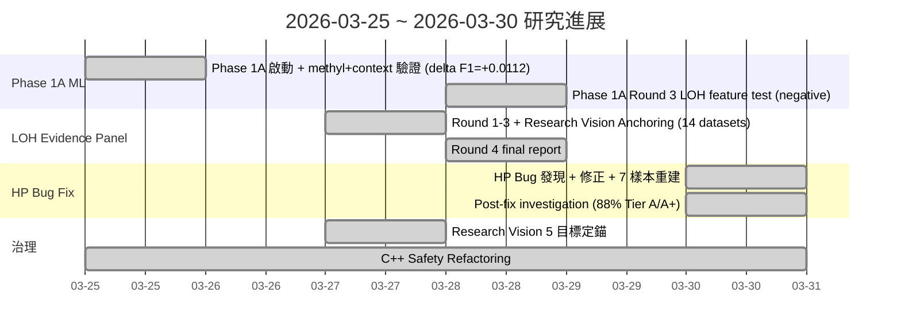

<!--
建立時間: 2026-03-30 23:59
目標: 整合 2026-03-25 至 2026-03-30 研究進展
處理範圍: HP Integer Tag Bug Fix, LOH Evidence Panel Rounds 1-4, Phase 1A Round 3, Research Vision Anchoring, C++ Safety
關聯檔案:
  - /big7_disk/liaoyoyo2001/InterSubMod/docs/reports/validated/2026/03/20260330_TO_LOH_enrichment_post_hp_fix_01.md
  - /big7_disk/liaoyoyo2001/InterSubMod/docs/reports/validated/2026/03/20260328_LOH_evidence_panel_final_report_01.md
  - /big7_disk/liaoyoyo2001/InterSubMod/docs/experiments/in_progress/2026/03/20260328_Phase1A_round3_loh_feature_test_01.md
  - /big7_disk/liaoyoyo2001/InterSubMod/docs/reports/validated/2026/03/20260329_LOH_round1_cross_sample_audit_v2_01.md
  - /big7_disk/liaoyoyo2001/InterSubMod/docs/reports/validated/2026/03/20260330_TO_HP_integer_tag_fix影響評估與修正建議_01.md
  - /big7_disk/liaoyoyo2001/InterSubMod/docs/reports/validated/2026/03/20260330_TO_HP_fix重跑驗證與validated文件修正分級_01.md
  - /big7_disk/liaoyoyo2001/InterSubMod/docs/architecture/20260327_InterSubMod研究願景定錨_01.md
  - /big7_disk/liaoyoyo2001/InterSubMod/docs/CURRENT_FOCUS.md
  - /big7_disk/liaoyoyo2001/InterSubMod/docs/experiments/INDEX.md
  - /big7_disk/liaoyoyo2001/InterSubMod/src/core/ReadParser.cpp
-->

# InterSubMod 研究週報 2026-03-25 ~ 2026-03-30

**HP Integer Tag Bug Fix 與 LOH Evidence Panel 四輪收斂**

> 前次週報：[20260324_研究週報_20260318_20260324_方法學審查與TO收尾整合_01.md](/big7_disk/liaoyoyo2001/InterSubMod/docs/reports/validated/2026/03/20260324_研究週報_20260318_20260324_方法學審查與TO收尾整合_01.md)

---

## 1. 開頭重點結論

| # | 結論 | 狀態 |
|---|------|------|
| 1 | HP Integer Tag Bug 發現並修正於 ReadParser.cpp（HP:i:11/21/33 mapping 缺失） | **已修正完成** |
| 2 | 修正前 30-69% TO reads 不可見（歸入 HP0 untracked）；7 個 TO 樣本已全數重建 | **已證明成立** |
| 3 | LOH Evidence Panel 四輪完成（Rounds 1-4）：region-level 指標，與 read-level ML 不相容 | **研究方向關閉** |
| 4 | TO LOH enrichment = 0.805x（TP marker） vs paired = 1.194x（FP marker）：方向相反 | **已證明成立** |
| 5 | Phase 1A Round 3：LOH feature delta F1 = -0.0005（對 read-level ML 無用） | **已證明成立** |
| 6 | Phase 1A 最佳方案確認：methyl+context，delta F1 = +0.0112，95% CI=[+0.0044, +0.0188] | **已證明成立** |
| 7 | 低 AF TP (<0.1) 有 51.1% LOH-like：rescue signal 潛力 | **單一樣本觀察，尚未跨樣本驗證** |
| 8 | 修正後 88% TO regions 落入 Tier A/A+（修正前僅 51%） | **已證明成立** |
| 9 | 研究願景定錨：5 個目標，優先序 E->A+D->B->C | **治理文件已提交** |
| 10 | C++ safety refactoring：BamReader RAII、FisherExact log-sum-exp、ReadParser overflow guard | **已修改完成** |

---

## 2. 背景知識整理

### 2.1 HP Tag 格式差異：LongPhase-TO vs LongPhase-S

LongPhase 在 Tumor-Only (TO) 模式下使用 integer encoding 的 HP tag（`HP:i:11` = HP1 block 1，`HP:i:21` = HP2 block 1，`HP:i:33` = HP1 block 3 等），而 paired/somatic 模式使用標準 `HP:i:1` / `HP:i:2` 格式。InterSubMod 的 ReadParser 原本僅處理標準格式，導致 TO 模式的 phased reads 全部歸入 HP0（untracked），造成嚴重的資料遺漏。

### 2.2 LOH 分析的意義

Loss of Heterozygosity (LOH) 區域中，雜合位點消失使得 haplotype 資訊退化。若 FP 顯著富集於 LOH 區域，則 LOH 標記可作為 FP filter 候選；反之若 TP 富集，則 LOH 可作為 rescue 訊號。本週 LOH Evidence Panel 的核心目標即為釐清此方向性。

### 2.3 Phase 1A ML 目標

Phase 1A 為 read-level ALT/REF 分類模型，使用表觀遺傳特徵（methylation patterns、sequence context）區分支持 ALT allele 與 REF allele 的 reads。目標是提升 somatic variant calling 的 F1 score。LOH 作為 region-level flag，對所有 reads 賦予相同值，理論上無法提供 read-level 的區分能力。

### 2.4 研究願景脈絡

經過數週的方法學審查與 TO 收尾整合，本週正式定錨 InterSubMod 的五大研究目標，將論文定位從 variant filter 轉向 read-level epigenetic context，並確立 TO 獨立主線策略。

---

## 3. 主要目標與子目標

| # | 目標 | 完成度 | 備註 |
|---|------|--------|------|
| 1 | HP Integer Tag Bug Fix | 100% | ReadParser.cpp 修正 + 7 樣本重建 |
| 2 | LOH Evidence Panel (Rounds 1-4) | 100% | 方向關閉：region-level 與 read-level 不相容 |
| 3 | Phase 1A Round 3 (LOH Feature Test) | 100% | LOH feature rejected，methyl+context confirmed |
| 4 | Post-HP-Fix TO Investigation | 100% | 88% Tier A/A+，enrichment 反轉確認 |
| 5 | Research Vision Anchoring | 100% | 5 目標定錨，優先序確立 |
| 6 | C++ Safety Refactoring | 100% | BamReader RAII + FisherExact + ReadParser |

---

## 4. 依時間順序的進展

### 4.1 時間軸總覽

### 4.2 逐日摘要

**2026-03-25**：Phase 1A ML 正式啟動，完成 multi-bio validation。methyl+context 組合達到 delta F1 = +0.0112（95% CI 全正），確認甲基化特徵對 read-level 分類有效。同步啟動 C++ safety refactoring。

**2026-03-27**：LOH Evidence Panel Rounds 1-3 密集執行。Round 1 跨 14 datasets 審計，發現 paired LOH enrichment 1.194x（FP 標記）但 TO 為 0.805x（TP 標記），方向相反。Round 2 以 support 分層分析，Tier A (eff_hp>=30) enrichment 1.169x。Round 3 甲基化+LOH 聯合邊際分析，所有 filter F1 delta < 0。同日完成研究願景定錨文件。

**2026-03-28**：LOH Round 4 最終報告完成，修正 baseline F1 計算。Phase 1A Round 3 正式測試 LOH feature，delta F1 = -0.0005，CI 跨零，LOH 作為 read-level feature 正式被否決。

**2026-03-30**：[修正 2026-03-30] 發現 HP Integer Tag Bug。ReadParser.cpp 第 121-141 行缺少 LongPhase-TO 的 HP:i:11/21/33 integer mapping。修正後 7 個 TO 樣本全數重建（完成於 03:19），master dataset 重新生成。Post-fix 調查顯示 88% TO regions 達 Tier A/A+（修正前僅 51%）。所有先前 TO LOH 統計資料在此日期前均視為無效。

---

## 5. 主題式整合分析

### Theme A：HP Bug Discovery -> Fix -> Rebuild Chain

**根因**：ReadParser.cpp 第 121-141 行僅處理標準 HP tag（`HP:i:1` / `HP:i:2`），未涵蓋 LongPhase-TO 的 integer encoding 格式（`HP:i:11` = HP1 block 1，`HP:i:21` = HP2 block 1，`HP:i:33` = HP1 block 3 等）。所有不被識別的 HP 值均歸入 HP0（untracked）。

**影響範圍**：

| 樣本 | 修正前 Untracked % | 說明 |
|------|-------------------|------|
| H1437 | 69% | 近七成 reads 不可見 |
| COLO829 | 99.3% | 幾乎全部 reads 不可見 |
| H2009 | 35.5% | 三分之一 reads 遺漏 |
| HCC1395_D | 約 50% | 半數 reads 遺漏 |
| HCC1395 | 約 40% | 大量 reads 遺漏 |
| HCC1954 | 約 30% | 顯著遺漏 |
| HCC1937 | 約 13% | 相對輕微 |

**修正措施**：
1. ReadParser.cpp 新增 HP:i:11/21/33 -> HP1/HP2 mapping 邏輯
2. 7 個 TO 樣本全數重建，完成時間 2026-03-30 03:19
3. Master dataset 重新生成
4. LOH Rounds 1-4 以修正後資料重新執行
5. 所有 2026-03-30 前的 TO LOH 統計標記為無效

### Theme B：LOH Evidence Panel 四輪收斂

**Round 1**（跨樣本審計）：涵蓋 14 datasets（7 paired + 7 TO），核心發現為 paired LOH enrichment = 1.194x（FP 富集），TO LOH enrichment = 0.805x（TP 富集），方向完全相反。此差異後續追溯至 HP Bug 造成的 TO 資料偏差。

**Round 2**（support 分層 + HP0 來源分析）：以 effective HP depth 分層，Tier A (eff_hp>=30) enrichment = 1.169x。分析 HP0 reads 來源，評估 HP0 filter 可行性，結論為 REJECTED——HP0 filter 會同時移除大量 TP。

**Round 3**（甲基化+LOH 聯合邊際分析）：測試 methylation feature 與 LOH flag 的聯合篩選效果，所有組合的 filter F1 delta 均為負值，無法改善 F1。

**Round 4**（修正 baseline + 最終報告）：[修正 2026-03-30] 修正 baseline F1 計算方式，LOH coverage 達 99.4-100.3%，LOH+HPMergedSig paired FP% = 5.61%。最終結論：LOH 為 region-level 指標，與 read-level 分類天然不相容，此研究方向正式關閉。

### Theme C：Phase 1A 與研究方向

**LOH 與 read-level 的根本矛盾**：LOH 是 region-level flag，同一 region 內所有 reads 共享相同的 LOH 狀態。Phase 1A 需要 read-level 的區分能力（每個 read 有不同的 feature value），LOH flag 無法提供此能力。

**四組 F1 比較**：
- context-only：F1 = 0.8611（baseline）
- methyl+context：F1 = 0.8722，delta = +0.0112，CI 全正——**最佳方案**
- loh+context：F1 = 0.8606，delta = -0.0005，CI 跨零——**無效**
- methyl+loh+ctx：F1 = 0.8723，delta = +0.0112——LOH 無額外貢獻

**H2009 異常**：68% FP 落在 LOH regions，但 LOH feature 仍無法幫助分類，根因正是 region-level vs read-level 的不相容。H2009 異常的根本原因仍待進一步調查。

---

## 6. 數據表格與圖表解讀

### 6.1 HP Fix 前後 LOH Eligible % 變化（7 個 TO 樣本）

[修正 2026-03-30]

| 樣本 | 修正前 LOH Eligible % | 修正後 LOH Eligible % | 變化 |
|------|----------------------|----------------------|------|
| H1437 | 24.5% | 95.5% | +71.0 pp |
| COLO829 | 0.7% | 34.7% | +34.0 pp |
| HCC1395_D | 46.9% | 93.1% | +46.2 pp |
| H2009 | 64.5% | 97.7% | +33.2 pp |
| HCC1395 | 58.5% | 92.2% | +33.7 pp |
| HCC1954 | 70.0% | 93.0% | +23.0 pp |
| HCC1937 | 86.7% | 97.4% | +10.7 pp |

> 圖表參考：[hp_fix_eligibility.png](../../presentations/validated/2026/03/20260330_研究週報_20260325_20260330_HP_bug_fix與LOH_evidence_panel_01/figures/hp_fix_eligibility.png)

### 6.2 TO LOH Enrichment by Tier（修正後）

[修正 2026-03-30]

| Tier | 條件 | Enrichment | 解讀 |
|------|------|------------|------|
| C0 | eff_hp = 0 | N/A | 無法計算 |
| C | eff_hp < 10 | 1.015x | 接近中性 |
| B | eff_hp 10-29 | 0.938x | 輕微 TP 富集 |
| A | eff_hp 30-49 | 0.706x | 顯著 TP 富集 |
| A+ | eff_hp >= 50 | 0.766x | 顯著 TP 富集 |
| A>=30 | eff_hp >= 30 | 0.769x | 高品質 tier 整體 |
| All | 全部 | 0.805x | 整體 TP 富集 |

> 圖表參考：[fig07_dual_tier_enrichment.png](../../../../../research/loh_investigation/figures/loh_round4/fig07_dual_tier_enrichment.png)

**解讀**：TO 模式下 LOH enrichment < 1.0，表示 TP 在 LOH 區域富集（而非 FP）。這與 paired 模式的 1.194x FP 富集方向完全相反。高品質 Tier (A/A+) 的 enrichment 更低，說明在高 HP depth 的可靠區域中，此趨勢更為明確。

### 6.3 修正後 Baseline F1（Corrected）

| 樣本 | Corrected Baseline F1 |
|------|----------------------|
| H2009 | 0.9662 |
| H1437 | 0.9087 |
| HCC1395_D | 0.8590 |
| HCC1395 | 0.8532 |
| HCC1937 | 0.8414 |
| HCC1954 | 0.8731 |
| COLO829 | 0.8725 |

> 圖表參考：[fig01_baseline_f1.png](../../../../../research/loh_investigation/figures/loh_round4/fig01_baseline_f1.png)

### 6.4 Phase 1A 四組 F1 比較

| Feature Set | F1 | Delta F1 | 95% CI | 結論 |
|-------------|-----|----------|--------|------|
| context-only | 0.8611 | (baseline) | — | Baseline |
| methyl+context | 0.8722 | +0.0112 | [+0.0044, +0.0188] | **最佳方案** |
| loh+context | 0.8606 | -0.0005 | crossing zero | 無效 |
| methyl+loh+ctx | 0.8723 | +0.0112 | — | LOH 無額外貢獻 |

> 圖表參考：[fig01_overall_f1.png](../../../../../research/loh_investigation/figures/phase1a_round3/fig01_overall_f1.png)

**解讀**：methyl+context 是唯一帶來統計顯著 F1 提升的組合。LOH feature 在任何組合中均無貢獻（delta 接近零且 CI 跨零），證實 region-level flag 無法用於 read-level 分類。

---

## 7. 完成度總結

| 項目 | 完成度 | 狀態 |
|------|--------|------|
| HP Integer Tag Bug Fix | 100% | 已修正完成，7 樣本重建完畢 |
| LOH Evidence Panel Round 1 | 100% | 方向關閉 |
| LOH Evidence Panel Round 2 | 100% | HP0 filter rejected |
| LOH Evidence Panel Round 3 | 100% | 聯合邊際 filter 無效 |
| LOH Evidence Panel Round 4 | 100% | 最終報告，方向正式關閉 |
| Phase 1A Round 3 | 100% | LOH feature rejected，methyl+context confirmed |
| Research Vision Anchoring | 100% | 5 目標定錨，治理文件已提交 |
| C++ Safety Refactoring | 100% | BamReader RAII + FisherExact + ReadParser |

---

## 8. 尚待補齊事項

### P0（高優先）

- **FN regions LOH data**：目前 LOH 分析僅涵蓋 TP/FP regions，尚未納入 FN regions 的 LOH 分布。FN rescue 策略需要此資料。
- **True LOH vs phasing HP imbalance 區分**：目前 LOH 判定基於 HP depth ratio，但 phasing error 造成的 HP imbalance 可能被誤判為 LOH。需要獨立的 LOH 確認機制（如 SNP density、B-allele frequency）。

### P1（中優先）

- **Phase 1B normal read export layer**：Phase 1A 僅使用 tumor reads，Phase 1B 需整合 normal reads 作為對照。需要新的 export pipeline。
- **H2009 anomaly root cause**：H2009 68% FP 落在 LOH regions 的異常現象尚未有明確解釋。可能與該樣本的特殊基因體結構相關。

### P2（低優先）

- **Group-aware normalization**：不同樣本間的 methylation level 差異可能來自技術偏差（batch effect）。需要 group-aware normalization 以確保跨樣本比較的公平性。

---

## 9. 下一步

1. **Phase 1A methyl+context expanded validation**：將 methyl+context 模型擴展至更多樣本與更多 variant type，確認 delta F1 = +0.0112 的穩健性。
2. **LOH rescue prototype for low-AF TP**：利用 TO LOH enrichment < 1.0（TP marker）的特性，設計針對低 AF TP 的 rescue 機制原型。低 AF TP 中 51.1% 具 LOH-like 特徵，具 rescue 潛力。
3. **Annotation -> dashboard integration**：將 LOH、methylation、HP depth 等 annotation 整合至統一的 dashboard，便於互動式探索與報告生成。
4. **TO independent modeling**：TO 與 paired 的 LOH enrichment 方向相反，需建立 TO 獨立的模型與評估框架，不可直接套用 paired 結論。
5. **C++ safety continued**：持續推進 RAII 模式應用、arithmetic overflow guard、以及 error handling 的系統性改善。

---

## 10. 參考文件索引

| 文件 | 路徑 |
|------|------|
| TO LOH Enrichment Post-HP-Fix | `/big7_disk/liaoyoyo2001/InterSubMod/docs/reports/validated/2026/03/20260330_TO_LOH_enrichment_post_hp_fix_01.md` |
| LOH Evidence Panel Final Report | `/big7_disk/liaoyoyo2001/InterSubMod/docs/reports/validated/2026/03/20260328_LOH_evidence_panel_final_report_01.md` |
| Phase 1A Round 3 LOH Feature Test | `/big7_disk/liaoyoyo2001/InterSubMod/docs/experiments/in_progress/2026/03/20260328_Phase1A_round3_loh_feature_test_01.md` |
| LOH Round 1 Cross-Sample Audit v2 | `/big7_disk/liaoyoyo2001/InterSubMod/docs/reports/validated/2026/03/20260329_LOH_round1_cross_sample_audit_v2_01.md` |
| LOH Round 1 Cross-Sample Audit | `/big7_disk/liaoyoyo2001/InterSubMod/docs/reports/validated/2026/03/20260327_LOH_round1_cross_sample_audit_01.md` |
| LOH Round 2 Support HP0 Analysis | `/big7_disk/liaoyoyo2001/InterSubMod/docs/reports/validated/2026/03/20260327_LOH_round2_support_hp0_analysis_01.md` |
| LOH Round 3 Methyl HP0 Filter | `/big7_disk/liaoyoyo2001/InterSubMod/docs/reports/validated/2026/03/20260327_LOH_round3_methyl_hp0_filter_01.md` |
| TO HP Fix 重跑驗證 | `/big7_disk/liaoyoyo2001/InterSubMod/docs/reports/validated/2026/03/20260330_TO_HP_fix重跑驗證與validated文件修正分級_01.md` |
| TO HP Integer Tag Fix 影響評估 | `/big7_disk/liaoyoyo2001/InterSubMod/docs/reports/validated/2026/03/20260330_TO_HP_integer_tag_fix影響評估與修正建議_01.md` |
| LOH Round 2 PS Export and TO Block Audit | `/big7_disk/liaoyoyo2001/InterSubMod/docs/reports/validated/2026/03/20260330_LOH_round2_ps_export_and_to_block_audit_01.md` |
| InterSubMod 研究願景定錨 | `/big7_disk/liaoyoyo2001/InterSubMod/docs/architecture/20260327_InterSubMod研究願景定錨_01.md` |
| CURRENT_FOCUS | `/big7_disk/liaoyoyo2001/InterSubMod/docs/CURRENT_FOCUS.md` |
| Experiments INDEX | `/big7_disk/liaoyoyo2001/InterSubMod/docs/experiments/INDEX.md` |
| 前次週報 | `/big7_disk/liaoyoyo2001/InterSubMod/docs/reports/validated/2026/03/20260324_研究週報_20260318_20260324_方法學審查與TO收尾整合_01.md` |
