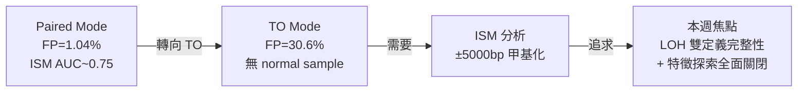
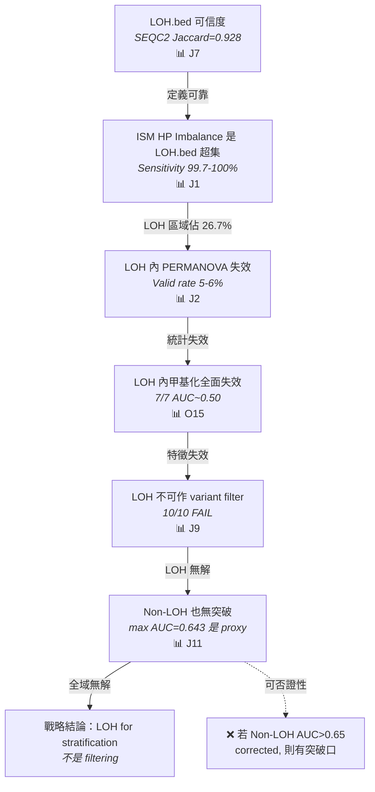
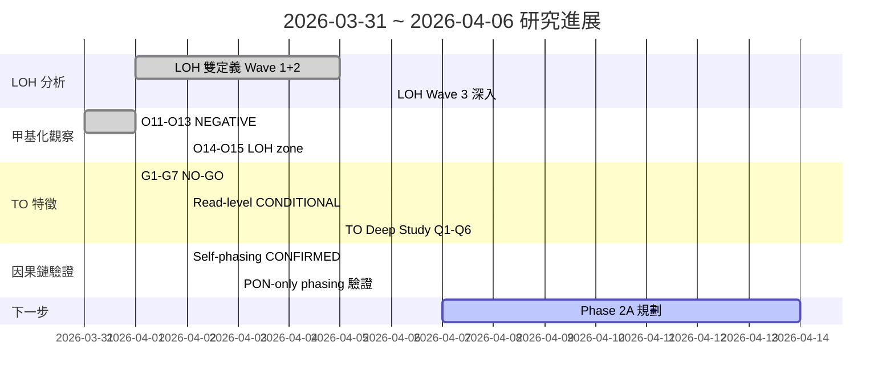

<!--
建立時間: 2026-04-06 22:00
目標: 整合 2026-03-31 至 2026-04-06 研究進展
處理範圍: LOH 雙定義交叉分析 Wave 1+2+3、O11-O15 甲基化觀察、G1-G7 TO FP 鑑別 NO-GO、Self-phasing 因果鏈、PON-only phasing 驗證、QS mode-aware 修正
關聯檔案:
  - /big7_disk/liaoyoyo2001/InterSubMod/docs/reports/validated/2026/04/20260406_LOH雙定義交叉分析報告/00_INDEX.md
  - /big7_disk/liaoyoyo2001/InterSubMod/docs/reports/validated/2026/04/20260402_longphase_to_vs_s_causal_chain_report_01.md
  - /big7_disk/liaoyoyo2001/InterSubMod/docs/experiments/INDEX.md
  - /big7_disk/liaoyoyo2001/InterSubMod/docs/reports/research_landscape/00_INDEX.md
-->

# 研究週報 2026-03-31 ~ 2026-04-06：LOH 雙定義與特徵探索全面關閉

---

## Layer 0：研究脈絡與背景知識

### 0.1 宏觀問題定位

| 指標 | 數值 | 較上週 |
|------|------|--------|
| 已確認結論 | 6/14 | +2 |
| NEGATIVE 關閉 | 5/14 | +3 |
| 懸置中結論 | 3/14 | -2 |
| 開放假說 | 2 | -3 |
| 當前階段 | Phase 1A 鎖定 | → Phase 2 規劃中 |

**一段話摘要**：InterSubMod 嘗試用甲基化特徵區分 TO 模式 TP/FP。本週完成 LOH 雙定義交叉分析（166 張圖表、16 項判定），**確定 LOH 不可作為 variant filter（10/10 FAIL）、多特徵組合 AUC=0.577<0.58、甲基化三維度全 NEGATIVE**。TO post-hoc 特徵探索正式全面關閉，研究方向轉向 read-level epigenetic characterization。

---

### 0.2 本週相關背景知識

#### 概念群組 1：LOH 雙定義與 Phasing

**LOH（Loss of Heterozygosity）** 是腫瘤中一條等位基因缺失的現象，造成該區域僅存單一 haplotype。在 InterSubMod 的分析中存在**兩種不同層級的 LOH 定義**：

1. **LOH.bed（區域層級）**：由 LongPhase-TO（根據 Knowledge/05_tools/longphase_to.md）產出，基於 phased genotype 中等位基因比例判定，以 BED 格式定義基因組上的 LOH 區域。這是 phasing 程式的直接輸出，粒度為連續基因組區域。

2. **HP_Ratio LOH（位點層級）**：由 ISM RegionProcessor 計算，定義為 HP_Ratio < 0.1 或 > 0.9（即某一 haplotype 的 reads 佔比超過 90%）。這是 per-variant 的間接指標。

LongPhase-TO 在 tumor-only 模式下使用 somatic variants 進行 phasing（根據 Knowledge/06_workflows/phasing_workflow.md），這產生了 **self-phasing 循環依賴**：somatic variants 同時作為 phasing 的輸入和 haplotagging 的輸出，造成 HP tag 偏差。

#### 概念群組 2：SEQC2 CNV Benchmark

**SEQC2（Sequencing Quality Control Phase 2）** 是 FDA 主導的多平台、多中心基因組 benchmark 計畫。其 CNV benchmark 資料集使用多種技術平台（WGS short-read + SNP array + 多中心共識）對 HCC1395 細胞株建立了 **gold standard LOH 定義**（320 個 autosomal LOH entries，覆蓋 1,490.5 Mb）。

SEQC2 LOH 的可信度來源：
- **多平台共識**：非單一方法，而是多種獨立技術交叉驗證
- **多中心驗證**：不同實驗室的重複性確認
- **公開標準**：作為 FDA benchmark 的一部分，經過嚴格審查

#### 概念群組 3：ISM 甲基化分析與 PERMANOVA

ISM（InterSubMod）在每個 somatic variant 位點的 ±5000bp 範圍內，提取覆蓋該區域的所有 reads 的 CpG 甲基化狀態，計算 read-read 距離矩陣（NHD/Bernoulli），並以 **PERMANOVA** 檢驗 HP1 vs HP2 群組間的甲基化差異是否顯著（根據 Knowledge/05_tools/intersubmod.md）。當 LOH 區域僅存單一 haplotype 時，HP 間比較失去統計意義——這是本週核心問題的生物學根因。

---

### 0.3 上週前情提要

上週（03-25~03-30）完成三項關鍵基盤工作：

1. **HP Integer Tag Bug 修正**：發現並修正 TO 模式下 HP tag 被當作整數（而非字串）處理的 bug，7 樣本 master dataset 全部重建完畢
2. **LOH Evidence Panel R1-R4 正式關閉**：四輪測試（cross-sample audit / HP0 filter / methyl HP0 filter / final integration）均無法以 LOH 特徵建立有效 variant filter，推薦 feature `tier_aplus_loh`（enrichment=2.02×）作為標記而非篩選工具
3. **Phase 1A methyl+context 鎖定**：paired-pure delta F1=+0.0112, CI=[+0.0044, +0.0188] 已鎖定

上週遺留的核心問題——**True LOH 與 phasing HP imbalance 如何區分？LOH 定義本身是否可信？**——正是本週主軸。

---

## Layer 1：已建立知識參考

### 1.1 已關閉假說參考表

| 假說 | 判決 | 關鍵證據 | 穩定度 |
|------|------|---------|--------|
| LOH Evidence Panel R1-R4 可建立 variant filter | ❌ NEGATIVE | 四輪均 FAIL | ⭐5 |
| Phase 1A methyl+context 對 paired-pure 有效 | ✅ CONFIRMED | delta F1=+0.0112, external validation | ⭐5 |
| TO 甲基化增益 | ❌ NEGATIVE | delta F1=-0.0206 | ⭐4 |

### 1.2 進入本週的開放問題

1. **Q1**：LOH.bed 與 HP_Ratio LOH 兩種定義的一致性如何？哪個更可信？ — 重要性：決定後續分層策略的基礎 — 解決條件：外部 gold standard 驗證
2. **Q2**：LOH 區域內，ISM 的甲基化特徵和統計檢驗是否仍然有效？ — 重要性：決定 ISM 是否需要 mode-aware 處理 — 解決條件：PERMANOVA valid rate + AUC 量化
3. **Q3**：LOH 之外（Non-LOH 58.1%），TO 特徵是否有區分力？ — 重要性：如果 Non-LOH 可解，則可集中資源 — 解決條件：Non-LOH AUC > 0.58

---

## Layer 2：本週調查

### Thread A：LOH 定義 → 可信度驗證 → ISM 影響 → 區塊觀察 → 全面結論

#### 問題陳述

- **是什麼**：系統性驗證 LOH 雙定義的可信度、一致性，並量化 LOH 對 ISM 分析的影響
- **為什麼重要**：上週 LOH Panel R1-R4 已關閉「LOH 作為 filter」，但 LOH 定義本身的可信度、ISM 在 LOH 區域的行為尚未系統性驗證

#### 定義區塊

> | 術語 | 定義 | 來源 | 範例值 |
> |------|------|------|--------|
> | **LOH.bed** | LongPhase-TO 輸出的區域層級 LOH 定義，基於 phased genotype ratio | LongPhase-TO BED | chr1:1M-50M |
> | **HP_Ratio** | HP1/(HP1+HP2) reads 比值，ISM 位點層級 | ISM RegionProcessor | 0.94 → LOH-like |
> | **HP Imbalance** | HP_Ratio < 0.1 or > 0.9 的位點判定 | ISM | rate=41.8% (TO) |
> | **四象限** | Q1: Both LOH; Q2: HP-only; Q3: LOH.bed-only; Q4: Neither | 本週定義 | Q1=26.7%, Q4=58.1% |
> | **SEQC2 LOH** | FDA 多平台共識 CNV benchmark 的 LOH 定義 | SEQC2 consortium | 320 entries, 1,490.5 Mb |

#### 假說與可否證條件

- **H1**：LOH.bed 是可信的 LOH 定義
  - 若 SEQC2 Jaccard > 0.90 則確認
  - 若 Jaccard < 0.80 則否決

- **H2**：ISM 在 LOH 區域需要特殊處理
  - 若 PERMANOVA valid rate < 20% 且 AUC~0.50 則確認
  - 若 valid rate > 50% 且 AUC > 0.60 則否決

- **H3**：LOH/Non-LOH 分層後，Non-LOH 有更高區分力
  - 若 Non-LOH AUC > 0.65 則確認
  - 若 Non-LOH AUC < 0.60 則否決

---

#### Step 1：LOH 兩種定義的一致性

ISM 使用兩種 LOH 定義，分析 419,692 筆 TO mode 數據的一致性：

---
**證據卡 E1 (Tier 1)：HP Imbalance 是 LOH.bed 的超集**

| 面向 | 內容 |
|------|------|
| **假說** | 兩種 LOH 定義應高度一致 |
| **測試** | 7 樣本 TO mode 419,692 rows，計算 per-sample Kappa/Jaccard/Sensitivity |
| **結果** | Sensitivity 99.7-100%；Q3（LOH.bed-only）僅 286 筆（0.07%）；HP Imbalance rate (41.8%) 顯著高於 LOH.bed rate (26.7%)；overall Kappa=0.670 |
| **可否證性** | 若 Q3 > 5% 則兩者不可互換 |
| **Confound 檢查** | HCC1954 Kappa=0.378（最低），因 LOH.bed rate 僅 6.3% vs HP rate 22.2%；不影響超集關係（Sensitivity 仍 99.8%） |
| **意義** | **ISM 完整包含 LOH.bed（J1）**——HP Imbalance 「過判」的部分（Q2, 15.2%）不是漏判，是 ISM 比 LOH.bed 更嚴格地捕捉 HP 偏移 |
| **圖表** | 圖 E1-1 證明四象限分佈中 Q3 近乎為空 |
---

**四象限分佈**：

| 象限 | 定義 | 筆數 | 佔比 |
|------|------|------|------|
| Q1 | Both LOH（HP Imbalance + LOH.bed） | 111,932 | 26.7% |
| Q2 | HP-only（HP Imbalance, 不在 LOH.bed） | 63,610 | 15.2% |
| Q3 | LOH.bed-only（在 LOH.bed, 無 HP Imbalance） | 286 | 0.07% |
| Q4 | Neither | 243,864 | 58.1% |

Q2 的本質後續由 J6 解答：這些位點 AF median=0.47（正常水準），d=-1.04 vs Q1，是 **phasing 偏差而非真 LOH**。

---

#### Step 2：SEQC2 — 外部金標準驗證 LOH.bed 可信度

---
**證據卡 E2 (Tier 1)：LOH.bed 與 SEQC2 一致性極高**

| 面向 | 內容 |
|------|------|
| **假說** | LongPhase-TO LOH.bed 應與 SEQC2 gold standard LOH 高度一致 |
| **測試** | HCC1395 + HCC1395_DORADO，base-pair level interval comparison，SEQC2 320 autosomal LOH entries (1,490.5 Mb) |
| **結果** | **Jaccard=0.928** (5kHz: 0.9277, Dorado: 0.9290)；Sensitivity=0.961；Precision=0.964；F1=0.963 |
| **可否證性** | 若 Jaccard < 0.80 則 LOH.bed 不可信 |
| **Confound 檢查** | SEQC2 基於 short-read WGS + array 多平台共識，LongPhase-TO 基於 ONT long-read phased genotype——方法完全獨立，高一致性非方法學循環 |
| **意義** | **LOH.bed 可信（J7）**。兩種完全獨立的方法（NGS 多平台 vs ONT phasing）對 HCC1395 的 LOH 判定幾乎完全吻合，LOH.bed 可作為後續分層分析的可靠基礎 |
| **圖表** | 圖 E2-1 證明 LOH.bed 與 SEQC2 的 base-pair level 交集覆蓋 1,432 Mb |
---

**為何 SEQC2 LOH 可信度最高**：

- SEQC2 是 **FDA 主導的 benchmark 計畫**，HCC1395 是其核心 reference cell line
- LOH 定義來自 **WGS short-read + SNP array + 多平台多中心共識**，非單一技術
- 覆蓋範圍 1,490.5 Mb（約佔 autosomal 基因組 ~53%），代表性充足
- LongPhase-TO 使用 **完全不同的技術路線**（ONT long-read phased genotype），與 SEQC2 方法學零重疊

HP_Ratio 作為 per-variant 預測 SEQC2 LOH 的 AUC=0.8979，但 LOH.bed 的 region-level F1=0.966 更優——合理，因為 LOH.bed 是 phasing 的直接輸出。

---

#### Step 3：ISM 為何對 LOH 需特殊處理

LOH.bed 可信度確認後，接下來的問題是：LOH 區域對 ISM 的分析有什麼影響？

---
**證據卡 E3 (Tier 1)：PERMANOVA 在 LOH 內不可用**

| 面向 | 內容 |
|------|------|
| **假說** | LOH 區域因只有一條 haplotype，HP 間比較應失效 |
| **測試** | 7 樣本 TO mode，LOH 區域內 PERMANOVA valid rate（需兩群各 ≥3 reads） |
| **結果** | Valid rate 僅 **5-6%**；min(HP) < 3 的比例 = 94%；LOH 內甲基化特徵 **7/7 樣本 AUC~0.50**（隨機） |
| **可否證性** | 若 valid rate > 50% 則 LOH 內仍可用 PERMANOVA |
| **Confound 檢查** | O15 以 32 張圖表跨 7 樣本獨立驗證；結論穩定 |
| **意義** | **LOH 內的 HP-based 特徵全部失效（J2）**。ISM 的 PERMANOVA、CramersV、VerificationClass 在 LOH 區域無統計意義，必須建立 mode-aware 處理 |
| **圖表** | 圖 E3-1 證明 LOH 內 min(HP) 分佈極度偏向 0-2 |
---

**根因**：LOH 區域只有一條 haplotype 上有 reads（HP_Ratio > 0.9），另一條幾乎無 reads。ISM 的 PERMANOVA 需要兩群各 ≥3 reads，在 LOH 區域 94% 的位點不滿足此條件。即使勉強計算，也無法產生有意義的群組間差異。

**已實作的修正**：QS mode-aware（commit `b9eaba7`）——TO 模式下停用 LOH penalty 和 verify bonus，避免基於無效 PERMANOVA 結果做 penalty 計算。

---

#### Step 4：ISM HP 偏移定義與 LOH.bed 的區塊切分

建立四象限後，進一步分析各區塊的 TP/FP 分佈：

> **證據卡 E4 (Tier 2)：Q2 是 phasing 偏差而非真 LOH**
>
> **假說**：Q2（HP-only, 非 LOH.bed）可能是弱版 LOH | **結果**：AF median=0.47（正常水準），d=-1.04 vs Q1；非 LOH 的 HP 偏移
> **意義**：Q2 由 phasing 偏差造成，不應與真 LOH 混合分析 | **可否證性**：若 Q2 AF 分佈與 Q1 一致則為弱 LOH
> *圖表*：圖 E4-1 Q2 vs Q1 AF 分佈對比

> **證據卡 E5 (Tier 2)：LOH 區域 TP-enriched，不可作為 filter**
>
> **假說**：LOH 區域移除可減少 FP | **結果**：LOH 內 FP rate=0.239 vs Non-LOH 0.338；**10/10 篩選策略在 7 樣本上全面 FAIL**（TP loss > 2%）
> **意義**：LOH 是 tumor suppressor 失活的常見機制，LOH 內大多數 variants 是真 TP（J9） | **可否證性**：若任何策略 TP loss ≤ 2% 且 FP removal > 0% 則可行
> *圖表*：圖 E5-1 證明 10 種策略均超過 TP loss 安全線

---

#### Step 5：各區塊觀察數據與甲基化結果

**LOH 區域**：

---
**證據卡 E6 (Tier 1)：LOH 內 AlleleDelta 是唯一 confound-free 信號但不足**

| 面向 | 內容 |
|------|------|
| **假說** | LOH 區域可能有不依賴 HP 的特徵可區分 TP/FP |
| **測試** | 31 特徵 × 7 樣本 × LOH/Non-LOH AUC 矩陣；AlleleDelta 深度驗證（residualize, L3 AF-bin） |
| **結果** | AlleleDelta AUC=0.556，7/7 樣本一致 TP-favored，residualize 後不變（confound-free）；但 0.556 遠低於 0.58 門檻 |
| **可否證性** | 若 AlleleDelta AUC > 0.65 則可作為 weak filter 基礎 |
| **Confound 檢查** | NumReads residualize → 不變；AF-bin L3 → 4/4 TP-favored；非 confound artifact |
| **意義** | **AlleleDelta 是 LOH 唯一真實信號（J10/J16）**，但 AUC=0.556 不足以單獨或組合作 filter |
| **圖表** | 圖 E6-1 AlleleDelta per-sample AUC consistency；圖 E6-2 residualize 前後對比 |
---

**Non-LOH 區域**（Q4, 58.1%）：

> **證據卡 E7 (Tier 2)：Non-LOH 區分力同樣有限**
>
> **假說**：Non-LOH 佔 58.1%，若可區分則可集中資源 | **結果**：最高 AUC=0.643（HPFineNGroups），但為 read count proxy；排除 confound 後**無特徵 > 0.58**
> **意義**：問題是全域性的而非 LOH 特異的——LOH 與 Non-LOH 差異 < 0.06 AUC（J11/J12） | **可否證性**：若 Non-LOH 任一特徵 corrected AUC > 0.60 則有突破口

**多特徵組合**：

> **證據卡 E8 (Tier 2)：多特徵組合不可行**
>
> **假說**：單一特徵弱，組合可能超過 0.58 | **結果**：AlleleDelta + CramersV + PairwiseMedianDist 三特徵 Voting AUC=**0.577 < 0.58 門檻**
> **意義**：多特徵組合也無法突破（J13），正式關閉 LOH 區域的特徵探索 | **可否證性**：若更多特徵組合 AUC > 0.60

**cnLOH 陷阱**：

cnLOH（copy-neutral LOH, Coverage_Multiple 0.8-1.2）的 PairwiseMeanDist 表面 AUC=0.5865 似乎過 0.58 門檻。但深入驗證發現這是 **Simpson's Paradox**（J14）：per-sample mean AUC=0.4987（本質隨機），整體數值被 H2009（N=31,970, 佔 48.6%）主導。5/7 樣本 TP-favored 但 COLO829=0.26、H1437=0.49 為 FP-favored。(Evidence: per-sample mean AUC=0.4987, source: 20260406_LOH雙定義交叉分析報告/08; falsifiable if per-sample mean AUC > 0.55)

CramersV 在 LOH 被 NumReads confound：AUC 0.511→0.464 after residualize（J15）。(Evidence: delta AUC=-0.047, source: 20260406_LOH雙定義交叉分析報告/07; falsifiable if residualize 後 AUC 不變)

---

#### 因果鏈圖

---

#### 結論

- **判決**：CONFIRMED — LOH 雙定義可信，但 LOH 不可作 filter；Non-LOH 同樣無突破
- **穩定度**：⭐5（166 圖表 × 7 樣本 × 3 Wave 交叉驗證）
- **這改變了什麼**：
  - LOH.bed 確認可信（Jaccard=0.928），可作為分層分析基礎
  - TO 特徵探索全面關閉：LOH 區域（甲基化失效 + filter FAIL）、Non-LOH（AUC<0.58）、組合（0.577<0.58）
  - ISM 需要 mode-aware 處理（已實作 QS mode-aware）
- **已排除的替代解釋**：
  - cnLOH 看似 AUC=0.587 → Simpson's Paradox（per-sample 0.50）
  - CramersV 看似有信號 → NumReads confound
  - 多特徵組合 → Voting 最高 0.577
- **什麼會重新開啟此問題**：
  - 若 self-phasing 修正（PON-only phasing）後 Non-LOH AUC > 0.65
  - 若低純度臨床樣本（非高純度細胞株）展現不同的特徵分佈

---

### Thread B：甲基化假說關閉 + TO 特徵 NO-GO + ASM 唯一亮點

#### 問題陳述

- **是什麼**：平行於 LOH 主線，驗證三條甲基化假說（O11-O13）、VCF 特徵鑑別（G1-G7）、read-level 鑑別
- **為什麼重要**：窮盡所有已知方向後，才能確定 ISM 的真實價值定位

#### 甲基化三維度 NEGATIVE（O11-O13）

---
**假說消除矩陣**

| # | 假說 | 測試 | 結果 | 判決 | 根因 |
|---|------|------|------|------|------|
| O11 | Within-group heterogeneity 可區分 TP/FP | epipolymorphism + entropy × 7 samples | AUC 0.845→**0.530** after n_reads correction | ❌ NEGATIVE | 表面信號完全來自 n_reads confound |
| O12 | TO LOH 三甲基化場景可區分 | AlleleDelta + L2 residualize × 7 samples | 全 corrected AUC<0.58；L2 collider bias 發現 | ❌ NEGATIVE | AlleleDelta 是 AF confound；L2 對近常數殘差化產生虛假信號 |
| O13 | 跨區域甲基化 correlation 不同 | shared read matching + residualize | 分層+matching 後差異完全消失 | ❌ NEGATIVE | shared read count confound |
---

#### TO Germline FP 鑑別 NO-GO（G1-G7 + Read-level）

> **證據卡 E9 (Tier 2)：TO VCF 特徵 60+ 全面失敗**
>
> **假說**：VCF 特徵（AF, GQ, strand bias 等）可識別 germline FP | **結果**：G1-G7 共 48 圖 60+ 特徵全 AUC<0.64；**TP loss ≤2% 下 FP removal=0%**
> **意義**：TO post-hoc germline FP 識別正式關閉 | **可否證性**：若新特徵組合 safe FP removal > 1%

> **證據卡 E10 (Tier 2)：Read-level LOSO AUC=0.721 但實用性為零**
>
> **假說**：Read-level haplotype + methylation 可提升鑑別 | **結果**：LOSO AUC=0.721（首次 >0.70），但安全約束下 FP removal=0%
> **意義**：高純度細胞株下幾乎所有 FP 都是 germline（甲基化與 TP 不可區分）；**低純度臨床樣本仍有潛力** | **可否證性**：若低純度樣本 safe FP removal > 5%

#### ASM — ISM 的唯一亮點

> **證據卡 E11 (Tier 2)：ISM PERMANOVA 唯一捕捉 ASM entropy imbalance**
>
> **假說**：SNV 位點是否有 allele-specific methylation (ASM) | **結果**：5 種獨立方法驗證 32-66% SNV 位點有 ASM；FP>TP 但重疊大；ISM PERMANOVA 是唯一量化 haplotype 間 entropy imbalance 的工具
> **意義**：ISM 不是「無用」——而是用途不同。ISM 的價值在 read-level epigenetic characterization，非 variant filtering | **可否證性**：若 ASM 比例 < 10% 則 ISM 甲基化分析缺乏生物學基礎

#### Self-Phasing 因果鏈 CONFIRMED（補充 LOH HP 偏移根因）

Self-phasing 循環依賴已完整驗證（五步因果鏈 + 23 TSV + 7 PNG）：
- TO 使用 somatic variants 作為 phasing 輸入 → HP bias 17.3:1
- 62% LOH 消失（paired → TO 對照）；effect size d=-1.20
- 31.2% self-phasing LOH（非真 LOH）
- PON-only phasing 可消除 somatic bias（bias 17.3:1 → 消除），LOH.bed Jaccard=1.0（不變），N50 +99.7%，phased rate +23.6pp

(Evidence: d=-1.20, 62% LOH 消失, source: 20260402_longphase_to_vs_s_causal_chain_report_01.md; falsifiable if PON-only phasing 後 HP bias 未消除)

---

## Layer 3：整合更新

### 3.1 結論總表更新

| # | 結論 | 判決 | 穩定度 | **本週變動** |
|---|------|------|--------|-------------|
| C1 | TO FP 30.6% 中 99.48% 由 PON 移除 | CONFIRMED | ⭐5 | — |
| C2 | ISM 甲基化增益 paired-pure +0.0112 | CONFIRMED | ⭐5 | — |
| C3 | Self-phasing 循環依賴汙染 38% 特徵 | CONFIRMED | ⭐5 | **本週因果鏈完整驗證** |
| C4 | TO 甲基化增益為負 | CONFIRMED | ⭐4 | — |
| C5 | LOH.bed 可信 (SEQC2 Jaccard=0.928) | **CONFIRMED** | **⭐5** | **本週新增** |
| C6 | **LOH 不可作 variant filter** | **CONFIRMED** | **⭐5** | **本週 J9: 10/10 FAIL** |
| C7 | **甲基化三維度 NEGATIVE (O11-O13)** | **NEGATIVE** | **⭐4** | **本週全部關閉** |
| C8 | **TO VCF 特徵全面 NO-GO (G1-G7)** | **NEGATIVE** | **⭐5** | **本週 60+ 特徵 AUC<0.64** |
| C9 | **Non-LOH 同樣無突破** | **NEGATIVE** | **⭐4** | **本週 J11: max 0.643 是 proxy** |
| C10 | ASM 32-66% SNV 位點有 ASM | POSITIVE | ⭐4 | **本週 5 方法驗證** |
| C11 | Read-level AUC=0.721 但 removal=0% | CONDITIONAL | ⭐3 | **本週新增** |
| C12 | **多特徵組合不可行** | **NEGATIVE** | **⭐5** | **本週 J13: Voting 0.577<0.58** |
| C13 | PON-only phasing 消除 somatic bias | CONFIRMED | ⭐4 | **本週驗證** |
| C14 | LOH 價值在 stratification 非 filtering | **CONFIRMED** | **⭐5** | **本週戰略結論** |

### 3.2 本週新增的認知

1. **SEQC2 LOH 與 LongPhase-TO LOH.bed Jaccard=0.928**：兩種完全獨立的方法對 HCC1395 LOH 判定幾乎吻合，確認 LOH.bed 作為分層基礎的可靠性
2. **LOH 內甲基化全面失效**（7/7 AUC~0.50）的根因是只有一條 haplotype 有 reads（PERMANOVA valid rate 5-6%）
3. **Non-LOH 也無突破**（max corrected AUC<0.58）：TO 的特徵區分力問題是全域性的，不是 LOH 特異的
4. **cnLOH AUC=0.587 是 Simpson's Paradox**：per-sample mean=0.50，被 H2009 主導
5. **AlleleDelta 是 LOH 唯一 confound-free 信號**（AUC=0.556），但不足以作 filter 或組合

### 3.3 仍然未知的

| 優先序 | 問題 | 依賴 | 預計何時可回答 |
|--------|------|------|---------------|
| 1 | Self-phasing 修正後（PON-only），ISM 特徵會改善多少？ | haplotag + ISM 全量重跑 | Phase 2A（2-3 週） |
| 2 | 低純度臨床樣本是否有更高的 read-level 鑑別力？ | 低純度樣本資料取得 | 待規劃 |
| 3 | Normal methylation reference 能否建立有效的 baseline？ | Phase 2A normal read export | 待規劃 |

---

## Layer 4：未來方向

### 4.1 下週優先行動

| 優先序 | 行動 | 依賴 | 預期結果 |
|--------|------|------|---------|
| 1 | 規劃 Phase 2A：PON-only phasing 全量重跑 + ISM 重跑 | PON-only phasing 驗證已完成 | 確認 self-phasing 修正後的真實特徵分佈 |
| 2 | 規劃 Phase 2A：Normal methylation reference baseline | Phase 2A 重跑完成後 | 建立 read-level epigenetic reference |
| 3 | 整理本週 166 圖表 + 研究全景文件更新 | — | 研究 landscape v2.0 |

### 4.2 里程碑收斂圖

### 4.3 風險評估

| 風險 | 可能性 | 影響 | 緩解方案 |
|------|--------|------|---------|
| PON-only 重跑後特徵仍無改善 | 中 | Phase 2A 核心假說否決 | 已有 baseline 比較框架，可快速判定 |
| 低純度樣本不可取得 | 低 | Read-level 方向無法驗證 | 可用 subsample 模擬（雖有限制） |
| 全量重跑計算資源不足 | 低 | 延遲 2A 啟動 | 可分批（priority samples first） |

---

## 附錄：參考文件索引

| 文件 | 路徑 |
|------|------|
| LOH 雙定義交叉分析報告（完整） | `/big7_disk/liaoyoyo2001/InterSubMod/docs/reports/validated/2026/04/20260406_LOH雙定義交叉分析報告/00_INDEX.md` |
| Self-phasing 因果鏈報告 | `/big7_disk/liaoyoyo2001/InterSubMod/docs/reports/validated/2026/04/20260402_longphase_to_vs_s_causal_chain_report_01.md` |
| Purity-dependent self-phasing validation | `/big7_disk/liaoyoyo2001/InterSubMod/docs/reports/validated/2026/04/20260402_purity_dependent_self_phasing_validation_01.md` |
| LOH Evidence Panel Post-Fix | `/big7_disk/liaoyoyo2001/InterSubMod/docs/reports/validated/2026/04/20260404_LOH_evidence_panel_post_TO_HP_fix_final_report_01.md` |
| Read-level Germline FP Report | `/big7_disk/liaoyoyo2001/InterSubMod/docs/reports/validated/2026/04/20260402_read_level_germline_fp_research_report_01.md` |
| 肉眼檢視推理鏈 | `/big7_disk/liaoyoyo2001/InterSubMod/docs/reports/validated/2026/04/20260406_肉眼檢視推理鏈與TP_FP可區分性分析_01.md` |
| O1-O10 系統性觀察彙整 | `/big7_disk/liaoyoyo2001/InterSubMod/docs/reports/validated/2026/04/20260401_systematic_observation_O1_O10_summary_01.md` |
| TO Feature Deep Study | `/big7_disk/liaoyoyo2001/InterSubMod/docs/experiments/in_progress/2026/04/20260405_TO_ClairSTO特徵區分力深度研究_01.md` |
| 研究全景索引 | `/big7_disk/liaoyoyo2001/InterSubMod/docs/reports/research_landscape/00_INDEX.md` |
| 實驗索引 | `/big7_disk/liaoyoyo2001/InterSubMod/docs/experiments/INDEX.md` |
| 前次週報 | `/big7_disk/liaoyoyo2001/InterSubMod/docs/reports/validated/2026/03/20260330_研究週報_20260325_20260330_HP_bug_fix與LOH_evidence_panel_01.md` |
