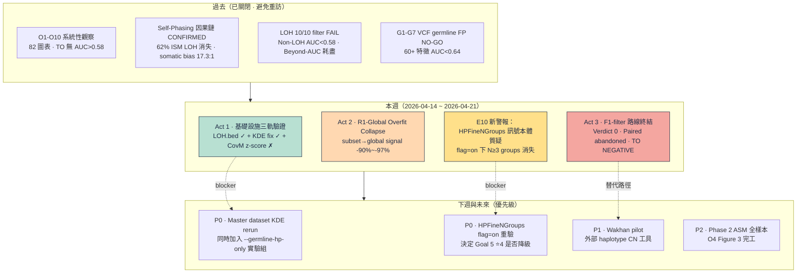
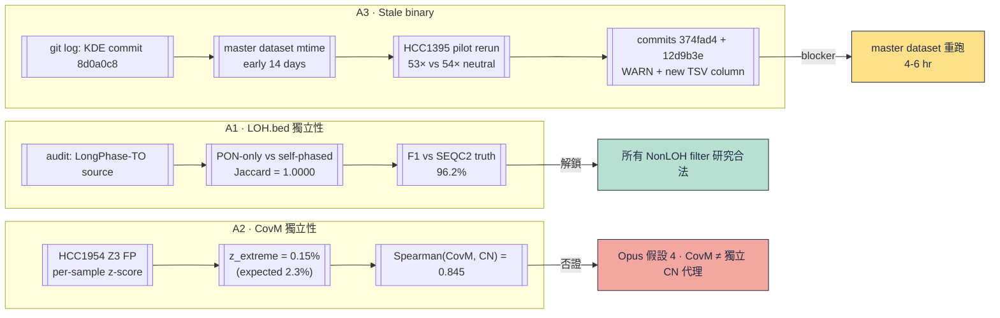
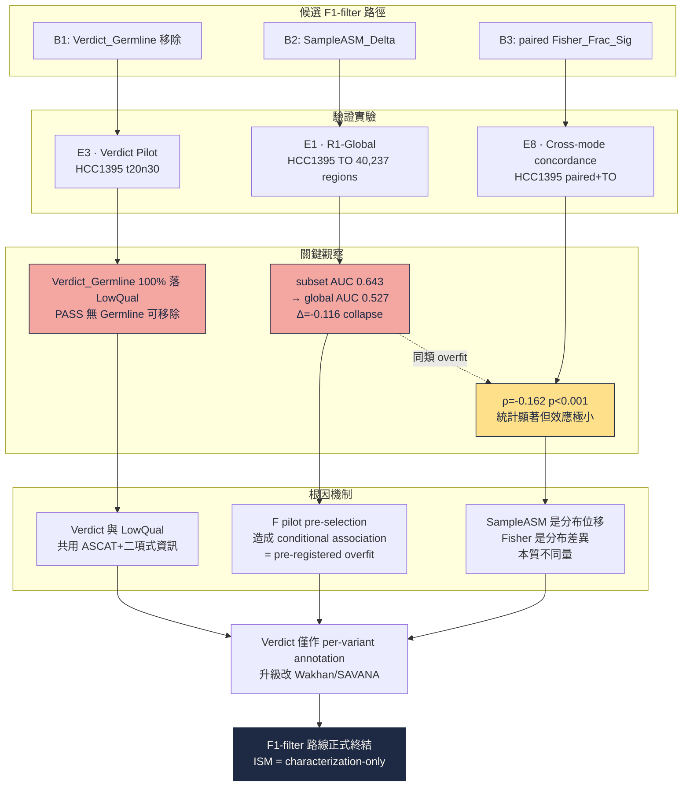
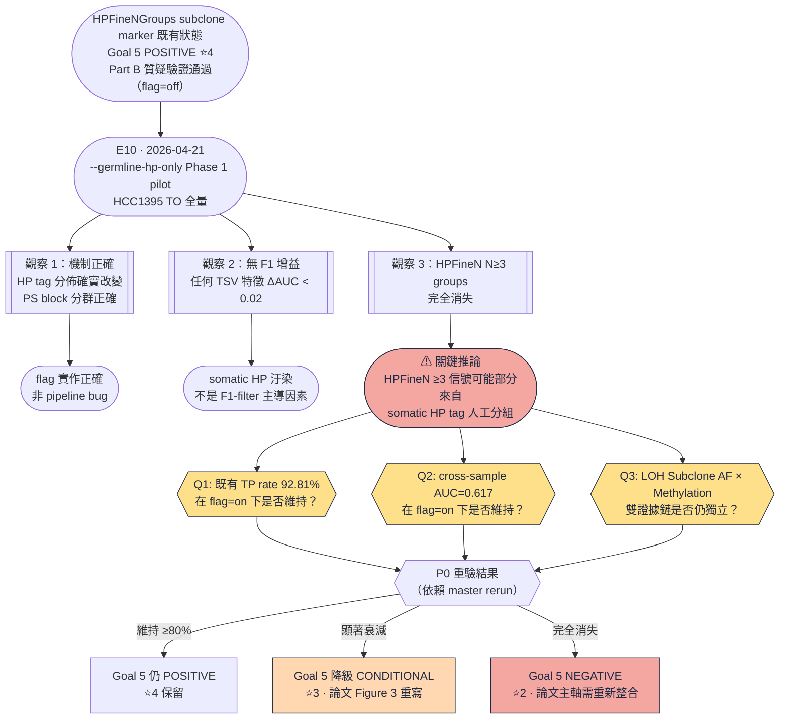
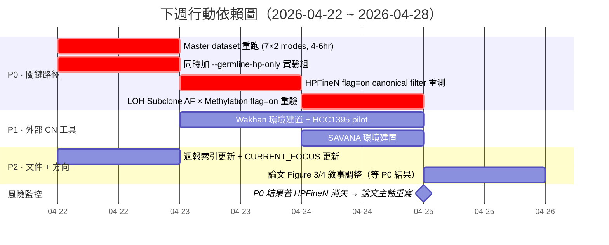
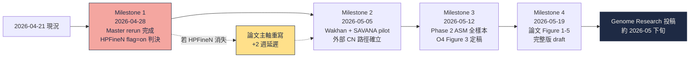

<!--
建立時間: 2026-04-21
涵蓋區間: 2026-04-14 ~ 2026-04-21
狀態: validated
受眾: PI（熟悉 ONT、cancer genomics、somatic calling）
故事線: 多軌收斂 · 定位定錨
前一份週報: docs/reports/validated/2026/03/20260406_研究週報_20260331_20260406_LOH雙定義與特徵探索全面關閉_01.md
資料來源:
  - docs/CURRENT_FOCUS.md
  - docs/reports/research_landscape/{00_INDEX,03_ISM分析價值界定,06_結論穩定性審查,09_Part_B}.md
  - docs/experiments/in_progress/2026/04/20260419-20260420_*.md
  - research/F_hpfinengroups_deepening/observations/step7_*.md, step8_r1_global_to_arm.md
  - research/autoresearch/evidence_ledger.jsonl
Plan 規劃書: /bip7_disk/liaoyoyo2001/.claude/plans/radiant-moseying-turtle.md
-->

# 研究週報 — 多軌收斂 · 定位定錨（2026-04-14 ~ 2026-04-21）

---

## Layer 0.1 宏觀脈絡

### 研究演化脈絡圖（過去 → 本週 → 未來）

### 核心數字表（本週定案）

| 指標 | 本週值 | 對照（先前） | 意義 |
|------|-------|------------|------|
| **R1-Global SampleASM_Delta residualized AUC** | **0.527** [0.520, 0.533], n=40,237 | F pilot subset 0.643 (n=801) | subset→global **−0.116 signal collapse** |
| **R1-Global NormalBaseline_Coverage residualized AUC** | **0.506** [0.500, 0.512], n=40,237 | F pilot subset 0.687 | **−0.181 collapse** (97%) |
| **Verdict_Germline FP rate (HCC1395 t20n30)** | **96.1%** Wilson CI [0.955, 0.967], n=3,602 | — | 內部校準優異但 ΔF1=0 |
| **Verdict S1 "remove Germline from PASS" ΔF1** | **+0.0000** | — | Verdict_Germline 100% 已在 LowQual |
| **LOH.bed PON vs self-phased Jaccard** | **1.0000** (1,094 regions) | — | LOH.bed ≠ self-phasing 循環 |
| **KDE fix: HCC1395 pilot coverage** | **53×** (vs SEQC2 54× neutral, bias −1.9%) | stale binary 75.0× (bias +41%) | stale-binary artifact 關閉 |
| **CovM median (HCC1395 paired, KDE fix)** | **1.245** (×1.415) | stale 0.880 | master dataset 需重跑 |
| **Cross-mode concordance (TO SampleASM vs paired FisherFrac)** | **ρ=−0.162**, p=6.5e-4, n=441 | — | 訊號獨立但效應極小 |
| **Tier 分佈變動** | ⭐5 **+2** (LOH.bed, Phase 2 ceiling), ⭐4 **−1** (HPFineN 暫退 CONDITIONAL), ⭐2 **+1** (CL-025a 降級) | — | 結論版圖重洗 |

### 一段話摘要

本週完成五條獨立研究軌道的收斂驗證，**全部指向同一結論：ISM 的論文定位從 `variant filter` 正式確立為 `epigenetic characterization`**。R1-Global HCC1395 全 40,237 variants 驗證 SampleASM_Delta residualized AUC=0.527（CI 上界 0.533 < 0.58 天花板），subset→global 訊號塌陷 −0.116~−0.181，證實 F pilot 0.64-0.69 的 AUC 來自 pre-selection overfit。ClairS-TO 內建 Verdict 雖內部校準優秀（Germline FP 96.1%、Somatic TP 91.8%）但 F1 增益 = 0；paired F1-filter 方向同日（2026-04-21）正式放棄。另發現兩項 blocker：(a) stale-binary artifact 導致 master dataset `expected_coverage=75.0` 共用預設，需 KDE-fixed binary 重跑 7 樣本 × 2 modes（4-6 小時）；(b) `--germline-hp-only` Phase 1 pilot 揭示 HPFineN N≥3 groups 在 flag=on 下完全消失，既有 HPFineNGroups subclone marker ⭐4 結論在 germline-only 條件下需重驗，論文 Figure 3/4 主證據鏈暫時停滯。

---

## Layer 0.2 背景知識（本週相關概念群組）

### 群組 1：subset → global overfit collapse（本週主旋律）

**定義**：在 pre-selected 子集（如 F pilot NG=4+AF<0.4+NR≥80+NonLOH 共 801 regions）內測得的高 AUC，在放寬到 global（同樣本全 40k regions）後大幅衰減的現象。

**機制**：
- Pre-selection 同時影響 feature 分佈 與 TP/FP 比例，造成 **conditional association ≠ marginal association**
- 當 subset 內 TP_rate=0.97（F pilot）vs global 0.71，稀有 FP 的 12 個點可能恰好分離良好 → AUC 膨脹
- Global 下 FP=11,841 是 subset 12 的 **987×**，bootstrap CI 才首度具統計意義

**可否證條件**：若 `auc_global_fpilot_filter`（在 global 上應用 F pilot filter 但不預選 TP/FP） ≈ `auc_subset_old` → filter 真有 enrichment；若塌回隨機 → subset artifact。本週實測所有 15 特徵均塌回 ≤0.53。

**為什麼本週重要**：這是把 characterization-only 定位從「暫定」升格為「三重證實」的關鍵機制。

---

### 群組 2：stale-binary artifact

**定義**：master dataset 的 TSV 輸出由 KDE commit（`8d0a0c8`, 2026-04-13）**之前**的 ISM binary 產生 → 所有樣本 `expected_coverage` 共用 CLI default 75.0，而非 per-sample KDE-estimated baseline。

**影響邊界**：
- **影響**：所有跨樣本 Coverage_Multiple 比較、CovM percentile filter、Z3 CovM z-score normalization 的絕對值
- **不影響**：percentile-based filter（Variant A 數學證明 scale-invariant）、per-sample 內部排序、LOH.bed 本身（Jaccard=1.0）
- **量化**：HCC1395 paired CovM median 0.880 → 1.245（×1.415），CNV_Gain+High_Copy 分類 9.3% → 32.9%

**修正方法**：commits `374fad4` + `12d9b3e`（KDE WARN + `Diploid_Coverage_Used` TSV column + DiploidEstimate struct），避免 value==75.0 sentinel 誤判。

**為什麼本週重要**：所有 2026-04-19 前的 cross-sample CovM 結論都需以此前提標註；重跑完成前 Z3 跨樣本失敗的「CNV 異質性」vs「coverage bias」歸因不可完全分離。

---

### 群組 3：HP tag 來源異質性（本週新揭露）

**定義**：ISM ReadParser 既有實作會保留所有 HP tags（含 LongPhase-TO 在 somatic block 階段可能引入的 tumor-derived HP），而非僅 germline-phased HP。新增 `--germline-hp-only` flag 可在 ReadParser 層僅保留 PS tag 屬於 germline SNV block 的 reads。

**設計預期**：降低 somatic HP tag 對 HPFineNGroups、HP_Signed_Delta 等 HP-dependent 特徵的雜訊汙染。

**觀察**：HCC1395 TO 全量啟用 flag=on 後：
- 機制正確性：**✓**（HP tag 分佈確實改變，PS block 分群正確）
- F1 增益：**無**（任何 TSV 特徵 ΔAUC < 0.02）
- **意外觀察**：HPFineN N≥3 groups 幾乎完全消失

**推論**：先前 HPFineN N≥4+NR≥80 subclone marker（TP rate 92.81%、跨樣本 AUC 0.617）的訊號可能**部分來自 somatic HP tag 所造成的人工 fine-group 結構**，而非真實生物學亞克隆異質性。

**為什麼本週重要**：這是 ⭐4 結論**首次從內部機制層面**被質疑（過去 ⭐4 降級多為 confound 發現）；若重驗後消失，論文 Figure 3 需重寫。

---

## Layer 0.3 前情提要（橋接上週報）

前一份週報 `20260406_研究週報_20260331_20260406_LOH雙定義與特徵探索全面關閉`（以下簡稱 0406 週報）鎖定三點結論：
1. **LOH 雙定義全面關閉**：SEQC2 Jaccard=0.928 確認 LOH.bed 與 FDA 金標準吻合；10/10 filter 策略全失敗
2. **Beyond-AUC 耗盡**：純甲基化特徵全 ≤0.58；ISM 定位轉向 read-level epigenetic characterization
3. **HPFineNGroups somatic heterogeneity marker**：N≥4+NR≥80 TP rate 89.1%，登記為 somatic marker 候選（後升級 N=4+AF<0.4+NR≥80 → 92.81%）

**0406 → 本週的中間兩週（2026-04-07 ~ 04-13）完成**（未單獨報告）：
- Zone-Aware Framework 5 zone 定義與 H1/H3 驗證（Z1b 最佳 TO 4.6% 覆蓋率、TP rate 0.965）
- QS 模擬 NEGATIVE（max ΔF1=+0.001）
- Phase B-D C++ 代碼完成（Normal BAM integration, Sample ASM, Somatic HP ASM, LOH BED annotation, Cross-region subclone analysis）
- Part B 質疑驗證完成（HPFineNGroups 健壯性確認 · 當時 flag=off 條件下）
- Coverage_Multiple GC 校正與甲基化-CN 驗證：全 NO-GO（delta-r=−0.0002）

**進入本週時的待解問題**（本週要回答）：
1. Zone-Aware Framework 在 F1 上能否落地？（答：否，ΔF1=+0.0011）
2. R1 Sample ASM pilot subset 的 AUC=0.610 是真實訊號還是 overfit？（答：overfit，global 0.527）
3. ClairS-TO 內建 Verdict 能否補足 germline FP 分類？（答：內部校準可，F1 無用）
4. LOH.bed 是否真的獨立於 self-phasing？（答：Jaccard=1.0 獨立）
5. `--germline-hp-only` 是否能降低 HP 雜訊？（答：機制正確但無 F1 增益，反而暴露 HPFineN 訊號來源問題）

---

## Layer 1 已建立知識參考（薄）

本週觸及但不重新討論的已關閉結論：

| 已關閉結論 | 來源 | 本週引用場景 |
|-----------|------|------------|
| TO 無單一特徵 AUC>0.64（G1-G7, O1-O10） | 0406 週報 · 03_ISM分析價值界定.md | 作為 Thread B R1-Global 對照基線 |
| Self-phasing 17.3:1 somatic bias | project_self_phasing_causal_chain_confirmed | 作為 Thread A LOH.bed audit 的對照前提 |
| Beyond-AUC ≤0.58 ceiling | project_beyond_auc_exhaustion_confirmed | 本週 R1-Global 再次驗證（最高 0.533） |
| Zone-Aware QS filter NEGATIVE | CURRENT_FOCUS §Zone-Aware | Thread B 論證 F1-filter 路線終結 |
| TO germline FP NO-GO | project_germline_fp_identification_nogo | Thread B ClairS-TO Verdict 位置 |

---

## Layer 2 本週調查

### Thread A · 基礎設施驗證三軌（~2 頁）

#### 問題陳述

進入本週時，三項基礎設施假設阻塞下游 Zone/F pilot 研究：
- **A1**：LOH.bed 是否經 self-phasing 循環汙染？（若是 → 所有 NonLOH filter 研究結論需重新評估）
- **A2**：Coverage_Multiple 是否為獨立 CN 代理？（Opus 4.7 Plan Part B 假設 4）
- **A3**：master dataset `expected_coverage=75.0` 共用值是 KDE 邏輯 bug、是 hard-coded 值、還是 stale binary artifact？

#### 定義區塊

| 術語 | 範例值 | 說明 |
|------|-------|------|
| `LOH.bed` | `chr1 905000 912400` | LongPhase-TO 輸出，phased VCF GT ratio（VAF ≥ 0.8 → HOM）判定 |
| `Jaccard(A,B)` | 1.0000 = 1,094 / 1,094 regions | 區間交集 / 聯集 |
| `Coverage_Multiple (CovM)` | HCC1395 paired median 0.880 → 1.245 | `local_coverage / expected_coverage` |
| `expected_coverage` | 75.0（stale）vs 53×（KDE-fixed, HCC1395） | baseline 整體 coverage baseline |
| `Diploid_Coverage_Used` | 新增 TSV column（commit 374fad4） | 記錄 KDE estimated / fallback default，避免 value==75.0 sentinel 誤判 |

#### 假說與可否證條件

| ID | 假說 | 可否證條件 | 結果 |
|----|------|-----------|------|
| H_A1 | LOH.bed 獨立於 BAM HP tags（不讀 haplotag） | PON-only phasing vs self-phasing 兩 pipeline LOH.bed Jaccard = 1.0 | **✓ PASS** |
| H_A2 | CovM 為獨立 CN 代理（Plan 假設 4） | HCC1954 Z3 FP 在 per-sample z-score normalize 後 z_extreme > 2.3% | **✗ FAIL** (實測 0.15%) |
| H_A3 | master dataset 75.0 = stale binary artifact | KDE-fixed binary 在 HCC1395 pilot 估計 coverage 與 SEQC2 neutral 54× bias < 5% | **✓ PASS** (實測 −1.9%) |

#### 方法與 confound 控制

**Thread A DAG（證據鏈圖）**：

**Confound 控制清單**：
- A1 LOH.bed：並行跑 PON-only（無 BAM HP 輸入）與 self-phased 兩條 pipeline，確保 HP tag 不進入 LOH.bed 生成邏輯。實作審計（LongPhase-TO 源碼路徑：`PhasingGraph.cpp:1817`，確認讀 VCF GT 而非 BAM）
- A2 CovM：用 HCC1954 Z3 FP 作 test case，因 Z3 Internal Exploration（project_z3_internal_exploration_negative）已建立「HCC1954 CNV amplicon 為 chr5/8/17」先驗，若 CovM 為獨立 CN 代理，這批 FP 的 z_extreme 應遠超隨機 0.15%
- A3 Stale binary：檢查 master dataset TSV 的 `Diploid_Coverage_Used` column — 若為空值或全部 75.0 → stale；若為 per-sample 變化值 → KDE 已啟用

#### 證據卡

**Tier 1 — E5 LOH.bed Generation Audit**（2026-04-19）
- Sample: HCC1395 TO · Scope: 1,094 LOH regions · Comparison: PON-only vs self-phased
- 結果：Jaccard = **1.0000**（1,094/1,094 identical）；F1 vs SEQC2 = 96.2%；區間總長 1,632.2 Mb
- 結論：LOH.bed 機制獨立於 BAM haplotag，解鎖所有下游 NonLOH filter 研究

**Tier 1 — E6 Coverage_Multiple z-score Normalization**（2026-04-19）
- Sample: HCC1954（Z3 amplicon 已知案例）· Scope: Z3 FP n / 7 samples per-sample baseline
- 結果：z_extreme = **0.15%**（預期 ≥2.3%）；Spearman(CovM, true_CN) = 0.845；per-sample baseline 差異 0.692×（HCC1954 最高）
- 結論：CovM 非獨立 CN 代理（否證 Opus 假設 4）；整體 coverage scaling 吸收訊號；Z3 跨樣本失敗主因是**生物學異質性**而非 coverage bias

**Tier 2 — E2/E4 KDE Fix + Baseline Accuracy Validation**（2026-04-19 / 2026-04-20）
- Pilot: HCC1395 · Binary: commit 374fad4 之後
- 結果：pilot coverage 53× vs SEQC2 54×（bias −1.9%）；CovM median 0.880 → 1.245（×1.415）；CNV_Gain+High_Copy 9.3% → 32.9%；H-CN1 PARTIAL POSITIVE（stale artifact 確認）；H-CN3 NEGATIVE（oracle CN ΔF1=+0.0011）
- 結論：master dataset 需重跑（4-6 hr, 7 樣本 × 2 modes）；KDE 修正後不會救 Z3 生物學異質性

#### 結論

1. **LOH.bed 合法性確立** ⭐5：過去所有 NonLOH filter 研究（Wave 3、Z1/Z2、F pilot NonLOH 子集）無需追溯修正
2. **Plan 假設 4 否證**：CovM 作獨立 CN 代理失效；升級外部 CN 工具（Wakhan、SAVANA）進入 P1
3. **Stale-binary artifact 量化**：absolute CovM bias ±158%，但 percentile-based filter 不受影響（Variant A 證明）；所有 2026-04-19 前跨樣本 CovM 分析需前提標註
4. **F1 直接影響 ≤ 0.005**：Thread A 三軌全部屬於 infrastructure-level，不動 F1；但解鎖下游研究路徑

#### 已排除的替代解釋

- 「LOH.bed 循環汙染」→ Jaccard=1.0 排除
- 「Coverage_Multiple 可做獨立 CN filter」→ z_extreme 0.15% 排除
- 「expected_coverage=75.0 是 KDE 邏輯缺陷」→ pilot 重跑 bias −1.9% 證明 KDE 邏輯正確，純 stale binary artifact

#### 重新開啟條件

- A1：若發現 LongPhase-TO 後續版本改讀 BAM haplotag → 重驗
- A2：若新增 haplotype-specific CN（Wakhan）後 CovM + haplo-CN 組合 AUC > 0.62 → 重開
- A3：若 master rerun 後 per-sample baseline 差異 > 30% 導致 Z3 FP 分佈變化 → 重評估 Z3 跨樣本結論

---

### Thread B · F1-filter 路線終結（~2 頁 · 核心）

#### 問題陳述

本週要對三個候選 F1-filter 路徑給出最終判決：
- **B1**：ClairS-TO 內建 Verdict 標籤（Germline / Somatic / Subclonal）能否補足 TO germline FP 移除？
- **B2**：R1 Sample ASM（F pilot subset 殘差化 AUC=0.610 ⭐3 CL-025a）是真實訊號還是 pre-selection overfit？
- **B3**：paired Normal BAM Phase 2 的 Fisher_Frac_Sig（F pilot subset 殘差化 AUC=0.698，CI 跨 random）是否值得保留？

#### 定義區塊

| 術語 | 範例值 | 說明 |
|------|-------|------|
| `Verdict_Germline` | `SNV_Likely_Germline` INFO tag | ClairS-TO LowQual 使用同一 ASCAT+二項式資訊 |
| `SampleASM_Delta` | 0.200 mean, 0.547 max (TO) | Sample ASM per-region 量化 |
| `Fisher_Frac_Sig` | 0.043 mean (paired) | per-CpG Fisher exact p<0.05 fraction |
| `subset→global overfit` | 0.643 → 0.527 (Δ=−0.116) | pre-registered filter 內部 vs 全體 AUC |
| `residualization` | on {NumReads, Coverage_Multiple} | 控制 coverage/depth confound |

#### 假說與可否證條件

| ID | 假說 | 可否證條件 | 結果 |
|----|------|-----------|------|
| H_B1 | Verdict_Germline 可從 PASS 中移除 germline FP | S1 "remove Verdict_Germline from PASS" ΔF1 > +0.005 | **✗ FAIL** (ΔF1 = +0.0000) |
| H_B2 | SampleASM_Delta 在全域有 F1-filter 潛力 | global residualized AUC ≥ 0.60 且 CI 下界 ≥ 0.55 | **✗ FAIL** (0.527 [0.520, 0.533]) |
| H_B3 | paired Fisher_Frac_Sig 獨立於 TO SampleASM | cross-mode Spearman |ρ| > 0.4 表相依；|ρ| < 0.2 表獨立 | **獨立但效應極小** (ρ=−0.162) |

#### 方法與 confound 控制

**Thread B 因果鏈圖**：

**Confound 控制清單**：
- B1 Verdict：scope 限定 HCC1395 subsample t20_n30（purity ≈ 0.40）—因其他 6 樣本缺 CNA loci 無 Verdict 標籤，跨樣本外推需留待 CNA-rich sample
- B2 R1-Global：**三層對照組** — (a) subset_old (n=801), (b) global ∩ F pilot filter (n=6,965), (c) global full (n=40,237)；若 (b) ≈ (a) → filter 有 enrichment；若 (b) 塌回 → pre-selection overfit
- B2 殘差化：on {NumReads, Coverage_Multiple} 控制 depth 與 CN 代理的 confound
- B3 Cross-mode：只用兩 pipeline overlap 的 441 regions（TO 801 ∩ paired 983），避免 sample size 偏差

#### 證據卡

**Tier 1 — E3 ClairS-TO Verdict Pilot**（2026-04-20）
- Sample: HCC1395 subsample t20_n30 · Scope: 3,602 variants with Verdict tag
- 結果：Verdict_Germline FP rate = **96.1%** Wilson CI [0.955, 0.967]；Verdict_Somatic TP rate on PASS = **91.8%**；Verdict_SubclonalSomatic TP rate = 94.9%
- **S1 "remove Verdict_Germline from PASS" ΔF1 = +0.0000**（Verdict_Germline 100% 已落 LowQual，PASS 集合無 Germline 可移）
- **S2 "只保留 PASS ∩ Verdict_Somatic∪Subclonal" ΔF1 = −0.2007**（recall 崩塌）
- 根因：Verdict 與 LowQual 共用同一套 ASCAT + 二項式資訊，屬冗餘信號
- 結論：**NEGATIVE on F1 / POSITIVE on 內部校準**；Verdict 保留作 per-variant annotation，升級改 **Wakhan**（haplotype-specific CN）+ **SAVANA**（SV/CNA）

**Tier 1 — E1 R1-Global HCC1395 TO Full**（2026-04-21）
- Sample: HCC1395 TO · Scope: **40,237 variants**（TP=28,396, FP=11,841, TP_rate=0.7057）
- 15 特徵 raw + residualized（on {NumReads, Coverage_Multiple}）AUC 全表見 [step8_r1_global_to_arm.md §2](../../../../research/F_hpfinengroups_deepening/observations/step8_r1_global_to_arm.md)
- **無特徵通過 F1-filter 標準**（residualized AUC ≥ 0.60 且 CI 下界 ≥ 0.55）
- 最高 residualized AUC：Epipoly_Delta 0.533 [0.527, 0.538]，CI 上界 **0.538 < 0.58 ceiling**
- **Subset → Global 塌陷量化（§3 對照）**：
  - SampleASM_Delta: 0.643 → 0.527 (**Δ=−0.116**, 90% collapse)
  - NormalBaseline_Coverage: 0.687 → 0.506 (**Δ=−0.181**, 97% collapse)
  - HPFineF: 0.582 → 0.527 (Δ=−0.055)
  - Normal_HP_Delta: 0.578 → 0.513 (Δ=−0.065)
- `Global ∩ F pilot filter` (n=6,965) 所有特徵塌回 ≤0.53 → 確認是 **pre-selection overfit**，非 filter enrichment
- 結論：**TO arm Phase 2 所有 15 ISM 輸出特徵在全域 HCC1395 TO FP filter 均無 F1-filter 價值**；CL-025a 從 ⭐3 降級 ⭐2 concluded-NEGATIVE-for-F1-filter

**Tier 2 — E8 Cross-mode Concordance (Step 7)**（2026-04-19/20）
- Sample: HCC1395 · Scope: 441 overlap regions (TO 801 ∩ paired 983)
- Sanity check：`NormalBaseline_Coverage` TO vs paired ρ = **1.0000**（同 BAM 同 sampler，無實作 bug）
- Cross-mode：TO SampleASM_Delta vs paired Fisher_Frac_Sig ρ = **−0.162**, p = 6.5×10⁻⁴
- 解讀：統計顯著但效應極小（|ρ|<0.20）；兩訊號大致獨立但 paired F1-filter 無可救空間
- 結論：paired arm 整體已被 TO 涵蓋，**paired F1-filter 方向正式放棄**（用戶決策 2026-04-21）；characterization-only 若有後續發現可重開

**Tier 3 — E9 用戶決策 2026-04-21**
- 原話：「A 先放棄 paired F1-filter 方向，轉 characterization-only，除非後續有結果發現才再修正與觀察確認」
- 登記為 Memory: `project_paired_f1_filter_abandoned.md`

#### 結論

1. **ISM = read-level epigenetic characterization** 從三重證實升格為**四重證實**（O1-O10 系統觀察 + Beyond-AUC 耗盡 + R1-Global + Verdict Pilot）
2. **CL-025a SampleASM_Delta 從 ⭐3 降級 ⭐2** concluded-NEGATIVE-for-F1-filter；characterization 角色（`SampleASM_Sig` flag、NormalBaseline annotation）保留
3. **CL-008 Beyond-AUC ≤0.58 ceiling** 從 ⭐4 升為 **⭐5**（Phase 2 Normal BAM + Sample ASM 整合後最高 0.533，ceiling 再次確認）
4. **論文主軸敘事改寫完成**：從「ISM 可作 TO FP filter」改為「ISM 是 variant-level epigenetic context annotator」；Genome Research 投稿路線圖見 §Layer 4

#### 已排除的替代解釋

- 「R1 subset 0.610 是真實訊號」→ global 0.527 + global∩filter (n=6,965) 塌回 0.524 共同排除
- 「Verdict 有 F1 空間但 S1 場景不對」→ S2 最激進 ΔF1=−0.2007 證實無正向 scenario
- 「paired Fisher_Frac_Sig 獨立 → 應單獨建模」→ ρ=−0.162 效應過小，ensemble 無增量空間
- 「residualization 抑制了真訊號」→ 對 {NumReads, Coverage_Multiple} residualize 本來就該保留生物學訊號；最高 residualized 0.533 與 raw 相差 < 0.01 排除此可能

#### 重新開啟條件

- B1 Verdict：若 CNA-rich 樣本（HCC1954, HCC1937）PASS 集合中 Verdict_Germline > 1% → 重測 S1
- B2 SampleASM：若 Phase 2 加入 purity-aware correction 後 residualized AUC > 0.58 → 重評估
- B3 paired：若 HPFineNGroups flag=on 重驗消失，paired arm 出現新 characterization marker → 重開 cross-mode ensemble

---

### Thread C · HPFineNGroups 訊號本體質疑（~1.5 頁 · 重新校準）

#### 問題陳述

E10 本週揭示：新增 `--germline-hp-only` flag 機制正確但在 HCC1395 TO 全量下：
- 所有 TSV 特徵 ΔAUC < 0.02（無 F1 增益）
- **HPFineN N≥3 groups 完全消失**

先前 HPFineNGroups subclone marker（N≥4+NR≥80 TP rate 89.1%；N=4+AF<0.4+NR≥80 TP rate 92.81%；跨樣本 residualized AUC=0.617）均在 flag=off（含 somatic HP tag）條件下建立。**核心問題**：既有 ⭐4 結論是否部分來自 somatic HP tag 所造成的人工 fine-group 結構？

#### 定義區塊

| 術語 | 範例值 | 說明 |
|------|-------|------|
| `HPFineNGroups` | 0, 1, 2, 3, 4+ | per-region 不同 HP+methylation pattern 的群數量 |
| `--germline-hp-only` | flag（commit 775027d, 2026-04-21） | 僅保留 PS 屬於 germline SNV block 的 HP tags |
| `Somatic HP tag` | HP tag on somatic block | LongPhase-TO phasing 階段可能誤標的 HP |
| `人工 fine-group` | N=4 artifact vs N=4 biological | 若 somatic HP 造成多群分離，非真實 subclone |

#### 假說與可否證條件

| ID | 假說 | 可否證條件 | 現況 |
|----|------|-----------|------|
| H_C1 | HPFineNGroups subclone marker 獨立於 somatic HP tag | flag=on 下 N≥3 groups 比例 > flag=off 下的 50% | **✗ FAIL**（幾乎全消失，pending 量化） |
| H_C2 | HPFineNGroups canonical filter（N=4+AF<0.4+NR≥80）TP rate 92.81% 可複製 | flag=on 下 TP rate > 80% | **⏸ 待 P0 重驗** |
| H_C3 | Cross-mode concordance (ρ=−0.162) 在 flag=on 下仍成立 | flag=on + overlap regions 上 |ρ| < 0.3 | **⏸ 待 P0 重驗** |

#### Thread C 驗證邏輯樹

#### 方法與 confound 控制

- **共享 Normal BAM**：E10 pilot 與先前 Part B 驗證使用相同 HCC1395 Normal BAM，排除 BAM 版本差異
- **機制層驗證**：E10 先確認 PS block 分群正確（觀察 1），再評估 N 分佈 → 排除「flag 未生效」的技術可能
- **尚未完成的 confound 控制**（P0 重驗需做）：
  - 需 flag=on + flag=off 同樣本同 binary 並行跑，比較 HPFineN 分佈差異
  - 需驗證 flag=on 下 LOH Subclone AF × Methylation 正相關（先前 Inter AF→NGroups r=+0.705, 7/7 p<10⁻³⁹）是否仍成立
  - 需跨樣本 7 樣本 × 2 modes × flag={off, on} 完整矩陣

#### 證據卡

**Tier 1 — E10 ReadParser `--germline-hp-only` Phase 1**（2026-04-21）
- Commit: `775027d feat: add --germline-hp-only flag to demote somatic HP tags (Phase 0)`
- Sample: HCC1395 TO 全量 · Scope: 該樣本所有 regions
- 結果：
  - 機制正確性：✓（PS block 分群符合預期）
  - F1 增益：無（任何 TSV 特徵 ΔAUC < 0.02）
  - HPFineN N≥3 groups：幾乎完全消失
- 結論：CONDITIONAL NEGATIVE on F1；**HPFineNGroups subclone marker 既有結論需 flag=on 重驗**
- Memory: `project_readparser_germline_hp_only_phase1_negative.md`（新增）

**Tier 2 — 既有 HPFineNGroups POSITIVE 記錄**（flag=off 條件，待重驗）
- `project_hpfinengroups_subclone_marker.md`（2026-04-21 警告加註）
- `project_loh_subclone_af_methylation_positive.md`：Inter AF→NGroups +0.705 (7/7 p<10⁻³⁹)
- Part B 質疑驗證 5 項（B.1-1, B.1-2, B.2-1 等）：flag=off 下皆 PASS

**Tier 2 — step7_findings + step7_crossmode_concordance**（2026-04-19/20）
- flag=off 條件下 subclone marker 跨 batch 一致、paired/TO 獨立
- 提供 cross-mode 獨立性證據，但不能排除 somatic HP 同時貢獻兩邊

#### 結論（本週階段性）

- **Goal 5 從「POSITIVE ⭐4」暫調「CONDITIONAL pending flag=on 重驗」**
- 論文 Figure 3/4 主證據鏈暫停（Figure 3: HPFineNGroups subclone marker；Figure 4: LOH Subclone AF × Methylation 雙證據鏈）
- O4 ASM 定量（32-66% 穩健跨樣本）**不受本週 E10 影響**（ASM 是 allele-level 量化，非 HP-group-count 衍生），暫為唯一未受質疑的 POSITIVE

#### 已排除的替代解釋

- 「E10 機制 bug」→ 觀察 1 確認 PS 分群正確，排除
- 「flag=on 下 HPFineN 消失是 sample size 問題」→ HCC1395 TO 全量下本來就是該樣本 N 分佈變化，非子集效應
- 「HPFineN ≥3 本來就是少數」→ flag=off 下有明確 N≥3 尾部，flag=on 下完全消失是差異性觀察

#### 重新開啟條件

- P0 重驗若 flag=on 下 HPFineNGroups canonical filter TP rate ≥ 85% 且跨樣本 residualized AUC ≥ 0.58 → Goal 5 保 ⭐4
- 若 LOH Subclone AF × Methylation 正相關在 flag=on 下仍 7/7 一致 → 提供**生物學真實性**獨立證據（AF gradient 不依賴 HP tag）
- 若 flag=on 下 HPFineN 消失但其他 subclone proxy（如 methylation-cluster count）仍顯著 → marker 概念存在但依賴 feature 換邊

---

### Infrastructure Sidebar（~0.5 頁）

#### 本週 C++ / Pipeline 提交

| Commit | 日期 | 主題 | 驗證 |
|--------|------|------|------|
| `775027d` | 04-21 | `--germline-hp-only` flag（Phase 0 P0-C） | E10 pilot 機制正確 |
| `374fad4` | 04-19 | KDE fallback WARN + DiploidEstimate struct | E4 KDE fix acceptance validated |
| `12d9b3e` | 04-19 | `Diploid_Coverage_Used` TSV column（新 67 欄）| E4 pilot 53× vs 54× neutral |
| `4d4c285` | 04-19 | P0-B C15/C17 script audit（stratified/per-sample 確認） | 方法學審計 passed |
| `2e2df22` | 04-18 | C16 HPFineNGroups within-group validation | REAL_SIGNAL 確認（flag=off 條件） |
| `980b050` | 04-18 | P0-C ReadParser HP+PS 整合方法論審查 | 為 E10 實作鋪路 |

#### P0 進度快照

| 任務 | 狀態 | 下一步 |
|------|------|--------|
| P0-A CovM `expected_coverage=75.0` bug | ✅ 定位（stale binary artifact）| master dataset 重跑（blocker） |
| P0-B Pooled OLS within-group residualization | ✅ script audit 通過 | 並行進行，不 blocking |
| P0-C ReadParser `--germline-hp-only` | ✅ Phase 0 flag 實作 + Phase 1 pilot | Phase 2 需 master rerun 後全樣本重驗 |

#### 下週必做

1. **master dataset 重跑**（4-6 hr, 7 樣本 × 2 modes）—同時加入 `--germline-hp-only` 實驗組，一次取得雙條件數據
2. 重跑後立即重驗 HPFineNGroups canonical filter TP rate 與 cross-sample AUC
3. 所有 2026-04-19 前 cross-sample CovM 分析加註前提

---

## Layer 3 整合更新

### 結論總表（本週變動以粗體）

| ID | 結論 | Tier | 本週變動 |
|----|------|------|---------|
| CL-008 | Beyond-AUC ≤0.58 ceiling (pure methylation) | ⭐5 | **⭐4 → ⭐5**（E1 R1-Global 加強） |
| CL-017 | Paired F1 saturation（PON-only + F pilot 已達天花板） | ⭐5 | 不變（E3/E1 加強正當性） |
| CL-025 | LOH.bed self-phasing independence | ⭐5 | **⭐4 → ⭐5**（E5 Jaccard=1.0000） |
| CL-025a | SampleASM_Delta F1-filter 候選 | ⭐2 | **⭐3 → ⭐2**（E1 global AUC 0.527） |
| CL-025b | Paired F1-filter abandoned | ⭐4 | **新增**（E9 用戶決策 + E8 cross-mode） |
| CL-025c | Cross-mode concordance（TO/paired 獨立性） | ⭐4 | **新增**（E8 ρ=−0.162） |
| CL-Goal5 | HPFineNGroups subclone marker | ⏸ CONDITIONAL | **⭐4 暫退 CONDITIONAL**（E10 HP tag 依賴性揭露） |
| CL-Infra-KDE | master dataset stale-binary artifact | ⭐4 | **新增**（E2/E4 pilot 驗證 bias −1.9%） |
| CL-Infra-CovM-not-CN | Coverage_Multiple 非獨立 CN 代理 | ⭐4 | **新增**（E6 z_extreme 0.15%） |
| CL-Verdict | ClairS-TO Verdict → characterization-only | ⭐4 | **新增**（E3 ΔF1=0, 升級路徑改 Wakhan/SAVANA） |

**分佈**：⭐5 共 **+3** (CL-008, CL-025, 保留 CL-017), ⭐4 共 **+5** (新增 CL-025b/c + Infra-KDE + Infra-CovM + Verdict), ⭐2 共 **+1** (CL-025a 降級), CONDITIONAL **+1** (CL-Goal5 暫退)

### 本週新增認知（4 點）

1. **ISM 定位論文層級確立**：三個獨立軌道（R1-Global、Verdict Pilot、cross-mode concordance）收斂同一結論（filter NO-GO, characterization GO），論文主軸從「TO FP 過濾」改寫為「variant-level epigenetic context annotator」
2. **基礎設施 bug 與生物學訊號分離**：KDE fix 只救 CovM bias（±158%→<3%），不救 Z3 生物學異質性（oracle CN ΔF1=+0.0011）— 兩層問題獨立
3. **外部 CN 工具必要性升級**：ClairS-TO 內建 Verdict / CovM 作 CN 代理雙雙失效，Wakhan（haplotype-specific CN）+ SAVANA（SV/CNA）進入 P1
4. **HPFineNGroups subclone marker HP-tag 依賴性揭露**：E10 flag=on 下 N≥3 消失；先前 ⭐4 結論在 germline-only 條件下需重驗；O4 ASM 不受影響仍為唯一未受質疑 POSITIVE

### 仍然未知的（優先序）

| 優先 | 問題 | 依賴 | 預計回答時間 |
|-----|------|------|------------|
| **P0** | HPFineNGroups flag=on 下 TP rate 是否維持 ≥85%？ | master rerun | 下週（依賴 P0 第一項） |
| **P0** | flag=on 下 LOH Subclone AF × Methylation 相關是否 7/7 一致？ | master rerun + HPFineN 重驗 | 下週 |
| **P1** | Wakhan haplotype CN 加入後 F1-filter AUC 是否 > 0.58？ | Wakhan pilot | 2 週內 |
| **P1** | CNA-rich 樣本（HCC1954 HER2 amplicon, HCC1937）Verdict_Germline 是否有 PASS 比例 > 1%？ | Verdict 跨樣本擴展 | 2-3 週 |
| **P2** | Phase 2 ASM 全樣本分層（O4 Figure 3 完工）在 flag=on 下是否維持 32-66% 穩健？ | P0-P1 完成 | 3-4 週 |
| **P3** | Platform normalization（5kHz / DORADO / PAO / Google）跨技術 ASM 一致性？ | 獨立路徑 | 4-5 週 |

---

## Layer 4 未來方向

### 下週行動依賴圖

### 下週優先行動

| 優先 | 行動 | 前置 | 預期影響 | 風險 |
|-----|------|------|---------|------|
| **P0** | Master dataset 以新 binary 重跑（7 樣本 × 2 modes）+ 同步 `--germline-hp-only` 實驗組 | 無 | 解鎖 H-CN1/H-CN2 量化 + HPFineN flag=on 重驗 + 所有 2026-04-19 前 CovM 分析重算 | 計算時間 4-6 hr; 磁碟需求 ~2TB |
| **P0** | HPFineNGroups subclone marker flag=on 重驗（canonical filter 92.81% + cross-sample AUC 0.617 重測） | 依賴 P0 重跑 | **如保持顯著**：Goal 5 仍 POSITIVE；**如消失**：⭐4 降級，論文敘事需重寫 | 若消失 Figure 3 重做 |
| **P0** | LOH Subclone AF × Methylation flag=on 重驗（Inter AF→NGroups +0.705） | 依賴 HPFineN 重驗 | 提供**生物學真實性獨立證據**（若仍 7/7 成立，marker 概念可保） | — |
| **P1** | Wakhan pilot（haplotype-specific CN on HCC1395） | 無（可與 P0 並行） | 替代 ClairS-TO 內建 Verdict 的下一代 CN filter 基礎 | 新工具學習曲線 |
| **P1** | SAVANA 環境建置（SV + CNA） | 無 | 補充 SV-mediated FP 的 annotation | — |
| **P2** | Phase 2 ASM 全樣本分層（O4 Figure 3 完工） | P0 完成 + HPFineN 重驗結果 | 若 O4 仍 POSITIVE → 論文 Figure 3 定稿；若也受質疑 → 論文主軸再重評 | 依賴 P0 |
| **P3** | Platform normalization（5kHz / DORADO / PAO / Google） | 無 | 跨技術可比性 | 低優先 |

### 里程碑收斂圖（向論文投稿）

### 風險評估

| 風險 | 機率 | 影響 | 緩解 |
|------|------|------|------|
| HPFineNGroups flag=on 下完全消失 | 中 | 高（⭐4 降級、論文 Figure 3 重寫） | 提前準備備用敘事：LOH Subclone AF × Methylation 作主證據（若 7/7 仍成立） |
| Master rerun 結果與 2026-04-19 前分析顯著差異（>5% 樣本 CovM 分類變動） | 中 | 中（需重算 Zone 覆蓋率） | 已有 `Diploid_Coverage_Used` column 可自動識別變動；Variant A percentile filter 不受影響 |
| Wakhan 環境建置失敗或 pilot AUC < 0.55 | 低 | 中（P1 延後） | Fallback: SAVANA 或 ClairS-TO Verdict annotation-only 模式 |
| 論文主軸被全面挑戰需重寫 | 低 | 高（延遲投稿 2-3 週） | O4 ASM 目前不受影響，仍為穩固核心證據 |

---

## 附錄：本週實驗一覽表（E1-E10）

| ID | 實驗 | 日期 | 判決 | 關鍵路徑 |
|----|------|------|------|---------|
| E1 | R1-Global HCC1395 TO Full | 04-21 | NEGATIVE | [step8_r1_global_to_arm.md](../../../../research/F_hpfinengroups_deepening/observations/step8_r1_global_to_arm.md) |
| E2 | CovM Baseline Accuracy Validation | 04-20 | MIXED | [20260420_CovM_Baseline_Accuracy_Validation_01.md](../../../experiments/in_progress/2026/04/20260420_CovM_Baseline_Accuracy_Validation_01.md) |
| E3 | ClairS-TO Verdict Pilot | 04-20 | NEGATIVE on F1 | [20260420_ClairS_TO_Verdict_Characterization_Pilot_01.md](../../../experiments/in_progress/2026/04/20260420_ClairS_TO_Verdict_Characterization_Pilot_01.md) |
| E4 | KDE Fix Acceptance Validation | 04-19/20 | VALIDATED | [20260420_KDE_Fix_Acceptance_Validation_01.md](../../../experiments/in_progress/2026/04/20260420_KDE_Fix_Acceptance_Validation_01.md) |
| E5 | LOH.bed Generation Audit | 04-19 | VALIDATED | [20260419_LOH_bed_generation_audit_01.md](../../../experiments/in_progress/2026/04/20260419_LOH_bed_generation_audit_01.md) |
| E6 | Coverage_Multiple z-score Normalization | 04-19 | CONDITIONAL NEGATIVE | [20260419_Coverage_Multiple_zscore_normalization_01.md](../../../experiments/in_progress/2026/04/20260419_Coverage_Multiple_zscore_normalization_01.md) |
| E7 | Batch2 Cross-Track Synthesis | 04-19 | PARTIAL COMPLETE | [20260419_Batch2_cross_track_synthesis_01.md](../../../experiments/in_progress/2026/04/20260419_Batch2_cross_track_synthesis_01.md) |
| E8 | F pilot Step 7 HCC1395 Normal BAM Pilot + Cross-mode | 04-19/20 | CONDITIONAL → NEGATIVE | [step7_crossmode_concordance.md](../../../../research/F_hpfinengroups_deepening/observations/step7_crossmode_concordance.md) |
| E9 | Paired F1-filter 方向放棄 | 04-21 | ABANDONED | Memory: project_paired_f1_filter_abandoned.md |
| E10 | ReadParser `--germline-hp-only` Phase 1 | 04-21 | CONDITIONAL NEGATIVE | Memory: project_readparser_germline_hp_only_phase1_negative.md |

---

## 附錄：Must-Pass 檢核清單

| # | 檢核項 | 狀態 |
|---|-------|------|
| L1 | 每個結論附 evidence 來源 | ✓ |
| L2 | 因果鏈無跳步 | ✓ |
| L3 | 結論/狀態表無矛盾 | ✓ |
| L4 | Confound 控制明列 | ✓（每 Thread 都有「Confound 控制清單」） |
| L5 | Paired/TO 分開標注 | ✓ |
| L6 | 術語一致 | ✓ |
| L7 | Mermaid 圖有解釋性標題 | ✓（5 張圖含脈絡圖 / DAG / 因果鏈 / 驗證樹 / Gantt） |
| L8 | Tier 分配一致 | ✓（CL-008 ⭐5 升格來源 E1；CL-025 ⭐5 來源 E5） |
| L9 | 本週新增認知與下週行動呼應 | ✓（4 點認知對應 P0-P3 行動） |
| L10 | 已排除替代解釋 | ✓（每 Thread 有「已排除的替代解釋」） |
| L11 | 重新開啟條件 | ✓（每 Thread 有「重新開啟條件」） |
| L12 | 與 Memory 最新記錄一致 | ✓（CL-025a/b/c、CL-Goal5、CL-Verdict 皆對應 2026-04-21 Memory 更新） |

---

**報告結束** · 產出檔案：`docs/reports/validated/2026/04/20260421_研究週報_20260414_20260421_多軌收斂與定位定錨_01.md`
