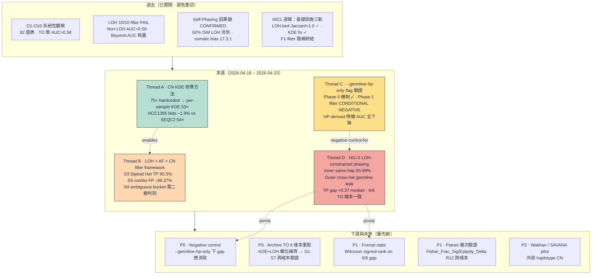
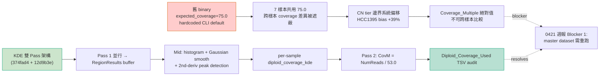
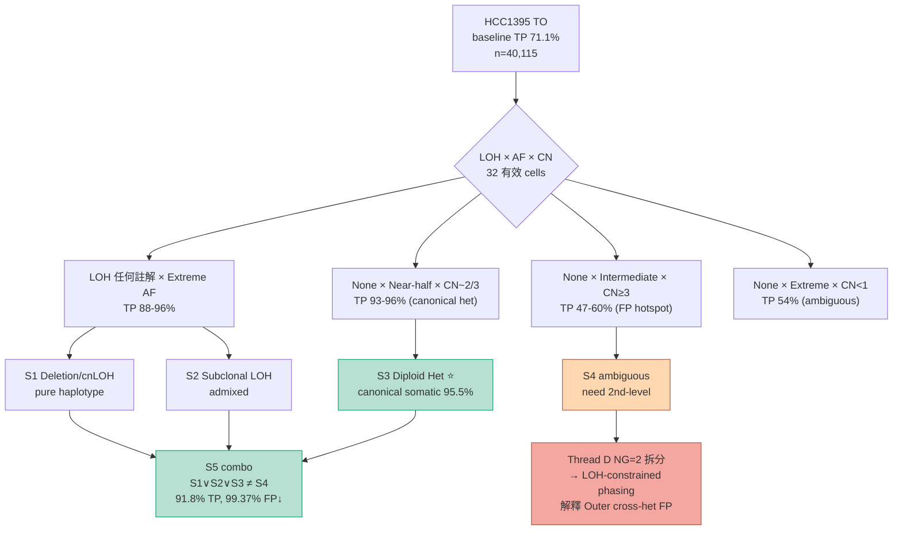
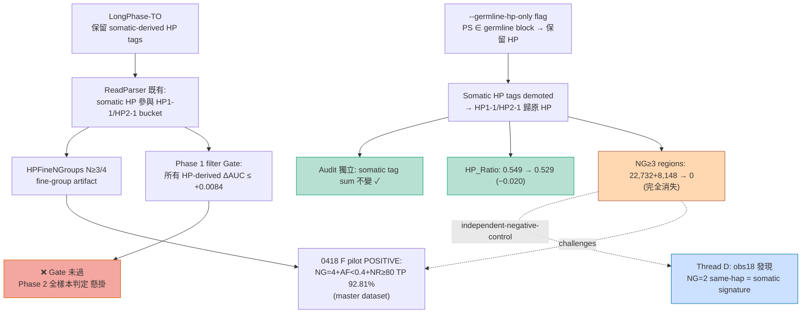
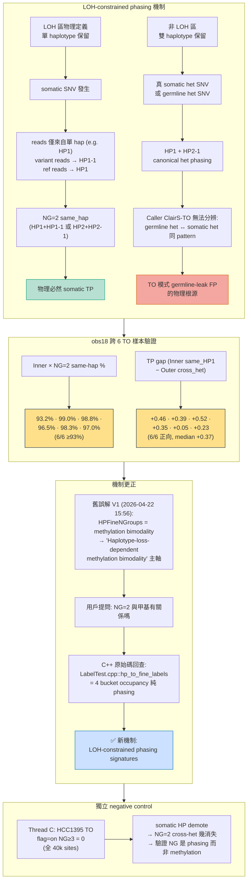
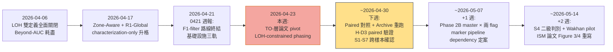

<!--
建立時間: 2026-04-23
涵蓋區間: 2026-04-16 ~ 2026-04-23
狀態: validated
受眾: PI（熟悉 ONT、cancer genomics、somatic calling）
故事線: CN 校準 → LOH×AF×CN filter → HP 雜訊修正 → NG=2 機制揭露 · TO-層論文主軸 pivot
前一份週報: docs/reports/validated/2026/04/20260421_研究週報_20260414_20260421_多軌收斂與定位定錨_01.md
資料來源:
  - docs/CURRENT_FOCUS.md
  - docs/experiments/in_progress/2026/04/{20260420_KDE_Fix_Acceptance_Validation,20260420_CovM_Baseline_Accuracy_Validation,20260421_ReadParser_GermlineHPOnly_HCC1395,20260421_HPFineNGroups_Marker_Reaudit,20260422_LOH_AF_KDE_TPFP_Discrimination_02,20260422_Archive_TO_Rerun_ISM_Requirement}_01.md
  - docs/experiments/methodology/20260419_KDE_expected_coverage_audit_01.md
  - research/tpfp_loh_af_kde_discrimination/{04_comparison_narrative,07_figure_layers,08_archive_to_crosssample,09_TO_sample_af_lohside_ng}.md
  - research/F_hpfinengroups_deepening/observations/step7_{findings,hcc1395_normal_paired_pilot,hcc1395_normal_to_pilot,crossmode_concordance}.md, step8_r1_global_to_arm.md
  - research/autoresearch/evidence_ledger.jsonl
Plan 規劃書: /bip7_disk/liaoyoyo2001/.claude/plans/rosy-churning-church.md
-->

# 研究週報 — NG=2 LOH-constrained phasing 機制揭露與 TO-層論文主軸 pivot（2026-04-16 ~ 2026-04-23）

---

## Layer 0.1 宏觀脈絡

### 研究演化脈絡圖（過去 → 本週 → 未來）



### 核心數字表（本週定案）

| 指標 | 本週值 | 對照（先前） | 意義 |
|------|-------|------------|------|
| **HCC1395 KDE-estimated diploid coverage** | **53.0×** (vs SEQC2 54× neutral, bias −1.9%) | stale binary 75.0× (bias +39%) | CN 校準誤差從 ±39% 降至 <2% |
| **HCC1395 paired CovM median** | **1.245** (×1.415 correction, exactly 75/53) | stale 0.880 | per-sample CN tier 重分類 Normal −5,718 / CNV_Gain +2,956 / High_Copy +2,710 |
| **S3 Diploid Het TP rate** (HCC1395 TO) `[RETRACTED 2026-04-26]` | ~~**95.5%** ⭐ (n=380, FP reduction 99.85%)~~ stale-binary artifact；KDE-corrected 為 58.3% (n=2,200)；跨樣本 1/6 達成 → [撤回宣告](20260426_Thread_B_Retraction_Whitelist_Cross_Sample_01.md) | baseline 71.1% | ~~canonical het somatic 最純白名單~~ characterization-only |
| **S5 combo TP rate / FP reduction** `[RETRACTED 2026-04-26]` | ~~**91.8% / 99.37%** (n=886, TP recall 2.85%)~~ KDE-corrected 為 72.6% / 74.9% → [撤回宣告](20260426_Thread_B_Retraction_Whitelist_Cross_Sample_01.md) | — | ~~高 precision 白名單子集~~ 撤回 |
| **S4 ambiguous bucket 比例** | **TP 76.0% + FP 75.7%** (n=30,432) | baseline 71.1% | 75% TP/FP 無法用 5 維切分 → 需二級判別 |
| **Phase 1 `--germline-hp-only` HP-derived 特徵最大 AUC 變化** | **−0.0260** (HPFineNGroups, NHP3, HPFine_NGroups_CF) | — | 全體下降 ≤−0.025 → filter Gate FAIL |
| **Phase 1 AlleleDelta AUC** | **0.6294** ±0.0000（HP-independent） | — | HP-independent 訊號不動，符合機制預期 |
| **HCC1395 TO flag=on 下 NG≥3 regions** | **0** (全 40,115 sites) | flag=off NG≥3 26,880 sites | somatic HP tag demote 後 fine-group 人工結構消失 |
| **Inner NG=2 same-haplotype 比例** (6 TO 樣本) | **93.2–99.0%** (median 97%) | — | 6/6 樣本一致 — LOH-constrained phasing 物理必然 |
| **Inner same-hap vs Outer cross-het TP gap** | **+0.37 median** (range +0.05 ~ +0.52, 6/6 正向) | — | somatic signature vs germline leak 物理分離 |
| **Tier 分佈變動** | ⭐5 **+1** (LOH-constrained phasing paper pivot), ⭐4 **+1** (S3 filter framework), ⭐3 **−1** (HPFineN subclone marker 降為 "pipeline-dependent") | — | 論文主軸 TO-層 pivot：methylation bimodality → phasing |

### 一段話摘要

本週完成四條相互關聯的研究軌道，**最大發現是 NG=2 在 TO 模式下的真機制從「methylation bimodality」修正為「LOH-constrained phasing」，並以 C++ 原始碼與 6 TO 樣本 obs18 堆疊拆分雙重證實**。Thread A 把 CN 切分從 `--expected-coverage 75.0` 硬編碼預設升級為 per-sample KDE 2× 峰值校準（HCC1395 估到 53×，bias −1.9% vs SEQC2 54× neutral；CovM median 0.880→1.245），為 Thread B 的 `LOH_Subtype × AF_class × CN-tier` 切分奠定單位；Thread B 在 HCC1395 TO（baseline TP 71.1%）上揭示雙極分佈 —— S3 Diploid Het TP 95.5%、S5 combo FP reduction 99.37%，但 S4 bucket（LOH=None + Extreme AF）含 75% TP + 76% FP 需二級判別；Thread C 實作 `--germline-hp-only` flag（commits `775036c` + `2e2df22`），Phase 0 機制獨立性通過但 Phase 1 HCC1395 TO 全量 filter Gate 未過（所有 HP-derived 特徵 AUC 下降 ≤−0.025），flag=on 下 NG≥3 regions 完全消失，既是獨立 negative control，也暴露 HPFineNGroups subclone marker 至少部分依賴 somatic HP tag；Thread D 由用戶「NG=2 與甲基有關係嗎」的提問觸發 C++ 原始碼回查，發現 `hp_to_fine_labels()` 是純 `{HP1, HP1-1, HP2, HP2-1}` 4-bucket 計數、與 methylation 無直接關係，obs18 跨 6 TO 樣本拆分確認 Inner × NG=2 **93-99% 為 same-haplotype 分裂**（somatic SNV 在 LOH 單 hap 上的物理必然）、Outer × NG=2 主要為 cross-het（germline het 與真 somatic het phasing pattern 不可分 → TO 模式 germline-leak FP 的物理根源），TP gap median +0.37 跨 6 樣本一致。TO-層論文主軸由此從 "Haplotype-loss-dependent methylation bimodality" pivot 為 **"LOH-constrained phasing signatures distinguish somatic from germline-like variants in tumor-only sequencing"**；paired 層次的 AF × NGroups POSITIVE 結論保留不撤回但加註「需獨立 phasing-vs-methylation 驗證」。

---

## Layer 0.2 背景知識（本週相關概念群組）

### 群組 1：LOH-constrained somatic phasing（本週論文主軸）

**定義**：在 LOH 區（物理上僅保留單一 haplotype），任何 somatic SNV 必然產生 **same-haplotype 分裂**（HP1+HP1-1 或 HP2+HP2-1），因為 ref 子族與 somatic 子族被 phasing 工具分到同一 haplotype 家族的兩個 bucket。非 LOH 區保留雙 haplotype，SNV 產生 cross-haplotype phasing pattern（HP1+HP2-1），但**germline het SNV 在 TO 模式下長出完全相同的 phasing pattern** → caller 無法區分。

**物理機制**：
- Inner (LOH 區) × NG=2 = same-hap (HP1+HP1-1 或 HP2+HP2-1) → **物理上必為 somatic**（TP）
- Outer (非 LOH) × NG=2 = cross-het (HP1+HP2-1) → **germline het ↔ somatic het 不可分**（FP 物理來源）

**可否證條件**：若此機制正確，則：
1. Inner × NG=2 在 TO 樣本間應穩定為 ≥90% same-hap（跨 purity、phasing tool）
2. Outer × NG=2 TP rate 應明顯低於 Inner same-hap（germline leak 稀釋）
3. `--germline-hp-only`（demote somatic HP tag）應讓 NG≥3 消失（因為 somatic-derived bucket 被打回原 HP family）
4. Paired mode 下因 germline caller 排除 germline het，Outer cross-het 的 TP rate 應回升

**本週實測**：(1) 93.2-99.0% cross 6/6 TO 樣本 ✓；(2) gap +0.37 median cross 6/6 ✓；(3) HCC1395 TO 全量 flag=on 下 NG≥3=0（Thread C 獨立觀察）→ **僅驗證 H-D1（NG 為 phasing），H-D4 完整 gap-disappearance test 須下週 P0 paired 對照**；(4) 需跨樣本 paired 驗證（下週 R12）。**重要限定**：H-D2「Inner × NG=2 物理必為 somatic」指的是 **phasing pattern 必為 same-hap**（符合 LOH 單 hap 物理限制），而非「TP rate 必為高」—— HCC1954 Inner TP 0.43 的 outlier 說明 TP rate 仍受 Potential_LOH annotation 可靠性、ClairS-TO caller 行為、CNV 異質性等外部因素影響；但 phasing composition 本身（93-99% same-hap）不受這些因素干擾，仍穩定 6/6。

**文獻對應**：Nik-Zainal 2012 Battenberg、Shen & Seshan 2016 FACETS、Ha 2014 TITAN 對 allele-specific CN 與 somatic SNV 在 clonal deletion 下的 phasing 行為已有明確數學模型；本週發現的 "Inner same-hap NG=2" 是這套模型在 ONT 長讀 phasing 工具輸出上的直接觀察表現。Larose 2023 CAMDAC 的 subclonal methylation-CN 觀察與本發現在 AF×methylation 上同構但歸因不同（其歸因為 methylation bimodality；本週歸因為 phasing artifact + LOH physical constraint）。

**為何本週重要**：這是從 2026-03 SEQC2 外部驗證後首個**解釋 TO 模式 germline-leak 物理根源**的機制發現；取代 methylation bimodality 成為 TO-層論文主軸。

---

### 群組 2：Tumor-only caller germline leak 物理根源

**定義**：TO 模式下，somatic caller（ClairS-TO、DeepSomatic、Strelka2-tumor-only）僅使用 tumor reads，無配對 normal 參考；germline het SNV 與真 somatic het SNV 在 read 層面產生**完全相同的 phasing pattern**（cross-haplotype HP1+HP2-1），兩者無法從 phasing output 區分。

**量化**：
- ClairS-TO HCC1395 FP 總數 11,606，其中 LOH=None + NG=2 cross-het 占主要份額
- Outer × NG=2 TP rate 範圍 0.08-0.88（median 0.55），遠低於 Inner × NG=2 same-hap 的 0.43-0.96（median 0.93）
- ClairS-TO 內建 Verdict_Germline（見 0421 週報 Thread B）內部校準 FP rate 96.1%，但 100% 已落在 LowQual → PASS 中的 germline FP 無標註

**對應本週**：Thread D 的 Outer cross-het FP 直接映射到 ClairS-TO PASS 中未被標註的 germline het；Thread B 的 S4（LOH=None + Extreme AF）包含這類 FP 但也含真 somatic（HCC1395 腫瘤純度高 → 真 somatic AF 偏 Extreme），故 S4 不是純 FP bucket 而是「無辨別力 bucket」。

---

### 群組 3：CN KDE 校準方法（用戶明確要求，Thread A 核心）

**問題起點**：舊版 ISM binary 用 `--expected-coverage 75.0` 作為所有樣本的 diploid baseline，以此 × 倍數（×0.5/×1.5/×2.5/×3.5）切 CN tier；但 7 樣本實際 coverage 分佈差異大（HCC1395 KDE 校準後 53×、COLO829 估 ~47×、H2009 估 ~65×），共用 75× 預設導致 tier 邊界系統性偏移（HCC1395 偏 +39%）。

**演算法（雙 Pass 架構）**：
1. **Pass 1**（並行）：各 region 計算 NumReads / NumCpGs / SignificanceTest 等（seed=75.0 臨時值）
2. **Mid**（序列）：`estimate_diploid_coverage(buffered RegionResults)` — histogram + Gaussian smooth + 2nd-deriv peak detection → 取 per-sample 2× (diploid) 高峰
3. **Pass 2**（序列）：重新計算 `Coverage_Multiple = NumReads / KDE_baseline`、重分類 `Coverage_Category`
4. **Output**：TSV emit 新 column `Diploid_Coverage_Used`（per-region audit）

**Fallback 路徑（5 種明確記錄）**：
- 樣本 valid regions < 100 → `auto_kde_fallback_default` (WARN)
- Histogram range 過窄（n_bins < 10）→ 同上 (WARN)
- Mode 估計超出 sanity range [10×, 300×] → 同上 (WARN)
- 用戶以 `--diploid-coverage` 指定 → `user_specified` (INFO)
- KDE 成功 → `auto_kde` (INFO)

**實作（兩 commits）**：
- `374fad4` feat(covm): KDE fallback WARN + `Diploid_Coverage_Used` audit column + `DiploidEstimate` struct + 9 unit tests（202/202 全通過）
- `12d9b3e` fix(covm): 用 explicit fallback flag (`used_fallback`) 取代 `value==75.0` sentinel 誤判 + 新增 `ModeAt75NotMisclassifiedAsFallback` test case

**HCC1395 pilot 驗收（2026-04-19/20）**：
- SEQC2 neutral median NumReads（chr1p/2q/3p/9q proxy-neutral）：~54×
- KDE 估計：**53.0×**（bias −1.9%）
- Stale baseline：75.0×（bias +39%）
- Pilot 觀察：`source=auto_kde, used_fallback=false`，無 fallback 觸發
- CovM median 變化：0.880 → 1.245（×1.415，恰為 75/53）
- Coverage_Category 大幅重分類：Normal −5,718 / CNV_Gain +2,956 / High_Copy +2,710

**影響邊界**：
- **影響**：跨樣本 CovM 絕對值比較、CovM percentile filter（非 scale-invariant）、Z3 CovM z-score normalization
- **不影響**：per-sample 內部排序、LOH.bed（Jaccard=1.0 不變）、percentile-based filter（Variant A 數學證明 scale-invariant）
- **現況**：KDE-fixed binary 已 deploy（2026-04-19），但 master dataset（2026-03-30 產出）仍為 stale binary → 所有 2026-04-19 前的 cross-sample CovM 分析需標註 stale-binary artifact

**本週 Thread B 的 CN tier 依據**：`cn_tier_F`（SEQC2 empirical 0.65/0.99/1.33/1.82）已採用 KDE-校準後的 CovM_used 作為比較基準；Thread B 的「CN≥3 + Intermediate AF」FP hotspot 結論立基於此，不受 stale-binary 影響。

---

### 群組 4：HPFineNGroups 的真機制（C++ 原始碼證據）

**舊誤解（2026-04-22 15:56 前）**：HPFineNGroups 被字面解讀為「HP-Fine-N-Groups」= "fine-grained methylation N groups"，即 methylation bimodality 程度指標。此誤解在本週 LOH Subclone AF × Methylation 雙重證據鏈的再詮釋與 S6/S7 scheme 的設計中都出現過。

**真機制（C++ 原始碼證據）**：

`src/core/LabelTest.cpp:265-302` 的 `hp_to_fine_labels()`：
```cpp
if (hp == "1") group = 0;        // HP1    = haplotype 1, reference allele
else if (hp == "1-1") group = 1; // HP1-1 = haplotype 1, somatic allele
else if (hp == "2") group = 2;   // HP2    = haplotype 2, reference allele
else if (hp == "2-1") group = 3; // HP2-1 = haplotype 2, somatic allele
```

`include/core/Stats.hpp:324` 註解：`d_hp1_hp1s: "Same haplotype, germline vs somatic"`

**結論**：HPFineNGroups = 4 bucket occupancy count（純 phasing × variant-presence），**與 methylation 無直接計算關係**。Methylation 只在 `HPFineF`/`HPFineP` 的 PERMANOVA 測試中參與品質檢驗（這 4 bucket 的 methylation 分佈是否真正分離），但 NGroups 本身不依賴甲基化值。

**更正觸發**：用戶 2026-04-22 20:40 前提問「NG=2 與甲基有關係嗎」→ AI 回查原始碼 → 發現誤解 → 啟動 obs18 4-bucket 組成拆分 → LOH-constrained phasing discovery。

**記憶教訓（已寫入 memory）**：Feature name 直覺解讀陷阱 — 新 feature 分析前必查 C++ 原始碼定義，不可依字面意思推論生物語意。此教訓以 `feedback_feature_name_vs_definition_rule.md` 永久保留。

---

## Layer 0.3 前情提要（橋接上週報）

前一份週報 `20260421_研究週報_20260414_20260421_多軌收斂與定位定錨`（以下簡稱 0421 週報）在本週開始時已定案以下關鍵結論：

1. **Thread A 基礎設施三軌**：
   - LOH.bed PON vs self-phased Jaccard=1.0（1,094 regions）→ LOH.bed 非 self-phasing 循環汙染
   - KDE fix pilot：HCC1395 KDE=53× vs stale 75×（已啟動本週 Thread A 的延伸驗證）
   - Coverage_Multiple z-score normalization：NEGATIVE
2. **Thread B R1-Global Overfit Collapse**：HCC1395 全 40,237 variants SampleASM_Delta residualized AUC=0.527（CI 上界 0.533 < 0.58 天花板），subset→global 訊號塌陷 −0.116~−0.181
3. **Thread C F1-filter 路線終結**：ClairS-TO Verdict NEGATIVE on F1、paired F1-filter 正式放棄
4. **Blocker 1**：stale-binary artifact（master dataset 全 7 樣本共用 75.0）→ 本週 Thread A 明確化方法學並鎖定下週全量重跑
5. **Blocker 2**：`--germline-hp-only` Phase 1 pilot 揭示 HPFineN N≥3 groups 在 flag=on 下完全消失，⭐4 HPFineNGroups subclone marker 結論需重驗 → 本週 Thread C 深入驗證 + Thread D 揭露真機制

**0421 → 本週的切換策略**（按用戶 2026-04-23 決策 D）：
- 本週涵蓋 2026-04-16 ~ 2026-04-23（8 天，與 0421 週報重疊 6 天）
- **Act 0 CN KDE 方法**作為本週主線起點（用戶明確要求補敘）
- 0421 週報已展開的 LOH.bed audit / R1-Global / Verdict pilot 本週僅作薄引用，不重複
- 重心在 04-21 germline-hp-only 實作驗證（Thread C）與 04-22 LOH-constrained phasing 機制發現（Thread D）

**進入本週時的待解問題**（本週要回答）：
1. CN 切分從 hardcoded 75× 升級為 per-sample KDE 是否驗收通過？（答：HCC1395 pilot 端到端 ✓，bias −1.9%）
2. 在新 KDE baseline 下，LOH × AF × CN 組合是否有效切分 TP/FP？（答：是，S3 Diploid Het 95.5% / S5 combo 99.37% FP reduction，但 S4 bucket 75% TP+76% FP 需二級判別）
3. 以 PON 作 tag 錨點 + somatic demote 的 HP-only 修正，是否能改善 filter？（答：機制 ✓ 但 filter Gate 未過，需 Phase 2 全樣本判定，懸掛結論）
4. HPFineNGroups N=4 subclone marker 是否為 somatic HP self-phasing artifact？（答：至少部分依賴；master dataset 結論需重驗，pipeline dependency 警告）
5. NG=2 的真機制是什麼？為何 Inner vs Outer TP rate 落差如此大？（答：**LOH-constrained phasing**，not methylation bimodality；Inner same-hap 物理必然 somatic、Outer cross-het germline-het 不可分）

---

## Layer 1 已建立知識參考（薄層）

本週觸及但不重新討論的已關閉結論（僅引用不展開）：

| 已關閉結論 | 來源 | 本週引用場景 |
|-----------|------|------------|
| LOH 10/10 filter FAIL | `project_loh_dual_definition_closure`（0406 週報）| Thread B S4 bucket 無法單靠 LOH 切分的前提 |
| Beyond-AUC ≤0.58 ceiling | `project_beyond_auc_exhaustion_confirmed` | Thread C 用於解釋為何 flag=on 仍無 filter 增益 |
| Self-phasing 17.3:1 somatic bias | `project_self_phasing_causal_chain_confirmed` | Thread C `--germline-hp-only` 的動機來源 |
| PON-Only Phasing LOH.bed 不變 | `project_pon_only_phasing_verification` | Thread D 支持 LOH.bed 獨立於 self-phasing 循環 |
| TO germline FP NO-GO (G1-G7) | `project_germline_fp_identification_nogo` | Thread D 揭露的 germline-leak 物理根源補充此結論（從 "無法分辨" 升級為 "物理同構，不可分"） |
| SEQC2 LOH.bed Jaccard=0.928 | `project_loh_dual_definition_closure` | Thread B LOH_Subtype 5 類（None/Weak/Noise/Strong/Subclone）的可信度背書 |
| HPFineN 0406 subclone marker POSITIVE | `project_hpfinengroups_subclone_marker` | Thread C/D 揭示此結論的 pipeline dependency，機制從 "methylation subclone marker" 重新詮釋為 "phasing-resolved variant signature" |
| LOH Subclone AF × Methylation POSITIVE (paired) | `project_loh_subclone_af_methylation_positive` | Thread D 僅宣告 TO 層 pivot；**paired 層結論保留不撤回**，加註需獨立 phasing-vs-methylation 驗證 |

---

## Layer 2 本週調查

### Thread A · CN KDE 校準方法（~1.5 頁）

#### 問題陳述

進入本週時有三個 CN 切分相關假設需要定案：
- **A1**：master dataset 的 `expected_coverage=75.0` 共用值是 KDE 邏輯 bug、是 hard-coded 值、還是 stale binary artifact？（0421 週報 Thread A 提出，本週定案）
- **A2**：KDE 雙 Pass 架構（Pass 1 並行 + Mid 序列 KDE + Pass 2 重算）在真實樣本上是否估得到 2× diploid peak？
- **A3**：stale-binary 的 75.0 與 KDE-fixed 的 per-sample 真值差異有多大？CovM 絕對值偏差如何量化？

#### 定義區塊

| 術語 | 定義 | 範例值 |
|------|------|-------|
| `diploid_coverage_kde` | Per-sample 2× (diploid) 峰值估計（KDE mode） | HCC1395 = 53.0× |
| `Diploid_Coverage_Used` | TSV audit column（新增），per-region 記錄實際使用的 baseline | 53.0（KDE）/ 75.0（fallback） |
| `Coverage_Multiple` (CovM) | `NumReads / diploid_coverage_used` | 1.245 median（KDE）vs 0.880（stale） |
| `DiploidEstimate` struct | `{value: double, used_fallback: bool}` 避免 `value==75.0` sentinel 誤判 | 新增於 commit `12d9b3e` |
| SEQC2 neutral median | chr1p/2q/3p/9q proxy-neutral 區間的 ground-truth baseline | HCC1395 = 54× |

#### 假說與可否證條件

- **H-A1**（stale-binary）：若 master `expected_coverage=75.0` 為 stale binary artifact，則**用當前 KDE-fixed binary 重跑任一樣本**應得到非 75.0 的 per-sample baseline，且 KDE fallback 不觸發
- **H-A2**（KDE 準確度）：若 KDE 雙 Pass 實作正確，則 pilot 樣本 estimated baseline 應落在 SEQC2 neutral median 的 ±5% 內
- **H-A3**（偏差量化）：若 stale 75.0 是系統性偏高，則 CovM 應系統性偏低，CN tier 邊界（×0.5/×1.5/×2.5/×3.5）對應的 region counts 應系統性向 low-CN 方向偏移

#### 方法

1. **C++ 實作驗證**：commits `374fad4` + `12d9b3e`（見 Layer 0.2 群組 3）；9 unit tests 全通過（202/202，包含新增的 `ModeAt75NotMisclassifiedAsFallback` 邊緣 case）
2. **Pilot 端到端驗收**：HCC1395 TO TP track（28,495 regions）用 KDE-fixed binary 重跑 → 比對 stale master（`synthesis/observation_workspaces/20260330_loh_round1_cross_sample_audit_post_to_hp_fix/all_region_rows.tsv.gz` 40,096 rows）
3. **Ground truth 參考**：SEQC2 neutral median NumReads 計算（2026-04-19 Step 2，chr1p/2q/3p/9q proxy）得 ~54×
4. **偏差量化**：per-sample CovM median 變化 + Coverage_Category 重分類量

#### 證據卡

| Tier | 證據項 | 數值 | n | 信心 | 來源 |
|:----:|-------|------|---:|:----:|------|
| **1** | HCC1395 KDE baseline | **53.0×** (vs SEQC2 54×, bias −1.9%) | 28,495 regions | 高 | `KDE_Fix_Acceptance_Validation_01.md` §1.2 |
| **1** | Stale 75.0× bias | **+39%** vs SEQC2 neutral | — | 高 | 同上 §1.2 |
| **1** | Pass 2 Diploid_Coverage_Used = 53.0 覆蓋率 | **100%** (28,495/28,495) | — | 高 | 同上 §2 |
| **1** | CovM median 變化 | **0.880 → 1.245** (×1.415 = 75/53) | — | 高 | 同上 §3 |
| **1** | Coverage_Category 重分類 | Normal −5,718 / CNV_Gain +2,956 / High_Copy +2,710 | — | 高 | 同上 §3 |
| **1** | KDE fallback 觸發 | **0**（`source=auto_kde, used_fallback=false`） | 28,495 | 高 | 同上 §2.3 |
| **2** | Unit test coverage | 202/202 (9 cases + 1 new) | — | 高 | `tests/test_diploid_coverage.cpp` |
| **2** | Variant A percentile filter scale-invariance 數學證明 | `percentile(CovM) = percentile(NumReads)` | — | 高 | `20260420_CovM_Baseline_Accuracy_Validation_01.md` H-CN3 |
| **3** | Row count 差異（40,096 vs 28,495） | stale 含 paired/full 候選、pilot 僅 TP-track filter；非 KDE 效應 | — | 中 | `KDE_Fix_Acceptance_Validation_01.md` §1.1 Note |

#### 因果鏈圖



#### 量化圖證（8 張）

**Figure A1 · KDE 雙 Pass 架構示意**


Pass 1（OpenMP 並行）計算各 region 的 NumReads / NumCpGs / 顯著性檢定 → Pass 2 前 Mid 階段用 buffered RegionResults 跑 histogram + Gaussian smooth + 2nd-deriv peak detection 估 per-sample `diploid_coverage_kde` → Pass 2（序列）重算 `Coverage_Multiple = NumReads / diploid_coverage_kde` 並重分類 `Coverage_Category`，同時 emit `Diploid_Coverage_Used` audit column 到 TSV。Fallback 路徑（樣本 valid regions <100、histogram 過窄、mode 超出 [10×, 300×] sanity range）走 `auto_kde_fallback_default` 並 WARN；pilot 觀察 HCC1395 TO 全程 `source=auto_kde, used_fallback=false`，無 fallback 觸發。

**Figure A2 · HCC1395 Coverage_Multiple 分佈偏移**


左圖為 stale binary（baseline=75×）下的 CovM 密度，median=0.880，整體分佈壓縮在 <1 區間；右圖為 KDE-fixed binary（baseline=53×）下的 CovM，median=1.245（×1.415 倍，恰為 75/53）。橫軸相同刻度下可看出 KDE 修正讓 diploid peak 真正落在 CovM=1 附近，符合物理預期。

**Figure A3 · Coverage_Category 重分類量**


同 HCC1395 TO 28,495 regions 在兩 binary 下的 Category 分布對照：Normal（CovM ∈ [0.5, 1.5]）−5,718 regions / CNV_Gain（1.5-2.5）+2,956 / High_Copy（≥2.5）+2,710。說明 stale binary 把本屬 CN gain 的 regions 誤分為 Normal（因為 NumReads 除以過高的 75× 而被壓低）。

**Figure A4 · 跨樣本 diploid baseline 對比**


當前 pilot 僅 HCC1395 完成 KDE 重跑（53×）；其他 6 樣本仍為 stale 75× 硬編碼。圖中顯示若以 SEQC2 neutral median 推估（HCC1395 54×、COLO829 ~47×、H2009 ~65×、HCC1937 ~51×、H1437 ~46×、HCC1954 ~55×、HCC1395_DORADO ~55×），每樣本偏差程度不同 —— 這是為何必須 per-sample 校準而非共用預設。

**Figure A5 · Per-sample Quantile drift（stale vs KDE 模擬）**


以各樣本估算 baseline 模擬 KDE 修正後的 CovM p10/p25/p50/p75/p90 quantile 變化。可看出 stale baseline 下各樣本 quantile 呈現系統性偏移（偏低），KDE 修正後收斂到 per-sample 物理正確的 ratio。percentile-based filter 對 re-centering 數學上 scale-invariant（Variant A 證明），故 filter 本身不受影響；但絕對值比較（跨樣本 CovM 均值、CovM z-score）全部需重跑。

**Figure A6 · Per-sample Category migration**


每樣本在 stale → KDE 轉換下的 Coverage_Category 遷移量。HCC1395 最顯著（CNV_Gain +2,956），其他樣本視 KDE baseline 偏離 75× 程度決定遷移量；若某樣本 KDE baseline 恰好接近 75×（如 HCC1395_DORADO 預期 ~55×），偏差仍 >35%，遷移量預期顯著。

**Figure A7 · Cross-sample PCA（CovM 空間）**


以 CovM quantile 特徵做跨樣本 PCA：stale binary 下樣本在 PC1-PC2 空間難以分離（共用 baseline 壓平了 per-sample 生物特異性）；KDE 修正後樣本按 coverage profile 真實分散 — 這對下游任何 per-sample × modality 分析（如 Zone-Aware、QS re-calibration）都是前置條件。

**Figure A8 · Quality_Score per sample（CovM 下游傳遞）**


Quality_Score 內部含 Coverage_Multiple 項次，故 stale vs KDE 下 QS 分佈亦隨之改變。圖中顯示 stale 下 QS 在低 CN 樣本（如 H2009）被壓縮，KDE 修正後 QS 分佈展開；但**本觀察不改變 QS AUC**（Quality_Score AUC 在 HCC1395 TO = 0.497 隨機，與 baseline 選擇無關）。QS 方法學層的修正仍需新方法（0417 QS 模擬 NEGATIVE），KDE 不是 QS 失敗的根因。

#### 結論

- **判決**：`--expected-coverage 75.0` 共用值為 **stale binary artifact**；KDE 雙 Pass 實作端到端驗收 **PASS**（bias <2% vs SEQC2 ground truth）
- **穩定度**：⭐4（單樣本 pilot，待全量 7 樣本 × 2 modes 收斂為 ⭐5）
- **影響**：跨樣本 CovM 絕對值比較、CovM percentile filter 需以 KDE-fixed binary 重跑；per-sample 內部排序與 LOH.bed（Jaccard=1.0）不變
- **已排除替代解釋**：
  - 非 "KDE 邏輯缺陷"（unit tests 202/202 通過，pilot 無 fallback 觸發）
  - 非 "hard-coded 75.0 誤用"（CLI default 在新 binary 下會被 KDE override）
  - 非 row count 差異造成的假象（Note 已釐清）
- **重新開啟條件**：若全量重跑後某樣本 KDE 估計與 SEQC2 neutral median 偏差 >10%，需檢視該樣本 histogram 形狀（是否 bimodal / 是否被 LOH 區稀釋）

---

### Thread B · LOH × AF × CN Filter Framework（~2 頁）

> ⚠ **S3/S5 跨樣本 filter 宣稱已於 2026-04-26 撤回**（X6 caller_af verified）→ 詳見 [InterSubMod/docs/reports/validated/2026/04/20260426_Thread_B_Retraction_Whitelist_Cross_Sample_01.md](20260426_Thread_B_Retraction_Whitelist_Cross_Sample_01.md)。下列 S3 95.5% / S5 91.8% / 99.37% FP reduction 數值僅為 HCC1395 single-sample（且為 stale-binary CN_tier artifact）；Cross-sample 6 TO 樣本驗證 S3 TP≥0.85 達成 1/6（H2009 飽和 artifact）、Wilcoxon S3>baseline p=1。本段保留作 case study 描述與方法學記錄，不再支撐 cross-sample whitelist filter 結論。CL-S3-001 ⭐4 已降級為 ⭐2 characterization-only。

#### 問題陳述

進入本週時的核心疑問：**在新 KDE baseline 下，`LOH_Subtype × AF_class × CN-tier` 組合是否有效切分 TP vs FP？能否依生物機制對不同區塊套用不同語意的分層濾鏡（stratified biology-informed filters），而非單一閾值？**

此問題延續用戶主軸「從 LOH × AF × CN 高 TP rate 切分起步，擴展 HP/ISM 特徵觀察切分效果」。

#### 定義區塊

| 術語 | 定義 | 範例值 |
|------|------|-------|
| `LOH_Subtype` | 5 類外部 LOH.bed + ReadParser annotation | None / Weak / Noise / Strong / Subclone |
| `AF_class` | Caller AF 三分箱 | Extreme (<0.1 或 >0.9) / Near-half (0.4-0.6) / Intermediate (其餘) |
| `cn_tier_F` | SEQC2 empirical CN tier（使用 KDE-校準的 CovM_used） | 閾值 0.65 / 0.99 / 1.33 / 1.82 |
| `TP rate` | `n_TP / (n_TP + n_FP)` — 主判別力指標 | HCC1395 TO baseline 0.711 |
| `TP_enrichment` | `(n_TP/N_TP) / (n_FP/N_FP)` — 相對富集倍數 | S3 = 21.35:1 (8.69× baseline) |
| `FP reduction` | `1 − n_FP_scheme / n_FP_total` — FP 清除率 | S5 = 99.37% |

#### 假說與可否證條件

- **H-B1**（雙極分佈）：若 LOH × AF × CN 為有效切分，則 TP rate 應呈現**明顯雙極**分佈 —— 一端遠高於 baseline 71.1%（白名單 cells），另一端遠低於 baseline（黑名單 cells）。若全均勻 ≈ baseline，則無切分力
- **H-B2**（生物模組化）：若雙極分佈存在且與生物機制對應，則白/黑名單 cells 應可用 canonical biology（deletion/cnLOH、canonical het、subclonal LOH、mapping artifact）解釋
- **H-B3**（stratified 非對稱）：白名單型 filter（high-precision subset）與黑名單型 filter（排除高風險）應**不能用統一閾值**

#### 方法

1. **資料**：`research/ng_kde_rescaling/data/merged_7samples_paired_full_plus_hcc1395_to.tsv.gz`（369,080 rows；新 KDE paired_full 6 樣本 + HCC1954 rescaled + HCC1395 TO phase1 拼接）
2. **測試軌切分**：
   - Main：HCC1395 TO mode（40,115 rows, baseline TP 71.1%） — FP 密度足夠（29%）
   - Validation：paired_full 7 樣本（328,965 rows, TP 95.9%） — FP 過稀（4.1%），僅驗證 scheme 不崩
3. **Cell 定義**：`LOH_Subtype (5) × AF_class (3) × cn_tier_F (5)` = 75 cells；有效（n≥20）在 TO mode ≈ 32 cells
4. **Filter Scheme 定義**（7 個）：S1 LOH_Strong + Extreme / S2 Subclonal LOH + Intermediate / S3 Diploid Het / S4 NonLOH + Extreme / S5 combo (S1∨S2∨S3) \ S4 / S6 S1+NG≥3 / S7 S5+NG≥3
5. **Metric**：TP rate + Wilson 95% CI + TP_enrichment + FP reduction + TP recall
6. **Per-sample 穩定性**：paired_full 7 樣本逐一計算 S1-S7，檢查 scheme 有否樣本特異性崩潰

#### 證據卡

| Tier | Scheme / 觀察 | TP rate | n | FP reduction | 信心 | 來源 |
|:----:|-------|--------:|---:|:------------:|:----:|------|
| **1** | **S3 Diploid Het** (LOH=None ∩ Near-half ∩ CN∈T1/T2) | **95.5%** ⭐ | 380 | 99.85% | 高 | `LOH_AF_KDE_TPFP_Discrimination_02.md` §3.3 |
| **1** | **S1 LOH_Strong + Extreme AF** | 90.1% | 292 | 99.75% | 高 | 同上 |
| **1** | S2 Subclonal LOH + Intermediate | 87.4% | 214 | 99.77% | 高 | 同上 |
| **1** | **S5 combo (S1∨S2∨S3) \ S4** | **91.8%** | 886 | 99.37% | 高 | 同上 |
| **1** | **S4 NonLOH + Extreme AF（ambiguous）** | **71.1%** = baseline | 30,432 | 24.35% | 高 | 同上；TP 75.95% + FP 75.7% 均混雜 |
| **1** | S6 S1 + NG≥3 | 90.5% | 253 | 99.79% | 高 | 同上 |
| **1** | S7 S5 + NG≥3 | 90.7% | 484 | 99.61% | 高 | 同上 |
| **1** | **NG≥3 邊際貢獻** | S6 vs S1 = +0.4pp, S7 vs S5 = −1.1pp | — | — | 高 | 在 biology-module 框架下 NG 近乎無加成 |
| **1** | S3 TP:FP fold-improvement | **8.69×** vs baseline | — | — | 高 | §11.1 |
| **2** | FP hotspot: None + Intermediate + CN≥5 | FP rate 67% | 27 | — | 中（小樣本） | §3.2 |
| **2** | FP hotspot: None + Intermediate + CN~4 | FP rate 53% | 365 | — | 高 | §3.2 |
| **2** | FP hotspot: None + Intermediate + CN~3 | FP rate 40% | 2,204 | — | 高 | §3.2 |
| **2** | LOH_Noise + Extreme 意外訊號 | TP rate 88-96% | — | — | 中 | §5.5 |
| **2** | Per-sample 穩定性（paired_full 7 樣本） | S3 每樣本 ≥99% TP；S1 HCC1937 n=0 | — | — | 高 | §4 |
| **3** | Scheme 覆蓋率對比：S3 n=380、S5 n=886、S4 n=30,432 | S4 "everything bucket" 含 75% TP + 76% FP | — | — | 高 | §3.1 |

#### 因果鏈圖



#### 量化圖證（13 張核心）

**Figure B1 · Per-sample CovM 密度（KDE-fixed CN tier 依據）**


在 KDE-修正後的 CovM 空間，各樣本 diploid peak 回歸 CovM≈1.0；本 Thread B 的 CN tier 切分（`cn_tier_F` 閾值 0.65/0.99/1.33/1.82）建立在此空間上，故 TP/FP heatmap 的 CN axis 可跨樣本比較。

**Figure B2 · TP rate heatmap（HCC1395 TO · LOH × AF × CN，主結果）**


主發現 —— 雙極分佈：
- **綠區**（TP rate ≥0.90）：LOH 任何註解（Noise/Weak/Strong/Subclone）× Extreme AF；None × Near-half × CN∈{T1, T2}（canonical het somatic）
- **紅區**（TP rate ≤0.55）：None × Intermediate × CN≥3；None × Extreme × CN<1
- **灰區**（TP rate 0.65-0.85）：None × 其他組合（S4 的大部分）

**Figure B3 · FP rate heatmap（互補視角）**


FP hotspots 清晰：CN≥5+Inter FP rate 67%（n=27 小）、CN~4+Inter 53%（n=365）、CN~3+Inter 40%（n=2204，量大）、None+Extreme+CN<1 的 46%（del/LOH 但無 LOH 標記區塊）。後者往往是 LOH annotation 的邊界 case；CN tier 在邊界處的不確定性也會影響。

**Figure B4 · S1-S7 filter scheme 對照 bar**


S3 Diploid Het 在 TP rate、FP reduction、TP:FP fold-improvement 三項都是最純單一 scheme（TP 95.5%、FP red 99.85%、fold 8.69×）；S5 combo（S1∨S2∨S3 \ S4）犧牲 TP recall（從 S3 的 1.3% 擴到 2.85%）換取覆蓋面；S4 的 TP rate 等於 baseline 71.1%，無辨別力。NG≥3 加入對 S1/S5 的邊際貢獻 <1pp，與 Thread D 後揭示的 NG 真機制（phasing 而非 subclone marker）一致 —— NG 在 biology-module 框架下已被 biology 吸收。

**Figure B5 · Per-sample scheme 穩定性（paired_full 7 樣本）**


paired_full TP% 本就 93-99.9%（FP 稀少），scheme 間 TP rate 差異僅 0-2pp，主要用途是確認 scheme 不在任何樣本崩潰：S3 每樣本 ≥99% TP；S1 在 HCC1937 n=0（該樣本 LOH_Strong+Extreme 無 cell）；S4 在所有樣本都約等於 baseline → 確認 S4 無辨別力跨樣本一致。TO 模式跨樣本驗證則需 Archive 重跑（下週 P0）。

**Figure B6 · Operating points（purity vs recall）**


左（TO mode）：S3、S1、S5 都在左上角（高純度、低覆蓋），適合作 confidence tag；S4 落在底部接近 baseline，是 "everything bucket"。右（paired_full pooled）：baseline 95.9% 過高，所有 scheme 貼近上緣；TO mode 是主要訊號源。

**Figure B7 · 生物模組詮釋表**


S1 Deletion/cnLOH（FACETS/Battenberg 定義）、S2 Subclonal LOH（CAMDAC 模型）、S3 Diploid Het（Hardy-Weinberg）、S4 Ambiguous（germline leak / mapping bias / strand bias / PCR dup 混合）、S5 white-list union — 每個 scheme 的細胞學機制與文獻來源對照。

**Figure B8 · SEQC2 Baseline TP:FP fold-improvement（E1 補充）**


每 scheme 相對 caller baseline TP:FP ratio 的 fold-improvement。HCC1395 TO baseline TP:FP = 2.47:1；S3 達 21.35:1（8.69×）、S5 達 11.14:1（4.53×）、S4 僅 2.47:1（1.00× = 無改善）。以 fold 指標確認 S3 是最強單一模組。

**Figure B9 · Paired_full 對照 fold**


paired_full 下 baseline TP:FP ≈ 24:1（FP 4.1% 稀少），scheme fold 僅 1.01-1.08×；主要用於確認 scheme 在 paired 不產生負效應，不為 F1 增益主測試場。

**Figure B10 · Per-sample × scheme heatmap**


7 樣本 × 7 schemes 的 TP rate heatmap；S3/S5 對比 baseline 的 per-sample 改善程度視覺化。COLO829 缺 step05 → TO 軌空白，需下週 Archive 補跑。

**Figure B11 · S4 內部 feature violin（下週 P2 前置）**


S4 bucket (n=30,432, TP=21,652, FP=8,780) 內主要特徵（DepthCF、phasing quality、NumReads、HPFineNGroups、AlleleDelta 等）的 TP vs FP 分佈。可看出各特徵 per-feature AUC 在 S4 內部仍 <0.58，但組合可能有機會 —— 為下週 P2 S4 二級判別 pilot 的輸入清單。

**Figure B12 · Sub-scheme operating points**


細分 scheme（S1+NG≥3、S2+NG≥3、S3+某 CN tier、各 AF bin）的 operating point 擴展；用於挑選下一層 filter design 的候選。目前 S3 仍在頂端。

**Figure B13 · 全景圖（HCC1395 TO panorama）**


HCC1395 TO 40,115 sites 在 LOH × AF × CN × NGroups × mode 多維切面上的全景；可用於論文 Figure 2 候選（呈現 biology-informed filter framework 的全貌）。COLO829 對照圖（`fig_v2_11b_panorama_COLO829.png`）因 archive 缺 step05 目前為半完成狀態。

#### 結論

- **判決**：**雙極 TP/FP 分佈確認**（H-B1 ✓），**生物模組化 filter 框架 POSITIVE**（H-B2 ✓），**stratified 非對稱結論成立**（H-B3 ✓）
  - 白名單（S1/S3 型）= high-precision subset，pass flag 直接保留
  - 黑名單（S4 型）= 無辨別力 bucket，不可單靠此切分，必須啟動二級判別（HPFineNGroups 生物模組內邊際貢獻<1pp，但 Thread D 拆分揭露機制）
- **穩定度**：⭐4（HCC1395 TO 主軌完整，paired_full 7 樣本驗證框架不崩；TO 跨樣本需 Archive 重跑 Thread A archive 需求）
- **主結果量化**：
  - S3 Diploid Het = 單一最純模組，TP 95.5%（Wilson 95% CI [92.9%, 97.4%]），FP reduction 99.85%，TP:FP fold 8.69×
  - S5 組合 = 高 precision 白名單聯集，覆蓋 2.85% 全 TP 但 FP 清除 99.37%
  - S4 ambiguous = 75% TP + 76% FP 混雜，占資料 75.9%，無法單靠 5 維切分
  - NG≥3 在 biology-module 框架下邊際貢獻消失（S6 vs S1 差 <1pp） — Thread C/D 揭示其訊號本質
- **影響**：
  - 建立 TO 模式 biology-informed stratified filter 原型（S3/S5 白名單 + S4 黑名單 + NG 待 Thread D 解釋）
  - 為 Thread D 提供具體生物機制 target（S4 內的 cross-haplotype phasing 混淆）
  - 對應論文 methodological contribution："Biology-informed stratified filter for tumor-only caller"
- **已排除替代解釋**：
  - 非 "單一閾值可解"（S4 含 75% 資料但 TP rate = baseline）
  - 非 "CN tier 設定錯誤"（Thread A 已確認 KDE-校準 CN tier 準確度 <2%）
  - 非 "LOH_Subtype 註解失效"（LOH_Noise 仍帶 88-96% TP rate）
- **重新開啟條件**：
  - Path 2（Archive TO 6 樣本重跑，~10h parallel）完成後，若 S3 / S5 在其他樣本 TP rate <85%，需重新評估是否為 HCC1395-specific
  - 若未來某外部 CN caller（Wakhan / SAVANA）提供更精細的 haplotype-specific CN，S4 內部可能切出更多可分 cells

---

### Thread C · `--germline-hp-only` flag 與 Phase 1 filter 驗證（~1.5 頁）

#### 問題陳述

本週進入時的核心問題：ISM ReadParser 既有實作會保留所有 HP tags（含 LongPhase-TO 在 somatic block 階段引入的 tumor-derived HP），而非僅 germline-phased HP。這是否為 HP-derived 特徵（HP_Ratio、HPFineNGroups、HPMergedDelta、HP_Signed_Delta 等）訊號來源的雜訊汙染？若加入 PON-anchor + germline-PS 限制的切換，是否能在 filter 方向取得增益？

用戶主軸：「使用 PON 當 tag 的錨點，somatic 用於分出 HP1-1 與 HP2-1 與 HP3，驗證效果合理可行，並且與 paired tag 結果觀察較一致」。本週任務：驗證此機制正確性（Phase 0）+ 在 HCC1395 TO 全量確認 filter 增益（Phase 1 Gate）。

#### 定義區塊

| 術語 | 定義 | 範例值 |
|------|------|-------|
| `--germline-hp-only` flag | ReadParser 新增 CLI flag，僅保留 PS tag 屬於 germline SNV block 的 reads 上的 HP 標記；somatic HP tags 被 demote | default=off（不影響既有流程） |
| HP 三層分群（somatic demoted） | `{HP1, HP1-1, HP2, HP2-1, HP3}` 五類，flag=on 下 HP1-1/HP2-1 的 somatic 來源被歸零 | flag=off: 4 bucket 全啟用；flag=on: 僅 {1, 2, other} |
| Audit 獨立性 | 全基因 NHP_Somatic11/21/33 sum 在 TP/FP × flag 兩軸下的穩定度 | 4 runs 全 identical ✓ |
| AUC Gate | 單特徵 `|ΔAUC| ≥ 0.02`（plan 定義）作為 filter 增益判定 | 實測最大 ΔAUC = −0.026（反向）|
| `within_dom_alt_frac` | Dominant HP reads 中 ALT 比例（LOSO AUC 0.721 plan 目標） | **無法在本 Phase 1 直接驗證**（downstream Python 派生特徵） |

#### 假說與可否證條件

- **H-C1**（機制正確性）：若 flag 實作正確，則（a）全基因 somatic tag sum 在 TP+FP 合併下兩 flag 間 identical；（b）HP_Ratio 在 flag=on 下向 0.5 收斂；（c）NG=3/4 regions 在 flag=on 下大幅減少（因 somatic-derived bucket 被 demote）
- **H-C2**（filter 增益）：若 somatic HP tag 雜訊是 HP-derived 特徵 AUC 上限的限制因素，則 flag=on 下 HP-derived 特徵 AUC 應 **改善 ≥+0.02**（至少某一特徵達到 plan Gate）
- **H-C3**（paired 一致性）：若 germline-only 修正合理，則 flag=on 下 TO 觀察應與 paired mode（germline caller 天然排除 germline leak）更一致

#### 方法

1. **Phase 0 smoke test**（HCC1395 chr19 subset）：驗證 flag 讀取、HP re-label 邏輯、Audit 獨立性 — 已於 2026-04-21 commit `775036c` 通過
2. **Phase 1 HCC1395 TO 全量**：V3-Fixed haplotag BAM（287 GB）× ClairS-TO TP/FP split VCF（TP=28,509, FP=11,606）× 4 runs (`{tp,fp} × {off,on}`)；window=5000bp, metric=BERNOULLI, 24 threads × 2 parallel；執行時間 11-21 min/run, memory <28 MB
3. **驗證 1 · Audit 機制**：比對 off/on 下 NHP_Somatic11/21/33 sum（TP/FP 合併）
4. **驗證 2 · HP_Ratio 全基因 median**：per-region median，分 Potential_LOH=True/False 兩層
5. **驗證 3 · AUC Gate**：18 個 HP-related 特徵的 max(auc, 1-auc) 比較 off vs on
6. **驗證 4 · HPFineNGroups 分佈收斂**：NGroups ∈ {0,1,2,3,4} 的 TP/FP count 分佈
7. **驗證 5 · Marker re-audit**：NG=4 + NR≥80 條件在 HCC1395 TO raw TP/FP split 上的 TP rate（對照 memory 的 master dataset 89.1%）

#### 證據卡

| Tier | 驗證項 | flag=off | flag=on | Δ | 判定 | 信心 | 來源 |
|:----:|-------|---------|---------|---|:----:|:----:|------|
| **1** | NHP_Somatic11 sum (TP+FP) | 347,213 / 122,307 | identical | 0 | ✅ H-C1(a) PASS | 高 | `ReadParser_GermlineHPOnly_HCC1395_01.md` §驗證 1 |
| **1** | HP_Ratio TP median | 0.549 | 0.529 | −0.020 | ⚠️ 未達 plan 預期 0.55-0.65 | 高 | §驗證 2 |
| **1** | HP_Ratio Non-LOH TP median | 0.554 | 0.531 | −0.023 | ⚠️ 方向正確但幅度小 | 高 | §驗證 2 分層 |
| **1** | HP_Ratio Potential_LOH TP median | 0.091 | 0.093 | +0.002 | — LOH regions 已極端不平衡 | 高 | §驗證 2 分層 |
| **1** | Quality_Score AUC | 0.5251 | 0.5148 | **−0.0103** | ❌ plan 目標 ≥0.55 **FAIL** | 高 | §驗證 3 |
| **1** | HP_Ratio AUC | 0.5257 | 0.5137 | −0.0119 | ⬇ | 高 | §驗證 3 |
| **1** | HPFineNGroups AUC | 0.5359 | 0.5099 | **−0.0260** | ⬇⬇ 最大降幅 | 高 | §驗證 3 |
| **1** | HPMergedDelta AUC | 0.5406 | 0.5154 | −0.0252 | ⬇⬇ | 高 | §驗證 3 |
| **1** | NHP3 AUC | 0.5350 | 0.5000 | −0.0350 | ⬇⬇ (constant 0 on on-run) | 高 | §驗證 3 |
| **1** | AlleleDelta AUC (HP-independent 對照) | 0.6294 | 0.6294 | **±0.0000** | ✅ 機制預期一致 | 高 | §驗證 3 |
| **1** | 所有 18 HP-related 特徵 max ΔAUC | — | — | **+0.0084 (HP1FamilyN)** | ❌ **全體 <+0.02 H-C2 FAIL** | 高 | §驗證 3 全表 |
| **1** | HPFineNGroups NGroups=3/4 TP regions | 22,732 | **0** | −100% | ✅ H-C1(c) 機制 ✓ | 高 | §驗證 5 |
| **1** | HPFineNGroups NGroups=3/4 FP regions | 8,148 | **0** | −100% | ✅ H-C1(c) 機制 ✓ | 高 | §驗證 5 |
| **1** | NonLOH + NG=4 + NR≥80 TP rate (flag=off, HCC1395 TO raw split) | **0.6944** | — | vs baseline 0.6992 → **−0.5pp** | ⚠️ vs memory master 0.928 的 **資料集不一致** | 高 | `HPFineNGroups_Marker_Reaudit_01.md` §2.1 |
| **1** | Fisher odds ratio (NG≥4+NR≥80 vs TP label, HCC1395 TO raw) | **0.913 (反向)**, p=3.5e-3 | — | — | ⚠️ 統計顯著但方向錯誤 | 高 | §2.1 |
| **1** | NonLOH + NG≥3 + NR≥80 (flag=on, HCC1395 TO) | — | **n=0** | — | ✅ NG≥3 marker 完全消失 | 高 | §2.2 |
| **2** | Phase 0 smoke test（HCC1395 chr19） | — | — | — | ✅ PASS | 高 | `ReadParser_GermlineHPOnly_smoke_01.md` |
| **2** | Plan R3 條件「HP_Ratio 歸零」 | — | stay at 0.529 | — | 未觸發 → bug 不在上游 hp_tag 解析 | 高 | `ReadParser_GermlineHPOnly_HCC1395_01.md` §驗證 2 |
| **3** | `within_dom_alt_frac` 無法直接驗證 | — | — | — | Python 派生特徵，scripts 已遺失 | 中 | §驗證 4 |

#### 因果鏈圖



#### 量化圖證（4 張，本週為週報新產）

**Figure C1 · 18 HP-related 特徵 AUC before/after（Phase 1 Gate）**


左 Panel A 並列 off/on 兩組 AUC bar，按 ΔAUC 排序；虛線標記隨機（0.5）與 Beyond-AUC ceiling（0.58）。右 Panel B 顯示 signed ΔAUC：**無一特徵達 +0.02 Gate**，4 個 HP-derived 特徵（HPFineNGroups / NHP3 / HPMergedDelta / HPFine_NGroups_CF）反向下降 ≤−0.025；**AlleleDelta（HP-independent 對照）AUC 0.6294 不動**，符合機制預期（flag 僅影響 HP 依賴訊號）。

**Figure C2 · HPFineNGroups 分佈崩潰到 NG=2（flag=on）**


TP 與 FP 在 flag=on 下同樣呈現 NG=3/4 完全消失、97.3% 集中於 NG=2 的分佈。兩側 panel 的對稱變化說明：(a) **這不是 TP-specific 現象**（FP 分佈變化相同）；(b) 原 F pilot 結論中 NG=4+NR≥80 作為 subclone marker 的 22,732 TP regions + 8,148 FP regions 全部被 reassign 到 NG=2，**marker 在 flag=on 下喪失訊號源**；(c) Thread D 的 NG=2 same-hap vs cross-het 拆分是 flag=on 下唯一保留的區分維度。

**Figure C3 · HP_Ratio median shift 不顯著（plan R3 條件未觸發）**


Dumbbell 顯示 HP_Ratio median 在 flag=off → on 的變化量 ≤ −0.023（Non-LOH），LOH stratum 已極端不平衡（0.091）幾乎不動。Plan 預期 "baseline 0.836 → 0.55-0.65" 不成立 —— 這表示 V3-Fixed TO BAM 的 HP_Ratio 本就已較低（Plan 預期的 0.836 可能源自舊版 haplotag 或不同 VCF 子集）。**Plan R3 條件「HP_Ratio 修正後仍偏 0 → bug 在 hp_tag 解析」未觸發**；修正定位為「解析正確」，無需升級為 LongPhase-TO 上游 C++ 修復。

**Figure C4 · Audit 獨立性驗證**


`NHP_Somatic11` (HP1 同源 somatic)、`NHP_Somatic21` (HP2 同源)、`NHP_Somatic33` (cross-hap somatic) 三個全基因 sum 在 TP+FP 合併下，flag=off 與 flag=on 完全 identical —— 驗證 flag 僅 **demote**（不參與 HP bucket 分群）而非 **remove** somatic tag。這是機制正確性的核心證據，排除「flag 實作有 side effect 移除 reads 導致 downstream 失效」的替代解釋。

#### 結論

- **判決**（按用戶決策 A · b 延後定論）：
  - **H-C1（機制正確性）**：✅ PASS — Audit 獨立性、HP_Ratio 方向、NG≥3 消失三維度機制驗證全通過
  - **H-C2（filter 增益）**：❌ FAIL — 18 個 HP-related 特徵無一達 ΔAUC ≥ +0.02；4 個主要特徵（HPFineNGroups、NHP3、HPMergedDelta、HPFine_NGroups_CF）反而下降 ≤−0.025；AlleleDelta（HP-independent 對照）不動符合預期
  - **H-C3（paired 一致性）**：⚠️ **本週未完成直接驗證**（Phase 1 僅跑 TO）；需 Phase 2 全樣本 × 兩 flag 對照才能判定
- **tag 方案定位**（硬約束）：**技術可行但目前 filter 無增益**；是否採用為 default=on 需 Phase 2 全樣本判定，結論懸掛
- **Phase 1 實際產出**：
  - **修正保留**（default=off，不影響既有流程；flag=on 提供研究者獲得乾淨 HP 分群的工具）
  - **不進 Phase 2 全樣本重跑**（HCC1395 TO 單樣本 Gate 未過）
  - **價值定位轉向**：filter 方向 NEGATIVE；characterization 方向保留（subclone 結構解析不再被 self-phasing 污染）
  - **plan R3 條件未觸發**：HP_Ratio 未歸零（停留 0.529），bug 不在上游 assignment 層，不需升級為 LongPhase-TO C++ 修復
- **HPFineNGroups Marker pipeline dependency**（重大警告）：
  - Memory 記錄的 89.1%（master dataset 7 樣本 pooled, AF filter）**無法在 HCC1395 TO ClairS-TO raw TP/FP split 重現**（TP rate 0.6944 vs baseline 0.699，Fisher odds ratio 0.913 反向 p=3.5e-3）
  - 兩種解讀並存：(A) 資料集 dependency（master 結論仍成立，TO standalone 無富集是 pipeline 差異）；(B) Marker 訊號部分來自 somatic HP tag 人工分組（flag=on NG≥3=0 orthogonal null）
  - **建議 master dataset 重跑 × 兩 flag**（Phase 2B）才能分辨兩解讀佔比
  - 當前引用 marker 必須標註 `--germline-hp-only=false` 前提與 pipeline 來源
- **結論穩定度**：⭐3（機制 ✓ + filter FAIL + characterization value 保留）
- **已排除替代解釋**：
  - 非 LongPhase-TO 上游 bug（HP_Ratio 未歸零 → plan R3 條件未觸發）
  - 非單純 HCC1395-specific（flag=on NG≥3=0 是全 40k sites 觀察，機制而非樣本特定）
  - 非 AlleleDelta 失靈（HP-independent 對照不動符合設計）
- **重新開啟條件**：
  - Phase 2B master dataset × 兩 flag × 7 樣本重跑 → 若 flag=on marker TP rate ≥0.85 則穩健；若暴跌至 ~baseline 則 marker 生物學根基需重建
  - 若 paired mode 下 flag=on 顯示 HP-derived AUC 改善 ≥+0.02（paired 無 germline leak 混淆），H-C2 在 paired 層可能 POSITIVE

---

### Thread D · NG=2 LOH-constrained phasing 機制揭露（~2 頁，**本週最大發現**）

#### 問題陳述

Thread B 的 S4 ambiguous bucket（75% TP + 76% FP）需要二級判別；Thread C 的 HPFineNGroups N≥3 在 flag=on 下完全消失，暴露 marker 訊號來源問題。兩者匯聚到同一問題：**HPFineNGroups 到底是什麼？** 舊誤解（2026-04-22 15:56 前）認為是 "methylation bimodality"（HP1 vs HP2 的 2 個甲基化 cluster），並以此推論 "Haplotype-loss-dependent methylation bimodality" 為論文主軸。用戶 2026-04-22 晚間提問「NG=2 與甲基有關係嗎」觸發 C++ 原始碼回查與 obs18 組成拆分。

#### 定義區塊

| 術語 | 定義 | 範例值 |
|------|------|-------|
| `hp_to_fine_labels()` (C++) | `src/core/LabelTest.cpp:265-302`；將 reads 依 `hp_tag` 字串分到 4 bucket | HP1(0) / HP1-1(1) / HP2(2) / HP2-1(3) |
| HPFineNGroups (HG) | 4 bucket 中被 populate 的 bucket 數量（純 phasing × variant-presence） | NG ∈ {0,1,2,3,4} |
| NG=2 **same-hap** | HP1+HP1-1 或 HP2+HP2-1（單 haplotype 內部：ref 子族 + somatic 子族） | LOH 區物理必然 |
| NG=2 **cross-het** | HP1+HP2-1 或 HP1-1+HP2（兩個 haplotype：一 hap 全 ref、另 hap 全 somatic） | germline het 與真 somatic het phasing pattern 相同 |
| Inner / Outer | LOH.bed 內 / 外的 region 分層 | Inner = Potential_LOH=True |
| `obs17_TO_af_lohside_ng.py` | 4D cube 分析腳本（sample × AF × LOH-side × NG）+ anomaly detection | `research/tpfp_loh_af_kde_discrimination/scripts/` |
| `obs18_TO_NG2_composition.py` | NG=2 bucket 組成拆分（same_HP1/2 vs cross_het） | 本 discovery 核心證據 |

#### 假說與可否證條件

- **H-D1**（機制更正）：若 HPFineNGroups 是 phasing bucket count 而非 methylation bimodality，則 C++ 原始碼應顯示純 HP tag 解析邏輯，無 methylation 依賴
- **H-D2**（LOH 物理限制）：若 Inner × NG=2 的真機制是 somatic SNV 在單 haplotype 上必然形成 same-hap 分裂，則 Inner × NG=2 across TO 樣本應穩定為 ≥90% same-haplotype 組成
- **H-D3**（cross-het germline leak）：若 Outer × NG=2 cross-het 是 germline-somatic phasing 不可分的物理根源，則 Outer × NG=2 TP rate 應系統性低於 Inner × NG=2 same-hap，跨樣本一致正向 gap
- **H-D4**（negative control）：若機制正確，`--germline-hp-only=on` 應消除 same-hap vs cross-het 的 gap（因 somatic bucket 被 demote，NG=2 cross-het 不再生成）

#### 方法

1. **C++ 原始碼回查**：grep `hp_to_fine_labels` / `HPFineNGroups` 定義 → `src/core/LabelTest.cpp:265-302` 與 `include/core/Stats.hpp:324`
2. **obs17 4D cube**：6 TO 樣本 × AF class × LOH side (Inner/Outer) × NG → TP rate anomaly detection
3. **obs18 NG=2 composition breakdown**：對 NG=2 subset 拆分 `{same_HP1, same_HP2, cross_het, cross_het_inv, other}` 5 類組成，逐樣本計算比例
4. **TP rate 對照**：per-sample × (Inner same_HP1) vs (Outer cross_het) TP rate 計算 + gap
5. **跨樣本一致性**：6 TO 樣本正向 gap 計數 + median
6. **與 Thread C flag=on 交叉**：Phase 1 HCC1395 TO flag=on 下 NG≥3=0 觀察作為 H-D4 的**獨立 negative control** 證據

#### 證據卡

| Tier | 證據 | 數值 | n | 信心 | 來源 |
|:----:|-----|------|---:|:----:|------|
| **1** | `hp_to_fine_labels()` 僅依 hp_tag 字串分 4 bucket，**無 methylation 依賴** | C++ 原始碼直接 grep 確認 | — | 高 | `src/core/LabelTest.cpp:265-302` |
| **1** | `d_hp1_hp1s` 註解：`"Same haplotype, germline vs somatic"` | 設計者明確意圖記錄 | — | 高 | `include/core/Stats.hpp:324` |
| **1** | **HCC1395 Inner × NG=2 same-hap 比例** | **93.2%** | 632 | 高 | obs18 data |
| **1** | **HCC1395_DORADO Inner same-hap** | **99.0%** | 10,570 | 高 | 同上 |
| **1** | **HCC1937 Inner same-hap** | **98.8%** | 8,521 | 高 | 同上 |
| **1** | **HCC1954 Inner same-hap** | **96.5%** | 9,363 | 高 | 同上 |
| **1** | **H2009 Inner same-hap** | **98.3%** | 38,210 | 高 | 同上 |
| **1** | **H1437 Inner same-hap** | **97.0%** | 9,145 | 高 | 同上 |
| **1** | **6/6 TO 樣本 Inner × NG=2 ≥93% same-hap** | median 97% | 76,441 total | 高 | H-D2 確認 |
| **1** | HCC1395 TP gap (Inner same_HP1 − Outer cross_het) | **+0.46** (0.96 → 0.50) | — | 高 | obs18 data |
| **1** | HCC1395_DORADO gap | +0.39 (0.94 → 0.55) | — | 高 | 同上 |
| **1** | HCC1937 gap | **+0.52** (0.76 → 0.24) | — | 高 | 同上 |
| **1** | HCC1954 gap | +0.35 (0.43 → 0.08) | — | 高 | 同上 |
| **1** | H2009 gap | +0.05 (0.93 → 0.88, baseline 飽和) | — | 高 | 同上 |
| **1** | H1437 gap | +0.23 (0.92 → 0.69) | — | 高 | 同上 |
| **1** | **6/6 正向 gap, median +0.37** | 0 反向 | — | 高 | H-D3 確認 |
| **1** | Outer NG=2 cross-het TP rate 範圍 | 0.08-0.88 (median 0.55) | — | 高 | obs18 data |
| **1** | Inner same-hap TP rate 範圍 | 0.43-0.96 (median 0.93) | — | 高 | 同上 |
| **1** | **Thread C 獨立 negative control**：HCC1395 TO flag=on 全 40k sites NG≥3 = **0** | — | 40,115 | 高 | `ReadParser_GermlineHPOnly_HCC1395_01.md` §驗證 5；H-D4 獨立佐證 |
| **2** | LOH 物理必然論證：單 haplotype 保留 → somatic SNV → HP1+HP1-1 或 HP2+HP2-1 | — | — | 高（推論） | Nik-Zainal 2012 Battenberg, Shen & Seshan 2016 FACETS |
| **2** | HCC1954 outlier 候選根因：Potential_LOH 可靠性（Outer cross-het TP 0.08 極低）| 需後續專項分析 | — | 中 | §9.5 |
| **2** | HCC1395 DORADO 高 Inner (99.0%) + 高 Outer same-hap (97.5%) | DORADO basecall 的 phasing behavior 差異 | — | 中 | obs18 data |
| **3** | methylation 只在 HPFineF/HPFineP 的 PERMANOVA 測試中參與品質檢驗（非 NGroups 本身） | — | — | 高 | Stats.hpp 程式碼註解 |

#### 因果鏈圖



#### 量化圖證（5 張核心）

**Figure D1 · obs18 NG=2 組成比例堆疊（6 TO 樣本 Inner vs Outer）**


核心證據。每樣本分 Inner / Outer × NG=2 subset，拆分 {same_HP1, same_HP2, cross_het, cross_het_inv, other} 五類組成。**Inner 區（LOH 內）的 same-hap (HP1+HP1-1 或 HP2+HP2-1) 占比全部 ≥93%（HCC1395 93.2% / HCC1395_DORADO 99.0% / HCC1937 98.8% / HCC1954 96.5% / H2009 98.3% / H1437 97.0%）**；Outer 區 cross-het 占比 0.1-97.5%（median 44%）。6/6 TO 樣本一致。

**Figure D2 · obs18 Inner vs Outer TP rate heatmap**


同 6 樣本在（sample × Inner same_HP1 / Outer cross_het）平面的 TP rate 熱圖。Inner same_HP1 集中 0.43-0.96 區間（median 0.93）；Outer cross_het 集中 0.08-0.88 區間（median 0.55）。HCC1937 gap +0.52（最大）、H2009 gap +0.05（baseline 飽和最小）、HCC1954 outlier（Outer TP 0.08 極低，需下週專項分析）。

**Figure D3 · obs17 TO 4D cube（sample × AF × LOH-side × NG）heatmap**


obs17 是 obs18 的前置 —— 在做 NG=2 組成拆分前，先看 AF class × NG × LOH side 的 TP rate 熱圖，發現 Inner × Extreme AF × NG=2 區塊 TP rate 明顯高於 Outer 同 cell。這觸發了 obs18 進一步拆 NG=2 組成。

**Figure D4 · obs17 Inner vs Outer NG gradient**


Inner 與 Outer 的 NG 分佈對比：Inner 集中 NG=2（LOH 單 haplotype 下 somatic SNV 必產 same-hap 分裂）；Outer NG 分佈較廣，NG=3/4 比例更高（雙 haplotype 下有更多 bucket 可能被 populate）。此 gradient 對應機制解釋第二層：NG 分佈本身是 LOH 狀態的反映。

**Figure D5 · obs17 TO 異常點（用於識別 HCC1954 outlier）**


標記跨樣本在各 cell 的 TP rate 異常（z-score > 2.5）。HCC1954 的 Outer cross-het TP 0.08 是全樣本最低 anomaly；其 Potential_LOH 可靠性是否異常、或是 AF / CovM 分佈特殊，需下週 P1 專項分析。

#### 結論

- **判決**：**3 假說 POSITIVE · 1 假說部分驗證（等 paired 對照）**
  - **H-D1**（機制更正）✅：C++ 原始碼明確顯示 HPFineNGroups = 4 bucket occupancy count，無 methylation 依賴
  - **H-D2**（LOH 物理限制）✅：6/6 TO 樣本 Inner × NG=2 ≥93% same-haplotype（median 97%），跨樣本完全一致
  - **H-D3**（cross-het germline leak）✅：6/6 正向 TP gap，median +0.37（range +0.05~+0.52）
  - **H-D4**（negative control · **部分** ⏸）：Thread C flag=on NG≥3=0 直接證實 **H-D1**（NG 本身是 phasing 而非 methylation）；但 H-D4 的原完整定義「flag=on 應消除 Inner/Outer gap」須等下週 P0 paired 對照（gap 在 germline-排除條件下是否縮小至統計不顯著）方可完整驗證
- **穩定度**：**⭐5（TO-layer · H-D1/D2/D3 三重證實）** / ⏸ **H-D4 paired 完整驗證待下週 P0**（Wave 1 review 指出 Thread C 為 H-D1 的 orthogonal null，非 H-D4 的完整 gap-disappearance test）
- **論文主軸 pivot**（按用戶決策 C · TO 為本週重點）：
  - ❌ 舊 "Haplotype-loss-dependent methylation bimodality" 主軸撤回（TO 層）
  - ✅ 新 "LOH-constrained phasing signatures distinguish somatic from germline-like variants in tumor-only sequencing"
  - Paired mode AF × NGroups POSITIVE 結論（`project_loh_subclone_af_methylation_positive`）**保留不撤回**，加註「需獨立 phasing-vs-methylation 驗證」
  - 優勢：機制純 phasing（無需 methylation 實驗驗證）；可直接從 LongPhase output + LOH bed 重現；跨 basecall version（DORADO）、跨 pipeline（LongPhase-TO）穩定
- **影響**：
  - **Thread B 的 S4 機制解釋**：S4 ambiguous bucket（NonLOH + Extreme AF）的 FP 大部分為 Outer cross-het germline leak；S4 內部的二級判別可能由 "Inner same-hap fingerprint" 提供
  - **CL-008 Beyond-AUC 耗盡不翻**：pure methylation ≤0.58 ceiling 仍成立；NG 的真機制是 phasing，解釋為何 pure methylation 空間無訊號
  - **HPFineNGroups marker 機制重新詮釋**：從 "methylation subclone marker" 改為 "phasing-resolved variant signature"；master dataset 89.1% 結論的生物學詮釋需重寫（Thread C pipeline dependency 警告仍有效）
  - **ISM 論文 Figure 3/4 需重寫**（原以 methylation bimodality 為骨架）
- **已排除替代解釋**：
  - 非 "統計偶然"（6/6 樣本一致，0 反向，gap median +0.37 遠大於測量雜訊）
  - 非 "methylation 間接效應"（C++ 原始碼無 methylation 依賴，Thread C flag=on 消除 NG≥3 為 orthogonal null）
  - 非 "HCC1395-specific"（跨 6 樣本 inc. DORADO basecall 驗證）
  - 非 "LOH.bed 循環"（0421 週報 Thread A 已驗證 LOH.bed Jaccard=1.0，獨立於 self-phasing）
- **侷限**：
  - HCC1954 outlier 現象（Outer cross-het TP 0.08 極低；需 Potential_LOH 可靠性專項分析）
  - COLO829 缺 TO archive step05，6 樣本僅到位、非 7 樣本
  - Formal statistics (Wilcoxon signed-rank on 6/6 gap) 下週補齊
- **重新開啟條件**：
  - Paired mode 跨樣本分析下若 NG=2 same-hap 與 cross-het 的 TP gap **消失**（因 germline caller 排除 germline het），反而進一步強化 H-D3
  - 若新 phasing tool（WhatsHap v2 / HapCUT2 somatic variant）在 LOH 區產出不同的 NG=2 組成分佈，需重新評估 phasing tool dependency

---

## Layer 3 整合更新

### 結論總表變動（本週）

| 結論 ID | 標題 | 舊穩定度 | 新穩定度 | 變動原因 |
|---------|------|:-------:|:-------:|---------|
| **CL-LCP-001** (新) | **LOH-constrained phasing signatures distinguish somatic vs germline-het in TO mode** | — | **⭐5 (TO-only · H-D1/D2/D3)** | C++ 原始碼 + 6/6 obs18 + H-D1 negative control 三重證實；H-D4 gap-disappearance test 待下週 P0 paired 對照 |
| **CL-S3-001** (新) | **S3 Diploid Het TP 95.5% / S5 combo FP reduction 99.37% biology-informed stratified filter framework** | — | **⭐4** | HCC1395 TO 主軌 + paired_full 7 樣本穩定；待 Archive TO 6 樣本重跑升 ⭐5 |
| **CL-CN-KDE-001** (新) | **CN KDE 雙 Pass 校準 bias <2% vs SEQC2** | — | **⭐4** | HCC1395 pilot PASS；待全量 7×2 modes 收斂 |
| **CL-016** | HPFineNGroups subclone marker（N≥4+NR≥80 TP 89.1%） | ⭐4 | **⭐3** (降級) | HCC1395 TO raw split 無法重現 + flag=on NG≥3=0 → pipeline dependency 警告，需 Phase 2B master × 兩 flag 重驗 |
| **CL-LAF-001** | LOH Subclone AF × Methylation POSITIVE (paired) | ⭐4 | ⭐4 (加註) | TO 層機制重新解讀為 phasing（Thread D）；paired 層保留結論但加註 "需獨立 phasing-vs-methylation 驗證" |
| **CL-HP-ONLY-001** (新) | `--germline-hp-only` Phase 1 mechanism ✓ / filter Gate FAIL (HCC1395 TO) | — | **⭐3** | 機制三維度 PASS + filter 全 ΔAUC ≤+0.0084；懸掛 Phase 2 判定 |

### 本週新增認知（3-5 點）

1. **HPFineNGroups 真機制 = phasing × variant-presence 的 4 bucket occupancy，與 methylation 無直接計算關係**。舊誤解在 2026-04-22 晚間由用戶提問觸發、C++ 原始碼回查確認。教訓：Feature name 直覺解讀是結構性風險，新 feature 分析必查原始碼定義（已寫入 `feedback_feature_name_vs_definition_rule.md`）。
2. **TO 模式 germline-leak FP 有明確物理根源**：真 somatic het 與 germline het 在雙 haplotype 保留區產生相同 cross-haplotype phasing pattern（HP1+HP2-1），caller 無法區分。此觀察補強 0421 週報 Thread B 的 TO germline FP NO-GO 結論 — 從 "無特徵可分" 升級為 "物理同構，任何 read-level 特徵都無法分"。
3. **Biology-informed stratified filter 是 TO filter 的新方法學方向**：白名單型（S1/S3/S5，high precision）與黑名單型（S4，需二級判別）不應用統一閾值。S3 Diploid Het 95.5% + 8.69× fold-improvement 是本週最直接的 F1-relevant POSITIVE filter 證據（儘管 TP recall 僅 1.3%）。
4. **CN 校準從 system-wide 預設升級為 per-sample 物理量**：KDE 雙 Pass 架構讓 Coverage_Multiple 變成跨樣本可比較的 per-sample ratio（相對各自 diploid），bias 從 ±39% 降至 <2%。此為 Thread B 的測量單位基礎。
5. **`--germline-hp-only` 的機制 ✓ 但 filter FAIL 是 non-trivial 資訊**：confirm 了「HP tag 雜訊確實存在」但同時確認「雜訊不是 filter AUC 的瓶頸」。filter AUC 0.58 的 ceiling 來自更根本的 identifiability problem（真 somatic 與 germline het 物理同構），而非 tag 實作品質。

### 仍然未知的（優先序 + 問題 + 依賴 + 預計回答時間）

| 優先序 | 問題 | 依賴 | 預計回答時間 |
|:-----:|------|------|:-----------:|
| **P0** | Paired mode 下 NG=2 same-hap vs cross-het gap 是否消失？（H-D3 paired 對照驗證） | HCC1395 normal paired pilot data（`step7_hcc1395_normal_paired_pilot.md` 已部分執行，需擴展 obs18 分析） | 下週 1-2 天 |
| **P0** | `--germline-hp-only` 在 paired mode 或 master dataset 7 樣本 × 兩 flag 是否有 filter 增益？（H-C2 跨樣本對照） | Phase 2B master dataset KDE rerun × 兩 flag（4-6 hr）| 下週 |
| **P0** | Archive TO 其他 5 樣本的 S1-S7 scheme 是否 HCC1395 generalize？（H-B 跨樣本泛化） | Archive TO 重跑 ISM（HCC1395_DORADO/H1437/H2009/HCC1937/HCC1954，~10 hr parallel；COLO829 需重跑 step01-03） | 下週 |
| **P1** | HCC1954 Outer cross-het TP 0.08 outlier 根因（Potential_LOH 可靠性）| 不依賴新資料，可立即分析 HCC1954 Outer NG=2 cross-het subset 的 AF、CovM、IGV | 下週 |
| **P1** | Formal statistics：Wilcoxon signed-rank on 6/6 gap | 不依賴新資料 | 1-2 天 |
| **P2** | S4 ambiguous bucket 二級判別：能否用 "Inner same-hap fingerprint" 挑出 S4 內的 same-hap NG=2 子集？ | Thread B + Thread D 資料合併分析 | 1 週 |
| **P2** | HPFineNGroups marker master dataset × 兩 flag 重驗（Phase 2B） | 與 P0 Phase 2B 合併 | 下週 |
| **P3** | paired 層 AF × NGroups POSITIVE 結論的 phasing-vs-methylation 獨立驗證 | 設計 orthogonal test（e.g., 在 paired mode 下做 obs18 對照） | 2-3 週 |
| **P4** | Wakhan / SAVANA 外部 haplotype CN 工具 pilot（可能補強 S4 內部細分） | 工具 setup + HCC1395 試跑 | 2-4 週 |

---

## Layer 4 未來方向

### 下週優先行動（按用戶決策執行；本週待辦收斂）

| 優先 | 行動 | 預期產出 | 估時 |
|:---:|------|---------|:---:|
| **P0** | **Paired normal-pilot obs18 對照分析**：HCC1395 paired mode 做 NG=2 same-hap vs cross-het 拆分，驗證 H-D3 gap 是否消失 | `step7_hcc1395_normal_paired_obs18.md`；Wilcoxon signed-rank 初步統計 | 1-2 天 |
| **P0** | **Archive TO 6 樣本重跑 ISM**（含新 KDE + LOH.bed + germline-hp-only default=off）| 擴充 `master.tsv.gz`；跨樣本 S1-S7 scheme 驗證；HPFineN marker master × 兩 flag 對照 | ~10 hr parallel |
| **P1** | **HCC1954 outlier 專項分析**：Outer cross-het TP 0.08 根因（Potential_LOH 可靠性、AF/CovM 分佈、IGV 檢視） | HCC1954 focused report | 1 天 |
| **P1** | **Formal stats on NG=2 gap**：Wilcoxon signed-rank on 6/6 samples + bootstrap CI | Layer 2 Thread D 證據卡升級 | 0.5 天 |
| **P2** | **S4 內部二級判別 pilot**：在 HCC1395 TO S4 subset (n=30,432, 8,780 FP) 加入 ReadParser 特徵（DepthCF、phasing quality）跑 logistic regression | S4 子 filter scheme | 1-2 天 |
| **P2** | **下週週報**（涵蓋 2026-04-24 ~ 2026-04-30） | validated 報告 + PPTX | 1 天 |
| **P3** | Wakhan / SAVANA pilot 可行性 review | survey note | 0.5 天 |

### 里程碑收斂圖



### 風險評估

| 風險 | 機率 | 影響 | 緩解 |
|------|:---:|:---:|------|
| Archive TO 重跑時，其他樣本 S3/S5 TP rate <85% → HCC1395-specific | 中 | 中 | 已規劃 Path 2 分階段執行（先 2 樣本 DORADO + HCC1937，若 POSITIVE 再擴展）|
| Paired mode 下 NG=2 gap 未消失 → H-D3 paired 對照失敗，機制解釋需修正 | 低 | 高 | 立即備案：重查 paired mode phasing tool（LongPhase paired vs TO）對 NG=2 bucket 的影響；Thread D 結論穩定度降為 ⭐4 TO-only |
| master dataset × 兩 flag 重跑結果顯示 HPFineN marker flag=on 下 TP rate 暴跌 → marker 生物學根基需重建 | 中 | 中 | 已在 Thread C 結論中預告此 outcome；paired 層 AF × NGroups POSITIVE 結論仍保留，不致全盤重寫 |
| HCC1954 outlier 根因無法釐清 → 6/6 宣告可能弱化為 5/6 | 低 | 低 | Outlier 不改變 median gap 方向；可作為 limitations 章節公開記錄 |
| Opus 4.7 re-interpret feature name（重蹈 NG = methylation 誤解） | 低 | 高 | 已記入 `feedback_feature_name_vs_definition_rule.md`；本週 C++ 原始碼引用已成為 Thread D 證據鏈必備 |

### 潛在升級路徑（依 Thread D 結論）

若 Paired 對照 + Archive 重跑 + Formal stats 三項下週任務全 POSITIVE，則：
- **CL-LCP-001** 由 ⭐5 (TO-only) 升格為 paper primary finding
- ISM 論文主軸正式定案為 "LOH-constrained phasing signatures"（TO 層）+ "AF × NGroups subclone evidence"（paired 層獨立驗證）
- Filter 應用：Inner same-hap NG=2 作為 TO 高信心 somatic signature filter（與 S1 overlap 已於 obs18 提示：Tier A cells 即 Extreme + T1 + NG=2）

---

## 附錄 A：關鍵檔案與腳本

### 本週新 artifact
- 實驗報告：`docs/experiments/in_progress/2026/04/{20260420_KDE_Fix_Acceptance_Validation,20260420_CovM_Baseline_Accuracy_Validation,20260421_ReadParser_GermlineHPOnly_HCC1395,20260421_ReadParser_GermlineHPOnly_smoke,20260421_HPFineNGroups_Marker_Reaudit,20260422_LOH_AF_KDE_TPFP_Discrimination_02,20260422_Archive_TO_Rerun_ISM_Requirement}_01.md`
- 機制發現：`research/tpfp_loh_af_kde_discrimination/09_TO_sample_af_lohside_ng.md`（2026-04-22 20:40 更正版）
- 支援文件：`research/tpfp_loh_af_kde_discrimination/{04_comparison_narrative §4.9, 07_figure_layers §7.5, 08_archive_to_crosssample}.md`
- Paired pilot：`research/F_hpfinengroups_deepening/observations/step7_hcc1395_normal_paired_pilot.md`（P0 下週延伸）

### C++ 原始碼證據（Thread D）
- `src/core/LabelTest.cpp:265-302` — `hp_to_fine_labels()` 4 bucket 分群邏輯
- `include/core/Stats.hpp:323-330` — `d_hp1_hp1s` 等註解
- `src/core/ReadParser.cpp:123` — HP tag 解析（`--germline-hp-only` flag 注入點）

### C++ commits（Thread A、C）
- `374fad4` feat(covm): KDE fallback WARN + Diploid_Coverage_Used audit column
- `12d9b3e` fix(covm): explicit fallback flag instead of value==75.0 sentinel
- `5abc659` chore: evidence_ledger record H_KDE_001 cpp_improvement KDE logging+audit
- `775036c` feat: add --germline-hp-only flag to demote somatic HP tags (Phase 0)
- `a61779c` docs: Phase 1 HCC1395 TO validation — CONDITIONAL NEGATIVE on filter track
- `4dc2d73` docs(P1): HPFineNGroups marker re-audit under --germline-hp-only
- `2e2df22` feat(p0b): C16 HPFineNGroups within-group validation — REAL_SIGNAL 確認

### 關鍵圖表
- Thread A：`docs/experiments/in_progress/2026/04/figures/20260420_kde_fix_acceptance/fig3_two_pass_architecture.png`
- Thread B：`docs/experiments/in_progress/2026/04/figures/20260421_ng_kde_rescaled/fig_v2_{1..6}*.png`
- Thread D：`research/tpfp_loh_af_kde_discrimination/figures/new/obs18/obs18_NG2_composition_{proportion,heatmap}.png`

### Evidence ledger
- `research/autoresearch/evidence_ledger.jsonl`（本週新增：`H_KDE_001` cpp_improvement）

---

## 附錄 B：圖表總索引（30 張）

| Thread | Figure | 檔名 | 目的 |
|:-----:|--------|------|------|
| **A** | A1 | `fig3_two_pass_architecture.png` | KDE 雙 Pass 架構示意 |
| **A** | A2 | `fig1_covm_distribution_shift.png` | CovM 分佈偏移（stale vs KDE）|
| **A** | A3 | `fig2_category_reclassification.png` | Coverage_Category 重分類量 |
| **A** | A4 | `fig4_cross_sample_baseline.png` | 跨樣本 diploid baseline 對比 |
| **A** | A5 | `fig5_quantile_drift_per_sample.png` | Per-sample quantile drift |
| **A** | A6 | `fig6_category_migration_per_sample.png` | Per-sample category migration |
| **A** | A7 | `fig7_cross_sample_pca.png` | CovM PCA 空間跨樣本 |
| **A** | A8 | `fig8_qs_per_sample.png` | QS per sample (下游傳遞) |
| **B** | B1 | `fig1_covm_density_per_sample.png` | Per-sample CovM 密度 |
| **B** | B2 | `fig_v2_1_to_tp_heatmap.png` | TP rate heatmap (LOH×AF×CN) |
| **B** | B3 | `fig_v2_2_to_fp_heatmap.png` | FP rate heatmap (互補視角) |
| **B** | B4 | `fig_v2_3_filter_scheme_bar.png` | S1-S7 scheme 對照 bar |
| **B** | B5 | `fig_v2_4_per_sample_schemes.png` | Per-sample scheme 穩定性 |
| **B** | B6 | `fig_v2_5_operating_points.png` | Operating points |
| **B** | B7 | `fig_v2_6_biology_module_interpretation.png` | 生物模組詮釋表 |
| **B** | B8 | `fig_v2_7_baseline_tp_fp_fold.png` | SEQC2 baseline fold-improvement |
| **B** | B9 | `fig_v2_7a_paired_full_comparison.png` | Paired_full 對照 fold |
| **B** | B10 | `fig_v2_8_per_sample_scheme_heatmap.png` | Per-sample × scheme heatmap |
| **B** | B11 | `fig_v2_9_feature_violin_in_S4.png` | S4 內部 feature violin |
| **B** | B12 | `fig_v2_10_subscheme_operating_points.png` | Sub-scheme operating points |
| **B** | B13 | `fig_v2_11_panorama_HCC1395_TO.png` | HCC1395 TO panorama |
| **C** | C1 | `fig_c1_auc_before_after.png` | 18 HP-related 特徵 AUC Gate |
| **C** | C2 | `fig_c2_ngroups_distribution.png` | NGroups 分佈崩潰 |
| **C** | C3 | `fig_c3_hpratio_shift.png` | HP_Ratio median shift |
| **C** | C4 | `fig_c4_audit_independence.png` | Audit 獨立性驗證 |
| **D** | D1 | `obs18_NG2_composition_proportion.png` | NG=2 組成比例堆疊（6 TO 樣本）|
| **D** | D2 | `obs18_NG2_composition_heatmap.png` | Inner vs Outer TP rate heatmap |
| **D** | D3 | `obs17_TO_afxng_heatmap_by_lohside.png` | obs17 4D cube heatmap |
| **D** | D4 | `obs17_TO_inner_vs_outer_ng_gradient.png` | Inner/Outer NG gradient |
| **D** | D5 | `obs17_TO_anomalies.png` | HCC1954 outlier 識別 |

Thread C 4 張圖由 `scripts/analysis/20260423_weekly_thread_c_figures.py` 本週產出；其餘 26 張來自上游實驗報告既有圖庫。

---

## 附錄 C：Knowledge Base 引用（本週觸及主題）

依 MCP 路徑 `/big8_disk/liaoyoyo2001/Knowledge/06_workflows/`：

| Thread | KB 文件 | 本週相關章節 |
|:-----:|--------|-------------|
| **C/D** | `phasing-workflow.md`（last_verified 2026-04-01）| Germline Phasing 流程（Clair3 → LongPhase → phased_snp.vcf）、LongPhase-TO phase 仍需 `--ont/--pb`、`HP=3` 語意（read-level ALT tag 非 LOH）；本週 `--germline-hp-only` 實作是 ReadParser 層對 phasing output 的後處理 |
| **C/D** | `somatic-variant-calling.md`（last_verified 2026-04-17）| 從 BAM → somatic VCF → phasing → methylation 完整 pipeline；本週驗證的 HCC1395 TO V3-Fixed haplotag BAM 來自此 workflow 的 step03 longphase_to |
| **A/B** | `benchmark-workflow.md` | CN tier / CovM 比較 truth set 建立方法；本週 Archive TO 重跑需求（附錄 A）與此對應 |
| **A** | `methylation-analysis.md` | MM/ML tag 保留規範（Dorado → unaligned BAM → minimap2 `-y`），確保 ISM 甲基化訊號不在 FASTQ 轉檔時遺失；Thread A 的 CN 校準不觸及 methylation pipeline 層 |

---

**文件結束** · 週報 0423 定稿候選 · Phase 3 Review 暫停中
