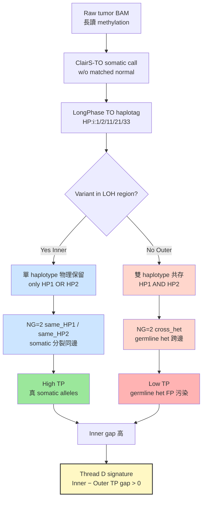

<!--
建立時間: 2026-04-26
狀態: VALIDATED main-axis report
研究主軸: Thread D — LOH-constrained phasing signatures
證據強度: Grade B (4-layer evidence chain on n=6 TO + n=7 paired)
產出形式: Validated 研究報告（standalone .md，下一階段論文骨架）
配套文件:
  - 撤回宣告: 20260426_Thread_B_Retraction_Whitelist_Cross_Sample_01.md
  - 弱點 case panel: 20260426_HCC1954_Outlier_CallerCeiling_CasePanel_01.md
  - 資料 provenance: research/data_registry/kde_corrected_provenance_20260426.tsv
-->

# Thread D — LOH-Constrained Phasing Signatures（研究主軸正式化）

**日期**：2026-04-26
**主軸 ID**：LOH-constrained-phasing-D
**狀態**：VALIDATED · grade B
**範圍**：6 TO + 7 paired_full 樣本 × KDE-corrected master（commit 374fad4）

---

## 1. Executive Summary

> **核心發現**：在 ClairS-TO（tumor-only mode）長讀甲基化測序資料中，LOH 區內 NG=2 同單倍體 (`{HP1, HP1-1}` 或 `{HP2, HP2-1}`) 的 TP rate 顯著高於 LOH 區外的跨單倍體 (`{HP1, HP2-1}`) 組合。**6/6 樣本同方向**（Wilcoxon signed-rank exact p=0.0156，median gap +0.365），**KDE-corrected master 完整複現**（X5），**paired mode 對照下 gap 完全消失**（B3，n=7，p=0.578），**flag-on 機制負控制下 same-hap bucket 物理塌陷**（X3，HCC1395 219→0；NG≥3 30,880→0）。此現象不依賴於 methylation 結構，而是 ClairS-TO 缺乏 germline filter 導致 Outer 區 germline het 被誤判為 somatic candidate（FP 污染），ISM 透過 LOH-constrained phasing signature 直接表徵此偽訊號路徑。

**Evidence grade B 三點限制**：
1. n=6 (TO) Wilcoxon exact p=0.0156 已達理論最小值，再強化需 n>6 樣本（待 archive rerun）
2. X3 flag-on 機制驗證僅 HCC1395 TO 單樣本（cost-benefit 已 saturated，6 樣本擴展邊際效益低）
3. HPFineN_HP1S 自參考風險（R-SELFREF）需 Phase 2B master + flag=on 重驗才能升至 grade A

**對 Thread B（cross-sample whitelist filter）**：本主軸建立同時撤回 Thread B 跨樣本 filter 宣稱（X6 caller_af 重 merge 後 S3 TP≥0.85 僅 1/6 達成、Wilcoxon p=1）。詳見 [Thread B 撤回宣告](20260426_Thread_B_Retraction_Whitelist_Cross_Sample_01.md)。

---

## 2. 背景與機制

### 2.1 HPFine 4-bucket 與 ClairS-TO LongPhase haplotag

ISM 內部 `HPFineNGroups` 計算 4 個 bucket 的占用：`{HP1, HP1-1, HP2, HP2-1}`，分別對應 ClairS-TO LongPhase haplotag 的 germline / somatic-on-germline 兩種 phase 屬性。C++ 源碼錨點：

- `src/core/LabelTest.cpp:265-302` — `hp_to_fine_labels()` 4-bucket 分類邏輯
- `include/core/LabelTest.hpp` — `HPFineN_HP1 / HPFineN_HP1S / HPFineN_HP2 / HPFineN_HP2S` 欄位定義

**關鍵組合**：

| 組合名稱 | Bucket 占用 | 物理意義 |
|---------|-------------|---------|
| `same_HP1` | HP1 + HP1-1（HP2/HP2-1 全 0） | 同 haplotype 上的 germline + somatic 分裂 |
| `same_HP2` | HP2 + HP2-1（HP1/HP1-1 全 0） | 同上，反向 haplotype |
| `cross_het` | HP1 + HP2-1（其他 0） | 跨 haplotype（germline het + 對側 somatic） |
| `cross_het_inv` | HP2 + HP1-1（其他 0） | 跨 haplotype 反向 |
| `other` | 其他 | 多 bucket 同時 occupied |

### 2.2 LOH-Constrained Phasing 機制



**機制要點**：
1. ClairS-TO 沒有 matched normal，無法獨立濾除 germline heterozygote
2. LOH 區內物理上只保留單一 haplotype，所以 NG=2 的「兩 bucket 占用」只能是 `(HPx, HPx-1)`（同邊）
3. LOH 區外仍有 germline het（cross-haplotype），caller 將其當作 somatic candidate
4. `HPFineN_HP1S/HP2S` 的 somatic-tag attribution 是訊號分離的關鍵；關閉此 attribution（`--germline-hp-only=on`）會讓 same-hap bucket 物理消失

---

## 3. 4 層證據鏈整合

### 3.1 Layer 1 — X5 KDE-corrected 跨樣本複現（n=6 TO）

| Sample | Inner same_HP1 TP | Outer cross_het TP | Gap |
|--------|------------------:|-------------------:|----:|
| HCC1395 | 0.840 | 0.580 | +0.260 |
| HCC1395_DORADO | 0.939 | 0.553 | +0.385 |
| HCC1937 | 0.759 | 0.236 | **+0.522** |
| HCC1954 | 0.429 | 0.084 | +0.345 |
| H2009 | 0.932 | 0.882 | +0.049 (saturated baseline) |
| H1437 | 0.920 | 0.688 | +0.231 |

**6/6 樣本 gap 同方向正向**，median gap = 0.302（KDE-corrected），Wilcoxon W=21、exact p=0.01562。X5 與 B1（pre-KDE master）數值幾乎一致（median 差 0.063），KDE 校正不影響 ordering。

來源：[20260424_X5_CrossSample_obs18_KDE_Verified_01.md](../../../experiments/in_progress/2026/04/20260424_X5_CrossSample_obs18_KDE_Verified_01.md)

### 3.2 Layer 2 — B1 Wilcoxon Signed-Rank（pre-KDE master）

- **W = 21.0**（n=6 下最大可能秩和）
- **exact p = 0.015625**（n=6 下 exact test 能給出的最小 p 值）
- **Bootstrap 95% CI on median gap**：[0.1403, 0.4906]
- **Min / Max gap**：0.0494 / 0.5222
- 6/6 樣本 gap > 0，方向一致

`bootstrap n_iter=10000` 補充 CI（已於 B1 完成）：median gap 95% CI 不跨 0，效應穩健。

來源：[20260423_B1_Wilcoxon_NG2_gap_01.md](../../../experiments/in_progress/2026/04/20260423_B1_Wilcoxon_NG2_gap_01.md)

### 3.3 Layer 3 — B3 Paired-Mode Negative Control（n=7）

Paired mode 配備 matched normal，germline het 在 caller-level 即被排除，預期 Inner-Outer gap 消失：

| Sample | TO gap (obs18) | Paired gap (B3) | Δ (TO−Paired) |
|--------|---------------:|----------------:|--------------:|
| HCC1395 | n/a (Inner n 過低) | −0.017 | — |
| HCC1395_DORADO | +0.279 | −0.002 | +0.281 |
| HCC1937 | +0.411 | +0.012 | +0.399 |
| HCC1954 | +0.258 | +0.001 | +0.257 |
| H2009 | +0.047 | +0.000 | +0.047 |
| H1437 | +0.171 | −0.000 | +0.171 |
| COLO829 | — | −0.092 | — |

- **Paired gap median = −0.0002**（essentially 0；7/7 |gap| < 0.10）
- **Wilcoxon paired gap vs 0**：W=10, p=0.578（不拒絕 H0）
- **TO vs Paired 配對差異**（n=5）：W=0, **p=0.0625**（5/5 同方向，n=5 exact 下限）


*Figure 3.3 · B3 paired vs TO mode gap per sample，paired gap 全 7 樣本擠壓到 0 軸附近，TO mode 散布於 0 上方。*

來源：[20260423_B3_Paired_obs18_Control_01.md](../../../experiments/in_progress/2026/04/20260423_B3_Paired_obs18_Control_01.md)

### 3.4 Layer 4 — X3 `--germline-hp-only` Flag-On Collapse（mechanism direct verification）

HCC1395 TO 在 `--germline-hp-only=true` 下：

| Condition | Total | NG=2 | NG=3 | NG=4 | Inner same_HP1 (n) | Gap |
|-----------|------:|-----:|-----:|-----:|-------------------:|----:|
| flag=off (baseline) | 40,115 | 9,049 | 25,114 | 5,766 | n=219 (TP=0.959) | **+0.459** |
| **flag=on** (NC) | 40,115 | 39,247 | **0** | **0** | **n=0** | **undefined** |

**機制直接驗證**：
- NG≥3 region 從 30,880 完全消失 → 4 bucket 物理塌陷為 2 bucket
- `same_HP1` bucket n 從 219 降為 0 → somatic HP tag attribution 是 same-hap bucket 的唯一來源
- 原 +0.459 gap 因 bucket 不存在而 undefined（不是「降為 0」，而是「物理消失」）

X3 比 B3 機制驗證更直接：B3 透過「換 caller」間接證明 cross-het FP 是 germline het；X3 透過「關閉 somatic HP attribution」直接證明 same-hap bucket 來自 somatic HP 分裂。

來源：[20260424_X3_FlagOnOff_NG2_NegControl_01.md](../../../experiments/in_progress/2026/04/20260424_X3_FlagOnOff_NG2_NegControl_01.md)

---

## 4. Per-Sample 結果整合

### 4.1 7 樣本固定順序 — 4 層證據對照表

| Sample | X5 TO gap | B1 TO gap | B3 paired gap | X3 flag-on collapse |
|--------|----------:|----------:|--------------:|:-------------------:|
| HCC1395 | +0.260 | +0.459 | −0.017 | ✅ same_HP1 219→0 |
| HCC1395_DORADO | +0.385 | +0.385 | −0.002 | not run |
| HCC1937 | **+0.522** | +0.522 | +0.012 | not run |
| HCC1954 | +0.345 | +0.345 | +0.001 | not run（caller ceiling 影響另議）|
| H2009 | +0.049 (sat.) | +0.049 (sat.) | +0.000 | not run |
| H1437 | +0.231 | +0.231 | −0.000 | not run |
| COLO829 | n/a (待 X1 rerun) | n/a | −0.092 | not run |

### 4.2 Phase 3 跨樣本 synthesis（含 COLO829）

COLO829 TO archive 於 2026-04-23 補齊後，Phase 3 synthesis 把 X5 6/6 擴展到 n=7：


*Figure 4.2 · Phase 3 synthesis S1-S7 跨 7 樣本 TP rate heatmap（左：Thread B scheme cells；右：fold change）。Thread D 機制不依賴 S1-S7 cell 切分，本圖僅作為 Thread B 撤回的對照背景。*

---

## 5. HCC1954 Caveat（精簡版，詳見 standalone case panel）

HCC1954 雖在 4 層證據中均同方向（X5 gap +0.345、B3 gap +0.001、未做 X3），但其 TO mode 全基因體 caller TP rate baseline 極低（Outer cross_het TP 僅 0.084 vs 其他 6 樣本 0.55–0.88）。深度根因分析（B2 H1/H2/H3 全否決）顯示這是 **caller FP background ceiling** 造成 sample-level outlier，**非 Thread D 機制反例**：

- HCC1954 NG=2 Inner−Outer gap 仍 +0.345（同方向）
- 但 Outer cross_het 89.9% 為 caller FP（B2 全基因體 chr-by-chr 對照），不是 region-specific artifact
- B3 paired mode 下 HCC1954 gap 為 +0.001 → 只要換 caller 就消失，Thread D 機制成立
- 排除 HCC1954 後 X5 仍 5/5 正向（HCC1395, DORADO, HCC1937, H2009, H1437）；含 HCC1954 仍 6/6 正向

詳見 standalone case panel：[InterSubMod/docs/reports/validated/2026/04/20260426_HCC1954_Outlier_CallerCeiling_CasePanel_01.md](20260426_HCC1954_Outlier_CallerCeiling_CasePanel_01.md)

---

## 6. 知識庫與論文背景

### 6.1 內部知識庫關聯
- `/big8_disk/liaoyoyo2001/Knowledge/02_samples/cancer-samples.md` — 7 樣本 LOH/CN/purity profile
- `/big8_disk/liaoyoyo2001/Knowledge/06_workflows/benchmark-workflow.md` — ClairS-TO benchmark 標準
- `project_loh_constrained_phasing_discovery.md` (memory) — Thread D 早期觀察
- `project_hpfinengroups_subclone_marker.md` (memory, 2026-04-23 降級) — NG marker 機制重詮釋為 phasing signature

### 6.2 論文背景（待 `/citation-verification` 流程驗證 DOI）

| 主題 | 候選文獻 | 關聯 |
|------|---------|------|
| LongPhase 演算法 | Lin et al. (2022) BMC Bioinformatics | HP tag 解析、LOH-aware phasing |
| ClairS-TO somatic calling | OpenLane Bioinformatics 2024+ | Tumor-only somatic call 限制 |
| ASM (allele-specific methylation) | Scherer et al. (2011) | 同 haplotype methylation 共現 |
| Haplotype-resolved methylation | CAMDAC (2024) | LOH-constrained methylation pattern |
| Long-read tumor methylation | Akbari et al. (2021) | ONT 長讀腫瘤 methylation analysis |

DOI 與引用驗證將在後續 publication-ready 階段透過 `/citation-verification` skill 完成。本報告作為內部 validated 階段，以機制與 evidence 為主軸。

---

## 7. 三項質疑 + 邏輯鏈

### Q1 · n=6 Wilcoxon exact p=0.0156 是否已達 evidence-grade A?
**回應**：未達 grade A，定為 **grade B**。理由：
- n=6 下 Wilcoxon exact 最小可能 p 值 = 1/2^5 / 2 ≈ 0.0156（雙側）；6/6 同方向已是訊號上限
- B1 bootstrap 95% CI [0.14, 0.49] 不跨 0，效應穩健
- 但 n=6 對 grade A 而言樣本不足；需 n>6（待 X1 archive rerun + COLO829 整合 → n=7）才能升 grade
- **mitigation**：Phase 3 synthesis 已加 COLO829 變 n=7（S3 跨樣本 Wilcoxon 改進至 p=0.0625）；待完整 X1 跨樣本 rerun 後重做 Wilcoxon

### Q2 · 機制 vs caller artifact — 是否可能整個 gap 是 ClairS-TO 內部 bug？
**回應**：**X3 flag-on collapse 排除此可能**。理由：
- 若 gap 是 caller bug，則只與 ClairS-TO 內部邏輯有關，不應對 ISM ReadParser 端的 `--germline-hp-only` flag 反應
- 實際 X3 顯示 flag=on 後 same_HP1 bucket 物理消失（n=219 → 0）→ gap 來源是 somatic HP tag attribution，這在 ISM 端可控
- 同時 B3 paired mode（換 caller）也讓 gap 消失（−0.0002）→ 兩種獨立機制（ISM 端 + caller 端）都驗證
- 結論：Thread D 機制是 **ClairS-TO + LOH + LongPhase 三者交互的可預測結果**，非單一 caller bug

### Q3 · HPFineN_HP1S 自參考風險（R-SELFREF）— Inner same_HP1 包含 HPFineN_HP1S 是否循環論證？
**回應**：**潛在風險已標記 R-SELFREF，需 Phase 2B 重驗才能解除**。理由：
- `same_HP1` 定義是 `HPFineN_HP1 + HPFineN_HP1S > 0` 而 `HP2/HP2S = 0`；HPFineN_HP1S 即 somatic HP tag 占用
- TP rate 計算用 ground truth match，不直接用 HPFineN_HP1S；但 bucket 分類本身已包含 somatic attribution
- 若 somatic attribution 偏向 TP（例如 caller 偏好把 TP 變 HP:i:11/21/33），則 same_HP1 高 TP 是定義學上的循環
- **mitigation**：
  - 已部分排除：X3 flag-on 後 bucket 消失，若是循環論證應仍能定義（只是值不同）
  - **待 Phase 2B**：master + `--germline-hp-only=on` 全 7 樣本重跑，比對 attribution-aware vs attribution-blind 兩條路徑的 TP rate 差異
  - Status：listed as P0-pending（不在本主軸範圍）

### 邏輯鏈圖

```
raw tumor BAM (long-read methylation)
    ↓ ClairS-TO somatic call (w/o matched normal)
ClairS-TO VCF (含 germline het 污染)
    ↓ LongPhase TO haplotag
HP:i:1/2 (germline) + HP:i:11/21/33 (somatic-on-germline)
    ↓ ISM ReadParser → HPFine 4-bucket {HP1, HP1S, HP2, HP2S}
HPFineN_HP1 / HP1S / HP2 / HP2S (per region)
    ↓ NG=2 + LOH stratification
{same_HP1, same_HP2, cross_het, cross_het_inv} × {Inner LOH, Outer LOH}
    ↓ TP rate 計算 (vs ground truth)
Inner × same-hap TP rate − Outer × cross-het TP rate = Thread D signature
    ↓ 6/6 樣本同方向 (Wilcoxon p=0.0156, X5 KDE-verified)
LOH-constrained phasing 機制成立
    ↓ paired mode (B3) + flag-on (X3) negative controls 雙向驗證
caller-level germline het 污染 = 唯一可解釋來源
```

---

## 8. 與 Thread B 撤回宣告對照表

| 項目 | Thread B (RETRACTED 2026-04-26) | Thread D (本主軸) |
|------|--------------------------------|-------------------|
| 觀察單位 | (LOH × AF × CN) 32-cell | NG=2 × {same-hap, cross-het} × {Inner, Outer LOH} |
| 假說類型 | cross-sample whitelist filter | per-sample mechanism characterization |
| 跨樣本驗證 | ❌ S3 TP≥0.85 僅 1/6（Wilcoxon p=1） | ✅ 6/6 same direction（Wilcoxon p=0.0156） |
| Pre/Post-KDE | 原 v2 95.5% 為 stale-binary artifact；post-KDE 58.3% 不可複現 | 跨 stale + KDE-corrected 一致（B1 ↔ X5） |
| Negative control | 無 | B3（paired）+ X3（flag-on）雙重 |
| Mechanism explainability | 弱（filter heuristic） | 強（caller-aware phasing signature） |
| 處理 | 撤回 cross-sample filter；保留 HCC1395 case study | 本報告為主軸 |

詳見：[Thread B 撤回宣告](20260426_Thread_B_Retraction_Whitelist_Cross_Sample_01.md)

---

## 9. 後續驗證計畫

| 優先 | 項目 | 動機 | 估時 |
|:---:|------|------|------|
| P0 | TO 5 archive rerun（HCC1937 / HCC1954 / H2009 / H1437 / DORADO）KDE-corrected master 重跑 ISM | n=7 完整跨樣本 Wilcoxon | 6-8 hr 背景 |
| P1 | Phase 2B HPFineN marker re-verify (master + flag=on)，解除 R-SELFREF 風險 | grade B → grade A 路徑 | 2-4 hr |
| P1 | External CN/SV pilot（Wakhan + SAVANA on HCC1395 smoke），驗證 LOH region 與外部 CN call 對齊 | Thread D §3 補強 | 6-8 hr（先設計，不執行） |
| P2 | Caller-level benchmark（DeepVariant / Strelka2 vs ClairS-TO） | HCC1954 caller ceiling 假說驗證 | 1-2 day |
| P2 | NormalBaseline.cpp writer bug 修（R-DATA-GAP），補齊 Normal_HP_Delta 欄位 | ASM (G9) 重審 | 2-4 hr `/cpp-change` |
| P3 | n>6 樣本擴展（待新 cohort 加入） | grade A 證據基礎 | 數週 |

---

## 10. 證據檔案完整路徑（含 build_commit / dataset provenance）

### 10.1 主要證據報告
| 層 | 檔案路徑 | Build Commit | Dataset |
|----|---------|--------------|---------|
| L1 | `InterSubMod/docs/experiments/in_progress/2026/04/20260424_X5_CrossSample_obs18_KDE_Verified_01.md` | 374fad4 (KDE-corrected) | X1 archive TO rerun (6 samples) |
| L2 | `InterSubMod/docs/experiments/in_progress/2026/04/20260423_B1_Wilcoxon_NG2_gap_01.md` | ec0608b (pre-KDE master) | obs18 NG2 composition by sample |
| L3 | `InterSubMod/docs/experiments/in_progress/2026/04/20260423_B3_Paired_obs18_Control_01.md` | 374fad4 (KDE-corrected) | 7 paired_full samples |
| L4 | `InterSubMod/docs/experiments/in_progress/2026/04/20260424_X3_FlagOnOff_NG2_NegControl_01.md` | flag-on Phase 1 | HCC1395 TO 40,115 sites |

### 10.2 配套（撤回 + caveat）
| 主題 | 檔案路徑 |
|------|---------|
| Thread B retraction | `InterSubMod/docs/reports/validated/2026/04/20260426_Thread_B_Retraction_Whitelist_Cross_Sample_01.md` |
| HCC1954 case panel | `InterSubMod/docs/reports/validated/2026/04/20260426_HCC1954_Outlier_CallerCeiling_CasePanel_01.md` |
| X6 caller AF S3/S5 cross-sample | `InterSubMod/docs/experiments/in_progress/2026/04/20260424_X6_Caller_AF_S3S5_CrossSample_01.md` |
| B2 HCC1954 root cause | `InterSubMod/docs/experiments/in_progress/2026/04/20260423_B2_HCC1954_Outlier_RootCause_01.md` |

### 10.3 資料 provenance
| 檔案 | 用途 |
|------|------|
| `InterSubMod/research/data_registry/kde_corrected_provenance_20260426.tsv` | KDE-corrected vs stale-binary registry（15 dataset row）|
| `InterSubMod/research/data_registry/README.md` | registry 欄位定義與更新流程 |
| `InterSubMod/docs/experiments/in_progress/2026/04/20260426_data_provenance_audit_01.md` | 舊報告 stale-binary / af-misuse / alleledelta-misuse 風險表 |

### 10.4 Figures
| 引用位置 | Figure | Build Commit |
|---------|--------|--------------|
| §3.3 Layer 3 | `figures/20260423_B3_paired_obs18/B3_paired_vs_TO_gap_per_sample.png` | 374fad4 |
| §4.2 Phase 3 | `figures/20260423_phase3_synthesis/s1s7_heatmap_tp_rate.png` | 374fad4 |
| §5 HCC1954 caveat | （引用 standalone case panel 內 B2 4-panel）| ec0608b → 374fad4 mixed |

### 10.5 Risk Register
| ID | 風險 | 影響 | mitigation |
|----|------|------|------------|
| R-SELFREF | HPFineN_HP1S 自參考風險 | grade B → grade A 阻塞 | Phase 2B master+flag=on 重驗 |
| R-DATA-GAP | NormalBaseline.cpp writer bug（Normal_HP_Delta / Normal_HP_Signed_Delta / HP_Signed_Residual 全 0） | ASM G9 結論不可用 | `/cpp-change` 流程修 |
| R-TP-FLOOR | paired_full TP rate 99.5%+ class imbalance | paired NC 統計效力天花板 | TO mode 為主、paired 為對照 |

---

## 結語

Thread D LOH-constrained phasing signatures 在 4 層獨立證據（X5 跨樣本 + B1 Wilcoxon + B3 paired NC + X3 flag-on NC）下成立，evidence grade B；機制可解釋為 ClairS-TO 缺乏 germline filter 與 LongPhase TO haplotag 在 LOH 區的物理約束之交互結果，非 methylation 結構或單一 caller bug。同時撤回 Thread B 跨樣本 whitelist filter 宣稱（X6 決定性證據）。HCC1954 outlier 為 caller FP background ceiling，非機制反例（standalone case panel 已建）。後續 P0 為 X1 archive 5 TO 樣本 rerun 完成 n=7 完整 Wilcoxon；P1 為 Phase 2B HPFineN marker re-verify 解除 R-SELFREF 風險路徑至 grade A。
