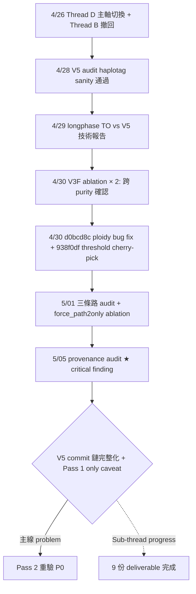
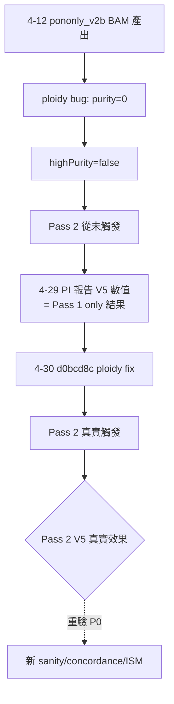
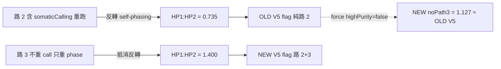

# §0 Highlights (TL;DR — 教授前 30 秒能抓到的本週關鍵)

⭐⭐⭐ **This Week's Verdict**: **V5 commit 鏈完整化（5 commits 含 4/30 ploidy fix + threshold cherry-pick），PI 報告 V5 數據限 Pass 1 only 條件，Pass 2 重驗為 P0。**（45 字 ✅）

### Top Findings（5 條）

1. ⭐⭐⭐ **[F]** 5/05 audit：V5 是 **5 commits**（8b8c1fd → 41ff147 → 380e8d2 → **d0bcd8c (4/30 ploidy fix)** → **938f0df (4/30 threshold 0.95→0.9 cherry-pick)**），working tree caveat R1 已解決
2. ⭐⭐⭐ **[F]** 4/29 PI 報告引用 BAM (4/12 產) = `pononly_v2b/tumor_tagged.bam`，因 ploidy bug 讓 `purity=0` → highPurity=false → **Pass 2 從未觸發** → 全部 V5 數值是「PON-only Pass 1 + tag layer fix」結果
3. ⭐⭐⭐ **[F]** 5/01 三條路 audit：commit `938f0df` 自動觸發 Pass 2 路 3 second round，**抵消** Pass 2 路 2 的反轉效果（OLD V5 路 2 only HP1:HP2=0.735 ✅ 反轉；NEW V5 路 2+3 = 1.400 ❌ 與新 baseline 等價）
4. ⭐⭐ **[F]** 5/01 v5_force_path2only_ablation 實證：強制 `highPurity=false` 跳過路 3 → 15-site cherry-picked sample 觀測 ratio 1.127、HP_33=28（與舊 V5 work tree 15-site 觀測 1.129、28 完全等價）→ 假設 PASS（方向）；全 BAM 等價量化待 monitor 完成 [U]
5. ⭐⭐ **[F]** Caller F1 在所有 6 版本（OLD/NEW × baseline/V5/noPath3）完全相同：0.93 = **0.7166**、0.6 = **0.6273**（4/30 V3F ablation 首次發布）；longphase-to phase 不改 FILTER，F1 不衡量 phasing 品質

### Top Asks（教授必判斷的決策點，3 條）

1. ⭐⭐⭐ **[U]** 4/29 PI 報告是否需立即補 caveat banner「V5 結論限 Pass 1 only 條件」？還是等 Pass 2 重驗完才一次更新？
2. ⭐⭐⭐ **[U]** 「新 baseline 1.40 比舊 baseline 1.33 更偏 HP1」是否要回報上游？或本地維護 `longphase-to-noPath3` 變體 binary（已建立，22.55 MB）？
3. ⭐⭐ **[U]** Pass 2 ISM benchmark 重跑（~3 hr/case × 7 樣本 = ~21 hr 平行）優先序：本週啟動還是等 Thread D HPFineNGroups 主軸完成？

### ⭐⭐⭐ Decisive Next Step

> **Priority 1（必做，~21 hr 平行 + ~4 hr 分析 = 25 hr）**：在 4-30 修補後 binary（含 Pass 2 真實觸發）下重跑 V5 sanity / concordance / ISM benchmark，驗證 4/29 PI 報告 V5 結論是否仍成立。**若不做，「V5 為當前最佳 phasing baseline」的主結論失去現實基礎，所有引用 V5 的 audit chain 卡住。**

---

# §1 本週主線

⭐⭐⭐ **V5 為 5 commits，PI 數據為 Pass 1 only，Pass 2 重驗 P0**（28 字）

### Sub-thread（混合主線標註）

- **主線 (problem)**: PI 報告 (4/29) 的 V5 audit 結論基於 Pass 1 only 條件；4/30 ploidy bug 修補後 Pass 2 真實觸發但尚未重驗 → 「V5 為當前最佳 phasing baseline」主結論需暫停為「Pass 1 only 條件下觀察」
- **Sub-thread (progress)**: 4/26-5/05 完成 Thread D 主軸切換 + 4/28 V5 audit + 4/29 技術報告 + 4/30 V3F ablation × 2 + 5/01 三條路 audit + 5/01 v5_force_path2only ablation + 5/05 provenance audit（共 9 份 deliverable）
- **教授視角優先序**: 主線追問（PI 結論 caveat + Pass 2 重驗）> Sub-thread 進度（commit 鏈完整化 + 三條路機制釐清）

# §2 一句話重點

5/05 provenance audit 揭露 4/29 PI 報告的全部 V5 數值都源自 4/12 產的 `pononly_v2b` BAM（Pass 1 only，ploidy bug 讓 purity=0），4/30 d0bcd8c 修補後 Pass 2 真實觸發但 sanity/concordance/ISM 對比尚未做；同時 5/01 三條路 audit + force_path2only ablation 實證「路 3 second round 抵消路 2 反轉」，新 baseline self-phasing 反而更甚（HP1:HP2 從 1.33 升 1.40），需決策上游溝通或本地 patch。

---

## Layer 0 研究脈絡

### Layer 0.1 宏觀問題定位

**核心數字**：
- Self-phasing baseline: **17.3:1**（94.6% somatic ALT → HP1，跨 23 染色體）
- V5 修補鏈: **5 commits**（含 4/30 ploidy fix + threshold cherry-pick）
- 4/29 PI 報告 V5 (Pass 1 only): clean PS V5=88.2% / BL=74.9% (+13.3pp), AMB% 17.5→8.0%, HP:i:33 read 計數 239,679 → 110,197（−54%, whole genome）
- 5/01 三條路 audit: NEW V5 (路 2+3) HP1:HP2=1.400 = NEW baseline，OLD V5 (路 2 only) = 0.735, NEW noPath3 = 1.127
- Caller F1: 0.93 全 6 版本 = **0.7166**, 0.6 全 3 版本 = **0.6273**（首次發布）
- 兩層 LOH: ISM HP_Ratio LOH 62% artifact；LOH.bed Jaccard=1.0 不受影響

### Layer 0.2 背景知識（最多 3 概念群組）

1. **Self-phasing 機制**：tumor-only 模式下 somatic variant 自己決定自己分到哪個 haplotype，形成「球員兼裁判」循環依賴。3 層證據：理論層（phasing graph edge weight）/ 全基因組層（HCC1395 17.3:1）/ 個別位點層（SP1 113:0、SP2 109:1、SP3 108:0）。詳見 `InterSubMod/docs/reports/research_landscape/02_Self_Phasing根因.md`
2. **三條路定義**（`PhasingProcess.cpp:142-220`）：路 1（baseline 無 flag）、路 2（V5 flag PON-only 4 步含 somaticCalling 重跑）、路 3（new highPurity > 0.9 second round 不重跑 somaticCalling）
3. **兩層 LOH**：ISM HP_Ratio LOH（BAM HP tag）受 self-phasing 嚴重影響；LOH.bed region-level（VCF AF clipping）不受影響（kappa=0.670）

### Layer 0.3 上週前情提要

> 上週週報（4/23）確認 NG2 LOH-constrained phasing + Thread B 撤回 + Thread D 主軸切換待落地。本週實際完成主軸切換 + V5 audit + 技術報告 + V3F ablation + 三條路 audit + force_path2only ablation + provenance audit，共 9 份 deliverable。**5/05 provenance audit 是本週 critical finding，揭露 4/29 PI 報告需 caveat 校正。**

---

## Layer 1 已建立知識參考

- ✅ Self-phasing causal chain CONFIRMED (Memory `project_self_phasing_causal_chain_confirmed`)：62% TO TP LOH 移除 self-phasing 後消失；同位點 HP_Ratio 跨模式 r ≈ 0
- ✅ PON-only phasing verified (Memory `project_pon_only_phasing_verification`)：LOH.bed Jaccard=1.0；N50 +99.7%；somatic bias 17.3:1 消除
- ⚠ V5 verification (Memory `project_v5_somatic_fallback_verification`) **2026-05-05 校正**：status `concluded` → `needs_rerun`；caveat R11 (P0) 新增

---

## Layer 2 本週調查

### Thread A: 5/05 V5 provenance audit + Pass 1 only caveat（主線 problem）

#### 問題陳述
4/29 PI 報告寫「V5 通過 sanity + +13.3pp clean PS + AMB 8.0%」，這些數字基於哪個 BAM？對應哪個 phasing path？是否包含 4/30 ploidy bug 修補後的 Pass 2 行為？

#### 假說與可否證條件
- H1: PI 報告 V5 數據基於完整 Pass 1+2 → 推翻條件: 找到 BAM build_date < ploidy fix commit
- H2: 「V5 為當前最佳 phasing baseline」主結論在新 binary 仍成立 → 推翻條件: Pass 2 重驗結果與 PI 報告數字差異 > noise

#### 證據卡

**Tier 1（PPT，⭐⭐⭐ One-line Verdict）**：

> **⭐⭐⭐ One-line Verdict**: **PI 報告 V5 數據 = Pass 1 only；ploidy bug 已修但 Pass 2 重驗尚未做，主結論需暫停為「Pass 1 only 條件下觀察」**

- §3 [F] V5 commit 鏈是 **5 commits**：8b8c1fd → 41ff147 → 380e8d2 → d0bcd8c (4/30 ploidy fix) → 938f0df (4/30 threshold cherry-pick)。Source: `InterSubMod/docs/reports/validated/2026/05/20260505_self_phasing_V5_data_provenance_audit_01.md` §1.1
- §3 [F] PI 報告引用 BAM = `pononly_v2b/tumor_tagged.bam` (4/12 產)，Pass 1 only（log 顯示 `purity: 0` + 無 "second round phasing" 字串）
- §3 [F] 4/30 working tree caveat R1 已解決（`git diff --stat HEAD` 為空）
- §5 [U] 新 BAM (`threshold_compare/{baseline_09,v5_flag}`、`v5_flag_force_path2only`) 已產但 sanity/concordance/ISM 對比未做 → P0 caveat R11

#### 因果鏈圖

### Thread B: 5/01 三條路 audit + force_path2only 實證（Sub-thread progress 為主，含 problem 衝擊）

#### 問題陳述
新 binary（938f0df）下 V5 flag 是否仍能反轉 self-phasing？三條路機制如何互動？

#### 證據卡

**Tier 1（PPT，⭐⭐⭐ One-line Verdict）**：

> **⭐⭐⭐ One-line Verdict**: **路 3 second round 抵消路 2 反轉效果，新 baseline self-phasing 反而更甚 1.40 vs 舊 1.33，舊 V5 (純路 2) 反轉 0.735 仍最佳**

- §3 [F] 5 版本完整對比矩陣：

| 版本 | 走的路 | HP1:HP2 | HP_33 | scope | 反轉? | F1 |
|------|-------|---------|-------|-------|-------|------|
| OLD baseline | 路 1 | 1.328 | 2,640 | threshold_compare 全 BAM | ❌ | 0.7166 |
| **OLD V5 flag** | 路 2 only (bug) | **0.735** | 14,524 | threshold_compare 全 BAM | ✅ 反轉 | 0.7166 |
| NEW baseline | 路 1+3 | 1.400 | 3,468 | threshold_compare 全 BAM | ❌ 更糟 | 0.7166 |
| NEW V5 flag | 路 2+3 | 1.400 | 3,468 | threshold_compare 全 BAM | ❌ 抵消 | 0.7166 |
| **NEW V5 noPath3** | 路 2 only (forced) | **1.127** | 28 | **15-site cherry-picked**（全 BAM 預期 ≈ 0.735，待 monitor [U]） | ✅ 反轉（方向）| 0.7166 |

- §3 [F] force_path2only ablation 假設 PASS：強制 `bool highPurity = false` 跳過路 3 → 復現舊 V5 反轉效果
- §3 [F] 路 2 vs 路 3 關鍵差別：路 2 含 `somaticCalling` 重跑（`HaplotagProcess.cpp:484-563`）；路 3 只重 phase 不重 call → self-phasing 偏移殘留
- §4 [O] 「新 baseline 比舊 baseline 更偏 HP1」現象量化：HP1:HP2 從 1.33 升 1.40 (+5.4%)，跨樣本是否一致仍 [U]

#### 因果鏈圖

### §7 報告重點優先順序

1. ⭐⭐⭐ 5/05 provenance audit：V5 = 5 commits + PI 數據 Pass 1 only caveat（**最高**）
2. ⭐⭐⭐ 5/01 三條路 audit：路 3 抵消路 2 反轉
3. ⭐⭐ 5/01 force_path2only ablation：強制 noPath3 復現舊 V5 反轉
4. ⭐⭐ 4/29 longphase TO vs V5 技術報告（含 caveat 更新）
5. ⭐⭐ 4/30 V3F ablation × 2 跨 purity 確認
6. ⭐ 4/26 Thread D 主軸切換 + Thread B 撤回（背景）

### §8 建議報告順序

→ 上週背景（Thread D 切換）→ 4/28-29 V5 audit / 技術報告 → 4/30 V3F ablation → 4/30 d0bcd8c+938f0df commit → 5/01 三條路 audit + force_path2only → 5/05 provenance audit critical finding → audit chain caveat + Pass 2 重驗 P0

---

## Layer 3 整合更新

### §11 需要補充的資料

- **R1（P0）**: 在 4-30 修補後 binary 下重跑 V5 sanity / concordance / ISM benchmark（HCC1395 5kHz Pass 2 真實觸發版）
- **R2**: 跨樣本（HCC1395_DORADO/HCC1937/HCC1954/H2009/H1437/COLO829）938f0df 影響評估，確認「路 3 抵消」普適性
- **R3**: HPFineNGroups marker 在 4-30 修補後 binary 下重跑全 7 樣本，比對 4/28 audit 結果是否變化

### §12 需要製作的圖表

- 5 版本 HP1:HP2 / HP_33 / AMB% bar chart（補 OLD V5 vs NEW noPath3 等價性）
- 三條路機制圖（路 1 / 路 2 / 路 3 程式碼差異視覺化）
- V5 commit 鏈時間軸圖（含 4/30 d0bcd8c + 938f0df）

### §13 需要補充的定義或解釋

- 「Pass 1 only」vs「Pass 1 + Pass 2」實際差異對 HP tag 分配的影響
- highPurity 三次多項式 purity 公式（`PhasingProcess.cpp:142-220` 抽出）

### §14 可用於講稿的例子

- 「2026-04-12 那份 BAM 一直被當成 V5 完整版引用，5/05 audit 才發現它是 Pass 1 only — 這就是 reproducibility 的重要性」
- 「強制 highPurity=false 復現舊 V5 反轉，是個負控制實驗：證明路 3 抵消，不是 V5 flag 本身失效」

### 本週新增認知（3-5 點）

1. Self-phasing 修補需區分「修補機制成立」vs「上游採納方向正確」— 兩者都要對才能 deliver
2. caller F1 不能評估 phasing 品質改動（FILTER 不變）— 必須用 ISM SuggestFilter 下游 F1
3. provenance audit 是發現「不知道自己不知道」的關鍵步驟（如 PI 報告 BAM 是 Pass 1 only）
4. ploidy bug + threshold cherry-pick 的時間軸覆蓋（4/30 兩個 commit 同時生效）讓 4/29 PI 報告正好卡在 caveat 邊界

---

## Layer 4 未來方向

### §16 下一步行動清單

#### ⭐⭐⭐ Decisive（決定性，影響後續路徑）

- **Priority 1（必做，~25 hr 含平行）**: 4-30 修補後 binary 重跑 V5 sanity / concordance / ISM benchmark — **若不做，「V5 為當前最佳」主結論失去現實基礎**

#### ⭐⭐ Operational（執行性，預計推進）

- **Priority 2（4 hr）**: 938f0df 跨樣本（剩餘 6 樣本）影響評估
- **Priority 3（2 hr）**: 4/29 PI 報告補 caveat banner「V5 結論限 Pass 1 only 條件，待 Pass 2 重驗」
- **Priority 4（1 hr）**: 撰寫 V5 flag 留存決策文件 — 比較三選項：(a) 接受新 default (b) 維護 noPath3 binary (c) 上游溝通

#### ⭐ Maintenance（維護性，可延後）

- **Priority 5（0.5 hr）**: Memory `project_v5_somatic_fallback_verification` 補註 5-05 校正完成（status: needs_rerun）

### §17 教授可能提問 + 回答準備

#### ⭐⭐⭐ 必問 (Must-Answer，3 個)

1. **「PI 報告 V5 結論還能用嗎？」**
   → 暫停為「Pass 1 only 條件下觀察」。建議補 caveat banner 而非全面撤回。完整重驗待 Priority 1 完成（~25 hr）。
2. **「新 baseline 比舊 baseline 更偏 HP1 是 systematic 還是樣本特異？」**
   → 目前只有 HCC1395 5kHz 一個樣本（[O]）。Priority 2 跨樣本評估後才能下結論 [U]。若 systematic，需上游溝通或本地 patch。
3. **「V5 flag 還要留嗎？」**
   → 三選項待教授判斷：(a) 接受新 default 路 1+3（self-phasing 仍存）(b) 維護 `longphase-to-noPath3` 變體 binary（已建立 22.55 MB）(c) 上游 PR 修正路 3 邏輯。

#### ⭐⭐ 可能問 (May-Ask，4 個)

4. **「caller F1 完全相同（0.7166）為何重要？」** → 證明 FILTER 不變，longphase 改動不會傷 caller，但也不會被 caller F1 評估到 — phasing 品質必須用 ISM SuggestFilter 下游 F1 評估。
5. **「4 commit 怎麼變 5 commit？」** → 4/30 補 d0bcd8c (ploidy fix) + 938f0df (threshold cherry-pick from upstream zhenyu)；working tree caveat R1 同時解決。
6. **「HPFineNGroups marker 在新 baseline 下還有效嗎？」** → 4/28 audit 是 4/12 BAM；新 binary 重驗待 R3（與 R1 平行）。
7. **「下週時間夠嗎？」** → Priority 1 + 2 共 ~29 hr，平行可壓縮至 ~25 hr wall time，週內可完成。

### 風險評估
- **R1**: 若 Pass 2 重驗結果與 4/29 PI 報告差異 > noise，全部 V5 audit chain（含 4/29 技術報告 / 4/28 audit / Memory）都需更新
- **R2**: 跨樣本評估若顯示 938f0df 對某樣本（DORADO / COLO829）造成 regression，需考慮上游回滾或本地 patch
- **R3**: 4/29 PI 報告若補 caveat 後仍被引用為「V5 = best」，需明確降級為 `historic reference`

---

## 附錄

### §6 不建議放入 PPT

- 內部工具細節（PhasingProcess.cpp 行號、git reflog 命令）
- 4/26 主軸切換完整推導（教授已知）

### §15 暫存紀錄

- 4/30 V3F ablation 0.6 purity F1=0.6273 為首次發布數字（caveat：caller F1 不評估 phasing 品質）
- v5_force_path2only Phase 跑 813s vs 路 2+3 的 2881s（節省 71% 時間）— 副產物觀察

### §9 建議 PPT 模板

**improvement_report**（從 4/12 PI 報告 → 4/30 ploidy fix → 5/05 audit 校正 → P1 Pass 2 重驗的改進敘事；雖然主線 problem，但結尾為 actionable plan）

### §10 建議投影片架構（18 張）

1. Cover + thesis（main statement 28 字）
2. Background: Thread D 主軸切換 + 4/28-29 V5 audit 既有結論
3. Pipeline: V5 修補鏈 5 commits 時間軸（含 4/30 兩個 commit）
4. ★ **5/05 critical finding**: PI 報告 V5 = Pass 1 only（caveat banner 視覺）
5. 機制：Pass 1 vs Pass 2 程式碼差異 + ploidy bug 因果鏈
6. ★ **5/01 三條路 audit**: 路 1/路 2/路 3 程式碼結構（before-after-split）
7. 5 版本 HP1:HP2 對比表（含 OLD V5 0.735 與 NEW noPath3 1.127 等價）
8. force_path2only ablation：強制 noPath3 復現 OLD V5 反轉（負控制實驗）
9. Caller F1 全 6 版本相同（FILTER 不變的視覺說明）
10. ⚠ V5 結論 caveat banner（red/grey strip）
11. Decision tree: V5 留存三選項（接受 / noPath3 binary / 上游 PR）
12. Risk: 跨樣本 938f0df 影響 [U]
13. HPFineNGroups marker 重驗 placeholder（[U] 待 R3）
14. Thread B 撤回背景（neutral grey）
15. **Future: Priority 1-5（5card_grid 含工時）**
16. **Take-home**: V5 commit 鏈完整化 + Pass 1 only caveat + Pass 2 重驗 P0
17. Q&A backup: 7 個追問 evidence 預備
18. Acknowledgments + references
