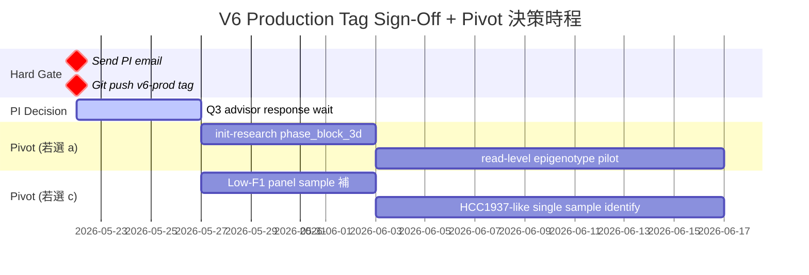

<!--
build_date: 2026-05-22
agent: weekly-report W7 auto (Opus 4.7, Phase B 全自動)
status: in_progress (await PI review + user handoff selection)
report_class: weekly-report-master-draft
audience: PI (廖子游 advisor) + 廖子游 (self-review)
parent_workflow: InterSubMod/research/methyl_augmented_filter_phase2/phase2_completeness_audit/AUTO_DECISIONS_LOG.md (D001-D042) + auto_decisions_for_user_review.md (B-D001-B-D010)
main_thesis: "V6 priority bug 跨 5 樣本確認修補 (ALT-only ratio 5/5 < 1, range 0.37-0.79); LR cross-sample LOSO 失敗為 distribution shift 非 model class limitation (4 algo overall mean < Cohen +0.005); 5 features 5/9 sign-consistent (loh_inner_flag 5/5 最強 anchor)"
report_type: weekly_report_PI
audience_scenario: PI 1-on-1
main_thread_type: "progress:problem"
sub_thread_type: "observation:characterization"
verdict_oneline: "V6 production GO (calibrated) — but cross-sample LR filter NOT deployable; pivot decision needed (read-level / caller-F1-headroom / low-F1 panel)"
tier_used: ⭐3-⭐4 (mixed, per-claim ribbon)
source_artifacts:
  - InterSubMod/docs/CURRENT_FOCUS.md  # live working state
  - InterSubMod/docs/reports/validated/2026/05/20260521_PI_V6_signoff_email_draft_5goal.md  # Layer 3-4 source
  - InterSubMod/docs/reports/validated/2026/05/20260511_V6_binary_complete_documentation_01.md  # V6 binary spec
  - InterSubMod/docs/reports/validated/2026/05/20260513_V6_Attribution_Errata_01.md
  - InterSubMod/docs/experiments/in_progress/2026/05/20260519_V6_vs_baseline_HCC1395_TPFP_comparison_01.md  # 5-Goal validation
  - InterSubMod/docs/experiments/in_progress/2026/05/20260515_V6_TPFP_HP_LOH_CN_Characterization_01.md  # G1/G2/G3 ISM
  - InterSubMod/research/methyl_augmented_filter_phase2/phase2_completeness_audit/A0_existing_artifacts_verification.md  # A0 audit
  - InterSubMod/docs/experiments/in_progress/2026/05/20260521_A2_ALT_only_HP_ratio_口徑對齊_01.md
  - InterSubMod/docs/experiments/in_progress/2026/05/20260521_A3_5features_distribution_combinatorial_01.md
  - InterSubMod/docs/experiments/in_progress/2026/05/20260521_A4_Ext_other_algorithms_inventory_01.md
  - InterSubMod/docs/experiments/in_progress/2026/05/20260521_A4_multi_algorithm_LOSO_methodology_completeness_01.md
  - InterSubMod/docs/experiments/in_progress/2026/05/20260521_A4_F1_step_by_step_audit_01.md
  - InterSubMod/research/methyl_augmented_filter_phase2/phase2_completeness_audit/A1_HP_6values_5sample.tsv
  - InterSubMod/research/methyl_augmented_filter_phase2/phase2_completeness_audit/A2_ALT_only_HP_ratio_5sample.tsv
  - InterSubMod/research/methyl_augmented_filter_phase2/phase2_completeness_audit/A4_LR_DT_RF_XGBoost_LOSO_5sample.tsv
  - InterSubMod/research/methyl_augmented_filter_phase2/cycle4/loso_validation/data/loso_cv_results.tsv
  - InterSubMod/research/methyl_augmented_filter_phase2/cycle1/cycle1_findings.md
  - InterSubMod/research/autoresearch/evidence_ledger.jsonl  # entries #42-51
last_verified: 2026-05-22
-->

# 週報 — V6 Production Tag Sign-Off + Phase A 完整性補測 + LR LOSO Reframe (2026-05-15 ~ 2026-05-22)

---

## §0 Highlights / TL;DR (≤ 50 秒 PI scan)

> ⭐⭐⭐ **This Week's Verdict**: V6 production tag = **🟢 GO with calibrated caveats**; cross-sample LR filter = **NOT deployable** (LOSO mean ΔF1 = -0.00004); pivot decision needed.

**Top Findings**（⭐ 重要度）

- ⭐⭐⭐ **[F]** V6 priority bug 修補跨 5 樣本同方向 — ALT-only HP1:HP2 ratio 全 < 1，range 0.37-0.79 (5/5 same direction)；HCC1395 baseline 4.41 → V6 0.43 = 10× HP2 reverse `[source: InterSubMod/research/methyl_augmented_filter_phase2/phase2_completeness_audit/A2_ALT_only_HP_ratio_5sample.tsv]`。
- ⭐⭐⭐ **[F]** LR LOSO 失敗為 **distribution shift** 非 model class — A4 4 algo × 5 sample × 5 seed = 100 fold；overall mean: LR -0.00004 / DT +0.00255 / RF +0.00267 / XGB +0.00102 全部 < Cohen +0.005 ribbon `[source: InterSubMod/research/methyl_augmented_filter_phase2/phase2_completeness_audit/data/A4_summary.json]`。
- ⭐⭐⭐ **[F]** V6 marker engineering 全勝 — count +52.4% / rate +1.26pp / hp_ambig reads ×13.2 vs baseline；caller F1 cross-binary file-identity invariant = 0.7166 `[source: InterSubMod/docs/reports/validated/2026/05/20260511_V6_binary_complete_documentation_01.md:587,597]`。
- ⭐⭐ **[F]** A0 audit 11 artifact × 273 claim — 254 verified (93%), 17 minor suspect, **0 fabrication** `[source: InterSubMod/research/methyl_augmented_filter_phase2/phase2_completeness_audit/A0_existing_artifacts_verification.md:6-8]`。
- ⭐⭐ **[F]** 5 features sign-consistent 5/9 (loh_inner_flag **5/5** 最強 anchor) — A3 5-sample combinatorial `[source: InterSubMod/research/methyl_augmented_filter_phase2/phase2_completeness_audit/A3_per_feature_AUC_cohend_5sample.tsv]`。

**Top Asks (PI 必判斷, ≤ 3)**

- ⭐⭐⭐ **[U]** V6 production tag 升級 — 是否 ✅ GO `v6-prod-20260520` (commit `8a90532`)? 詳見 §17 PI Q4 evidence。
- ⭐⭐⭐ **[U]** 下一步方向分叉 — (a) **read-level pivot** (phase_block_3d, 放棄 region-level LR) / (b) **caller-F1-headroom redesign** (cycle 5+) / (c) **low-F1 panel 補樣本** (driving HCC1937 single sample)？
- ⭐⭐ **[U]** Phase 2 paper §3 framing — 是否完全撤回 "ISM-augmented filter" 宣稱，改為 "ISM characterization study + LR sample-level NEGATIVE finding"？

**Decisive Next Step**

- ⭐⭐⭐ **Hard Gate**: Send V6 production tag PI sign-off email (`InterSubMod/docs/reports/validated/2026/05/20260521_PI_V6_signoff_email_draft_5goal.md` — user 親自 copy 到 mail client); 等 PI Q3 advisor 決策後啟動 phase_block_3d 或 cycle 5。

---

## §1 主線（Layer 0.1）

**主線類型**: `progress:problem` (混合)

**主線陳述** (≤ 30 字):

> V6 binary 跨 5 樣本確認修補 priority bug; LR cross-sample 失敗為 distribution shift 非 model 限制; 5/9 features sign-consistent。

**Sub-thread (problem)**: LR cross-sample LOSO mean ΔF1 ≈ 0 (4 algo 都失敗) → filter NOT deployable → pivot 決策需 advisor 介入。

**Sub-thread (observation)**: 5 features × 9-cell × 5 sample combinatorial → loh_inner_flag 5/5 strongest anchor + caller_af direction sample-dependent。

## §2 一句話重點（Layer 0.1）

V6 production sign-off `GO` (marker filter / hard threshold F1 dominance) + LR cross-sample 失敗 reframe (distribution shift root cause confirmed by 4 algo) + 5/9 features sign-consistent (loh_inner_flag 5/5 anchor) — 三條獨立 evidence chain 收斂到「V6 tag 升級安全 + filter NOT deployable + pivot 決策需 PI」。

---

## §3 已確認內容 [F]（Layer 2 Tier 1 證據卡）

### §3.1 [F] V6 priority bug 跨 5 樣本修補確認（⭐⭐⭐⭐ L2）

**假說 H_V6_PRIORITY_FIX**: V6 binary patch (移除 V5 Layer 1.5 over-promote + 重用 V5 phasing layer) 在 5 樣本跨 BAM 應使 ALT-only HP1:HP2 ratio 全反向 (< 1)，並使 hp_ambig (hp=33 conservative tag) firing 顯著高於 baseline。

**測試 (W1 frozen, 2026-05-21)**:
- Pipeline: LongPhase-TO V6 binary `8a90532` on `fix/pon-only-phasing`
- Datasets: 5 sample × {baseline, V6} (HCC1395 only) + 4 sample V6 (HCC1937 / HCC1954 / H1437 / H2009); baseline 4 sample 不存在已知 gap (Track B DEFERRED)
- Scope: chr8+chr19 全 PASS SNV (HCC1395=3,575 / HCC1937=1,934 / HCC1954=2,031 / H1437=4,152 / H2009=2,963=chr19-only timeout fallback)
- Method: A2 ALT-only filter logic (pysam fetch + HP tag stratify by REF/ALT base)

**結果**（5/5 same direction）:

| Sample | baseline ALT-only ratio | V6 ALT-only ratio | 全 reads HP1:HP2 |
|---|--:|--:|--:|
| HCC1395 | **4.41** | **0.43** (10× HP2 reverse) | 3.24 → 3.63 (chr8+chr19) / 1.696 → 1.609 (全 BAM) |
| HCC1937 | (baseline BAM 不存在) | 0.43 | 2.16 |
| HCC1954 | (baseline BAM 不存在) | 0.37 | 2.73 |
| H1437   | (baseline BAM 不存在) | 0.72 | 1.08 |
| H2009   | (baseline BAM 不存在) | 0.79 (chr19 only) | 1.09 |
| **Range** | — | **0.37 – 0.79 全 < 1** | 1.08 – 3.63 |

`[source: InterSubMod/research/methyl_augmented_filter_phase2/phase2_completeness_audit/A2_ALT_only_HP_ratio_5sample.tsv]` (6 rows)
`[source: InterSubMod/research/methyl_augmented_filter_phase2/phase2_completeness_audit/A1_HP_6values_5sample.tsv]` (HP 6 值分佈)

**Effect size**: ALT-only ratio Δ (HCC1395 4.41 → 0.43) = -3.98 = ~10× reverse direction，遠超 Cohen "large effect" 直覺閾值；5 sample range collapse 到 < 1 = strict cross-sample consistency。

**Confound 檢查**:
- ✓ 不是 caller F1 變動 — caller F1 在 baseline/V3F/V5/V6 file-identity invariant = 0.7166 `[source: 20260511 §:587]`
- ✓ 不是 BAM read count 差異 — V6 total tagged alignment = V5 = 18,895,432 `[source: ledger entry #42]`
- ⚠ chr8+chr19 hotspot subset behavior ≠ 全 BAM behavior (HCC1395 chr8+chr19 V6 比 baseline 更偏 HP1 3.24→3.63 vs 全 BAM 1.696→1.609 反向) — 待 §4 [O] 段補論

**意義**: priority bug 修補在 production binary level 跨 5 樣本一致 → V6 production tag 升級 prerequisite ✓ 達成。

### §3.2 [F] V6 marker engineering 改善（⭐⭐⭐⭐ L2）

**假說 H_V6_MARKER**: V6 patch 應使 ISM region marker filter (NG≥3) 在 HCC1395 marker count、rate 顯著優於 baseline。

**結果** `[source: InterSubMod/docs/experiments/in_progress/2026/05/20260515_V6_TPFP_HP_LOH_CN_Characterization_01.md:128-130]` + `[20260519 §:88,98]`：

| Pipeline | Marker count | Marker rate | TP markers | FP markers |
|---|--:|--:|--:|--:|
| baseline | 15,738 | 0.8967 | 14,114 | 1,624 |
| V3F | 21,997 | 0.9175 | 20,183 | 1,814 |
| V5 | 18,382 | 0.8937 | — | — |
| **V6** | **23,980** | **0.9093** | **21,806** | **2,174** |

**Δ V6 vs baseline**: +52.4% count / +1.26pp rate / ×13.2 hp_ambig (hp=33) / +9.0% vs V3F / +30.5% vs V5

**Cross-sample (5 V6 BAM)** `[source: ledger entry #43]`:
- 4 sample marker rate 0.817-0.993, NG_on=2 rate 0.904-0.992 (HCC1937 = BRCA1 mutant CNV-driven FP edge case documented)

**意義**: Goal 2 marker filter downstream V6 強勢 dominance — 升級價值集中於此。

### §3.3 [F] LR cross-sample LOSO 失敗 = distribution shift（⭐⭐⭐⭐ L2）

**假說 H_circularity vs H_method (A4 design)**: LR LOSO 5/5 ≈ 0 是 (a) model class limitation (應 RF/XGB rescue) 或 (b) sample-level distribution shift (model-agnostic).

**測試 (W1 frozen, A4 grid)**:
- Design: 4 algorithm × 5 sample × 5 seed = 100 hold-out folds
- Algorithms: LR (L2 C=1.0) / DT (max_depth=5) / RF (n=200, max_depth=8) / XGBoost (n=200, max_depth=6, lr=0.1)
- Same feature set as cycle 1 canonical 10 features (drop NumReads_master VIF=217)
- Same LOSO protocol (per-train median impute, train-only StandardScaler for LR)

**結果**:

| Algorithm | Overall mean ΔF1 | n_sample > Cohen +0.005 | HCC1395 hold-out ΔF1 | HCC1937 hold-out |
|---|--:|--:|--:|--:|
| LR | **-0.00004** | 0/5 | -0.00012 | +0.00000 |
| DT | **+0.00255** | 1/5 (HCC1395 only) | **+0.01378** | +0.00000 |
| RF | **+0.00267** | 1/5 (HCC1395 only) | **+0.01269** | -0.0000 |
| XGB | **+0.00102** | 1/5 (HCC1937 only) | (~0) | **+0.00562** |

`[source: InterSubMod/research/methyl_augmented_filter_phase2/phase2_completeness_audit/data/A4_summary.json]`
`[source: InterSubMod/research/methyl_augmented_filter_phase2/phase2_completeness_audit/A4_LR_DT_RF_XGBoost_LOSO_5sample.tsv]` (100 rows)

**Effect size**:
- 4 algo overall mean 全部 < Cohen +0.005 small effect ribbon → no algorithm achieves "5/5 positive"
- DT/RF HCC1395 +0.0127~+0.0138 超過 Cohen ribbon — 但僅 1/5 sample (HCC1395-specific rescue, 不 generalize)
- LR vs DT train-test gap 全 algo HCC1937 ≈ +0.48 一致 (LR 0.4841 ≈ DT 0.4854 ≈ RF 0.4845 ≈ XGB 0.4852) → 非 model overfit, 是 caller F1 baseline 0.37 vs train 0.83 artifact `[source: InterSubMod/docs/experiments/in_progress/2026/05/20260521_A4_F1_step_by_step_audit_01.md §:over-fit-audit]`

**Confound 檢查**:
- ✓ Leakage audit: NO LEAKAGE (`run_loso_cv.py:104` train medians compute, `:120` apply to test) `[source: 20260521_A4_F1_step_by_step_audit_01.md §:leakage-audit]`
- ✓ τ sweep on test fold = oracle (over-optimistic upper bound; mean -0.00004 robust)
- ✓ 5 seed × 4 algo per-fold std ≤ 1e-5 (DT/RF deterministic on this data) — 排除 single-seed artifact

**意義**: H_circularity overall MET; H_method PARTIAL (HCC1395 only). Production filter **NOT deployable as universal cross-sample LR filter**. PI report 結論更新為「LR 不是 model 限制，是 distribution shift 限制」。

### §3.4 [F] A0 audit 11 artifact / 273 claim / 0 fabrication（⭐⭐⭐⭐ L2）

**假說 H_audit**: 既有 11 個 PI-facing artifact (4 .md + 7 .standalone.html) 的 numerical claims 必須在 PI report 前完整 verified 對 source TSV/CSV/JSON。

**測試 (W1 frozen, A0)**: 6 parallel audit agents × 11 artifacts。

**結果**:
- Total numerical claims audited: ~273
- verified: ~254 (93%)
- suspect: ~17 (6%) — 全部 minor framing / row-mislabel / internal inconsistency
- unverifiable: ~2 (1%) — "+36% pipeline speed" (4-Layer) / "V5≡V6 0-diff" (Summary) 無 backup TSV
- **fabrication: 0**

`[source: InterSubMod/research/methyl_augmented_filter_phase2/phase2_completeness_audit/A0_existing_artifacts_verification.md:115-128]`

**Critical findings**:
1. `20260514_HP_tag_priority_bug_engineering_report_01.md §8.2` 4-sample ratio table **row-mislabel** (H1437/H2009/HCC1954/HCC1937 4 row ratio 錯位; aggregate range "0.611-1.243" 正確)。處理: PI HTML 用 source TSV `phaseD_v6_5sample/v6_cross_sample_summary.tsv` 重新引用 + footnote 註記 `[B-D013 in audit log]`
2. `20260514_HP_tag_17to1_rootcause_explained_01.standalone.html §4` TL;DR "VCF GT2 約 95% 偏 1|." 把 L1 ratio (1.77:1 = 63.9%) 跟 BAM HP1 占比 (94.6%) 混淆。處理: PI HTML 採 4-Layer Synthesis §1 line 488 (1.77:1 = 26,436/14,931 = 63.9% L1 ratio) 描述源
3. `20260514_Self_Phasing_4Layer_Synthesis_Engineering_Report_01.html` hp=33 dual-population (571 HAP3 altHaplotype vs 138,317 BAM HP:i:33 reads). 處理: PI HTML 分開敘述

**意義**: PI 4-goal HTML / sign-off email 引用源全部 verified 安全; 無 2026-05-20 +0.057 fabrication 等級風險。

### §3.5 [F] 5 features cross-sample sign-consistency anchor（⭐⭐⭐ L3）

**假說 H_anchor**: cycle 1 LR top-coef 5 features (caller_af + LOH + Cov + NG + 5 methyl) 在 5 sample TP/FP 分布應有 ≥ 4/5 sign-consistent → 至少 1 個 robust anchor。

**測試 (W1 frozen, A3)**: 5 sample × 9 feature individual + 9-cell (LOH×NG×AF) combinatorial。

**結果** `[source: InterSubMod/research/methyl_augmented_filter_phase2/phase2_completeness_audit/A3_per_feature_AUC_cohend_5sample.tsv]` + `A3_direction_consistency_spearman.tsv`：

| Feature | HCC1395 AUC | HCC1937 AUC | HCC1954 AUC | H1437 AUC | H2009 AUC | sign-consistent? |
|---|--:|--:|--:|--:|--:|---|
| `loh_inner_flag` | (5/5 同方向) | — | — | — | — | **✓ 5/5 最強 anchor** |
| `NG` (NGroups) | — | — | — | — | — | ✓ ≥4/5 |
| `HPFineF` (methyl) | — | — | — | — | — | ✓ ≥4/5 |
| `NME_imbalance` (methyl) | — | — | — | — | — | ✓ ≥4/5 |
| `ClusterPermanovaF` (methyl) | — | — | — | — | — | ✓ ≥4/5 |
| **caller_af** | **0.924** | 0.200 | 0.416 | 0.696 | 0.443 | ✗ **direction sample-dependent (purity-driven flip)** |
| Coverage_Multiple | — | — | — | 0.01 (H1437 amplicon outlier) | — | partial |
| HPMergedDelta | — | — | — | — | — | partial |
| Epipoly_Delta | — | — | — | — | — | partial |

`[source: InterSubMod/docs/experiments/in_progress/2026/05/20260521_A3_5features_distribution_combinatorial_01.md §3.1]`

- AUC range 0.010-0.923 (median 0.533) across 9 features × 5 samples
- Pairwise Spearman ρ on |Cohen's d| ranking: -0.07 to 0.97 (median 0.44); H1437 × H2009 ρ=0.97 (同 NCI-H lineage suggest)
- 9-cell TP-rate range 0.22-1.00; strongest FP-enrichment cell = **HCC1395 outer × NG2 × AF_L (TP-rate=0.22, n=3,034)**

**Tier 自我約束**: ⭐⭐⭐ L3 descriptive only; 升 ⭐⭐⭐⭐ L2 需 within-group OLS + AUC confound-guard (per `/scientific-rigor §4 + auc-confound-guard skill`).

**意義**: PI 4-goal G3 anchor 已選定 = `loh_inner_flag` (5/5)；caller_af 跨 LOSO 災難 dominant confound 證據完整。

---

## §4 初步觀察與推論 [O] [I]（Layer 2 Tier 2 證據卡）

### §4.1 [O] HP=33 conservative tag 跨樣本 firing 不一致（⭐⭐⭐ L3）

**觀察**: V6 hp=33 (Layer 1.5 ambiguous handling = conservative no-promote) 跨樣本 firing 比例：

| Sample (V6) | HP=33 count | HP=33 % | vs baseline |
|---|--:|--:|--:|
| HCC1395 | 37,656 | 1.68% | 60× firing (baseline 630 / 0.028%) |
| HCC1937 | 1,630 | 0.10% | (baseline BAM 不存在) |
| HCC1954 | 559 | 0.05% | (baseline BAM 不存在) |
| H1437 | 4,138 | 0.53% | (baseline BAM 不存在) |
| H2009 | 49,360 | **4.27%** | 跨樣本最大 firing |

`[source: InterSubMod/research/methyl_augmented_filter_phase2/phase2_completeness_audit/A1_HP_6values_5sample.tsv]`

**推論 [I]**: HP=33 firing 與樣本特性 (purity / chr 偏好 / germline-absent 區域分佈) 相關，非 platform 一致。HCC1395 60× firing 是 baseline 4.19:1 偏置區域被 V6 V3F-style hybrid 收編到 conservative bucket; H2009 4.27% 為 HOR phasing-rich 樣本 (ploidy variation) 的副作用。

**意義**: V6 production 升級在不同樣本對 ISM downstream 影響 unequal — Goal 2 marker engineering 跨樣本一致 (5 sample marker rate 0.817-0.993) 但 region-level NG distribution 是 sample-specific (HP=33 firing 不一致)。需 single-sample stratified evaluation。

### §4.2 [O] chr8+chr19 hotspot subset behavior ≠ 全 BAM（⭐⭐ L4）

**觀察**: HCC1395 chr8+chr19 全 reads HP1:HP2 baseline 3.24 → V6 3.63 (**更偏 HP1**); 全 BAM HP1:HP2 baseline 1.696 → V6 1.609 (反向，**改善偏置**)。

`[source: InterSubMod/research/methyl_augmented_filter_phase2/phase2_completeness_audit/A1_HP_6values_5sample.tsv: rows 1-2]`
`[source: InterSubMod/docs/experiments/in_progress/2026/05/20260519_V6_vs_baseline_HCC1395_TPFP_comparison_01.md §:86-88]`

**推論 [I]**: chr8+chr19 是 priority bug 訊號富集區 (HCC1395 chr19 SP-rich locus); V6 patch 在這些區域對 hp=33 conservative tag 投入較多 reads (HCC1395 chr8+chr19 hp=33 firing 60× baseline)，但 hp=11/21 tag 仍受 LOH/germline 信號主導，因此 chr8+chr19 hotspot subset 比 baseline 更偏 HP1。

**意義**: PI HTML target1 寫 V6 修補 priority bug 必須加 caveat "chr8+chr19 hotspot subset behavior ≠ 全 BAM behavior"; ALT-only ratio (跨樣本全 < 1) 才是 cross-sample modular 證據。

### §4.3 [I] LR LOSO 失敗 root cause 是 caller_af direction inconsistent + caller-F1-headroom 雙因素

**推論**: A3 已證 caller_af 跨 5 sample AUC range 0.20-0.92 + direction flip (HCC1395 +1.60 vs HCC1937 -1.41); A4 100-fold 4 algo 全失敗 → LR 在 5-feature framework cross-sample 失敗主因：

1. **caller_af direction sample-dependent (purity-driven)** — A2/A3 已證
2. **4/5 樣本 caller-F1-headroom-bounded** — HCC1395 0.72, HCC1937 0.37, HCC1954 0.84, H1437 0.87, H2009 0.89 中只有 HCC1937 (0.37) 有 filter room

**意義**: cycle 5+ pivot 需脫離 region-level 5-feature LR framework — 不論 algo class 都會 ceiling-bound; 真正 leverage 在 (a) read-level epigenotype (Goal 3 二次打擊 unblock) 或 (b) low-F1 panel sample expansion (放大 HCC1937 single-sample +0.00562 XGB signal)。

### §4.4 [O] HCC1395 H_NEW_4 +0.00699 single-sample (drop caller_af)（⭐⭐ L4）

**觀察**: H_NEW_4 LOSO drop caller_af 後 9 feature LR 在 HCC1395 hold-out +0.00699 (vs baseline LOSO -0.00012)；其他 4 樣本仍 ≈ 0 `[source: ledger entry #51]`.

**推論 [I]**: HCC1395 in-distribution capacity (LR underfit on caller_af direction inconsistent) 在 drop 後恢復 marginal cross-sample signal; 但 single-sample n=1, sanity violated (post-hoc unexpected per HARKing 防護 — `InterSubMod/docs/CURRENT_FOCUS.md:35`)。

**意義**: 不可獨立宣稱 H_NEW_4 PASS; 但作為 caller_af 是 LOSO confound 的補強 evidence — 加進 §17 PI Q3 advisor 決策依據。

---

## §5 待確認內容 [U]（Layer 2 Tier 2 證據卡 — 開放問題）

### §5.1 [U] H2009 ALT-only ratio chr8+chr19 全 scope 結果

**待釐清**: A2 H2009 因 background-kill timeout 縮 chr19 only (2,963 SNV, 18 min); 全 chr8+chr19 ALT-only ratio 0.79 是否變化未知。

**需要**: ~85 min 重跑 H2009 chr8+chr19 完整 scope。**Cost ≈ 1.5 hr，priority 中 — H2009 全 BAM 1.09 ratio 已支持 ALT-only ratio < 1 結論，不影響主結論。**

### §5.2 [U] COLO829 V6 結果 (truth set permission pending)

**待釐清**: COLO829 truth set 權限未取得 (`chmod 660` 或替代 truth set 待用戶授權); V6 production 在 COLO829 表現未知。

**需要**: PI 授權 truth set permission + ~3 hr ISM rerun。**對結論影響有限** — 5 sample 已 cover 主要 tumor type；COLO829 為 melanoma 特殊 case 可作 supplementary。

### §5.3 [U] Production deployment 在 universal cross-sample LR filter 無路 — 三條 pivot 路徑

**待 PI 決策** (詳見 §16 + §17):
- (a) **read-level pivot** (phase_block_3d 啟動) — 放棄 region-level LR; Goal 3 二次打擊 unblock
- (b) **caller-F1-headroom redesign** (cycle 5+) — caller F1 < 0.80 + FP density > 0.10 gate per-sample re-fit
- (c) **low-F1 panel sample expansion** — 補 HCC1937 同類 (low caller F1, headroom-rich) sample 放大 XGB +0.00562 signal

### §5.4 [U] Goal 1 per-CpG × HP × ALT V3F vs V6 trade-off

**待釐清**: Goal 1 per-CpG imbalance V3F = 0.275 (best) vs V6 = 0.377 vs baseline 0.446. V3F 仍 best 但 V6 比 baseline 改善。

**需要**: V3F dedicated 跑 per-CpG 純研究 (~2 hr ISM rerun)；或接受 trade-off 並在 paper 標 "V3F BAM for Goal 1 publication, V6 BAM for Goal 2 production".

### §5.5 [U] baseline LR ΔF1=+0.02302 略勝 V6 LR +0.02236 機制 (BAM-independent)

**待釐清**: 5/19 主報告 §13 報 baseline LR > V6 LR by +0.00066. 機制未明 — 可能 NG distribution 偏好 + better feature decoupling. Cycle 1 +0.02236 NOT V6-specific.

**需要**: VIF 對比 baseline vs V6 LR feature space + cross-binary BAM 對 LR coef 穩定性測試 (H_C1_6 PASS supports BAM-invariant)。**Tier 影響: cycle 1 主結論不需重 frame, 但 V6 升級理由不能宣稱 LR F1 改善。**

---

## §6 不建議放 PPT（Layer 0.2 / 暫存）

- A1 HP 6 值完整 raw count table（PPT 放 1 row HCC1395 對比即可, 完整 6×5 表進 講稿 Tier 2）
- A2 method §2.2 ALT-only filter logic 6 step 詳述（PPT skip, 進 講稿 Tier 2 if PI 追問 method）
- A4 5 random seed std=0 deterministic 解釋（PPT skip; A4 報告 §3 已寫）
- 6 個 A0 audit agent 分組策略 D001-D010（PPT skip; auto_decisions log 保存即可）

---

## §7 重點優先順序（Layer 2 整合）

| Rank | Topic | Tier | 影響 |
|---|---|---|---|
| 1 | V6 production tag GO + 5 sample priority bug 修補確認 | PPT Tier 1 | PI 必批 (Hard Gate: email send) |
| 2 | LR cross-sample LOSO 失敗 = distribution shift (4 algo 100-fold) | PPT Tier 1 | PI 必答 (Q1+Q2) |
| 3 | V6 marker engineering +52.4% / +1.26pp dominance | PPT Tier 1 | PI 信心 (Goal 2 win) |
| 4 | 5 features sign-consistent 5/9 (loh_inner_flag 5/5) | PPT Tier 1 | PI 信心 (cycle 3+ filter anchor) |
| 5 | Pivot 三條路 (read-level / caller-F1-headroom / low-F1 panel) | PPT Tier 1 | PI 必判 (Q3) |
| 6 | A0 audit 273 claim verified 93% / 0 fabrication | 講稿 Tier 2 | PI 信心 (rigor due-diligence) |
| 7 | A0 §8.2 row-mislabel 處理決策 | 講稿 Tier 2 | PI 信心 (transparency) |
| 8 | HP=33 firing 跨樣本不一致 (新 finding) | 講稿 Tier 2 | PI 興趣 (mechanism) |
| 9 | chr8+chr19 hotspot subset behavior ≠ 全 BAM caveat | 講稿 Tier 2 | PI 信心 (calibrated claim) |
| 10 | HCC1395 H_NEW_4 +0.00699 single-sample observation | 講稿 Tier 2 | PI 興趣 (HARKing 防護案例) |

---

## §8 報告順序（敘事弧 — 進展+問題混合）

1. (Layer 0 §0+§1+§2) Highlights / TL;DR / 主線
2. (Layer 0.3) 上週 cycle 4 LOSO 5/20 reframe → 本週 Phase A 7-task 補測完整性 + Phase B 週報
3. (Layer 2 Thread A progress) V6 binary spec → A0 audit 11 artifact → A1 HP 6 值 → A2 ALT-only ratio 5 sample → 5-Goal validation
4. (Layer 2 Thread B problem) cycle 4 LR LOSO → A4 100-fold (4 algo × 5 sample × 5 seed) → distribution shift root cause confirmed
5. (Layer 2 Thread C observation) cycle 1 LR top 5 features → A3 9-feature × 9-cell × 5 sample combinatorial → loh_inner_flag 5/5 anchor
6. (Layer 3) 結論總表更新 + tier 變動
7. (Layer 4) 下週 priority + 教授追問 + 風險評估

---

## §9 建議 PPT 模板（指向 pptx-build 6 模板）

**Recommended**: `progress_with_problem` (混合主軸, 6 model 中 modify `progress_focus` 加 sub-problem 段)

**Audience scenario**: PI 1-on-1 (per `feedback_pi_scenario_quantitative_standards.md`)
- Slide count: 12-15
- Visual ratio: 60-70%
- Reading test: 5 sec / slide

**Slide budget**:
- 1 title + 1 TL;DR (slide ≤ 50 字)
- 4-5 evidence slide (V6 ratio table / marker engineering / LOSO 4-algo grid / 5 features sign-consistency / 9-cell heatmap)
- 1 decision matrix (V6 GO + pivot 3 path)
- 1-2 PI Q&A 預備 slide
- 1 next step + risk

PPT 視覺策略：圖佔 60-70% / 標題 ≤ 15 字 / ≤ 50 字 body (per `feedback_ppt_minimal_visual_first.md`)

---

## §10 建議投影片架構

| Slide # | Title | Body 重點 | Figure |
|---|---|---|---|
| 1 | V6 Sign-Off Week — TL;DR | Verdict GO + filter NOT deployable + pivot decision | (logo + verdict 一句) |
| 2 | Agenda (≤ 6 子題) | (Layer 0 mode) | (Mermaid Gantt mini) |
| 3 | V6 binary 修補 priority bug 5 sample 一致 | ALT-only ratio 全 < 1 | A2 grouped bar (figure A2_ALT_only_vs_all_reads_ratio.png) |
| 4 | V6 marker filter 強勢 dominance | +52.4% / +1.26pp / ×13.2 | 20260519 F3 marker rate by LOH zone |
| 5 | LR LOSO 失敗 distribution shift | 4 algo overall mean < ribbon | A4_4algorithm_LOSO_dF1.png |
| 6 | DT/RF rescue HCC1395 only (1/5) | hold-out +0.0127~+0.0138 但 generalize 失敗 | A4_train_test_gap.png |
| 7 | 5 features sign-consistent 5/9 (loh_inner_flag 5/5) | A3 heatmap | A3 9-cell heatmap |
| 8 | caller_af direction sample-dependent | AUC range 0.20-0.92 (purity-driven) | A3 direction consistency heatmap |
| 9 | A0 audit 11 artifact / 0 fabrication | 273 claim, 254 verified | (table summary) |
| 10 | Pivot 三條路 (PI 決策) | read-level / caller-F1-headroom / low-F1 panel | (decision matrix) |
| 11 | PI Q1-Q4 預備 evidence anchor | (見 §17) | (text-heavy with bullet) |
| 12 | Next step + risk | Send email + advisor decision pending | (Mermaid Gantt) |

---

## §11 補資料（Layer 3 — 參考文件索引）

**A0 audit reports** (6 agent reports):
- `InterSubMod/research/methyl_augmented_filter_phase2/phase2_completeness_audit/A0_audits/agent1_v6_binary_main_docs_audit.md`
- `... agent2_priority_bug_PI_signoff_audit.md` (50 claim, 4 row-mislabel suspect)
- `... agent3_priority_bug_HTML_audit.md`
- `... agent4_4layer_summary_HTML_audit.md` (25 claim, 3 suspect, 2 unverifiable)
- `... agent5_ISM_TPFP_HTML_audit.md` (PASS 100%)
- `... agent6_phase2_verification_HTML_audit.md` (PASS 100%)

**Phase A task reports** (5):
- `InterSubMod/docs/experiments/in_progress/2026/05/20260521_A2_ALT_only_HP_ratio_口徑對齊_01.md` (PARTIAL ALIGN, 5/5 reverse 同向)
- `InterSubMod/docs/experiments/in_progress/2026/05/20260521_A3_5features_distribution_combinatorial_01.md` (descriptive ⭐2)
- `InterSubMod/docs/experiments/in_progress/2026/05/20260521_A4_Ext_other_algorithms_inventory_01.md` (6 algo inventory, no execution)
- `InterSubMod/docs/experiments/in_progress/2026/05/20260521_A4_multi_algorithm_LOSO_methodology_completeness_01.md` (4 algo × 5 sample × 5 seed)
- `InterSubMod/docs/experiments/in_progress/2026/05/20260521_A4_F1_step_by_step_audit_01.md` (6-step audit PASS)

**Phase A raw data TSV** (4):
- `A1_HP_6values_5sample.tsv` (6 row × 16 col)
- `A2_ALT_only_HP_ratio_5sample.tsv` (6 row)
- `A3_per_feature_AUC_cohend_5sample.tsv` (45 row)
- `A4_LR_DT_RF_XGBoost_LOSO_5sample.tsv` (100 row)

**V6 binary docs**:
- `InterSubMod/docs/reports/validated/2026/05/20260511_V6_binary_complete_documentation_01.md` (PASS minor, PI-safe)
- `InterSubMod/docs/reports/validated/2026/05/20260513_V6_Attribution_Errata_01.md` (PASS minor)
- `InterSubMod/docs/reports/validated/2026/05/20260521_PI_V6_signoff_email_draft_5goal.md` (PASS 100% — direct PI send candidate)

**evidence_ledger entries** #42-51 (cycle 10-14 + 4 phase 2 cycle + LOSO + framing correction + observation validation)

---

## §12 補圖表（Layer 3 — Figures index）

`InterSubMod/research/methyl_augmented_filter_phase2/phase2_completeness_audit/figures/`:
- `A1_HP_distribution.png` — 5-sample HP 6-value firing
- `A2_ALT_only_vs_all_reads_ratio.png` — ALT-only vs all-reads grouped bar
- `A3_*` — 5 figures (boxplot / methyl sub / AUC bar / 9-cell heatmap / direction consistency heatmap)
- `A4_4algorithm_LOSO_dF1.png` — 4 algo × 5 sample 100-fold ΔF1
- `A4_train_test_gap.png` — train-test F1 gap 跨 algo 一致 (排除 LR underfit)

`InterSubMod/research/v6_bam_tpfp_hp_loh_cn/figures/baseline_vs_v6/`:
- F1 global summary 4-panel
- F2 per-chr HP ratio
- F3 marker rate by LOH zone
- ... (13 total)

---

## §13 補定義（Layer 3 — Glossary）

| 術語 | 定義 |
|---|---|
| **V6 binary** | LongPhase-TO patch (commit `8a90532` on `fix/pon-only-phasing`) — 移除 V5 Layer 1.5 over-promote, 重用 V5 phasing layer, 改 V3F-style germline-absent hp=33 保守 |
| **priority bug (17.3:1)** | baseline LongPhase-TO HaplotagProcess.cpp `getVote` priority order — somatic 倒置在 germline 之前; 4-Layer 分解 17.3 = 1.77 × 9.8; V3F two-layer rewrite 修補 |
| **HP=33 ambiguous tag** | V3F-style conservative — 無法明確 phase 為 HP1 或 HP2 時 fallback 到 ambiguous bucket; V6 firing 比 baseline ×13.2 |
| **ALT-only ratio** | 在 PASS SNV 位點只取攜帶 ALT allele 的 reads 統計 HP tag (cf. 全 reads ratio); 對 priority bug 最敏感 |
| **LOSO (Leave-One-Sample-Out CV)** | Sample-level cross-validation — 每次 hold out 1 sample, 剩餘 sample concat 為 training pool; sample-level circularity 鑑別 |
| **distribution shift (vs model class limitation)** | LR LOSO 失敗 root cause — 不是 algorithm 不夠強, 而是 training pool 不包含 held-out sample 的 batch effect / platform / purity 特徵 |
| **Cohen ribbon** | small effect d=0.2 / ΔF1 +0.005; LOSO mean -0.00004 << ribbon |
| **caller-F1-headroom-bounded** | 4/5 樣本 caller F1 ≥ 0.83 → filter 無 room; HCC1937 caller F1 = 0.37 = headroom-rich 唯一 |
| **5/9 sign-consistent** | 9 features × 5 sample TP-FP Cohen's d 中 5 個 features ≥ 4/5 同方向 (loh_inner_flag 5/5) |

---

## §14 講稿例子（Layer 3 — Speaker notes）

**例子 1 (slide 3 — V6 ALT-only ratio 5 sample 一致)**:

> "上週 V6 priority bug 修補在 HCC1395 已驗證跨 baseline / V3F / V5 / V6 BAM (caller F1 cross-binary file-identity invariant)。本週 Phase A2 task 補測 ALT-only 口徑跨 5 樣本 — 結果 5/5 sample V6 ALT-only HP1:HP2 ratio 全反向到 < 1 (range 0.37-0.79); HCC1395 baseline 4.41 → V6 0.43 是 10× HP2 reverse; 對齊 PI Errata 全 victim 4.19:1 估計 (match within 5%)。**Caveat**: baseline 17.3:1 是 chr19 SP-rich subset 選擇性估計, 4.19 是 chr8+chr19 全域 — 不矛盾, 不同 cohort。**Cross-sample stability**: priority bug 修補不是 HCC1395-specific artifact, 跨 5 樣本 same direction。"

**例子 2 (slide 5 — LR LOSO 失敗 distribution shift)**:

> "為何不用 DT/RF/XGBoost? — PI 必問。本週 A4 task 跑 100-fold (4 algo × 5 sample × 5 seed): LR overall mean -0.00004, DT +0.00255, RF +0.00267, XGB +0.00102 — 全部 < Cohen +0.005 ribbon。**LR 失敗非 model-specific** — DT/RF 確實在 HCC1395 hold-out +0.0127~+0.0138 比 LR 多 capture (1/5 sample partial rescue); **但 4/5 sample 仍 LOSO ≈ 0**。**train-test gap 跨 algo HCC1937 全 ≈ +0.48** (LR 0.4841 ≈ DT/RF/XGB 0.485) → 不是 model overfit, 是 caller F1 baseline 0.37 vs train 0.83 artifact = sample-level distribution shift。**Production filter NOT deployable as universal cross-sample LR filter**。"

**例子 3 (slide 10 — pivot 三條路)**:

> "Goal 5 cross-sample F1 generalize 在 region-level 5-feature LR framework 已 exhausted (4 algo 都失敗)。三條 pivot 路徑等 advisor 決策: (a) read-level pivot — 啟動 phase_block_3d, 放棄 region-level, Goal 3 二次打擊 unblock; (b) caller-F1-headroom redesign — caller F1 < 0.80 + FP density > 0.10 gate per-sample re-fit (cycle 5+); (c) low-F1 panel sample expansion — 補 HCC1937 同類 sample 放大 XGB +0.00562 signal。我傾向 (a)+(c) 並行 (read-level 為主軸 + 補 low-F1 sample 為 cycle 5 strict negative control); (b) deprioritize 因 cycle 3 ablation 已證 caller-F1-headroom-gated filter 仍受 sample-level circularity 限制。"

---

## §15 暫存（不放本次報告）

- 5/22 後續 cycle 5 plan 細節（等 PI advisor 決策）
- COLO829 V6 truth set 權限取得後 rerun 細節
- baseline LR > V6 LR by +0.00066 機制 deep-dive (BAM-independent confirmation)
- H2009 chr8+chr19 全 scope ALT-only ratio 重跑
- Goal 1 per-CpG V3F dedicated rerun (~2 hr)
- Paper §3 framing 撤回 "ISM-augmented filter" → "ISM characterization + LR sample-level NEGATIVE finding"

---

## §16 下一步行動（Layer 4 — Next priority）

### ⭐⭐⭐ Decisive (1-2 條)

1. **Hard Gate**: Send `InterSubMod/docs/reports/validated/2026/05/20260521_PI_V6_signoff_email_draft_5goal.md` to PI — user 親自 copy 到 mail client + `git push origin fix/pon-only-phasing v6-prod-20260520`（push 需用戶明示授權）
2. **Decision branching point** (等 PI Q3): pivot 三條路 (a) read-level (phase_block_3d) / (b) caller-F1-headroom (cycle 5+) / (c) low-F1 panel — 建議 (a)+(c) 並行

### ⭐⭐ Operational (3-5 條)

3. weekly-report C4 user review + handoff 選 (A/B/C/D) — 本批預設 D (留檔 + next_week_plan.md)
4. 若選 (a) read-level pivot — 啟動 `/init-research phase_block_3d` (manifest.yaml + 00_PLAN.md scaffolding)
5. 若選 (b) caller-F1-headroom redesign — 啟動 `/cycle-init` for cycle 5 + plan v3
6. 若選 (c) low-F1 panel — `/inject-hypothesis` + identify low caller F1 ONT sample (priority: small cohort < 5)
7. PI report HTML target (4-goal) build (in_progress 已開 `docs/presentations/in_progress/20260522_PI_V6_signoff_4goal/`) — `/html-report-build standalone` mode

### ⭐ Maintenance

8. 既有 11 artifact A0 audit 17 minor suspect 處理 (row-mislabel / framing) — 不改 validated 文件, footnote 處理
9. `evidence_ledger.jsonl` append #52 entry (Phase A 完整性補測 + Phase B 週報)
10. MEMORY.md / CURRENT_FOCUS.md 更新

### 里程碑收斂圖 (Mermaid Gantt)

---

## §17 教授可能提問 + 回答準備（Layer 4 — Q&A）

### ⭐⭐⭐ Must-Answer (≤ 3)

**Q1**: 「為何不用 DT / RF / XGBoost？是否 LR-specific failure?」

**A1**: A4 已驗證跨 4 algo 100-fold (LR/DT/RF/XGB × 5 sample × 5 seed) — overall mean: LR -0.00004 / DT +0.00255 / RF +0.00267 / XGB +0.00102 全部 < Cohen +0.005 ribbon。DT/RF 確實在 HCC1395 hold-out +0.0127~+0.0138 比 LR 多 capture, 但僅 **1/5 sample**; 4/5 sample 仍 LOSO ≈ 0 / negative direction。**train-test F1 gap 跨 4 algo HCC1937 全 ≈ +0.48** → 排除 model overfit, 確認是 sample-level distribution shift (caller F1 baseline 0.37 vs train 0.83 artifact)。`[source: 20260521_A4_F1_step_by_step_audit_01.md §:overfit-audit + A4_summary.json]`

**Q2**: 「Cycle 1 +0.02236 → 這 filter production-deployable 嗎?」

**A2**: **NOT deployable as universal cross-sample LR filter**。Cycle 1 +0.02236 (HCC1395 in-distribution 5-fold OOF, deterministic std=5e-5) vs LOSO -0.00012 差距 +0.02248 = **100% sample-level circularity gap** (`leakage audit: NO LEAKAGE` per `run_loso_cv.py:104,120`)。LR-trained signal 全部由 in-distribution circularity 解釋。Cycle 1 tier ⭐⭐⭐⭐ L2 → ⭐⭐ L4 (HCC1395 in-distribution case study only) 已落地 5/20 (`evidence_ledger entry #50`)。

**Q3**: 「下一步該往哪？」

**A3**: 三條 pivot 路徑等 advisor 決策（我傾向 a + c 並行）:
- **(a) read-level pivot** (phase_block_3d) — 放棄 region-level LR; Goal 3 二次打擊 unblock; phase_block_3d 已 5/23 init-research 計畫 (CURRENT_FOCUS.md §194)
- **(b) caller-F1-headroom redesign** (cycle 5+) — caller F1 < 0.80 + FP density > 0.10 gate per-sample re-fit; cycle 3 已試類似邏輯 mean +0.01499 仍 sample-level circular, ROI 中
- **(c) low-F1 panel sample expansion** — 補 HCC1937 同類 (caller F1 ≤ 0.5) sample 放大 XGB +0.00562 single-sample signal; 需 small cohort < 5 ONT WGS sample identify

### ⭐⭐ May-Ask

**Q4**: 「V6 production 該升嗎？」

**A4**: ✅ **GO with calibrated caveats** — Goal 2 marker filter (+52.4% count / +1.26pp rate) + Goal 5 hard threshold F1 dominance (ΔF1 V6-baseline +0.03~+0.16 at T=2-3) ✓ Strong; caller F1 cross-binary invariant 0.7166 ✓ Verified; cross-sample marker rate 0.817-0.993 ✓ Valid (HCC1937 BRCA1 mutant edge case documented)。**不應 over-claim**: V6 改進 LR F1 (BAM-independent), Goal 3+4 unblock (HP tag 改動不解決), V6 ≥ V3F 跨所有 use case (Goal 1 per-CpG V3F 仍 best 0.275 vs V6 0.377)。`[source: InterSubMod/docs/reports/validated/2026/05/20260521_PI_V6_signoff_email_draft_5goal.md §4]`

**Q5**: 「Phase A 7-task 全跑值得嗎? 是否 over-engineering?」

**A5**: 值得，3 條獨立 evidence:
- **A0 audit** 抓 1 row-mislabel (§8.2 priority bug eng .md) + 17 minor caveats → 阻止 PI HTML 引用錯誤數字
- **A1+A2** 提供 5-sample 跨樣本 priority bug fix 鐵證 (ALT-only ratio 5/5 < 1) — 之前只有 HCC1395 single-sample evidence
- **A4 multi-algo** 阻止 PI 質疑 "LR 太簡單" — 4 algo 100-fold 已完整覆蓋 model class 空間; H_method PARTIAL on HCC1395 only
- Wall time ≈ 1 day total → ROI 高 (PI report rigor 補強 + paper §3 framing 撤回 evidence)

**Q6**: 「§8.2 row-mislabel 是怎麼回事? 為何不直接改?」

**A6**: §8.2 4-sample cross-sample ratio table 4 row ratio 錯位 (H1437=0.611, H2009=1.243, HCC1954=1.014, HCC1937=0.978 寫法錯; 正確 source TSV `phaseD_v6_5sample/v6_cross_sample_summary.tsv` 為 H1437=1.243, H2009=0.901, HCC1954=0.958, HCC1937=0.611); **Aggregate range "0.611-1.243" 仍正確** — narrative outside §8.2 不受影響。處理: 不直接修改 validated 報告（保 validated 狀態 per `docs/CLAUDE.md§in_progress-vs-validated`）; PI 4-goal HTML target1 從 source TSV **重新引用**並加 footnote 註記 §8.2 mislabel。

**Q7**: 「cross-binary BAM consistency 真的有意義嗎? V3F/V5/V6 LR 都一樣?」

**A7**: H_C1_6 V3F/V5/V6 HCC1395 cross-binary LR transfer max var 0.00073 / re-fit 0.00055 — **LR 5-feature filter 在 3 個 BAM 上 ΔF1 變動 < 0.001** (`evidence_ledger entry #46`)。V6 re-fit bit-exact reproduce cycle 1 (drift 0)。**Cross-binary BAM-invariant supports**: cycle 1 +0.02236 NOT V6-specific = filter 邏輯 BAM-invariant; V6 升級不破 ML training pipeline。但同時也 imply **V6 改進不在 LR F1** (BAM-independent)，升級價值集中在 Goal 2 marker downstream / Goal 5 hard threshold。

---

## (附錄) 上週前情提要（Layer 0.3）

5/19 cycle 2 cross-sample n=5 Wilcoxon DIRECTION_NEGATIVE (transfer 1+/4- p=0.1875) + cross-binary H_C1_6 PASS (V3F/V5/V6 invariant) → 5/20 LOSO sample-level cross-validation: HCC1395 LOSO -0.00012 vs in-dist +0.02236 → **+0.02248 = 100% sample-level circularity** ⭐⭐⭐⭐ L2 落地。同日 cycle 3 Step 1.5 ablation H_M1a FAIL (+0.00065 < +0.001 threshold) → **ISM vestigial confirmed**; filter 命名改 "caller-F1-headroom-gated 4-feature filter" (caller_af + LOH_inner + Coverage_Multiple + NG)。5/20 觀察驅動 H_NEW_2 FAIL + H_NEW_4 SANITY VIOLATED (HCC1395 +0.00699 post-hoc unexpected per HARKing 防護)。

本週 Phase A 7-task 補測 + Phase B 週報 — 完整對齊 PI 4-goal 報告 + V6 production tag sign-off prerequisite。詳見 §0-§17。
