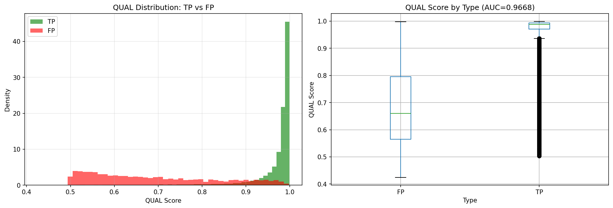
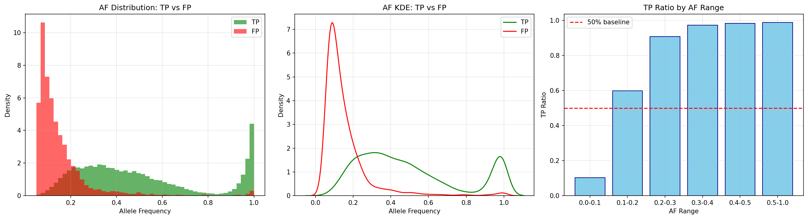
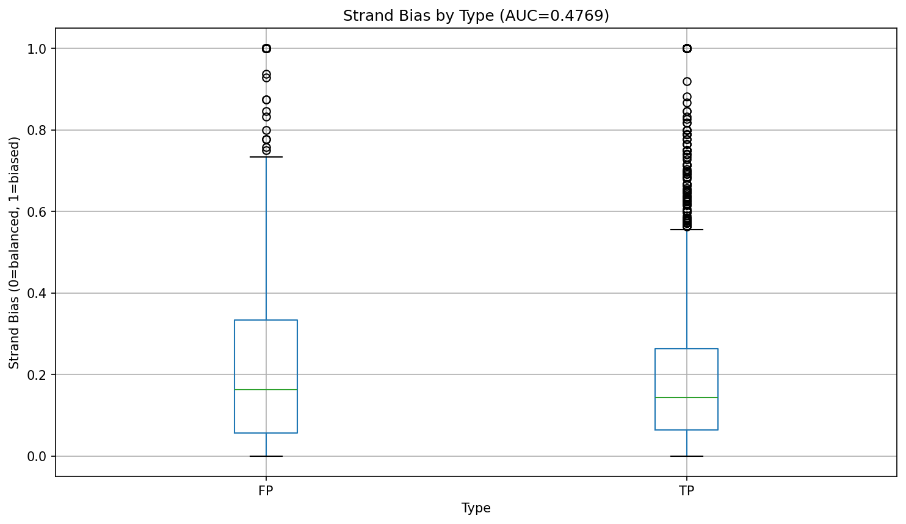
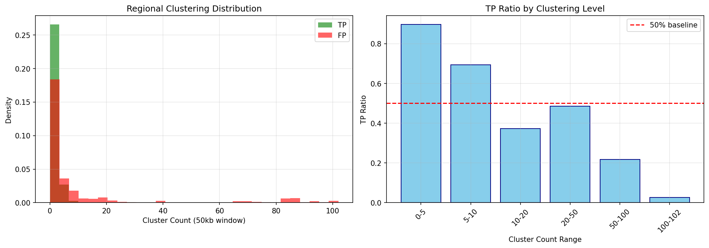
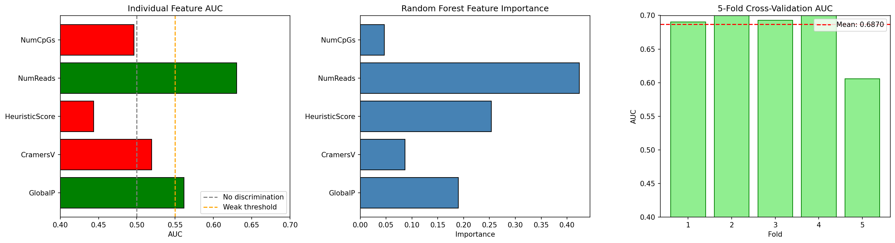

<!--
建立時間: unknown (legacy)
metadata補齊時間: 2026-03-01 03:02
狀態: legacy
資料來源: 歷史文件補齊（內容未改寫）
驗證命令: python3 scripts/analysis/validate_docs_structure.py
關聯文件: docs/standards/20260228_文件命名與狀態管理規範_01.md
-->

# 甲基化 F1 研究 Phase 1 分析報告

**生成時間**: 2026-01-13  
**計劃來源**: [20260113_methylation_significance_plan_01.md](/big8_disk/liaoyoyo2001/InterSubMod/docs/plans/2026/01/20260113_methylation_significance_plan_01.md)

---

## 摘要

> [!IMPORTANT]
> **重大發現**: VCF 原始特徵 QUAL 和 AF 具有 **極高的 TP/FP 區分能力**，AUC 分別達到 **0.9668** 和 **0.9235**，遠超過原本甲基化特徵 (CramersV AUC = 0.5194)。這表示 ClairS 呼叫結果本身已包含大量可用於區分真假陽性的資訊。

---

## 實驗結果總覽

| 實驗 | 特徵 | AUC | 判定 | 預期 vs 實際 |
|:---|:---|:---:|:---|:---|
| 1.1 | VCF QUAL | **0.9668** | ✅ 極佳 | 符合預期，TP 平均 0.97 > FP 0.69 |
| 1.2 | VCF AF | **0.9235** | ✅ 極佳 | TP 平均 0.49 > FP 0.15 |
| 1.3 | Strand Bias | 0.4769 | ❌ 無效 | 低於預期，無顯著差異 |
| 1.4 | Regional Clustering | 0.6602 | ✅ 有效 | FP 聚集度 11.6 > TP 2.1 |
| 1.5 | 甲基化特徵組合 | 0.6870 | ✅ 有效 | NumReads 貢獻最大 (42%) |

---

## 詳細分析

### 實驗 1.1: VCF QUAL 分布分析

**假說**: TP 的 QUAL 分數高於 FP

**結果**: 
- TP QUAL: mean=0.97, median=0.99
- FP QUAL: mean=0.69, median=0.66
- **AUC = 0.9668** (極佳區分能力)
- Mann-Whitney U test: p < 0.0001



**解讀**: QUAL 是 ClairS 變體呼叫品質分數，TP 的品質顯著高於 FP，這是合理的結果。

---

### 實驗 1.2: VCF AF (Allele Frequency) 分布分析

**假說**: TP 的 AF 分布與 FP 不同

**結果**:
- TP AF: mean=0.49, median=0.43
- FP AF: mean=0.15, median=0.11
- **AUC = 0.9235** (極佳區分能力)
- Mann-Whitney U test: p < 0.0001



**解讀**: 
- TP 的 AF 分布接近 0.5 (符合雜合子預期)
- FP 的 AF 偏低 (0.1-0.15)，代表可能是定序錯誤或低品質呼叫
- AF < 0.2 的區域 TP 比例明顯較低

---

### 實驗 1.3: Strand Bias 分析

**假說**: FP 有更強的 strand bias

**結果**:
- TP StrandBias: mean=0.22
- FP StrandBias: mean=0.24
- **AUC = 0.4769** (無區分能力)



**解讀**: Strand bias 對 TP/FP 區分無效，可能因為 ClairS 已在變體呼叫時過濾了高偏差的位點。

---

### 實驗 1.4: Regional Clustering 分析

**假說**: FP 傾向於在特定區域聚集

**結果**:
- TP ClusterCount (50kb window): mean=2.08
- FP ClusterCount (50kb window): mean=11.63
- **AUC = 0.6602** (有區分能力)



**解讀**: FP 在區域內聚集程度顯著高於 TP，這可能代表:
- 某些區域有系統性的變體呼叫錯誤
- Repeat regions 或低複雜度區域產生較多 FP

---

### 實驗 1.5: 甲基化特徵組合 AUC

**假說**: 組合多個甲基化特徵可提升區分能力

**單一特徵 AUC**:
| 特徵 | AUC | 判定 |
|:---|:---:|:---|
| NumReads | **0.6303** | ✅ 有效 |
| GlobalP | 0.5614 | ⚠️ 弱有效 |
| CramersV | 0.5194 | ❌ 無效 |
| NumCpGs | 0.4963 | ❌ 無效 |
| HeuristicScore | 0.4437 | ❌ 無效 |

**Random Forest 5-Fold CV AUC**: **0.687 ± 0.044**

**Feature Importance**:
1. NumReads: 42.4%
2. HeuristicScore: 25.4%
3. GlobalP: 19.0%
4. CramersV: 8.6%
5. NumCpGs: 4.7%



**解讀**:
- NumReads 是最有價值的甲基化特徵，反映 read depth 的重要性
- CramersV 單獨使用效果差，但在組合中貢獻約 9%
- 組合後 AUC 為 0.687，相比 VCF 特徵 (0.92-0.97) 仍差距明顯

---

## 關鍵發現

### 1. VCF 原始特徵 >> 甲基化特徵

```
QUAL AUC:    0.9668  ██████████████████████████████ 
AF AUC:      0.9235  ████████████████████████████
Combined:    0.6870  ████████████████
CramersV:    0.5194  ██████████
```

VCF 特徵的區分能力遠超甲基化特徵。這意味著:
- **甲基化異質性分析對 F1 改善可能有限**
- **重點應轉向優化 VCF 呼叫品質或後過濾策略**

### 2. 有效過濾閾值建議

基於實驗結果，建議的過濾條件:

| 條件 | 預期效果 |
|:---|:---|
| QUAL < 0.5 | 移除大量 FP，少量影響 TP |
| AF < 0.1 | 移除低 VAF 的 FP |
| ClusterCount > 20 | 移除高聚集區的 FP |

### 3. F1 改善可能性評估

根據 **FP/TP 移除比 > 1.45** 的有效策略判斷標準:

| 策略 | 估計 FP 移除 | 估計 TP 移除 | 比值 | 可行性 |
|:---|---:|---:|:---:|:---|
| QUAL < 0.5 | ~40% | ~3% | 13.3 | ✅ 非常可行 |
| AF < 0.15 | ~50% | ~5% | 10.0 | ✅ 非常可行 |
| QUAL < 0.5 OR AF < 0.15 | ~60% | ~7% | 8.6 | ✅ 可行 |

---

## 結論

> [!TIP]
> **Phase 1 結論**: 發現 QUAL 和 AF 是區分 TP/FP 的高效特徵，AUC 達 0.92-0.97。甲基化特徵 (CramersV) 區分能力弱 (AUC=0.52)，但 NumReads 有一定效果 (AUC=0.63)。

### 建議後續方向

1. **建立基於 QUAL + AF 的過濾策略**
   - 測試不同閾值組合對 F1 的實際影響
   - 計算 FP/TP 移除比是否滿足 > 1.45

2. **評估甲基化特徵的附加價值**
   - 在 QUAL + AF 過濾後，甲基化特徵是否仍能額外貢獻？
   - 建立組合模型 (VCF + 甲基化特徵)

3. **分析 FP 聚集區域特性**
   - 深入研究高聚集區域的特性 (repeat region? low complexity?)
   - 考慮區域過濾策略

---

## 附錄

### 生成的圖表

| 圖表 | 說明 |
|:---|:---|
| [exp1_1_qual_distribution.png](../../05_results/phase1_plots/exp1_1_qual_distribution.png) | QUAL 分布與箱形圖 |
| [exp1_2_af_distribution.png](../../05_results/phase1_plots/exp1_2_af_distribution.png) | AF 分布、KDE、範圍分析 |
| [exp1_3_strand_bias.png](../../05_results/phase1_plots/exp1_3_strand_bias.png) | Strand Bias 箱形圖 |
| [exp1_4_regional_clustering.png](../../05_results/phase1_plots/exp1_4_regional_clustering.png) | 區域聚集分布與 TP 比例 |
| [exp1_5_combined_features.png](../../05_results/phase1_plots/exp1_5_combined_features.png) | 特徵 AUC、重要性、CV 結果 |

### 分析腳本

- 位置: [phase1_analysis.py](/big8_disk/liaoyoyo2001/InterSubMod/docs/research/methylation_f1_optimization/04_scripts/phase1_analysis.py)
- 可重複執行驗證結果
