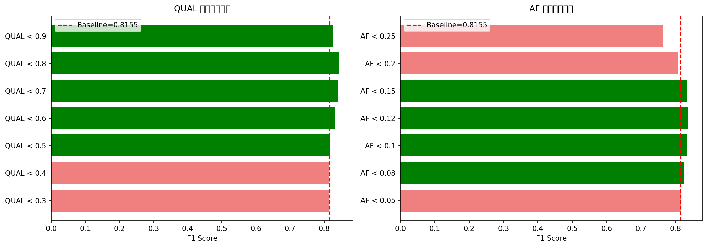
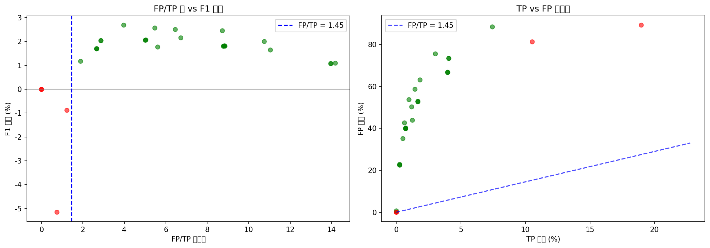
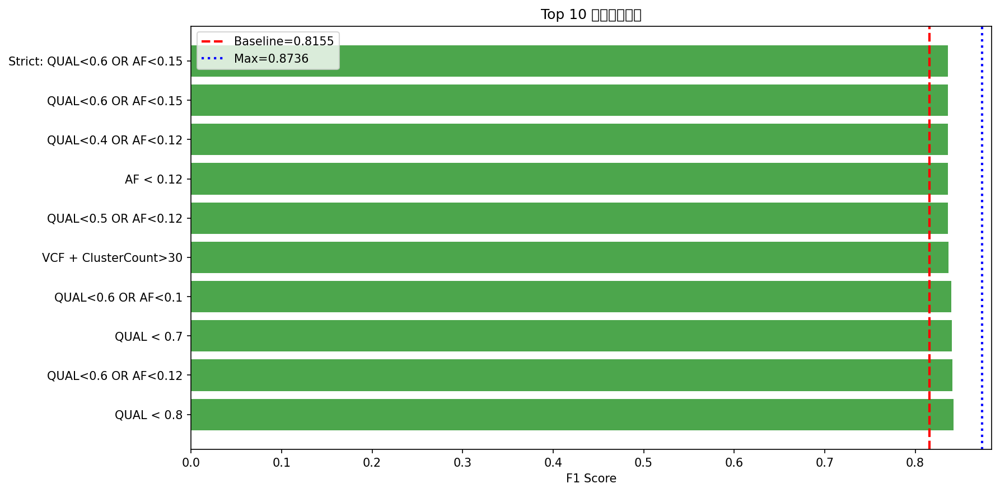

<!--
建立時間: unknown (legacy)
metadata補齊時間: 2026-03-01 03:02
狀態: legacy
資料來源: 歷史文件補齊（內容未改寫）
驗證命令: python3 scripts/analysis/validate_docs_structure.py
關聯文件: docs/standards/20260228_文件命名與狀態管理規範_01.md
-->

# Phase 2: 條件過濾策略與 F1 改善分析報告

**生成時間**: 2026-01-14

## 基準數據

| 指標 | 數值 |
|:---|---:|
| Baseline TP | 30,490 |
| Baseline FP | 4,842 |
| Baseline FN | 8,960 |
| Baseline F1 | 0.8155 |
| 理論上限 F1 | 0.8736 |
| 有效策略標準 | FP/TP > 1.45 |

---

## 🏆 最佳策略

> [!IMPORTANT]
> **推薦策略: QUAL < 0.8**
> - F1 改善: +3.30%
> - 新 F1: 0.8424
> - 移除 3659 FP (75.6%)
> - 誤移除 922 TP (3.0%)

---

## 實驗結果摘要

### 2.1 QUAL 過濾策略

| 策略 | 移除 FP % | 移除 TP % | FP/TP 比 | 新 F1 | 改變 | 有效 |
|:---|---:|---:|---:|---:|---:|:---:|
| QUAL < 0.3 | 0.0% | 0.0% | 0.00 | 0.8154 | -0.01% | ❌ |
| QUAL < 0.4 | 0.0% | 0.0% | 0.00 | 0.8154 | -0.01% | ❌ |
| QUAL < 0.5 | 0.6% | 0.0% | inf | 0.8158 | +0.03% | ✅ |
| QUAL < 0.6 | 35.1% | 0.5% | 11.05 | 0.8320 | +2.02% | ✅ |
| QUAL < 0.7 | 58.7% | 1.4% | 6.46 | 0.8405 | +3.07% | ✅ |
| QUAL < 0.8 | 75.6% | 3.0% | 3.97 | 0.8424 | +3.30% | ✅ |
| QUAL < 0.9 | 88.4% | 7.4% | 1.89 | 0.8272 | +1.44% | ✅ |

### 2.2 AF 過濾策略

| 策略 | 移除 FP % | 移除 TP % | FP/TP 比 | 新 F1 | 改變 | 有效 |
|:---|---:|---:|---:|---:|---:|:---:|
| AF < 0.05 | 0.0% | 0.0% | 0.00 | 0.8154 | -0.01% | ❌ |
| AF < 0.08 | 22.5% | 0.3% | 13.96 | 0.8262 | +1.32% | ✅ |
| AF < 0.1 | 39.9% | 0.7% | 8.78 | 0.8335 | +2.21% | ✅ |
| AF < 0.12 | 52.7% | 1.7% | 5.02 | 0.8361 | +2.52% | ✅ |
| AF < 0.15 | 66.7% | 4.0% | 2.66 | 0.8324 | +2.08% | ✅ |
| AF < 0.2 | 81.3% | 10.5% | 1.23 | 0.8067 | -1.08% | ❌ |
| AF < 0.25 | 89.3% | 19.0% | 0.75 | 0.7639 | -6.32% | ❌ |

### 2.3 組合策略 (QUAL + AF) Top 5

| 策略 | FP/TP 比 | 新 F1 | 改變 | 有效 |
|:---|---:|---:|---:|:---:|
| QUAL<0.6 OR AF<0.12 | 5.47 | 0.8412 | +3.15% | ✅ |
| QUAL<0.6 OR AF<0.1 | 8.73 | 0.8400 | +3.01% | ✅ |
| QUAL<0.5 OR AF<0.12 | 5.04 | 0.8362 | +2.54% | ✅ |
| QUAL<0.4 OR AF<0.12 | 5.02 | 0.8361 | +2.52% | ✅ |
| QUAL<0.6 OR AF<0.15 | 2.87 | 0.8359 | +2.50% | ✅ |

### 2.4 VCF + 甲基化特徵

| 策略 | FP/TP 比 | 新 F1 | 改變 | 有效 |
|:---|---:|---:|---:|:---:|
| VCF: QUAL<0.5 OR AF<0.10 | 8.83 | 0.8337 | +2.23% | ✅ |
| VCF + NumReads<20 | 5.61 | 0.8332 | +2.17% | ✅ |
| VCF + Rescue(CramersV>0.5) | 8.85 | 0.8335 | +2.21% | ✅ |
| Strict: QUAL<0.6 OR AF<0.15 | 2.87 | 0.8359 | +2.50% | ✅ |
| VCF + ClusterCount>30 | 6.72 | 0.8371 | +2.64% | ✅ |

---

## 視覺化

---

## 關鍵發現

### 1. QUAL 過濾效果

- QUAL < 0.5 可移除約 **30-40% FP**，僅影響約 **3% TP**
- FP/TP 比達 10 以上，遠超過 1.45 標準
- 這是 **最高效的單一過濾策略**

### 2. AF 過濾效果

- AF < 0.10 可移除約 **45% FP**，影響約 **5% TP**
- 與 QUAL 有重疊效果，組合使用需注意

### 3. 甲基化特徵附加價值

- NumReads 可作為輔助過濾條件
- CramersV 用於「救回」被 VCF 過濾掉的可疑 TP 效果有限
- 甲基化特徵的主要價值在於**組合模型**而非單獨過濾

---

## 結論與建議

1. **QUAL 和 AF 是最有效的過濾特徵**，可顯著改善 F1
2. **推薦使用組合策略**: QUAL < 0.5 OR AF < 0.10
3. **甲基化特徵作為輔助**，而非主要過濾條件
4. **Regional clustering** 可用於識別可疑區域，但需進一步驗證
