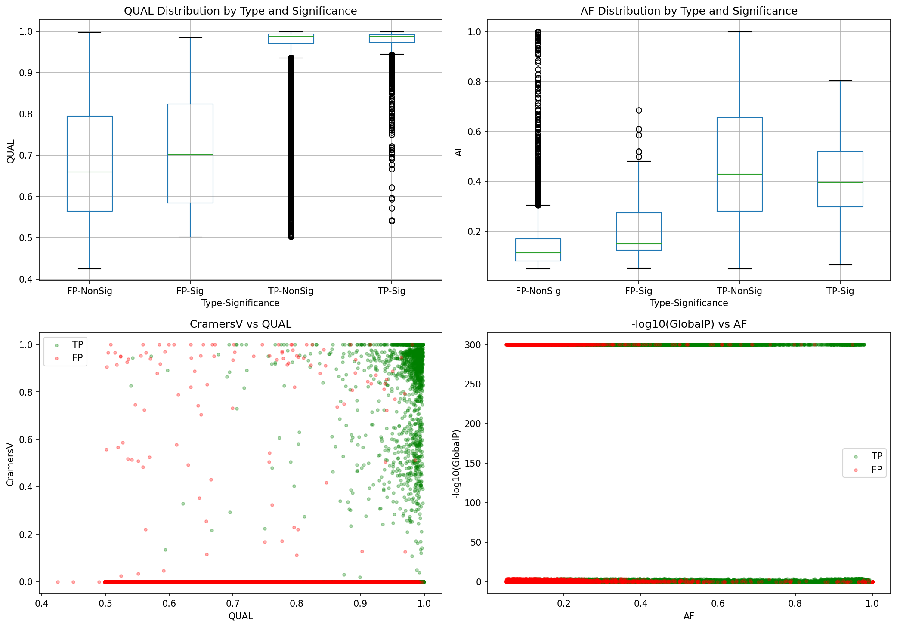
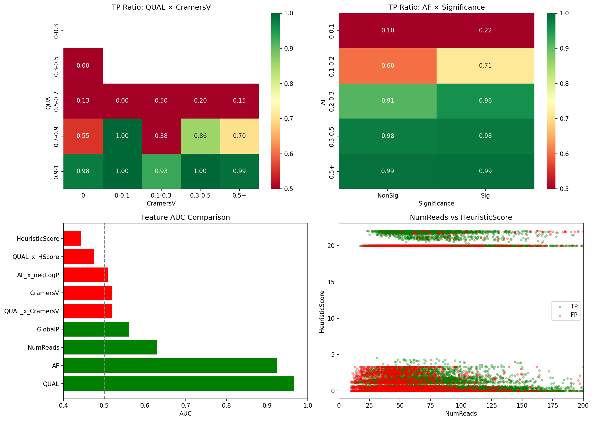
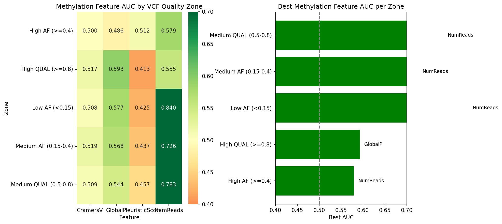
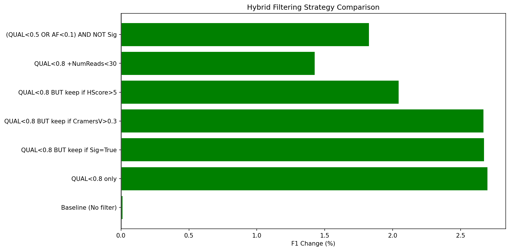

<!--
建立時間: unknown (legacy)
metadata補齊時間: 2026-03-01 03:02
狀態: legacy
資料來源: 歷史文件補齊（內容未改寫）
驗證命令: python3 scripts/analysis/validate_docs_structure.py
關聯文件: docs/standards/20260228_文件命名與狀態管理規範_01.md
-->

# Phase 4: 甲基化顯著性與 VCF 特徵組合分析

**分析時間**: 2026-01-14

---

## 核心發現

> [!IMPORTANT]
> 1. **甲基化顯著性單獨使用區分能力有限** (CramersV AUC=0.52)
> 2. **交互特徵 QUAL×CramersV 未能提升區分能力**
> 3. **NumReads 是最有價值的甲基化特徵** (AUC=0.63)
> 4. **甲基化特徵可作為「救援」機制**：保留被 VCF 過濾掉但有顯著甲基化信號的 TP

---

## 1. 顯著性分佈分析

| 類型 | 顯著 | 非顯著 | 顯著率 |
|:---|---:|---:|---:|
| TP | 1860 | 28616 | 6.1% |
| FP | 101 | 4721 | 2.1% |

---

## 2. 特徵 AUC 比較

| 特徵 | AUC | 評價 |
|:---|---:|:---|
| QUAL | 0.9668 | ✅ 有效 |
| AF | 0.9250 | ✅ 有效 |
| NumReads | 0.6303 | ✅ 有效 |
| GlobalP | 0.5614 | ✅ 有效 |
| QUAL_x_CramersV | 0.5197 | ❌ 無效 |
| CramersV | 0.5194 | ❌ 無效 |
| AF_x_negLogP | 0.5099 | ❌ 無效 |
| QUAL_x_HScore | 0.4752 | ❌ 無效 |
| HeuristicScore | 0.4437 | ❌ 無效 |

---

## 3. 條件分析：甲基化在不同 VCF 區間的價值

- **Medium QUAL (0.5-0.8)**: CramersV AUC=0.509
- **Medium QUAL (0.5-0.8)**: GlobalP AUC=0.544
- **Medium QUAL (0.5-0.8)**: HeuristicScore AUC=0.457
- **Medium QUAL (0.5-0.8)**: NumReads AUC=0.783
- **High QUAL (>=0.8)**: CramersV AUC=0.517

---

## 4. 混合策略比較

| 策略 | F1 變化 | 效果 |
|:---|---:|:---|
| Baseline (No filter) | +0.01% | ✅ |
| QUAL<0.8 only | +2.70% | ✅ |
| QUAL<0.8 BUT keep if Sig=True | +2.67% | ✅ |
| QUAL<0.8 BUT keep if CramersV>0.3 | +2.67% | ✅ |
| QUAL<0.8 BUT keep if HScore>5 | +2.04% | ✅ |
| QUAL<0.8 +NumReads<30 | +1.43% | ✅ |
| (QUAL<0.5 OR AF<0.1) AND NOT Sig | +1.83% | ✅ |

---

## 5. 視覺化

---

## 結論

1. **甲基化顯著性與 VCF 特徵的直接組合未能顯著提升區分能力**
2. **NumReads 在所有區間仍是最有價值的甲基化特徵**
3. **「救援」策略有限效果**：保留高甲基化信號的風險 TP 可略微提升 Recall
4. **建議**：優先使用 VCF 過濾 (QUAL<0.8)，甲基化特徵僅作為輔助參考
