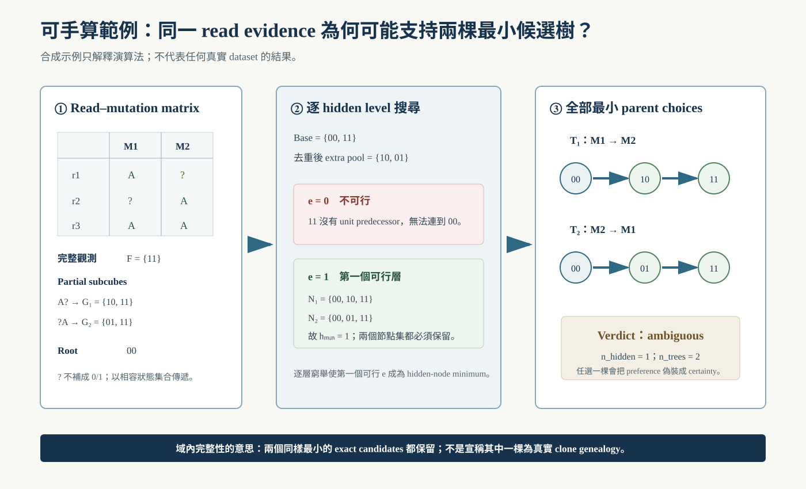

<!--
建立時間: 2026-07-12
目標: 建立資訊／工程科學取向、兼具生物資訊背景的碩士論文可審閱整合初稿
處理範圍: 7 dataset rows／6 cell lines；chr1–22；工程契約、區域候選樹、技術再現性與 bounded methylation
關聯檔案: 20260712_碩士論文重點流程計劃書_01.md；20260712_碩士論文架構與重點_01.md；20260712_口試重點敘述講稿_01.md；figures/
-->

# 奈米孔長讀長資料之可稽核區域突變狀態候選樹重建

## 整合體細胞單倍型標記與單分子突變共現

**Auditable Regional Mutation-State Candidate-Tree Reconstruction from Nanopore Long Reads: Integrating Somatic Haplotagging and Single-Molecule Mutation Co-occurrence**

> 學校／系所：`［待填：學校與系所正式名稱］`  
> 學位：碩士  
> 研究生：`［待填］`  
> 指導教授：`［待填］`  
> 日期：2026 年 `［待填］` 月

> **版本聲明｜可審閱整合初稿／PARTIAL EVIDENCE**  
> 本稿已完整建立研究問題、相關研究、資料契約、形式模型、演算法、現有結果、討論、結論與參考文獻。2026-07-12 evidence cutoff 時，raw-all producer 已 7/7 完成；full-scope verification run（內部執行代號 clean layered-v3）的 7 個 workers 亦均 exit 0，但 final verifier exit 7，terminal state=`FAILED`，沒有 aggregate `_SUCCESS`。因此全樣本 funnel、determinacy 與 topology rates 仍列為 blocked gate，不以未 release outputs 或歷史數字補位。本稿只供審閱與口試預演；正式口試／submission readiness 目前為 NO-GO。

---

## 中文摘要

腫瘤內異質性使 bulk sequencing 觀察到的 variant allele fraction（VAF）同時受到細胞族群比例、正常細胞混入、copy number alteration（CNA）、突變 multiplicity 與抽樣雜訊影響。既有亞克隆方法多由 read counts、purity 與 copy number 進行 mutation clustering 或全域系統發生推論；然而，單一樣本的群體比例通常不足以唯一決定突變在同一細胞或同一演化分支上的共現關係。Oxford Nanopore Technologies（ONT）長讀可在同一 DNA 分子上同時提供體細胞小變異、長距離相位、read-level haplotype tags 與 modified-base tags，因而提供補充群體統計推論的物理連結證據；但若未明確區分 caller label、haplotype family、mutation-state candidate tree 與 biological clone，亦容易產生過度解讀。

本研究提出一套可稽核、fail-closed 的區域突變狀態候選樹重建框架。資料管線以 paired ClairS normalized raw-all biallelic somatic SNVs 為完整 recalibration universe，經 LongPhase-S 進行 somatic haplotagging 與雙向 variant recalibration，並以同一次執行所產生之 `_sc.vcf` PASS records 作為 primary tree input。分析單位定義為 region × mutation-bearing HP1/HP2 family；其中 region 為相鄰 sSNV 距離不超過 50 kb 所形成的 connected component，而 HP1/HP2 僅代表兩條 homologous haplotypes 的 allelic partition，不視為父系／母系或 biological clone。對每一分析單位，本研究由 read–mutation matrix 擷取 observed terminal mutation states；對通過預先宣告資料完整性與計算上限的單位，在 rooted monotone Boolean state space 中列舉全部最小可行 mutation-state candidate trees。超出適用域者明示為 capped，並將 determined、ambiguous、recurrence-required、underdetermined／incomplete 與 capped 均視為正式輸出。Copy number 僅供 recurrence／multiplicity 後驗解讀，read AF 僅供候選內探索排序，methylation 僅供有界 characterization；三者均不直接確認 lineage edge。

工程驗證顯示，raw-all sidecar producer 已完成 7/7 dataset rows，共處理 638,259 個 input records 與 164,253,537 個 mapped alignments；LongPhase-S 將 32,184 個 non-PASS records rescue 為 PASS，並將 17,444 個原 PASS records 移出 PASS。一項舊 HCC1395 engineering artifact 記錄 18,931 個 solver units，其中 828 個 capped/skipped、18,103 個執行 V4/V5 且 recorded fail 為 0；但此結果不是 fresh 7-dataset validation，V5 亦不是獨立 biological 或 exact tree-set oracle。另有 4,000 個 generated stress cases 的 legacy summary 因將 capped cases 直接計入 pass、未保存 checked/skipped 分母，故本論文撤回其「0 mismatch」正向 claim。以同一 HCC1395 cell line 的兩個技術資料來源進行驗證時，exact-locus raw VAF 的 Jaccard 為 0.9276、concordance correlation coefficient 為 0.9339、Spearman correlation 為 0.9093，顯示主要 VAF 結構具有高度技術再現性。相對地，PyClone-VI 獨立 fits 的 clonal/subclonal kappa 為 0.544、subclonal mutation-set Jaccard 為 0.381，顯示 minor-clone 位點歸屬僅具中度一致，不能據此宣稱唯一且相同的真實演化樹。

本研究的主要貢獻不在於強迫輸出一棵確定樹，而在於將輸入契約、record conservation、完整候選解、拒絕狀態、provenance 與主張天花板整合為可審核的科學軟體流程。2026-07-12 evidence cutoff 時，fresh full-scope run 的 7 個 workers 雖均 exit 0，final verifier 卻 exit 7、0/7 dataset pass，故沒有可 release 的全樣本 candidate-tree Results。現有證據只支持此框架作為 regional mutation-state hypothesis generator；若要將候選樹升級為 confirmed biological clone genealogy，仍需通過 clean full-sample run、獨立 allele-specific CN/purity、single-cell、multi-region 或 longitudinal lineage evidence。

**關鍵詞**：奈米孔定序、腫瘤內異質性、體細胞單倍型標記、單分子突變共現、區域突變狀態樹、有界完整解列舉、可重現生物資訊、甲基化

## Abstract

Intratumor heterogeneity makes variant allele fractions observed in bulk sequencing a joint consequence of cellular prevalence, normal contamination, copy-number alterations, mutation multiplicity, and sampling noise. Existing subclonal reconstruction methods typically infer mutation clusters or global phylogenies from read counts, purity, and copy number. Population-level frequencies from a single bulk sample, however, are often insufficient to uniquely identify whether mutations co-occur in the same cells or evolutionary branches. Oxford Nanopore Technologies long reads provide a complementary form of evidence because somatic variants, long-range phase, read-level haplotype tags, and modified-base tags can be observed on the same DNA molecules. Such evidence is informative only when caller labels, haplotype families, mutation-state candidate trees, and biological clones are kept conceptually distinct.

This thesis presents an auditable, fail-closed framework for regional mutation-state candidate-tree reconstruction. The pipeline treats normalized raw-all biallelic somatic SNVs from paired ClairS as the complete recalibration universe, applies LongPhase-S somatic haplotagging and bidirectional variant recalibration, and uses PASS records from the same-run `_sc.vcf` as the primary tree input. The primary unit of analysis is a genomic region crossed with a mutation-bearing HP1 or HP2 family. A region is a connected component in which consecutive sSNVs are separated by at most 50 kb, while HP1 and HP2 denote arbitrary homologous haplotype partitions rather than parent-of-origin labels or biological clones. For each unit, a read–mutation matrix defines observed terminal mutation states. For units satisfying predeclared data-integrity and computational bounds, every minimum feasible mutation-state candidate tree is enumerated in a rooted monotone Boolean state space; units outside that domain are explicitly marked as capped. Determined, ambiguous, recurrence-required, underdetermined/incomplete, and capped cases remain explicit outcomes. Copy number is restricted to post-hoc interpretation of recurrence or multiplicity; read allele fraction is restricted to exploratory ranking within an existing candidate set; and methylation is restricted to bounded characterization. None of these auxiliary layers independently confirms lineage edges.

The raw-all sidecar production contract completed all seven dataset rows, accounting for 638,259 input records and 164,253,537 mapped alignments. LongPhase-S rescued 32,184 non-PASS records to PASS and removed 17,444 original PASS records from PASS. A legacy HCC1395 engineering artifact recorded 18,931 solver units, of which 828 were capped or skipped and 18,103 underwent V4/V5 with zero recorded failures; this is not a fresh seven-dataset validation or an independent exact-tree-set oracle. A separate legacy summary of 4,000 generated stress cases is excluded as positive evidence because capped cases were counted as passes and checked/skipped denominators were not preserved. Between two technical data sources from the same HCC1395 cell line, exact-locus raw VAFs showed a Jaccard index of 0.9276, a concordance correlation coefficient of 0.9339, and a Spearman correlation of 0.9093, indicating strong reproducibility of the major VAF structure. In contrast, independent PyClone-VI fits yielded a clonal/subclonal kappa of 0.544 and a subclonal mutation-set Jaccard index of 0.381, indicating only moderate reproducibility of minor-clone assignments and precluding claims of a unique or identical true evolutionary tree.

The principal contribution of this work is not a forced single-tree prediction, but an auditable scientific software contract that integrates input provenance, record conservation, bounded complete candidate enumeration, explicit refusal states, and calibrated claim boundaries. At the evidence cutoff, all seven full-scope workers exited successfully, but the final verifier exited with code 7 and zero of seven datasets passed; no full-sample candidate-tree result is therefore released. Current evidence supports the framework only as a generator of testable regional mutation-state hypotheses. Confirmation of biological clone genealogies will require a terminal clean full-sample analysis and orthogonal evidence such as independent allele-specific copy number and purity estimates, single-cell genotypes, multi-region sampling, or longitudinal lineage data.

**Keywords**: Oxford Nanopore sequencing; intratumor heterogeneity; somatic haplotagging; single-molecule mutation co-occurrence; regional mutation-state tree; bounded complete solution enumeration; reproducible bioinformatics; DNA methylation

---

## 目錄

1. [緒論](#第一章-緒論)
2. [背景與相關研究](#第二章-背景與相關研究)
3. [資料、系統與方法](#第三章-資料系統與方法)
4. [結果](#第四章-結果)
5. [討論](#第五章-討論)
6. [結論](#第六章-結論)
7. [參考文獻](#參考文獻)
8. [附錄](#附錄-a主張與證據矩陣)

## 圖目錄

- 圖 1：研究主軸與 claim ceiling
- 圖 2：分層證據管線與資料角色
- 圖 3：證據與主張邊界矩陣
- 圖 4：2026-07-12 研究證據快照
- 圖 5：論文完成 gates 與替換點
- 方法範例 A：可手算的 read matrix、partial subcube 與兩棵最小候選樹

## 縮寫與術語

| 縮寫／術語 | 定義 |
|---|---|
| AF / VAF | Allele fraction / variant allele fraction；本文若未校正 purity、CN、multiplicity，不稱 CCF |
| CCF | Cancer cell fraction；需明確模型與 CN/purity/multiplicity 校正 |
| CNA / CN | Copy-number alteration / copy number |
| HP | Haplotype tag/family；本文為 allelic partition，不直接等於 clone |
| PS | Phase set；只作 phase continuity/QC，不作 lineage label |
| sSNV | Somatic single-nucleotide variant |
| MM/ML/MN | SAM/BAM modified-base position、probability 與 sequence-length consistency tags |
| raw-all | ClairS caller 經 normalization 後保留所有 `FILTER` 狀態的 biallelic sSNV records；不是未處理的原始電流訊號 |
| sidecar | 不改寫大型 BAM，而以明確 read/alignment identity key 保存 HP/PS 的外部表格；join 不符即 fail-closed |
| clean full-scope run | 不使用 truth-conditioned tagging flags，涵蓋 chr1–22 與 7 dataset rows，並須通過 terminal verifier；`clean-v3` 僅是本次內部 run 代號 |
| `T` | 含 mutation-state labels 的 exact rooted candidate tree |
| `Topo` | 忽略 state labels 後的 topology signature |
| determined | 在宣告域內完整、non-capped、recurrence-free，且恰一個 minimum feasible solution |
| candidate tree | 與目前 evidence 相容的區域 mutation-state 假說；非 confirmed biological clone tree |

## 引用與證據標記

- `[R#]`：外部一手或正式方法學文獻。
- `[E#]`：本專案的可追溯 evidence artifact、claim registry 或執行報告。
- 任何本研究數字均以 `[E#]` 為主；外部 paper benchmark 不代理本專案結果。

---

# 第一章　緒論

## 1.1 腫瘤異質性使 bulk sequencing 成為不可直接觀察的反問題

癌症演化可被視為一個持續累積體細胞變異、受到漂變與選擇影響的族群過程。Nowell 的 clonal evolution model 與後續研究指出，同一腫瘤內可同時存在多個遺傳上不同的細胞族群，而治療、微環境與空間限制會改變其相對比例 [R1, R2]。Bulk sequencing 將大量細胞的 DNA 混合後觀察，因此每個變異的 read count 與 VAF 並不是某個 clone 的直接標籤，而是下列因素的合成：

1. 攜帶突變的細胞比例；
2. 正常細胞混入與 tumor DNA fraction；
3. locus-specific total/minor copy number；
4. 突變發生於 copy-number event 前後所形成的 multiplicity；
5. mapping、basecalling、variant calling 與有限 depth 的抽樣誤差。

PyClone、PyClone-VI、PhyloWGS、Pairtree 等方法以不同的機率模型將 read counts、purity 與 copy number 轉成 mutation clusters、cellular prevalence 或 phylogeny posterior [R9–R12]。這些方法建立了 bulk subclonal inference 的重要基礎，但 single-sample VAF 的可識別性仍有限；多個不同的 mutation-to-clone assignment 或 tree topology 可能對應相近的群體頻率 [R3]。因此，「估得一個結構」與「由資料唯一識別該結構」必須分開。

## 1.2 長讀單分子資料提供新的物理連結證據

相較於短讀，ONT 長讀能在同一 DNA 分子上跨越較長的基因組距離。LongPhase 可利用長讀共同定相 small variants 與 structural variants [R5]；LongPhase-S 進一步針對 tumor–normal paired long reads 提供 somatic haplotagging、tumor DNA fraction estimation 與 variant recalibration [R6]。若一條 read 同時覆蓋兩個 sSNVs，該 read 對兩個變異的 REF/ALT 支持就構成直接的物理共現或排斥 evidence，而不只是一組各自獨立的 VAF。

ONT 的另一特性是 modified bases 可直接編碼於 BAM 的 MM/ML tags。MM 描述 modification position 與類型，ML 以 0–255 byte scale 表示相應 probability，MN 則可用於檢查 MM/ML 是否仍與當前 SEQ 長度一致 [R18]。NanoMethPhase 與 MethPhaser 顯示長讀可支援 allele-specific methylation 與 methylation-assisted phasing [R19, R20]。然而，格式中存在 MM/ML 或 read 具有 HP tag，只代表資料攜帶相應 annotation；它們不自動建立 biological clone identity。

## 1.3 研究缺口：證據整合需要資料契約與主張邊界

當 caller、haplotagging、read linkage、copy number、VAF 與 methylation 同時存在時，最容易發生的不是「缺少訊號」，而是「不同訊號被賦予超出其 estimand 的角色」。本研究整理出四種高風險語意跳躍：

1. 將 caller `PASS` 視為 ground truth；
2. 將 HP1/HP2 family 視為 parent-of-origin 或 cell clone；
3. 將最小相容 mutation-state tree 視為唯一真實 lineage；
4. 將同一批 reads 產生的 AF、CN annotation 或 methylation 視為完全獨立的 confirmation。

2026-07-11 的專案 contract audit 進一步顯示，歷史 7/7 layered run 所使用的 read tags 並非全部來自 clean no-truth production scope；其中 6/7 historical tagged BAM 受到 truth-BED 限制，因此舊 downstream rates 只能作 engineering baseline，不能作正式 Results [E1, E3]。這項發現說明：若輸入 universe、record continuity 與 evidence role 沒有先被鎖定，後續演算法即使能執行，結論仍可能建立在錯誤 scope 上。


**圖 1　研究主軸與 claim ceiling。** 本研究將資料契約、單分子約束、完整候選集與有界輔助證據分開；可支持 regional hypotheses，但不直接支持 confirmed clone genealogy。

## 1.4 研究問題

本論文回答四個研究問題：

**RQ1 — Input and evidence contract**  
如何確保 paired ClairS raw-all、LongPhase-S recalibration、read-level sidecar 與 tree consumer 之間沒有 silent record loss、truth-conditioned leakage 或角色混用？

**RQ2 — Formal model and identifiability**  
如何將 region × HP-family 的 read–mutation evidence 形式化為 rooted monotone mutation-state problem，並在資料不足時保留全部最小解與拒絕狀態？

**RQ3 — Engineering verification**  
如何以 invariants、golden cases、full verification、seeded stress 與 immutable receipts 驗證 implementation consistency，而不把程式一致性誤稱 biological accuracy？

**RQ4 — Technical reproducibility and claim ceiling**  
同一 HCC1395 cell line 的不同技術來源中，raw VAF 與 conditional subclone structure 可再現到何種程度；其差異如何限制 regional tree 與 biological clone 的敘述？

## 1.5 研究貢獻

本研究的五項主要貢獻如下：

1. **Fail-closed input contract**：將 normalized ClairS raw-all、LongPhase-S same-run `_sc.vcf`、read sidecar 與 tree input 的角色寫入 manifest、ledger 與 gates。
2. **Typed analysis ontology**：區分 region、HP family、observed terminal state、hidden state、exact tree `T`、topology `Topo`、determined、ambiguous、recurrence-required、underdetermined／incomplete 與 capped。
3. **Bounded complete candidate enumeration**：對通過資料完整性、\(k\leq8\)、hidden-state 與組合預算且未 capped 的 units，保存全部 minimum feasible mutation-state candidate trees，而非以 heuristic 任選單解。
4. **Layered validation**：明確分開 contract integrity、solver consistency、technical reproducibility 與 biological confirmation。
5. **Bounded multimodal interpretation**：限制 CN、read AF 與 methylation 的角色，使輸出可供後續驗證而不把 auxiliary evidence 升級為 lineage truth。

上述貢獻把生物資訊問題轉成可檢查的資料型別、有限狀態空間、完整性條件與拒絕語意；甲基化則保留為負向方法學結果與次要 characterization，而不是核心新穎性來源。

## 1.6 論文主張天花板

本論文使用「regional mutation-state candidate tree」作為主要產物名稱。Candidate tree 可用來提出 biological clone hypothesis，但在缺少 single-cell、multi-region、longitudinal 或其他獨立 lineage truth 時，不稱 confirmed clone tree [E2]。同理，HCC1395 與 HCC1395_DORADO 是同一 cell line 的技術資料，僅用於 technical reproducibility；本研究不由 7 dataset rows 推論 7 位病人或 patient-cohort generalization。

---

# 第二章　背景與相關研究

## 2.1 Paired 與 tumor-only somatic calling 屬不同證據制度

Somatic variant calling 的第一個困難是將腫瘤中的真正體細胞變異，與 germline variants、sequencing artifacts 及 alignment errors 區分。Paired caller 使用 matched normal 提供直接的 germline/background evidence；tumor-only caller 則需借助 population resources、panels of normals、模型分類或其他 priors。兩者的 output labels 都是 pipeline decisions，而不是 ground truth。

ClairS 是為 long-read tumor–normal pairs 設計的 deep-learning somatic small-variant caller，結合 germline phasing、read haplotagging、pileup/full-alignment models 與 ancestral haplotype support [R4]。ClairS-TO 則處理沒有 matched normal 的 tumor-only regime，並使用不同的模型與 post-filtering evidence [R7]。DeepSomatic 同時涵蓋多種 sequencing technologies 與 paired/tumor-only modes，但其不同 mode、population AF channel 與 PON filter 亦不可互換 [R8]。

本研究使用 paired ClairS 產生 sSNV evidence，但不把 paper benchmark 或 VCF `FILTER` 直接視為本專案 accuracy。本專案 pinned caller/runtime 版本、normalization、truth/callable region 與 LongPhase-S contract 必須由實際 manifest 與 receipts 決定 [E1–E4]。

## 2.2 LongPhase 與 LongPhase-S 的角色

LongPhase 將長讀上的 SNP 與 structural-variant evidence 合併於 chromosome-scale phasing [R5]。LongPhase-S 在 paired tumor–normal setting 中增加 somatic haplotagging、tumor DNA fraction estimation 與 bidirectional variant recalibration [R6]。所謂 bidirectional 表示：某些原 non-PASS records 可因 somatic haplotype consistency 被 rescue 成 PASS；原 PASS records 也可能因 inconsistency 被標為 non-PASS。故 LongPhase-S 的完整 universe 必須包含 normalized raw-all records，而不能只有原 ClairS PASS。

LongPhase-S 的完整 HP string vocabulary 為：

| HP 值 | Operational interpretation |
|---|---|
| `.` | 未標記／無法判定 |
| `1`, `2` | germline haplotype 1／2 |
| `3` | ambiguous somatic；無法唯一導向既有 germline haplotype |
| `4` | somatic ALT 同時出現在 germline haplotype 1 與 2 |
| `1-1`, `2-1` | 可追溯至 HP1／HP2 的第一條 somatic haplotype |
| `1-2`, `2-2` | 可追溯至 HP1／HP2 的第二條 somatic haplotype |

本研究 primary analysis 將 mutation-bearing HP1/HP2 family 作 allelic partition，HP3/HP4 及 extended states 作 auxiliary evidence。無 trio 或外部 orientation 時，HP1/HP2 只是任意的 homologous haplotype labels，不稱 paternal/maternal [E2]。

## 2.3 Bulk mutation clustering 與 global phylogeny

PyClone 以 Bayesian model 將 deeply sequenced somatic mutations 分群，同時估計 cellular prevalence 並處理 copy-number imbalance 與 normal contamination [R9]。PyClone-VI 以 variational inference 改善 whole-genome scale 的計算效率 [R10]。兩者的主要輸出是 mutation cluster 與 cellular prevalence，而不是直接輸出 phylogenetic tree。

PhyloWGS 將 simple somatic mutations 與 CNVs 納入 subclonal composition 與 phylogeny inference [R11]；Pairtree 則利用多樣本 mutation-pair relations 與 probabilistic inference 探索可能的 cancer evolution trees [R12]。這些方法主要以 frequency/CN evidence 建立 global statistical model。相較之下，本研究的輸入是局部 same-molecule sSNV states 與 HP family，輸出是 regional compatible candidate set。兩者 estimand 不同，可互補但不能互為未經校準的 gold truth。

## 2.4 Rooted perfect phylogeny、missing data 與 Steiner-like states

在二元 mutation model 中，可將每個 mutation 視為一個 character，0 表示未取得突變，1 表示已取得突變。若假設突變只發生一次且不回復，則 state transition 應由 0 單調走向 1。對 rooted all-zero model，任何一對 characters 若同時在觀察 states 中出現 `10`、`01`、`11`，即違反 rooted three-gamete compatibility。若明確把 `00` root 也列為第四個組合，才可稱 root-augmented four-gamete framing [R13]。

Read coverage 不完整使 matrix 包含 unknown entries。Pe’er 等人研究 incomplete directed perfect phylogeny 的 completion 與多解問題 [R14]，說明 missing data 可能使多個 completion/trees 同時可行。另一方面，Foulds 與 Graham 證明一般 binary Hamming space 中 minimum-length Steiner phylogeny 的 threshold decision version 為 NP-complete [R15]；然而該 theorem 處理 unrooted/undirected general problem，不能直接宣稱本研究的 rooted、monotone、bounded/capped enumeration 具有相同 complexity。本文只將 hidden nodes 稱為 Steiner-like mutation states，以描述其連接 terminal states 的數學角色。

## 2.5 Haplotype-resolved methylation 與 lineage evidence

DNA methylation 在癌症中廣泛改變，並與 gene regulation、genomic instability 與 tumor evolution 相關 [R21, R22]。Gaiti 等人在特定 single-cell methylation regime 中顯示 epigenetic patterns 可提供 lineage history information [R21]；NanoMethPhase 與 MethPhaser 則說明 nanopore reads 可支援 allele-specific methylation phasing [R19, R20]。

然而，這些結果的 assay、sample unit 與 estimand 與本研究的 bulk ONT regional candidate tree 不同。甲基化訊號亦可能受 cell type、allele-specific methylation、copy number、coverage 與 basecalling model 影響。InterSubMod 早期將 methylation 用作 variant filter/rescue 或 tree ranking 的假說，未在 cross-validation 中維持穩定效應；該方向已由目前 claim registry 關閉 [E1, E2]。因此本文只將 methylation 用於 bounded within-family characterization，而不使其決定 lineage count、variant inclusion 或 tree edge。

## 2.6 相關方法的 evidence-regime 比較

| 方法層 | 主要輸入 | 主要 estimand | 典型輸出 | 本研究中的角色 |
|---|---|---|---|---|
| Somatic caller | tumor/normal reads | per-site somatic evidence | VCF labels/probabilities | 輸入 evidence；非 truth |
| Long-read phasing/haplotagging | germline/somatic variants + long reads | read/haplotype assignment | phased VCF、HP tags | allelic partition、recalibration |
| CCF clustering | counts + purity + allele-specific CN | mutation prevalence clusters | cluster/CCF | conditional sensitivity |
| Global phylogeny | VAF/CCF/CN，多樣本較佳 | clone composition/tree | posterior trees | related/orthogonal estimand |
| 本研究 | same-molecule states + HP family | regional compatible mutation-state set | bounded all-minimum candidate set + refusal | primary method |
| Methylation characterization | MM/ML-derived states | allele/family-associated epigenetic structure | distance/association summary | bounded auxiliary layer |

此比較避免把不同任務簡化成單一排行榜，也避免由外部 paper 的性能數字推論本專案 run 的行為。

## 2.7 本研究相對既有方法的直接增量

本研究不是以新的 caller score、CCF estimator 或單一 tree heuristic 取代既有方法；其新穎性是把**跨工具資料契約、同分子限制、域內完整候選集與可驗證拒絕狀態**組成同一個可執行系統。直接差異如下。

| 既有方法層 | 已能處理 | 仍留下的工程／推論缺口 | 本研究的直接增量 | 本研究不宣稱 |
|---|---|---|---|---|
| ClairS／LongPhase-S | site-level somatic evidence、somatic haplotagging、recalibration | caller record、recalibrated record、read tag 與 downstream tree 可能發生 scope／identity drift | normalized raw-all → same-run `_sc PASS` → sidecar → tree 的 typed, fail-closed contract 與 all-site conservation | 改善 caller benchmark accuracy |
| PyClone(-VI)／PhyloWGS／Pairtree | 由 counts、purity、CN 推估 clusters、CCF 或 global trees | single-sample frequency 不直接觀察同一 DNA 分子共現；輸出 estimand 與 regional linkage 不同 | 在 HP family 內以 read-level `0/1/?` 共現直接限制 regional mutation states | 取代 global clone composition／whole-tumor phylogeny |
| Perfect phylogeny／incomplete directed perfect phylogeny | 定義 compatibility、missing-data completion 與理論解空間 | 未提供本研究 production artifact identity、資料守恆、cap 與 terminal receipt | 將 partial observations 表為 subcube groups，對明示 bounded domain 列舉全部最小可行候選並輸出 machine-auditable verification | 解決一般 NP-hard Steiner phylogeny |
| First-solution-only design（方法 ablation，非特定競品） | 只保存 traversal 中第一個解，實作簡單 | traversal preference 會被誤認為 identifiability | 分離 analytical candidate set、analytical count 與 display cap；ambiguous／capped 不降格成單解 | 未做 head-to-head 前不宣稱效能優勢 |
| Methylation-assisted phasing／lineage studies | 在特定 assay 與 estimand 下提供 allele/lineage-associated訊息 | 不保證 bulk ONT methylation 對本文 tree 有獨立增量 | 將既有 negative cross-validation 寫成明確禁止事項與未來正交驗證設計 | methylation 確認 variant、edge 或 clone |

最接近的形式 prior art 是 incomplete directed perfect phylogeny [R14]；最接近的癌症演化工具則是以 frequency/CN 為主要 evidence 的 PhyloWGS／Pairtree [R11, R12]。兩者都不應被塑造成「只輸出一棵樹」的對手；上表 first-solution row 只是本文內部 design ablation。正式 head-to-head 或功能矩陣仍待完成。

因此，論文可被檢驗的新穎性命題是：**在預先宣告的有限狀態域內，系統設計為窮舉宣告 pool 中的最小候選，而不因 traversal、顯示上限或 silent artifact fallback 任意縮成一棵樹；超出該域時留下可追溯的拒絕理由。** 目前 V5 只交叉檢查 analytical count，fresh end-to-end verifier 又未通過，故「exact tree-set completeness 已獨立證明」仍是不可說的 claim。這是工程設計命題，不是 biological tree accuracy 命題。

---

# 第三章　資料、系統與方法

## 3.1 研究設計與資料範圍

本研究的預先宣告範圍為 GRCh38 chr1–22，涵蓋 7 個 dataset rows：HCC1395、HCC1395_DORADO、COLO829、H1437、H2009、HCC1937 與 HCC1954。HCC1395 與 HCC1395_DORADO 在 frozen manifest 中共用 `biological_id=HCC1395`，後者標記為 `platform_replica`，因此 biological cell-line samples 為 6，而非 7 位病人或 7 個生物複本。現有 artifacts 能確認兩者是同一 cell line 的不同技術來源，但不足以進一步宣稱其 library preparation、raw-signal acquisition 或批次關係完全獨立 [E2, E8]。

| Dataset row | Biological ID | 技術角色 | Somatic evidence | Allele-specific CN／purity role | Production truth role | 本論文用途 |
|---|---|---|---|---|---|---|
| HCC1395 | HCC1395 | ONT canonical | paired ClairS | measured；SEQC2 source | 禁止進入 production tagging／tree construction | canonical framework；與 DORADO 作技術再現 |
| HCC1395_DORADO | HCC1395 | ONT_DORADO platform replica | paired ClairS | SEQC2 same-cell-line sensitivity；**非獨立 CN measurement** | 同上 | 技術來源再現性；不當 biological replicate |
| COLO829 | COLO829 | ONT canonical | paired ClairS | unavailable；不以 CN=2 代填 | 同上 | contract／solver scope；不作 CCF fit |
| H1437 | H1437 | ONT canonical | paired ClairS | measured；SAVANA | 同上 | full-scope framework validation |
| H2009 | H2009 | ONT canonical | paired ClairS | measured；SAVANA | 同上 | full-scope framework validation |
| HCC1937 | HCC1937 | ONT canonical | paired ClairS | unavailable；不以 CN=2 代填 | 同上 | contract／solver scope；不作 CCF fit |
| HCC1954 | HCC1954 | ONT canonical | paired ClairS | measured；SAVANA | 同上 | full-scope framework validation |

表中「paired ClairS」描述 caller evidence regime；matched-normal artifact 不被重新解讀為 tree truth。CN availability 取自 frozen input manifest；truth resources 即使存在，也只能用於明確 benchmark，不能滲入 production HP/PS sidecar 或 candidate construction [E8]。

碩論定稿還需要下列 dataset provenance。現有 frozen manifest 足以鎖定內部 BAM/VCF/sidecar path、size、mtime、sampled-chunk或完整 SHA-256，以及 biological/platform role；但它不是完整的公開 Data Availability table。缺少欄位不得由檔名推測。

| Reproducibility field | Evidence cutoff 狀態 | 定稿條件 |
|---|---|---|
| Public accession／來源機構 | 未在本稿的 frozen manifest 統一記錄 | 逐 dataset 加 accession、license 與 primary source citation |
| Tumor–normal pair ID | 可確認 paired ClairS regime；exact matched-normal artifact 未進 downstream manifest | 加 tumor/normal specimen ID、normal relationship 與 input hash |
| ONT library／flow-cell chemistry | 未統一記錄 | 從原始 run metadata 匯出並凍結 |
| Basecaller model／version | 僅有 platform role，無全資料一致的完整表 | 加 basecaller、model、modified-base model 與版本 |
| Coverage／read N50／read-length distribution | 本稿尚無 frozen summary | 以同一 QC script 產生 7-row immutable table |
| Reference FASTA／annotation resource | 本文只鎖 GRCh38 chr1–22 scope | 加 FASTA build、contig policy、annotation版本與 hashes |
| ClairS／LongPhase-S runtime | artifact paths 與 source bundle 可追，但尚未整理成逐 dataset 表 | 加 container/env lock、binary/model version 與完整 argv |
| HCC1395–DORADO library/batch relation | 只確認相同 biological ID 與 platform replica | 由原始 metadata 說明是否同 library、重 basecall 或獨立 sequencing run |

因此本稿現在能重現「已凍結 artifacts 上的分析」，但尚不能讓外部研究者由公開 accession 從原始資料完整再建；此項列為 submission blocker，而非隱含已完成。

資料角色如下：

| 資料 | Primary role | 明確排除的角色 |
|---|---|---|
| Paired ClairS raw-all VCF | LongPhase-S 完整 recalibration universe | ground truth |
| LongPhase-S `_sc.vcf` PASS | canonical primary tree input | confirmed somatic biology |
| ClairS PASS | sensitivity/audit tree input | canonical tree input |
| Read-tag sidecar | HP/PS/read identity evidence | independent biological truth |
| Caller `FORMAT/AF` | raw read-AF summary | CCF（未校正時） |
| Allele-specific CN/purity | conditional CCF/multiplicity interpretation | direct tree edge |
| MM/ML tags | modified-base evidence | clone label |
| Truth VCF/BED | 明確 benchmark 的 truth/callable scope | production haplotag filter |

所有 run 必須保存 input manifest、software version、command argv、hash、record counts、validation summary 與 terminal receipt。正式釋出時，code commit、environment lock、source bundle 與 input identities 必須被不可變地綁定；本研究 evidence cutoff 所對應的 code identity 列於附錄 B。

## 3.2 Canonical input contract

Canonical tree pipeline 定義為：

```text
paired ClairS raw-all biallelic sSNV records
→ canonical normalization and keying
→ LongPhase-S somatic haplotagging + bidirectional recalibration
→ same-run _sc.vcf PASS records
→ autosomal regional tree consumer
```

每個 record 使用 normalized `CHROM:POS:REF:ALT` key。All-site ledger 需滿足下列 invariants：

1. raw input records 經 normalization 後不可 silent loss；
2. LongPhase-S input multiset 與 normalized raw-all multiset一致；
3. `_sc.vcf` all-record multiset 與 LongPhase-S output accounting 一致；
4. `_sc.vcf` PASS multiset 與 primary tree input 一致；
5. 每個 tree-eligible record 有唯一 funnel disposition；
6. sidecar join 的 missing、extra、unknown HP 與 exact-key conflict 皆為 0；
7. production command 不含 truth VCF/BED filtering flags；
8. 任一 invariant 失敗即停止，不回退使用 historical BAM tags。

這項 contract 修正了舊 PASS-only universe 的方法範圍問題。Raw-all producer 的 bidirectional rescue/removal 數量亦顯示，若只從 caller PASS 啟動，會系統性漏掉 LongPhase-S 認為可 rescue 的 candidates [E4]。

## 3.3 Region 與 HP-family 單位

令一條染色體上的 tree-input sSNVs 依位置排序為 \(v_1,\ldots,v_n\)。若相鄰位點 \(v_i\) 與 \(v_{i+1}\) 的 genomic gap 不超過 50 kb，兩者連於同一 component。Region 是此鄰接關係的 connected component，因此 region total span 可大於 50 kb；50 kb 不是整段區域的上限。

在每個 region 中，reads 依 HP evidence 分組。Primary reconstruction 只使用 mutation-bearing HP1/HP2 families。HP3/H4 與 extended states 保存於 auxiliary ledger；root-only family 標為 reference control，而非 primary lineage。PS 只描述 phase-set continuity/QC，不建立 clone 或 topology edge。

Primary analysis unit 記為：

\[
u = (\text{dataset},\ \text{chromosome},\ \text{region},\ \text{HP family}).
\]

## 3.4 Read–mutation matrix

對 unit \(u\) 中的 \(k\) 個 sSNVs，建立 read set \(R_u\) 與矩陣：

\[
X_u \in \{0,1,?\}^{|R_u|\times k},
\]

其中 \(X_{ij}=1\) 表示 read \(i\) 在 mutation \(j\) 支持 ALT，\(X_{ij}=0\) 表示支持 REF，`?` 表示 read 未覆蓋、base quality 不足或無法可靠判定。經過明確 read/site QC 後，唯一的非全零 mutation-bearing row patterns 構成 observed terminal set \(S_u\)；全零向量 \(0^k\) 作 rooted reference state。

對兩個完整 binary states \(a,b\in\{0,1\}^k\)，定義 coordinate-wise partial order：

\[
a \preceq b \iff \forall j,\ a_j \le b_j.
\]

若 \(a\prec b\)，則從 \(a\) 到 \(b\) 的 edge 表示只取得新 mutations，不發生 1→0 reversal。Edge cost 可由 Hamming distance表示：

\[
d_H(a,b)=\sum_{j=1}^{k}|a_j-b_j|.
\]

Missing entries 不被默默補成 0 或 1；completion 或 compatibility 無法唯一決定時，該不確定性必須傳遞至 candidate set 或 refusal status。

## 3.5 Rooted compatibility 與候選樹

完整 read pattern 形成 \(F_u\subseteq\{0,1\}^k\)。含 `?` 的 partial pattern \(p\) 不被單點補值，而被表示為與已知 0/1 相容的 Boolean subcube \(G(p)\subseteq\{0,1\}^k\)。令 root \(r=0^k\)，候選節點集合 \(N\) 必須同時滿足：

1. **完整觀測覆蓋**：\(\{r\}\cup F_u\subseteq N\)；
2. **部分觀測覆蓋**：每個 partial group 均有 \(N\cap G(p)\neq\varnothing\)；
3. **Unit-flip closure**：每個非 root 節點 \(x\in N\) 至少存在一個 \(x-\{j\}\in N\)，使所有 edges 只增加一個 mutation；
4. **Root connectivity**：反覆沿 unit predecessor 回溯必達 root。

對任意兩個 mutation columns \(p,q\)，若某節點集同時包含 `10`、`01` 與 `11`，即違反 rooted three-gamete condition。相容節點集具有 recurrence-free perfect-phylogeny interpretation；不相容節點集的 unit-flip trees 必含至少一個重複取得的 mutation bit，本文將其標為 `recurrence_required`，再交由獨立 CN／multiplicity evidence 作後驗解讀，而不在結構目標中暗自懲罰。

Solver 的最小化目標不是任意 VAF score，而是額外 mutation-state nodes 的數量：

\[
h(N)=\left|N\setminus(\{r\}\cup F_u)\right|,
\qquad
\mathcal{N}^{*}_u=\arg\min_{N\in\mathcal{N}_u}h(N).
\]

對每個 \(N\in\mathcal{N}^{*}_u\)，每個非 root 節點從 \(N\) 中選擇一個 unit predecessor 作 parent；所有 parent-choice combinations 的聯集即為 analytical candidate set \(\mathcal{T}^{*}_u\)。由於每條 edge 都是單一 0→1 flip，固定節點集的 edge 數由節點數決定；hidden-node minimum 因而是本實作的明確最佳化準則。Hidden state 是連接 observed／partial-supported states 的數學節點，不直接等於未觀察的 cell clone。

Candidate pool 的實作定義如下。先令 \(M=F_u\cup\bigcup_{p}G(p)\)，再取

\[
P_{extra}=\{Y:\exists m\in M,\ Y\subseteq m\}\setminus(\{r\}\cup F_u).
\]

也就是把每個完整 state 與每個 partial-subcube member 的所有 subsets 收集後，以 set semantics 去重，排除 root 與已固定的完整觀測，再依 `(cardinality, lexicographic bit index)` 排序。Partial completion 若導向相同 Boolean state，只在 pool 中保留一次；搜尋順序不影響某一 hidden level 的窮舉集合。

**條件式完備性命題。** 若 `(i)` 真實最小解的所有 extra nodes 都位於上述 \(P_{extra}\)，`(ii)` \(h_{min}\leq4\)，`(iii)` 每一層組合數不超過 150,000，且 `(iv)` analytical tree cap 為 0，則逐層枚舉第一次找到可行解的 \(e\) 等於 \(h_{min}\)，並涵蓋該 pool 下所有最小 node sets。對任一 unit-flip-closed \(N\)，每個非 root node 選一個 unit predecessor；因 popcount 沿 edge 嚴格增加，所得圖必無環且可回到 root，所有 parent-choice Cartesian products 因而涵蓋該 \(N\) 的所有 rooted unit-flip arborescences。這是相對於宣告 pool 與 caps 的 proof sketch，不是 unrestricted phylogeny theorem；目前 V5 只重算 candidate count，尚非獨立 exact tree-set equality oracle。

## 3.6 Complete enumeration 與 refusal ontology

「完整」只在預先宣告的有限資料／計算域內成立，而不是對一般 phylogeny problem 的無條件宣稱。Frozen full-scope run 使用下列界線：

| 維度 | Frozen value | 對完整性主張的影響 |
|---|---:|---|
| Genome scope | GRCh38 chr1–22 | 不推論 chrX/Y 或未納入 contigs |
| Region rule | adjacent gap ≤50,000 bp | connected component；total span 可 >50 kb |
| Read support | `MINREAD=3` | 未達支持門檻的 pattern 不進 terminal set |
| Mapping/base quality | `MAPQ_MIN=20`；`BASEQ_MIN=0` | 完整性只相對於此 observation contract |
| Mutation dimension | `MAX_SNV=8` | 每 solver unit \(k\leq8\)，Boolean state space 至多 \(2^8=256\) |
| Extra-state search | `extra_cap=4` | 超出四個額外 states 不宣稱 complete |
| Per-level combinations | 150,000 | 任一 hidden level 超出預算即 `capped` |
| Analytical tree storage | `ANALYSIS_TREE_CAP=0` | 0 代表不截斷 analytical candidate set |
| Display storage | `DISPLAY_TREE_CAP=32` | 只限制 UI 顯示，不得當 analytical set |
| Verification cadence | `VERIFY_EVERY=1` | 每一個 eligible non-capped unit 執行完整 V4/V5 |

因此完整性主張的精確句型是：**對通過 input/schema checks、未受 mutation／hidden／combination cap 影響、`trees_complete=true` 且 V1–V7 通過的分析單位，列舉全部最小可行候選樹；其餘單位明示 refusal 或 capped。**

**Algorithm 1　Bounded minimum candidate-tree enumeration**

```text
Input : full patterns F, partial patterns P, mutation count k
Output: analytical candidate set, exact count, class, refusal metadata

1  Require k ≤ 8; convert every p in P to a compatible Boolean subcube G(p).
2  Set base = {0^k} ∪ F; generate candidate extra nodes from subsets of
   full/subcube members, excluding base.
3  For e = 0 ... min(4, number of extra candidates):
4      If C(pool_size, e) > 150,000: return capped with reason.
5      Enumerate every N = base ∪ e extras.
6      Retain N iff it covers every full/partial observation and is unit-flip closed.
7      Stop at the first e with at least one feasible N; this proves minimum hidden count.
8  For every minimum N, enumerate every combination in which each non-root node
   selects exactly one unit predecessor as parent.
9  Compute exact analytical tree count, recurrence bits and compatibility class.
10 Run V1–V7. A positive display cap may shorten only the rendered examples.
11 If any search cap is reached, preserve the capped flag and never claim determined/complete.
```



**方法範例 A　可手算的候選樹完整列舉。** 合成 read matrix 同時包含完整 `11` 與 partial `1?`、`?1` patterns；在 root `00` 與一個 hidden state 的最小層中，`00→10→11` 與 `00→01→11` 都必須保留，因此 verdict 為 ambiguous。此圖只解釋演算法，不是 empirical result。

Solver 在 capped path 可保留一棵 greedy fallback 供診斷，但該樹不是 complete analytical result，不能進 determinacy／topology denominator。對 non-capped units，solver 保存全部 \(\mathcal{T}^{*}_u\)，而非只保存 traversal order 中第一棵。輸出狀態定義如下：

| Operational label | 層級與可執行 trigger | 敘述方式 |
|---|---|---|
| determined | solver：`capped=false`、`n_trees=1`、`has_recfree=true`、`has_recurrence=false`、`trees_complete=true` | 只在宣告域與目前 evidence 下唯一的 candidate |
| ambiguous | solver：non-capped、candidate set complete，且 `n_trees>1` 並存在 recurrence-free minimum solution | 多個同樣最小的 candidates；全部保留 |
| recurrence_required | solver：`has_recurrence=true` 且 `has_recfree=false` | 所有最小解都需 recurrence；語意上違反 recurrence-free rooted compatibility |
| underdetermined／incomplete | solver／pipeline：`n_trees=0`、`trees_complete=false`，或 required artifact／read support 未達 contract | 資料或 analytical set 不完整；不補成單解，也不進 complete denominator |
| capped | solver／funnel：觸及 `MAX_SNV`、`extra_cap`、per-level budget 或其他明示 search cap | 計算邊界；fallback 只供診斷，不宣稱無解／完整 |
| reference-only | pipeline：unit 不含 mutation-bearing lineage state | reference control，不進 primary denominator |

本文不再把 `incompatible` 當作與 `recurrence_required` 並列而未定義的 operational label：在目前 solver 中，rooted-three-gamete 不相容且仍有 unit-flip solution 時輸出 `recurrence_required`；若在宣告 cap 內未建立 analytical set，則輸出 capped／underdetermined metadata。正文、摘要、HTML 與口試均依此 vocabulary。

Exact tree `T` 保留 node state labels 與 directed edges；`Topo` 則 canonicalize 後忽略 labels，只比較形狀。兩者不能互換，因為相同 topology 可承載不同 mutation-state assignment。

## 3.7 CN、read AF 與 methylation 的有界角色

### 3.7.1 Read AF

Read AF 來自 caller 原始 `FORMAT/AF`，以 exact `CHROM:POS:REF:ALT` key join。未經 purity、allele-specific CN 與 mutation multiplicity 校正前，只稱 raw/read AF。它可在已建立的 read-compatible candidates 中作 exploratory ordering，但不刪除 candidate、不改寫 complete candidate set，也不稱 posterior probability 或 CCF [E2]。

### 3.7.2 Copy number

CN 可解釋為何 observed VAF/AF 與 simple cellular prevalence 不一致，亦可提示 mutation-before-CNA、mutation-after-CNA 或 multiplicity scenarios。本文只在 tree candidate 已由 read constraints 生成後作 post-hoc interpretation。缺 reviewed allele-specific CN 的 dataset 不以 total CN=2 代填。

### 3.7.3 Methylation

MM/ML-derived methylation state 可在既定 HP family 或 candidate context 中描述 allele/family-associated epigenetic structure。本文不使用 methylation：

- 決定 variant 是否進入 tree；
- rescue／filter caller record；
- 決定 lineage count；
- 排除 read-compatible candidates；
- 確認 biological clone 或 tree edge。

此限制反映既有負向 cross-validation evidence，而非假設 methylation 不具任何生物訊息。

## 3.8 驗證階梯


**圖 2　分層證據管線。** Caller、recalibration、read evidence、candidate tree 與 auxiliary interpretation 各有獨立角色；下方四層 validation 不可互相代理。


**圖 3　證據與主張邊界。** VA 是 current production contract，VB 是有明示限制的 historical solver audit，VC 為技術再現性，VD 才是生物確認；fresh solver end-to-end 與 VD 均未完成。VA–VD 是 validation layers，與參考來源編號 `[E1]`–`[E8]` 無關。

驗證分為四層：

1. **Contract integrity**：record multiset、sidecar join、truth-flag absence、hash、terminal receipts。
2. **Solver verification**：golden cases、V1–V7、candidate-count/invariants 與 corrected seeded stress；目前僅有 legacy audit，fresh evidence 尚未通過。
3. **Technical reproducibility**：同一 cell line 不同技術來源的 exact-locus VAF、distribution neighbors 與 conditional PyClone fits。
4. **Biological confirmation**：single-cell genotype co-occurrence、multi-region/longitudinal samples 或其他獨立 lineage truth。

Solver-level V1–V7 定義如下：

| Check | 被驗證的性質 | 明確通過條件 |
|---|---|---|
| V1 valid arborescence | 每條 edge 與 rooted tree geometry | edge 恰為一個 0→1 flip；每個非 root 節點一個 parent；root-connected 且無環 |
| V2 coverage | 觀測守恆 | 每個完整 state 都是 tree node；每個 partial subcube 至少被一個 node 覆蓋 |
| V3 consistency | state vocabulary | 觀測完整 states 為 node set 子集；所有 nodes 均在宣告 Boolean universe |
| V4 minimality | hidden-node minimum | 由另一驗證路徑重建 candidate pool，證明 \(h_{min}-1\) 層無可行解 |
| V5 candidate-count agreement | analytical count cross-check | 由另一程式路徑重算最小層 feasible node sets 與解析 tree count，須等於 solver 回報；相同 count **不等於** exact tree-set equality proof |
| V6 model correctness | class／recurrence flags | `determined`、`ambiguous`、`recurrence_required` 與 `has_recfree/has_recurrence` 邏輯一致 |
| V7 no overclaim | 唯一性敘述 | `determined` 必須恰一棵、recurrence-free、non-capped 且存在完整解 |

V4/V5 的「獨立」只表示**不信任主列舉函式自報、以另一程式路徑重新計算同一形式模型**；V5 比對 analytical count，不產生並比較完整 exact tree set。舊 HCC1395 artifact 中 18,103/18,103 recorded pass 因而只能作 historical implementation audit，不能證明 fresh 7-dataset candidate-set completeness，更不是 biological oracle [E5]。

Run-level U0–U7 則檢查跨程式 artifact contract：

| Gate | 對象 | Fail-closed 條件 |
|---|---|---|
| U0 production scope | LongPhase-S argv／producer receipt | production command 不得含 truth VCF/BED filtering flags |
| U1 record continuity | normalized raw-all → LongPhase-S input → recalibrated all records | normalized key multiset 無 missing、extra 或 silent loss |
| U2 exact alignment tags | producer capture | capture/execution counts、HP vocabulary 與 alignment identity 不得矛盾 |
| U3 sidecar join | raw BAM alignment exposure ↔ HP/PS sidecar | exact matches 等於 exposures；missing、unknown、conflict 必須為 0 |
| U4 all-site ledger | raw、recalibrated、PASS、tree input 與 funnel | 每個 record 恰有一個 disposition，且各層 multiset 守恆 |
| U5 sidecar equivalence | raw BAM + sidecar ↔ direct tagged-BAM reference | 在已宣告驗證範圍內，eligible observations、R/A/X、family 與 digest 必須一致 |
| U6 frozen provenance | manifest、source、environment、BAM/sidecar binding | worker/verifier 只能讀 frozen artifacts；所有 identity hashes 一致 |
| U7 atomic lifecycle | preflight、workers、verifier、terminal markers | 失敗／empty set 不得產生 `_SUCCESS`；成功 marker 必須最後原子建立 |

U5 不被擴張為「全 BAM payload 已作 global equivalence」；frozen manifest 明示其 assurance 為 bounded coordinate equivalence。2026-07-12 full-scope run 正因 schema 與 post-input identity gates 失敗而沒有 `_SUCCESS`，示範 U6/U7 所要求的 fail-closed lifecycle [E8]。

## 3.9 統計與再現性分析

HCC1395/HCC1395_DORADO raw-VAF analysis 使用 exact shared allele keys。主要 effect-size 指標包含 set Jaccard、Pearson/Spearman correlation、Lin concordance correlation coefficient（CCC）、mean absolute error（MAE）、差值門檻比例與 independent-binomial compatibility；1 Mb block bootstrap 用於保留局部基因組 correlation 的 uncertainty estimate [E6]。

PyClone-VI 使用 beta-binomial model、固定 seed 與明確 cluster cap。Independent fits 的主要比較為 adjusted Rand index（ARI）、normalized mutual information（NMI）、Hungarian matched agreement、clonal/subclonal Cohen’s kappa 與 subclonal mutation-set Jaccard。由於 clonal majority 可使 overall agreement 虛高，本文將 subclonal-specific denominator 視為主要解讀 [E7]。

所有統計結果均報告分母、analysis universe、source version 與 claim ceiling。P-value 若出現，只作對應 null 下的 evidence，不取代 effect size、uncertainty 或 biological relevance。

## 3.10 實作與可重現性

核心 InterSubMod 使用 C++17；研究分析與驗證腳本使用 Python/shell，版本與命令由 run receipt 固定。正式 full pipeline 的可重現單位不是單一 output file，而是：

```text
input manifest + normalized record hashes + command argv + software/code identity
+ per-stage validation + terminal receipt + immutable summary + evidence ledger
```

本論文結果引用的內部來源列於「參考文獻與證據來源」。Clean layered-v3 完成前，任何 historical topology/funnel percentages 都不進正式結果。

# 第四章　結果

## 4.1 Raw-all production contract 已完成 7/7

2026-07-12 的 raw-all receipt closeout 顯示，7 個 dataset rows 皆通過 producer-level contract [E4]。整體共處理 638,259 個 normalized input records 與 164,253,537 個 mapped alignments；流程只保存 read-tag sidecar，未持久化完整 tagged BAM。LongPhase-S bidirectional recalibration 將 32,184 個 non-PASS records rescue 為 PASS，並將 17,444 個原 PASS records 轉為 non-PASS。

| Dataset | Input records | non-PASS → PASS | PASS → non-PASS |
|---|---:|---:|---:|
| HCC1395 | 134,122 | 4,592 | 5,528 |
| HCC1395_DORADO | 123,240 | 5,162 | 4,404 |
| COLO829 | 43,014 | 2,002 | 740 |
| H1437 | 83,261 | 5,168 | 1,091 |
| H2009 | 168,638 | 6,285 | 2,095 |
| HCC1937 | 59,161 | 5,616 | 3,049 |
| HCC1954 | 26,823 | 3,359 | 537 |
| **總計** | **638,259** | **32,184** | **17,444** |

此結果有兩項工程意義。第一，rescued 與 removed records 都不是零，證明 LongPhase-S 的 tree universe 不能以原 ClairS PASS 集合代理。第二，7/7 producer completion 只證明 clean no-truth sidecar 與 recalibrated VCF 的上游 contract；它不代表下游 region construction、tree enumeration、canonical/sensitivity comparison 或 biological validation 已完成。

## 4.2 Solver 舊工程稽核可參考，但 stress headline 撤回

舊 HCC1395 engineering artifact 共記錄 18,931 個 units；其中 828 個為 capped/not-applicable，其餘 18,103 個執行 V4/V5 並 recorded fail=0 [E5]。此數值可說明 legacy implementation 在該資料與形式模型下未回報 invariant failure，但 scope 不是 fresh 7-dataset clean run，V5 也只比對 analytical count，不能作 exact tree-set completeness oracle。

同一 legacy harness 另產生 5 seeds × 800＝4,000 個 stress cases。然而紅隊 code audit 顯示：capped case 未執行 V4/V5，程式卻直接增加 `stress_pass`；輸出也沒有保存 checked 與 capped-skipped 的完整分母 [E5]。因此「4,000 stress、0 mismatch」不成立，本論文將它列為待修復／重跑項，而非正向結果。

| 驗證 artifact | Generated／total | 真正 checked | Recorded result | 本論文處置 |
|---|---:|---:|---|---|
| Legacy HCC1395 units | 18,931 | 18,103；另 828 capped | 0 recorded fail | historical implementation audit；不可泛化 fresh 7 datasets |
| Legacy seeded stress | 4,000 | **未知**；capped/skipped 未保存 | legacy summary 寫 0 mismatch | **撤回正向 claim**；修 counter 後重跑 |
| Biological lineage truth | 0 | 0 | 未測 | 不可主張 tree accuracy |

這個反例也說明 verifier 本身必須受驗證：即使 summary 顯示 PASS，只要 denominator accounting 錯誤，就不能成為科學證據。

## 4.3 HCC1395 raw VAF 的主要結構跨技術來源高度再現

HCC1395 與 HCC1395_DORADO 是同一 cell line 的兩個技術資料來源。Primary latest LongPhase-S PASS universe 的 exact-locus comparison 顯示，allele union 為 82,705，exact shared alleles 為 76,721，set Jaccard 為 0.9276 [E6]。

| Source / scope | Union | Shared | Jaccard | Pearson | Spearman | CCC | MAE | Binomial 95% compatible |
|---|---:|---:|---:|---:|---:|---:|---:|---:|
| Latest / all caller | 82,705 | 76,721 | .9276 | .9343 | .9093 | .9339 | .0624 | 93.07% |
| Latest / SEQC2 | 31,429 | 30,265 | .9630 | .9565 | .9170 | .9560 | .0600 | 93.22% |
| Caller-PASS baseline / all | 82,506 | 76,848 | .9314 | .9295 | .8997 | .9291 | .0627 | 93.14% |
| Caller-PASS baseline / SEQC2 | 30,443 | 29,408 | .9660 | .9558 | .9143 | .9552 | .0600 | 93.43% |

Latest all-caller 1 Mb block-bootstrap 95% intervals 為：Jaccard 0.9190–0.9346、Pearson 0.9270–0.9403、CCC 0.9266–0.9400、MAE 0.0609–0.0641。93.07% 的 exact shared loci 落在 simplified independent-binomial 95% difference band 內，observed RMS difference 約為 sampling expectation 的 1.0886 倍。

這些指標共同支持「主要 raw-VAF 結構具有跨技術來源再現性」。但 `|ΔVAF|≤0.05` 的比例只有 50.50%，`|ΔVAF|≤0.10` 為 79.74%，故高度整體 correlation 不等於每一位點近乎相同。Binomial-compatible 亦不是 variant accuracy 或 tree accuracy。

在 7 個 datasets 的 truth-confirmed marginal distributions 中，HCC1395_DORADO 在 latest 與 caller-PASS baseline、Jensen–Shannon divergence、Wasserstein distance 與 Kolmogorov–Smirnov distance 共 6 個組合中，均為 HCC1395 的第一最近鄰 [E6]。此結果符合相同 cell line 技術來源應較不同 cell line 接近的方向性預期，但 marginal distribution 仍不可作 sample identity 或 clone identity 的唯一判別器。

## 4.4 PyClone-VI 顯示 clonal 主幹可再現，minor membership 僅中度一致

PyClone-VI validation 以 14 個預註冊 fits 檢查 HCC1395 兩技術來源、mutation universe、CN discretization 與其他具 reviewed allele-specific CN 的 cell lines；14/14 jobs、input/result row invariants 與 seed contract 皆通過 [E7]。HCC primary universe 為兩側 LongPhase-S PASS exact intersection 再與 SEQC2 sSNV truth exact intersection，共 30,265 loci；排除 3 個無 measured CN loci 後，PyClone input 為 30,262。

Joint fit 得到一個佔 95.29% mutations 的 clonal cluster 及數個低比例 subclonal clusters。Joint fit 共用 cluster labels，故不能把其 label agreement 當獨立再現率。真正的 reproducibility assessment 來自兩側 separate fits：

| 指標 | Main, n=30,262 | Near-integer CN, n=22,051 | 解讀 |
|---|---:|---:|---|
| ARI | .539 | .573 | 全體 label agreement 僅中度 |
| NMI | .339 | .390 | 同上 |
| Hungarian overall | 98.29% | 98.96% | 被約 98% clonal majority 支配 |
| Subclonal mutation-set Jaccard | **.381** | **.411** | minor membership 僅中度再現 |
| Clonal/subclonal kappa | .544 | .577 | 中度一致 |
| Both-subclonal cluster ARI | .325 | .552 | minor 內部結構會改變 |

Main separate fits 中，兩側都標為 subclonal 的 loci 為 277；僅 HCC1395 為 subclonal 者 235，僅 DORADO 者 215，任一側 subclonal 的 union 為 727。這個 subgroup denominator 比 98.29% overall agreement 更能回答「minor-clone 位點是否相同」。

H1437 與 H2009 的 main-to-near subclonal Jaccard 分別為 .956 與 .911，但 H2009 的 posterior assignment confidence 偏低；HCC1954 的 subclonal Jaccard 僅 .253、kappa .365，顯示不同資料的 CN sensitivity 與 uncertainty 明顯不均。COLO829 與 HCC1937 因缺 reviewed measured allele-specific CN 而 fail-closed，不以 total CN=2 代填。

因此，PyClone-VI 支持 HCC1395 兩技術來源皆具有主要 clonal backbone 與低 CCF 成分，但不支持精確且相同的 minor-clone membership，更不產生 phylogenetic tree truth。

## 4.5 Methylation filter／rescue／ranker 的主線未獲穩定支持

InterSubMod 早期研究曾探索 methylation 是否可改善 variant filtering、candidate rescue 或 tree ranking。最新 evidence registry 顯示，先前一個 leave-one-sample-out 正向效應在修正後由 +0.02236 collapse 至 -0.00012，整體 mean 約 -0.00004；因此 methylation-as-filter/ranker 已由 current claim registry retired [E1, E2]。此結果並不表示 methylation 在癌症生物學中無訊息，而是表示本專案現有資料與驗證設計不足以支持它作 production decision layer。

本論文因此保留兩類 bounded conclusions：

1. methylation 可在已定義 HP family 或 candidate context 中描述 residual epigenetic structure；
2. methylation 目前不能 filter variants、rescue candidates、決定 lineage count、rank candidate trees 或 confirm biological clone。

## 4.6 Clean layered-v3 計算 workers 完成，但 final verifier fail-closed

截至 2026-07-12 12:27:13 +08:00 的 evidence cutoff，clean run `20260712_layered_reconstruction_v3_raw_all_lps_pass_v2` 的 7 個 sample workers 均 return code 0，但 final verifier return code 7；run 以 `E_CHILD_FAILED` 進入 terminal `FAILED`，`verification_summary.json` 為 `all_pass=false`、0/7 dataset pass，且沒有 aggregate `_SUCCESS` [E8]。

Verifier 回報兩類 failure：

1. **`E_SCHEMA_INVALID`（7/7 datasets）**：每個 sample contract 的 `mlhp_part_1.funnel.n_groups_read_unsupported` 不是 non-negative integer。
2. **`E_POST_INPUT_IDENTITY`（5 datasets）**：H1437、H2009、HCC1395_DORADO、HCC1937 與 HCC1954 的 post-run alignment payload storage identity 未通過 frozen identity comparison。

此結果說明 compute-stage process completion 與 validated release 是兩個不同 gate。Workers exit 0 不能越過 verifier failure；本稿因此不報告 clean full-sample funnel、mutation-bearing determinacy、multi-HP、candidate-tree shapes、CN-stratified rates 或 canonical-versus-sensitivity tree agreement。Failure receipt 本身可作 fail-closed engineering evidence，但不能用來判定未 release topology outputs 的科學有效性。

下列 historical rates 明確排除於正式 Results：44.7%、34.9%、32.6%、56.2% 與 92.86%。它們來自 upstream-mismatched 或 heuristic historical engineering snapshots，不能填補 clean-v3 空白 [E1–E3]。


**圖 4　2026-07-12 研究證據快照。** Producer 與 solver contract 已通過；HCC technical reproducibility 為 partial；clean layered-v3 與 biological confirmation 尚未解鎖。各卡片 estimand 不同，故不合併成單一性能分數。

終版 Result freeze 必須同時具有：

1. aggregate terminal `_SUCCESS`；
2. 7/7 canonical/sensitivity stage receipts；
3. U0–U7 全部 PASS；
4. complete candidate-set analysis 未被 stored-prefix 截斷；
5. immutable summary tables、hashes 與 number provenance；
6. 摘要、第四章、結論與口試數字的一致性檢查。

## 4.7 研究問題的目前答案

| RQ | 目前答案 | 證據 ceiling |
|---|---|---|
| RQ1 Contract | raw-all → `_sc PASS` 的 7/7 producer contract 已建立，rescue/removal 非零 | L2 engineering |
| RQ2 Formal model | region × HP-family、complete candidates 與 refusal ontology 已形式化 | Method + L2 implementation |
| RQ3 Verification | legacy HCC1395 18,103 checked／0 recorded fail；4,000-stress claim 因 counter flaw 撤回；fresh verifier FAILED | historical implementation evidence only |
| RQ4 Reproducibility | major VAF structure 高度再現；minor PyClone membership 僅中度一致 | L3 technical, not biological truth |

---

# 第五章　討論

## 5.1 資訊工程貢獻：把科學主張做成可執行契約

本研究最重要的工程貢獻不是新的單一 score，而是將 evidence role 與 claim boundary 轉成可執行的資料契約。Normalized raw-all、same-run recalibrated VCF、read sidecar、tree input、CN、AF、methylation 與 truth resources 不再只是檔案路徑，而是具有 type-like role 的 artifacts。當某個 artifact 缺少 identity、scope 不符或被錯用，流程 fail-closed，而不是靜默選擇另一個「看起來可用」的檔案。

這種設計回應科學軟體常見的 failure mode：程式能跑完，但 input provenance 與 estimand 已改變。Raw-all producer 中 32,184 rescue 與 17,444 removal 的存在，具體說明 input universe 不是無關緊要的實作細節；若只使用 caller PASS，研究問題本身就會被改寫。

## 5.2 多解、recurrence-required 與 capped 是資訊，不是雜訊

在 inverse problems 中，無法唯一識別不代表演算法失敗。若 read evidence 在宣告域內允許多個 minimum feasible trees，最誠實的輸出是完整 candidate set；若所有最小解均違反 recurrence-free rooted compatibility，應輸出 recurrence-required；若沒有完整 analytical set 則輸出 underdetermined／incomplete metadata；若狀態空間超出 cap，應輸出 capped 而非假裝無解。

這項原則也避免將 computation preference 偽裝成 biological certainty。例如，依 iteration order 只保存第一棵 tree，可能讓後續 VAF 或 methylation analysis 看似只需「驗證」一個答案；實際上其他同樣可行 candidates 已被程式隱藏。完整解集合使後續 single-cell 或 multi-region evidence 能真正執行消歧，而不是只確認早期 heuristic。

## 5.3 與 bulk CCF／global phylogeny 方法的互補性

PyClone-VI 與 PhyloWGS 類方法可跨大量 mutations 利用 frequency、CN 與 purity，建立 global mutation clusters 或 phylogeny [R10, R11]。本研究則用 same-molecule linkage 在局部 region 內建立物理相容 constraints。前者擅長群體層 summary，後者擅長局部共現；兩者可形成跨尺度 evidence，但不能在沒有 calibration 的情況下互相當 truth。

HCC1395 的結果呈現此互補性：raw VAF 的 major structure 跨技術來源高度再現，但 independent PyClone fits 的 subclonal mutation-set Jaccard 只有 .381。這不等於其中一個方法「錯」，而是說明 minor structure 對 counts、CN discretization、model mode 與有限 evidence 敏感。Regional candidate set 因而應保留 uncertainty，而不是用 overall 98% clonal-majority agreement掩蓋 minor denominator。

## 5.4 技術再現性不能代理 biological accuracy

HCC1395 與 HCC1395_DORADO 的優點是 biological source相同，可用來檢驗 sequencing/basecalling/data-processing source 對 VAF structure 的影響。其限制也正來自 biological source相同：這兩份資料不是獨立腫瘤演化實例，不能回答跨病人泛化或 clone biology reproducibility。

同樣地，read AF、HP tags 與 methylation 多由相同 reads 或同一 pipeline 產生。即使它們在數值上同方向，也可能共享 mapping、coverage、basecalling 或 ascertainment biases。本文因此不使用「三個正交訊號共同確認」這類措辭；只有真正獨立的 sample unit、assay 或 lineage truth 才能提供較強正交性。

## 5.5 Copy number、purity 與 mutation multiplicity 的限制

Observed VAF 與 cellular prevalence 的關係可概念化為：

\[
\mathrm{E}[VAF] \approx
\frac{\rho\, f\, m}
{\rho\, C_T + (1-\rho)C_N},
\]

其中 \(\rho\) 為 tumor DNA fraction，\(f\) 為攜帶 mutation 的 tumor-cell fraction，\(m\) 為 mutant-copy multiplicity，\(C_T\) 與 \(C_N\) 分別為 tumor/normal total copy number。此式僅作概念說明；實際模型需處理 subclonal CNA、allele-specific states 與 uncertainty。

若 \(\rho\)、\(C_T\) 或 \(m\) 不確定，read AF 便不能直接稱 CCF。DORADO analysis 共用 HCC1395 SAVANA CN 是 shared-CN sensitivity，不是獨立 CN measurement；COLO829/HCC1937 因缺 reviewed allele-specific CN 而不輸入 PyClone，正是 fail-closed 原則的實例。

## 5.6 Methylation 的負向結果與合理定位

癌症 methylation 的生物重要性並不保證它在每個工程決策中都能提供穩定增益。特定 single-cell 或 allele-specific assays 可揭示 lineage/epigenetic history [R19–R21]；bulk ONT read-level methylation 則同時受 cell mixture、allelic state、coverage、modification model 與 CN 影響。

本研究將 filter/rescue/ranker 的負向 evidence 保留在論文中，有三個價值：

1. 防止研究方向只保留正向結果；
2. 說明 auxiliary evidence 的適用範圍；
3. 將未來工作從「再調一次 threshold」提升為需要獨立設計的 validation problem。

未來若要重新評估 methylation，應先預註冊 estimand，例如「在已由單細胞 truth 定義的 clone pairs 中，methylation distance 是否提供 read evidence之外的增量資訊」，而不是直接讓 methylation 參與 candidate selection 後再用同一 label 驗證。

## 5.7 主要限制

1. **Clean full-sample verifier terminal FAILED**：workers 7/7 exit 0，但 schema/input-identity gates 未通過；本稿無 final funnel/determinacy rates。
2. **Cell-line scope**：7 dataset rows 只涵蓋 6 cell lines，不能泛化至病人 cohort。
3. **Single-region/local estimand**：regional candidate trees 不能直接組成 whole-tumor genealogy。
4. **HP orientation**：無 trio orientation，HP1/HP2 不代表 parent-of-origin。
5. **Read errors與 missingness**：basecalling、mapping、allele support threshold 與 read coverage 可改變 terminal states。
6. **State-space cap／sensitivity 尚缺**：50 kb、`MINREAD=3`、`MAX_SNV=8`、`extra_cap=4` 與 150,000-level budget 皆會改變 analyzable denominator；fresh run 未 release，故目前無可信 cap-trigger rates 或 preregistered sensitivity，且候選數／形狀不可由 stored prefix 推論。
7. **CN/purity availability**：部分 datasets 缺 reviewed allele-specific CN；DORADO CN非獨立 measurement。
8. **Orthogonality不足**：VAF、HP、methylation 多源自相同 reads；biological confirmation 未完成。
9. **LongPhase-S publication status**：核心方法目前仍有 preprint/runtime evidence，效能 claim 需明示版本與資料集。
10. **Software release provenance**：正式 release 仍需以 immutable commit、environment lock、source bundle 與 frozen input identities 綁定論文數字。

## 5.8 未來工作與升級 gates


**圖 5　論文完成 gates。** 方法與章節可先鎖定；clean-v3 terminal 後替換正式結果；biological confirmation 仍是獨立未來 gate。

短期工作依序為：

1. 完成 clean layered-v3 canonical/sensitivity run 與 U0–U7；
2. 凍結全樣本 funnel、candidate-set、determinacy 與 refusal denominators；
3. 執行 canonical `_sc PASS` 與 ClairS-PASS sensitivity 的 paired comparison；
4. 對 region-gap、read support、state cap 與 missingness 做預註冊 sensitivity；
5. 加入獨立 caller 或 orthogonal long-read source，評估 input dependence。

中長期工作為：

1. 以 single-cell genotype 或 linked-read truth 檢驗 regional states；
2. 以 multi-region/longitudinal samples測試 candidate edges；
3. 取得獨立 allele-specific CN/purity 與 mutation multiplicity；
4. 建立 patient-derived、不同癌別與臨床樣本 cohort；
5. 將 methylation 重新定義為增量預測問題，而非 lineage confirmation shortcut。

---

# 第六章　結論

本研究提出一套以 ONT 長讀單分子 sSNV 共現與 somatic haplotagging 為基礎的可稽核區域突變狀態候選樹重建框架。系統以 normalized paired ClairS raw-all 作 LongPhase-S 完整 recalibration universe，以 same-run `_sc.vcf PASS` 作 primary tree input，並透過 all-site ledger、read-sidecar identity、terminal receipts 與 fail-closed gates 保持資料角色與 provenance。

在演算法層，本研究將分析單位定義為 region × mutation-bearing HP family，從 read–mutation matrix 建立 observed terminal states；對通過預先宣告資料與計算界線的 units，於 rooted monotone state space 中列舉全部 minimum feasible candidate trees。Determined、ambiguous、recurrence-required、underdetermined／incomplete 與 capped 都是正式輸出；hidden state 是 mutation-state graph node，不是已確認的 cell clone。

現有工程證據顯示 raw-all producer 7/7 完成，LongPhase-S bidirectional recalibration 實際改變 PASS universe；legacy HCC1395 artifact 在 18,103 個 non-capped units 中為 0 recorded fail，但不代表 fresh 7-dataset validation。原「4,000 stress、0 mismatch」因 counter flaw 已撤回。HCC1395 兩技術來源的主要 raw-VAF 結構高度再現，但 independent PyClone-VI 的 minor-clone membership 只有中度一致；fresh full-scope verifier 又以 0/7 pass 結束。這些結果只支持本方法作為待完成端到端驗證的 regional hypothesis framework，不能被描述為已確認的 biological clone genealogy。

本論文的核心工程主張是：在不完全、含雜訊且可能多解的生物資訊問題中，**完整表達解空間與拒絕理由，比強迫輸出單一答案更接近可驗證科學**。Clean full-sample topology、patient generalization 與 biological lineage confirmation 仍需後續 terminal run 與正交資料完成。

---

# 參考文獻

## 外部一手與方法學文獻

1. **[R1]** Nowell PC. The clonal evolution of tumor cell populations. *Science*. 1976;194(4260):23–28. DOI: [10.1126/science.959840](https://doi.org/10.1126/science.959840).
2. **[R2]** Greaves M, Maley CC. Clonal evolution in cancer. *Nature*. 2012;481:306–313. DOI: [10.1038/nature10762](https://doi.org/10.1038/nature10762).
3. **[R3]** Tarabichi M, et al. A practical guide to cancer subclonal reconstruction from DNA sequencing. *Nature Methods*. 2021. DOI: [10.1038/s41592-020-01013-2](https://doi.org/10.1038/s41592-020-01013-2).
4. **[R4]** Zheng Z, et al. ClairS: a deep-learning method for long-read tumor–normal pair somatic small variant calling. *Nature Methods*. 2026. DOI: [10.1038/s41592-026-03152-4](https://doi.org/10.1038/s41592-026-03152-4).
5. **[R5]** Lin JH, Chen LC, Yu SC, Huang YT. LongPhase: an ultra-fast chromosome-scale phasing algorithm for small and large variants. *Bioinformatics*. 2022;38(7):1816–1822. DOI: [10.1093/bioinformatics/btac058](https://doi.org/10.1093/bioinformatics/btac058).
6. **[R6]** Ho et al. LongPhase-S: purity estimation and variant recalibration with somatic haplotyping for long-read sequencing. *bioRxiv* preprint. 2025. DOI: [10.1101/2025.11.20.689492](https://doi.org/10.1101/2025.11.20.689492).
7. **[R7]** Chen L, et al. ClairS-TO: a deep-learning method for long-read tumor-only somatic small variant calling. *Nature Communications*. 2025;16:9630. DOI: [10.1038/s41467-025-64547-z](https://doi.org/10.1038/s41467-025-64547-z).
8. **[R8]** Park et al. Accurate somatic small variant discovery for multiple sequencing technologies with DeepSomatic. *Nature Biotechnology*. 2025. DOI: [10.1038/s41587-025-02839-x](https://doi.org/10.1038/s41587-025-02839-x).
9. **[R9]** Roth A, et al. PyClone: statistical inference of clonal population structure in cancer. *Nature Methods*. 2014;11:396–398. DOI: [10.1038/nmeth.2883](https://doi.org/10.1038/nmeth.2883).
10. **[R10]** Gillis S, Roth A. PyClone-VI: scalable inference of clonal population structures using whole genome data. *BMC Bioinformatics*. 2020;21:571. DOI: [10.1186/s12859-020-03919-2](https://doi.org/10.1186/s12859-020-03919-2).
11. **[R11]** Deshwar AG, et al. PhyloWGS: reconstructing subclonal composition and evolution from whole-genome sequencing of tumors. *Genome Biology*. 2015;16:35. DOI: [10.1186/s13059-015-0602-8](https://doi.org/10.1186/s13059-015-0602-8).
12. **[R12]** Wintersinger JA, et al. Pairtree: efficient reconstruction of cancer evolutionary trees from bulk sequencing data. *Blood Cancer Discovery*. 2022. DOI: [10.1158/2643-3230.BCD-21-0092](https://doi.org/10.1158/2643-3230.BCD-21-0092).
13. **[R13]** Gusfield D. Efficient algorithms for inferring evolutionary trees. *Networks*. 1991;21:19–28. DOI: [10.1002/net.3230210104](https://doi.org/10.1002/net.3230210104).
14. **[R14]** Pe’er I, Pupko T, Shamir R, Sharan R. Incomplete directed perfect phylogeny. *SIAM Journal on Computing*. 2004. DOI: [10.1137/S0097539702406510](https://doi.org/10.1137/S0097539702406510).
15. **[R15]** Foulds LR, Graham RL. The Steiner problem in phylogeny is NP-complete. *Advances in Applied Mathematics*. 1982;3:43–49. DOI: [10.1016/S0196-8858(82)80004-3](https://doi.org/10.1016/S0196-8858(82)80004-3).
16. **[R16]** Fang LT, et al. Establishing community reference samples, data and call sets for benchmarking cancer mutation detection using whole-genome sequencing. *Nature Biotechnology*. 2021. DOI: [10.1038/s41587-021-00993-6](https://doi.org/10.1038/s41587-021-00993-6).
17. **[R17]** Krusche P, et al. Best practices for benchmarking germline small-variant calls in human genomes. *Nature Biotechnology*. 2019;37:555–560. DOI: [10.1038/s41587-019-0054-x](https://doi.org/10.1038/s41587-019-0054-x).
18. **[R18]** GA4GH Large Scale Genomics Work Stream. Sequence Alignment/Map Optional Fields Specification. [SAMtags.pdf](https://samtools.github.io/hts-specs/SAMtags.pdf), accessed 2026-07-12.
19. **[R19]** Akbari V, et al. Megabase-scale methylation phasing using nanopore long reads and NanoMethPhase. *Genome Biology*. 2021;22:68. DOI: [10.1186/s13059-021-02283-5](https://doi.org/10.1186/s13059-021-02283-5).
20. **[R20]** Fu et al. MethPhaser: methylation-based long-read haplotype phasing of human genomes. *Nature Communications*. 2024. DOI: [10.1038/s41467-024-49588-0](https://doi.org/10.1038/s41467-024-49588-0).
21. **[R21]** Gaiti F, et al. Epigenetic evolution and lineage histories of chronic lymphocytic leukaemia. *Nature*. 2019;569:576–580. DOI: [10.1038/s41586-019-1198-z](https://doi.org/10.1038/s41586-019-1198-z).
22. **[R22]** Jones PA, Baylin SB. The fundamental role of epigenetic events in cancer. *Nature Reviews Genetics*. 2002;3:415–428. DOI: [10.1038/nrg816](https://doi.org/10.1038/nrg816).

## 本研究 evidence artifacts

1. **[E1]** `InterSubMod/docs/CURRENT_FOCUS.md`，2026-07-11 contract override；runtime snapshot 已落後於 2026-07-12 receipts，不作最新 terminal SoT。
2. **[E2]** `/big7_disk/liaoyoyo2001/external_validation/_schema/paper_claims.tsv`，2026-07-11 claim registry；其中 ISM-R02 stress wording 已被 `[E5]` 紅隊 audit 反證，本稿採較保守 override，待 registry 更新。
3. **[E3]** `InterSubMod/research/20260710_layered_reconstruction_v2/20260711_ClairS_LongPhaseS_sSNV位點與ReadTag契約稽核_01.md`。
4. **[E4]** `InterSubMod/output/synthesis/research_rounds/20260711_longphase_s_raw_all_production_sidecars_v2/raw_all_receipt_closeout.json`。
5. **[E5]** `InterSubMod/docs/methodology/_assets/20260627_subclone_4axis_teaching/data/full_v4v5_verification_HCC1395.json`；`InterSubMod/docs/methodology/_assets/20260627_subclone_4axis_teaching/scripts/full_v4v5_verification.py`；`InterSubMod/research/20260710_layered_reconstruction_v2/audit_notes/{02_layered_chain_audit.md,03_verification_risk_audit.md}`。前兩者提供 legacy counts/code，後兩者記錄 V5 與 stress denominator 限制。
6. **[E6]** `InterSubMod/research/20260712_vaf_ccf_subclone_crosssoftware_validation/20260712_七樣本RawVAF技術再現與HCC1395配對驗證_01.md`。
7. **[E7]** `InterSubMod/research/20260712_vaf_ccf_subclone_crosssoftware_validation/20260712_PyCloneVI跨技術來源Subclone條件式分群完整執行紀錄_01.md`。
8. **[E8]** `InterSubMod/output/synthesis/research_rounds/20260712_layered_reconstruction_v3_raw_all_lps_pass_v2/{run_state.json,children.json,verification_summary.json,verification_summary.tsv,verifier.log}`，terminal failure cutoff 2026-07-12 12:27:13 +08:00。

---

# 附錄 A　主張與證據矩陣

| 主張 | 目前證據 | 等級 | 可否進摘要／結論 |
|---|---|---|---|
| Raw-all producer contract 7/7 | terminal receipts + closeout | L2 | 可 |
| LongPhase-S bidirectional changes universe | 32,184 rescue、17,444 removal | L2 | 可 |
| Legacy solver implementation audit | HCC1395 18,931 total；828 capped；18,103 checked；0 recorded fail | L1 historical | 僅討論／方法稽核，不作 fresh full-scope headline |
| Legacy 4,000-case stress summary | capped 未驗卻計 pass；checked/skipped 未保存 | invalidated | 不可；修 counter 並重跑 |
| Major raw-VAF structure reproducible | HCC exact-locus metrics + bootstrap | L3 technical | 可，需明示 technical source |
| Minor subclone membership stable | Jaccard .381/.411、kappa .544/.577 | L3 conditional | 只能寫「中度一致／不穩」 |
| Clean full-sample topology rates | workers 7/7 exit 0；verifier exit 7、0/7 pass、無 `_SUCCESS` | blocked | 不可 |
| Methylation improves F1/tree ranking | cross-validation effect collapse | retired/negative | 不可；可寫負向邊界 |
| Candidate tree equals biological clone tree | 無 independent lineage truth | unsupported | 不可 |
| Patient generalization | 6 cell lines、0 patient cohort | unsupported | 不可 |

# 附錄 B　可重現命令與輸出契約

## B.1 Build provenance

```bash
bash scripts/provenance_stamp.sh
```

Evidence cutoff 的實際輸出：

```text
build_branch: research/subclonal-reconstruction-202606
build_commit: 6067568
worktree: /big7_disk/liaoyoyo2001/InterSubMod
```

此 commit 是 analysis-code snapshot，不包含本次仍為 untracked 的論文交付目錄；正式稿件 provenance 必須在版本化後重新產生。

## B.2 Raw-VAF technical reproducibility

```bash
python research/20260712_vaf_ccf_subclone_crosssoftware_validation/scripts/run_raw_vaf_validation.py \
  --manifest /big7_disk/liaoyoyo2001/big7_disk_output/synthesis/research_rounds/20260712_layered_reconstruction_v3_raw_all_lps_pass_v2/input_manifest.snapshot.json \
  --output-dir /big7_disk/liaoyoyo2001/InterSubMod/research/20260712_vaf_ccf_subclone_crosssoftware_validation/results/raw_vaf_validation_v1 \
  --bootstrap-reps 500 \
  --seed 20260712
```

Report 保存的執行輸出片段：

```text
PASS datasets=7 sources=2 valid_records=925,059
PASS count_reconstruction=925,059/925,059
LATEST HCC pair exact metrics Jaccard=0.9276 Pearson=0.9343 Spearman=0.9093 CCC=0.9339 MAE=0.0624
```

## B.3 PyClone-VI

```bash
InterSubMod/research/20260712_vaf_ccf_subclone_crosssoftware_validation/external_tools/pyclone_vi_env/bin/pyclone-vi fit \
  -i <bundle>.pyclone_input.tsv.gz \
  -o <bundle>/model.h5 \
  -c 40 -d beta-binomial -r <20-or-10> -t 4 --seed 20260712
```

14/14 fits、input/result row invariants 與 fixed-seed contract 通過；完整 argv、stdout、stderr、HDF5 與 SHA-256 見 `[E7]`。

# 附錄 C　Blocked ledger

| Blocked item | 缺少證據 | 解鎖條件 | 解鎖前處置 |
|---|---|---|---|
| Full-sample funnel | clean-v3 valid terminal summary | 修復 schema/identity failures後取得 aggregate `_SUCCESS` + U0–U7 | 不報比例 |
| Determinacy/multi-HP rates | complete canonical candidate sets | no truncation + immutable tables | 不用 historical rates |
| Candidate-tree accuracy | independent tree/lineage truth | single-cell/multi-region/time-series | 稱 hypothesis only |
| Cross-caller robustness | second caller same contract | preregistered sensitivity | 不泛化 caller independence |
| COLO829/HCC1937 CCF | reviewed allele-specific CN | measured CN/purity | PyClone fail-closed |
| Patient generalization | patient-derived cohort | external validation cohort | 限定 cell lines |
| Methylation increment | independent validation estimand | held-out/orthogonal labels | bounded characterization |

# 附錄 D　論文定稿檢查表

- [ ] 修正 `E_SCHEMA_INVALID` 與 `E_POST_INPUT_IDENTITY`，重跑取得 clean-v3 aggregate `_SUCCESS` 與 7/7 receipts。
- [ ] 修正 legacy stress counter，保存 generated／checked／capped-skipped／failed 分母並重跑；同步更新 ISM-R02 registry。
- [ ] U0–U7 全部 PASS，完整候選集無 hidden truncation。
- [ ] 以 immutable machine-readable summary 產生終版結果表。
- [ ] 完成 7-row accession、tumor-normal IDs、ONT chemistry/basecaller、coverage/N50、reference與runtime版本表。
- [ ] 將本稿、圖組與 evidence manifest 納入 immutable commit；不得再把 analysis-code commit 當 manuscript commit。
- [ ] 更新圖 4 與新增全樣本 funnel／canonical-sensitivity figures。
- [ ] 摘要、4.6、結論與口試數字同步。
- [ ] 全部數字具有分母、來源、evidence tier 與 claim ceiling。
- [ ] 「7 datasets／6 cell lines」全篇一致。
- [ ] HP1/HP2 未被寫成 paternal/maternal。
- [ ] Region 未被誤寫成 total span ≤50 kb。
- [ ] Read AF 未被寫成 CCF；methylation 未被寫成 tree confirmation。
- [ ] References metadata、學校格式、作者／指導教授與學位資訊補齊。
- [ ] Markdown links、SVG、HTML offline、print 與 browser QA 全部通過。

---

**Provenance 狀態**：analysis-code snapshot 為 branch `research/subclonal-reconstruction-202606`、commit `6067568`；但本論文交付目錄在 evidence cutoff 仍為 untracked，該 commit **不包含本稿**。建立日期 2026-07-12；runtime evidence cutoff 2026-07-12 12:27:13 +08:00；status `draft / partial evidence`。正式 release 必須先將稿件與 immutable evidence manifest 一併版本化；HTML 為摘要檢視 companion，Markdown 為完整 source draft。
