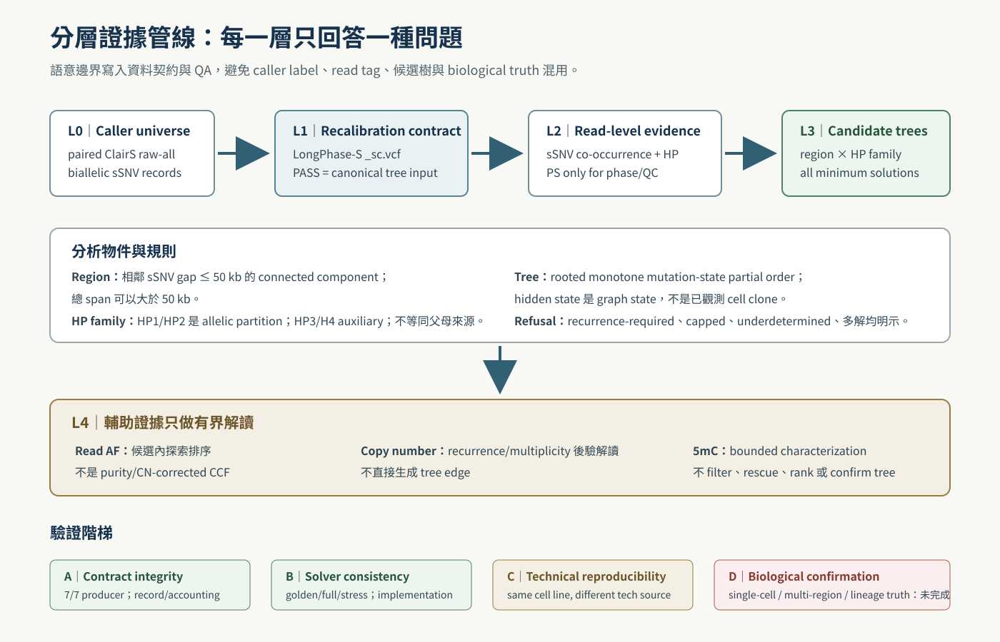
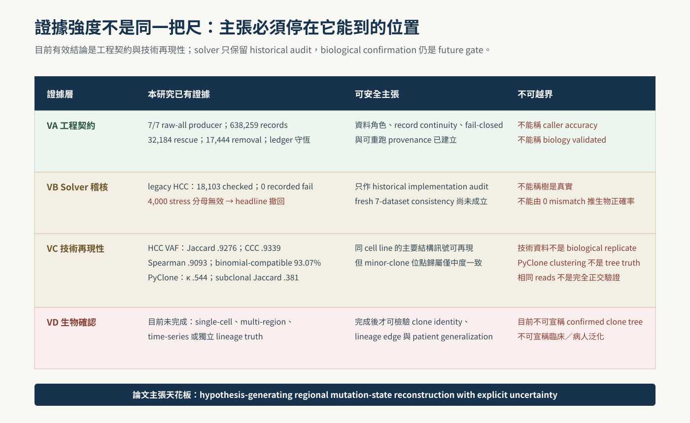

<!--
建立時間: 2026-07-12
目標: 定義碩士論文六章結構、每節 assertion-evidence、核心術語、圖表與 claim boundary
處理範圍: 資訊／工程科學取向；生物資訊應用；Task type B comprehensive validation
關聯檔案: 20260712_碩士論文重點流程計劃書_01.md；20260712_碩士論文_01.md
-->

# 碩士論文架構與重點

> **用 Pyramid Principle＋Assertion–Evidence：全篇由「可驗證工程框架」統攝，六章依序回答為何需要、前人怎麼做、系統如何定義、證據顯示什麼、哪些仍不能說、最後貢獻是什麼。（影響：高；信心：高）**

## 1. 讀者在 5 分鐘內必須得到的答案

| 問題 | 本論文答案 |
|---|---|
| 做了什麼？ | 建立 paired ClairS → LongPhase-S → read evidence → regional candidate-tree 的 fail-closed 分層框架。 |
| 新意在哪裡？ | 把資料角色、完整候選集、多解／拒絕狀態與驗證階梯做成可稽核工程契約。 |
| 證明了什麼？ | 上游 contract 7/7 與 HCC1395 主要 VAF 結構的技術再現；solver 只有 legacy HCC1395 audit，fresh end-to-end 尚未通過。 |
| 沒證明什麼？ | 未證明唯一真實 clone tree、patient generalization 或 methylation-based lineage confirmation。 |
| 為何是資訊工程論文？ | 核心貢獻是資料模型、形式化、演算法、完整性、fail-closed QA、provenance 與可重現系統。 |

## 2. 全篇中心論證

> **Claim**：長讀單分子 sSNV 共現能在 haplotype family 內縮小區域 mutation-state 演化的可行解空間；若系統同時保存完整候選集、拒絕狀態與 evidence provenance，便能產生可檢驗而不過度宣稱的演化假說。

論證鏈：

1. bulk VAF/CCF 能估群體結構，但單樣本 tree topology 常不可識別；
2. 長讀提供同一分子上的物理共現與 allelic family；
3. 這些 read constraints 可轉成 rooted monotone mutation-state compatibility 問題；
4. 候選集可能唯一、可能多解、可能 recurrence-required、underdetermined 或超出 cap；
5. 因此誠實系統應輸出完整解集合與拒絕原因，而不是強迫單一樹；
6. copy number、AF、methylation 各自提供有限輔助，但不能跨越 evidence ceiling；
7. contract、solver 與技術再現性可工程驗證；生物 clone confirmation 仍需正交資料。



## 3. 六章架構總覽

| 章 | Assertion heading | 回答的核心問題 | 主要證據／輸出 |
|---|---|---|---|
| 第一章 緒論 | 長讀物理共現可補 bulk 重建的 evidence gap，但不能自動消除不可識別性 | 為何值得做？ | 問題、RQ、貢獻、claim ceiling |
| 第二章 背景與相關研究 | 既有 caller、phasing、clone inference 與 methylation 方法處理的是不同 estimands | 與前人差在哪裡？ | evidence-regime comparison |
| 第三章 系統與方法 | 資料契約、形式模型、域內完整枚舉與拒絕狀態共同構成可驗證重建 | 怎麼做、為何可信？ | schema、適用域、pseudocode、invariants、validation design |
| 第四章 結果 | 工程契約與主要技術訊號已可驗證；全樣本 clean topology 與生物 truth 尚未解鎖 | 實際得到什麼？ | producer、solver、VAF/PyClone、blocked ledger |
| 第五章 討論 | 本方法是 regional hypothesis generator，不是 global clone truth engine | 結果代表什麼？ | 比較、限制、negative evidence、future gates |
| 第六章 結論 | 可稽核與誠實拒絕是本研究的主要工程貢獻 | 最後留下什麼？ | bounded conclusion |

## 4. 第一章：緒論

### 1.1 腫瘤異質性是 inference problem，不只是資料量問題

**Assertion**：腫瘤由多個細胞族群混合而成；bulk sequencing 的觀察量是混合後的 read counts，因此 clone identity、cellular prevalence 與 tree topology 不會由 VAF 自動唯一決定。

**Evidence**：Nowell 1976；Greaves & Maley 2012；PyClone／PhyloWGS；Tarabichi practical guide。

**不得寫**：「只要 depth 足夠就能得到唯一真實樹」。

### 1.2 ONT 長讀增加單分子證據，但也增加資料語意責任

**Assertion**：同一 read 可同時承載 sSNV、phase/haplotype 與 MM/ML modified-base information，提供短讀難以直接觀察的長距離連結；但 tag 的存在不等於生物結論成立。

**Evidence**：LongPhase、LongPhase-S、SAM optional fields、NanoMethPhase、MethPhaser。

### 1.3 研究缺口是「有證據但沒有可稽核 claim boundary」

**Assertion**：現有方法多擅長 caller、phasing、CCF clustering 或 global phylogeny 的其中一項；本研究關心如何把單分子 evidence 轉成完整、可拒絕的 regional candidate set。

### 1.4 研究問題

- RQ1：如何建立 raw caller 到 tree consumer 的 record-level contract？
- RQ2：如何形式化並完整列舉 region × HP-family mutation-state candidates？
- RQ3：如何驗證 implementation consistency 且不混稱 biological accuracy？
- RQ4：跨技術來源的 VAF／conditional subclone structure 能再現到何種程度？

### 1.5 貢獻與主張天花板

以五項貢獻收尾：contract、formal model、complete enumeration、refusal ontology、validation ladder。最後加一段明確排除：本論文不宣稱 patient-level confirmed clone genealogy。

## 5. 第二章：背景與相關研究

### 2.1 Somatic variant calling 的 paired 與 tumor-only 是不同 evidence regimes

比較 ClairS、ClairS-TO、DeepSomatic：

| 維度 | Paired ClairS | Tumor-only caller | 本研究使用方式 |
|---|---|---|---|
| Matched normal | 有 | 無 | 使用 paired regime |
| 主要 estimand | somatic small-variant evidence | 在缺 normal 下辨識 somatic candidates | caller output 是輸入，不是 truth |
| PON／Verdict | 非等同 truth | 可作 tag/filter evidence | 不直接升級 lineage claim |
| 對 tree 的角色 | 提供候選位點 | 提供不同 regime 的候選 | 不由 caller FILTER 直接決定 edge |

本節必須明示本專案 pinned ClairS 版本與 2026 正式論文版本可能不同，不能直接把 paper benchmark 數字當本專案性能。

### 2.2 Long-read phasing 與 somatic haplotagging

敘述順序：LongPhase（germline/SV phasing）→ LongPhase-S（somatic haplotagging、tumor DNA fraction、bidirectional recalibration）→ 完整 9-state HP vocabulary。

完整詞彙：`.`, `1`, `2`, `3`, `4`, `1-1`, `2-1`, `1-2`, `2-2`。

術語紅線：

- HP1/HP2 是 arbitrary homologous haplotype labels；無 trio orientation 不稱父系／母系。
- HP3 是 unresolved/ambiguous somatic family，不是 LOH label。
- HP4 與 extended states 是 auxiliary；是否納入分析必由 schema 明定。
- PS 是 phase-set/QC，不是 clone identifier。

### 2.3 Bulk subclonal inference 與 phylogeny

用 estimand 比較，不做不公平排行榜：

| 方法類型 | 典型工具 | 主要輸入 | 主要輸出 | 與本研究關係 |
|---|---|---|---|---|
| CCF clustering | PyClone/PyClone-VI | read counts、purity、allele-specific CN | mutation clusters、cellular prevalence | 互補 sensitivity；不產 tree truth |
| Global phylogeny | PhyloWGS、Pairtree | VAF/CCF、CN、多樣本 | clone composition/tree posterior | global statistical inference；estimand 不同 |
| Regional read linkage | 本研究 | same-molecule sSNV + HP family | compatible regional candidate-tree set | 物理 linkage；保留多解與拒絕 |

### 2.4 Perfect phylogeny、incomplete states 與 Steiner interpretation

精確用語：本研究 rooted all-zero model 的 incompatibility 應稱 **rooted three-gamete condition**：任一 pair of characters 不可同時觀察 `10`、`01`、`11`。若明確把 `00` root 也列入四種組合，才可稱 root-augmented four-gamete framing。

理論邊界：Foulds & Graham 的 NP-complete theorem 是 unrooted/undirected minimum-Hamming Steiner decision problem；不可直接推出本研究 bounded rooted solver NP-hard。

### 2.5 Haplotype-resolved methylation 與癌症 lineage

NanoMethPhase、MethPhaser 支持 allele-specific methylation／methylation-assisted phasing；Gaiti et al. 支持特定 single-cell methylation regime 可含 lineage information。這些文獻**不**證明 bulk ONT methylation 可確認本研究的 clone tree。

本研究定位：methylation 是 residual within-family characterization，不是 variant filter、candidate rescue、tree ranker 或 lineage count estimator。

### 2.6 新穎性必須用 direct delta 呈現

至少以一張表直接對照四類工作：caller／haplotagging、bulk CCF／global phylogeny、perfect phylogeny／IDP、single-best-tree pipeline。每列回答「前人已做什麼、還缺什麼、本研究新增什麼、不宣稱什麼」。核心 novelty 句固定為：

> 本研究把 normalized raw-all 到 candidate set 的跨工具 identity contract，與 partial-subcube、bounded complete enumeration、analytical/display separation 及 refusal receipts 合為一個可執行系統；它新增的是可稽核完整性，不是 biological accuracy oracle。

## 6. 第三章：資料、系統與方法

### 3.1 資料範圍、provenance 與角色

必列：

- 7 dataset rows、6 cell lines；HCC1395/HCC1395_DORADO 同 biological ID，但現有 artifacts 不足以宣稱 library／raw-signal 批次完全獨立；
- chr1–22 primary scope；
- caller VCF、LongPhase-S `_sc.vcf`、read sidecar、CN、MM/ML 各自角色；
- truth/callable regions 只用於明確 benchmark，不可滲入 production tagging；
- commit、manifest、SHA-256 與 run receipt。

正文必放 dataset relationship table：dataset row、biological ID、technical role、paired evidence regime、CN availability/source、truth role 與論文用途。COLO829/HCC1937 明示 CN unavailable；HCC1395_DORADO 的 shared CN 只作 sensitivity，不是獨立 measurement。

### 3.2 Input contract 與 all-site ledger

Canonical chain：

```text
paired ClairS raw-all biallelic sSNV
→ normalization
→ LongPhase-S bidirectional recalibration
→ same-run _sc.vcf PASS
→ tree input
```

ClairS PASS 只作 sensitivity/audit。每個 caller record 具有唯一 disposition；missing、extra、duplicate-conflict 或 truth flag 任一出現即 fail-closed。

### 3.3 區域與 HP-family 分析單位

區域定義：將 autosomal sSNVs 依座標排序，若相鄰位點距離 ≤50 kb 則連於同一 connected component；**總 region span 可大於 50 kb**。

Primary unit：`region × mutation-bearing HP1/HP2 family`。root-only family 是 reference control；HP3/H4 auxiliary 不進 primary lineage denominator。

### 3.4 Read–mutation matrix 與狀態集合

對每個 unit 建 read × mutation matrix，值至少區分 ALT-supported、REF-supported 與 missing/unknown。觀察到的 mutation-bearing row patterns 形成 terminal states；全零 root 作 reference state。

需定義：

- observed terminal state；
- hidden/Steiner mutation state；
- exact ordered tree `T`；
- unlabeled topology `Topo`；
- complete、underdetermined／incomplete、capped、recurrence-required；
- `determined`＝在宣告域內、candidate set 完整、non-capped、V1–V7 通過且恰一個 recurrence-free minimum feasible solution。

### 3.5 Candidate-tree enumeration

演算法敘述重點：

1. 將 full patterns 固定為 nodes，partial patterns 表成 Boolean subcubes；
2. 逐 hidden-node level 生成候選 extra states，保留 coverage + unit-flip closure 的節點集；
3. 於第一個可行 level 停止，證明 hidden-node minimum；
4. 對所有 minimum node sets 列舉每個非 root 節點的 unit-predecessor parent choices；
5. 分開保存 exact analytical count／set 與 display subset；
6. 以 rooted three-gamete 判斷 recurrence-free compatibility，並以 V1–V7 重算；
7. mutation、hidden 或組合預算超界即輸出 capped reason，不任選一棵。

正文必附 pseudocode 與 frozen domain：`MAX_SNV=8`、state space ≤256、`extra_cap=4`、150,000 combinations/level、`ANALYSIS_TREE_CAP=0`、`DISPLAY_TREE_CAP=32`、`VERIFY_EVERY=1`。不聲稱解了 unrestricted Steiner phylogeny。

### 3.6 輔助證據

- Read AF：候選內探索排序；需明示未完整校正 purity、CN、multiplicity，因此不稱 CCF。
- Copy number：後驗解讀 recurrence/multiplicity；不直接建立 edge。
- Methylation：在已定義的 family/candidate context 中 characterization；不 filter、rescue、rank 或 confirm。

### 3.7 驗證設計

四層命名為 VA–VD：contract integrity、solver consistency、technical reproducibility、biological confirmation。每層有獨立分母與 claim ceiling，避免與 evidence references `[E1]`–`[E8]` 撞名。

正文必逐項定義 V1–V7（arborescence、coverage、consistency、minimality、candidate-count agreement、model correctness、no-overclaim）與 U0–U7（production scope、record continuity、tag capture、sidecar join、all-site ledger、bounded equivalence、frozen provenance、atomic lifecycle）。V4/V5 是同一形式模型的另一程式路徑重算；V5 不產生 exact tree-set equality proof，也不是 biological oracle。



## 7. 第四章：結果

### 4.1 Raw-all production contract 已通過 7/7

Assertion：clean raw-all producer 的 record-level engineering contract 已完成。

正式表：

| 指標 | 結果 | 解讀 |
|---|---:|---|
| Dataset rows | 7/7 | producer contract complete |
| Input records | 638,259 | raw-all normalized records |
| non-PASS → PASS | 32,184 | bidirectional rescue |
| PASS → non-PASS | 17,444 | bidirectional removal |
| Mapped alignments | 164,253,537 | sidecar extraction scope |
| Persisted BAM | false | sidecar-only production |

不得寫：7/7 producer＝完整 reconstruction complete。

### 4.2 Solver 舊 audit 與 verifier 反例

Assertion：legacy HCC1395 artifact 的 18,103 checked units 為 0 recorded fail，但不是 fresh 7-dataset validation；舊 4,000-stress headline 因 capped counter flaw 撤回。

務必跟一句：V5 只比對 analytical count，不是 exact tree-set equality oracle；verifier summary 也必須接受 denominator audit。

### 4.3 HCC1395 的主要 raw-VAF 結構跨技術來源高度再現

Primary exact-locus numbers：union 82,705；shared 76,721；Jaccard .9276；CCC .9339；Spearman .9093；MAE .0624；binomial 95% compatible 93.07%。

解讀：整體主要結構高度一致，但只有約一半位點差 ≤.05，因此不等於每位點相同。

### 4.4 Conditional subclone clustering 顯示主幹穩定、minor assignment 不穩

14/14 PyClone-VI fits PASS；獨立 HCC fits ARI .539、NMI .339、κ .544、subclonal-set Jaccard .381。near-integer sensitivity 分別 .573、.390、.577、.411。

解讀：clonal-majority signal 可再現，但精確 minor-clone membership 僅中度一致；這反而是限制 tree claim 的重要負向／校準證據。

### 4.5 Clean layered-v3 的 workers 完成，但 final verifier fail-closed

本節不是空白，而是 terminal failure ledger：

- 7/7 workers 均 return code 0；
- final verifier return code 7，`state=FAILED`、`all_pass=false`、0/7 dataset pass；
- 7/7 sample contracts 因 `mlhp_part_1.funnel.n_groups_read_unsupported` 非 non-negative integer 而 `E_SCHEMA_INVALID`；
- H1437、H2009、HCC1395_DORADO、HCC1937、HCC1954 另有 `E_POST_INPUT_IDENTITY`；
- 無 aggregate `_SUCCESS`，故 outputs 不 release；
- 尚待 canonical/sensitivity tree receipts 與 U0–U7；
- 舊 44.7%、34.9%、32.6%、56.2%、92.86% 不得替代。

修正 verifier/schema/identity gate 並重跑通過後，終版只替換本節表格與相應摘要句，不更動 RQ、方法或 claim ceiling。

## 8. 第五章：討論

### 5.1 本研究與 global clone-tree inference 的 estimand 不同

本研究使用 local physical linkage 建 region × HP-family candidate set；PyClone/PhyloWGS/Pairtree 由 bulk frequency 與 CN/purity 進行 statistical deconvolution 或 global phylogeny。兩者互補，不以「誰全面優於誰」收尾。

### 5.2 多解與拒絕不是失敗，而是結果的一部分

Ambiguous／recurrence-required／underdetermined／capped 反映現有 read evidence 的資訊限制。強迫單解會把 algorithm preference 偽裝成 biological certainty。

### 5.3 技術再現性與 biological accuracy 必須分開

HCC1395/DORADO 來自同一 cell line，可檢驗 source reproducibility；不能當獨立 biological replicate。VAF 高一致而 minor PyClone membership 只中度一致，正好說明主要 signal 與細部 lineage 不可混稱。

### 5.4 Copy number、purity 與 multiplicity 仍限制解讀

Read AF 不是 CCF；DORADO 共用 HCC SAVANA CN 是 shared-CN sensitivity，不是獨立 CN measurement；COLO829/HCC1937 缺 reviewed allele-specific CN，因此不強行輸入 PyClone。

### 5.5 Methylation 的負向結果是方法邊界

舊 methylation filter/rescue/ranker 主線已關閉。其價值轉為 bounded characterization 與 future orthogonal feature，而不是為了保留研究敘事硬說可改善 F1 或選樹。

### 5.6 外部效度與下一步

1. clean-v3 terminal + U0–U7；
2. independent caller sensitivity；
3. reviewed allele-specific CN/purity/multiplicity；
4. single-cell、multi-region 或 time-series lineage truth；
5. 真實臨床檢體與跨癌別 cohort。

## 9. 第六章：結論

建議只保留三層結論：

1. **工程**：建立可追溯、fail-closed 的資料與分析契約；
2. **演算法**：對 non-capped compatible units 保存完整最小候選解並明示拒絕；
3. **科學**：主要技術訊號可再現，但 regional candidate tree 仍是可檢驗假說，不是已確認 clone genealogy。

## 10. 圖表規劃

| 編號 | Assertion title | 圖型 | 狀態 |
|---|---|---|---|
| 圖 1 | 本研究把看見訊號與證明 clone 分開 | narrative map | 已建立 `figures/01_*` |
| 圖 2 | 每一層 evidence 只回答一種問題 | flow/DAG | 已建立 `figures/02_*` |
| 圖 3 | 工程、技術與生物證據不可用同一尺 | claim matrix | 已建立 `figures/03_*` |
| 圖 4 | producer 通過、legacy solver audit 有限制、技術再現 partial、clean-v3 未解鎖 | evidence snapshot | 已建立 `figures/04_*`；completion gate C2 後更新 |
| 圖 5 | 方法與章節可先鎖，正式 rates 等 terminal gate | gate timeline | 已建立 `figures/05_*` |
| 方法範例 A | 小型 read matrix 如何產生兩棵同樣最小候選樹 | worked algorithm example | 已建立 `figures/06_*`；合成示例 |
| 終版圖 6 | clean-v3 全樣本 funnel 與 denominator conservation | flow/funnel | 待 C2/C3 |
| 終版圖 7 | canonical vs ClairS-PASS sensitivity 的 tree-set comparison | paired plot | 待 C2/C3 |
| 終版圖 8 | CN/read-AF/methylation 的 bounded downstream summary | multi-panel | 待 C2/C3 |

## 11. Claim registry 對正文的映射

| Claim | 正文位置 | 狀態 |
|---|---|---|
| ISM-A01 candidate regional mutation-state trees | 摘要、1.5、3.4–3.5、6 | active |
| ISM-M01 7 datasets/6 cell lines | 摘要、3.1、4 | active |
| ISM-M02 raw-all → `_sc PASS` | 3.2、4.1 | active |
| ISM-M04 region × HP family | 3.3 | active |
| ISM-M05 HP is allelic partition | 2.2、3.3、5.3 | active |
| ISM-M06 complete minimum compatible solutions | 3.5、4.2 | active；正文限定 declared bounded domain |
| ISM-M07 bounded CN/AF/methyl roles | 3.6、5.4–5.5 | active |
| ISM-R02 solver consistency | 4.2 | registry 仍 active，但紅隊 audit 已反證 stress denominator；本稿降級，待 reconciliation |
| ISM-R03 clean final rates | 4.5 | blocked |
| ISM-R05 methylation boundary | 2.5、3.6、5.5 | active boundary |
| ISM-R06 read AF ≠ CCF | 3.6、5.4 | active boundary |
| ISM-D01 candidate ≠ clone truth | 摘要、1.5、5、6 | active ceiling |
| ISM-X01/X02/X03 retired lines | 4.5、附錄 blocked ledger | excluded |

## 12. 必須淘汰的舊框架

| 舊敘事 | 為何淘汰 | 新位置 |
|---|---|---|
| 甲基化改善 variant F1／rescue | LOSO effect collapse；主線 retired | 第五章負向邊界 |
| BRCA2／chr2 個案承擔全篇主軸 | 個案不能代表工程方法全貌 | 討論或附錄案例 |
| HP1/HP2 是父系／母系 | 無 trio orientation | arbitrary homologous haplotypes |
| 35,332／23,810 backbone | 舊 input universe retired | raw-all → `_sc PASS` |
| 44.7/34.9/32.6/56.2/92.86% 作 final rates | historical upstream-mismatched run | clean-v3 gate 後重算 |
| VAF-selected tree＝正確 tree | AF 未完全校正且不是 truth | exploration/sensitivity only |
| 技術來源＝biological replicate | 同一 cell line | technical reproducibility |

## 13. 口試章節對應

12 張主投影片依論文章節縮寫：

1. 問題與一句話貢獻（Ch1）
2. Claim boundary 與目前狀態（Ch1/Ch4）
3. Related-work evidence regimes（Ch2）
4. Input contract（Ch3）
5. HP family 與 analysis unit（Ch3）
6. Mutation-state matrix（Ch3）
7. Complete candidate enumeration（Ch3）
8. Producer/solver result（Ch4）
9. VAF technical reproducibility（Ch4）
10. PyClone minor-structure instability（Ch4/Ch5）
11. Methylation/CN/AF bounded roles（Ch5）
12. Contribution、限制與 gates（Ch6）

## 14. 架構完成判準

這份架構可視為鎖定，需同時滿足：

- 每一章有 assertion，而非只有 topic；
- 每一結果句附分母與 evidence tier；
- `candidate`、`regional`、`mutation-state` 三詞在摘要與結論一致；
- `clone` 出現時都能判定是背景概念、假說或已驗證對象；
- clean-v3 blocked 數字沒有偷偷出現在摘要、圖題或口試 headline；
- 圖表以相對路徑嵌入，同一資料夾可離線閱讀。
