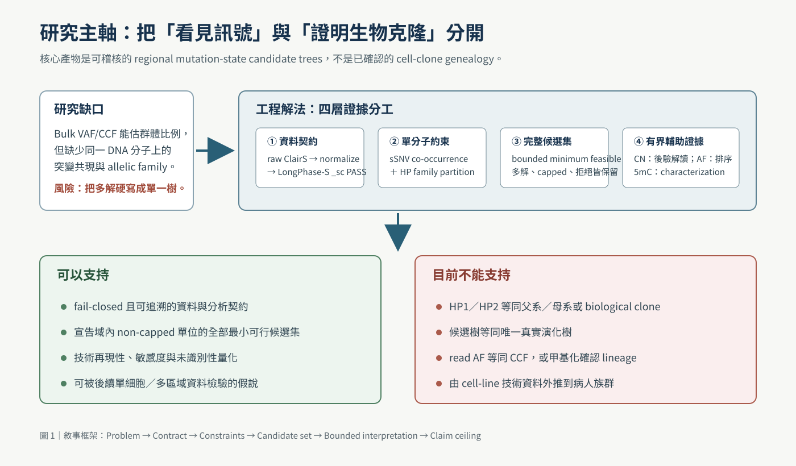
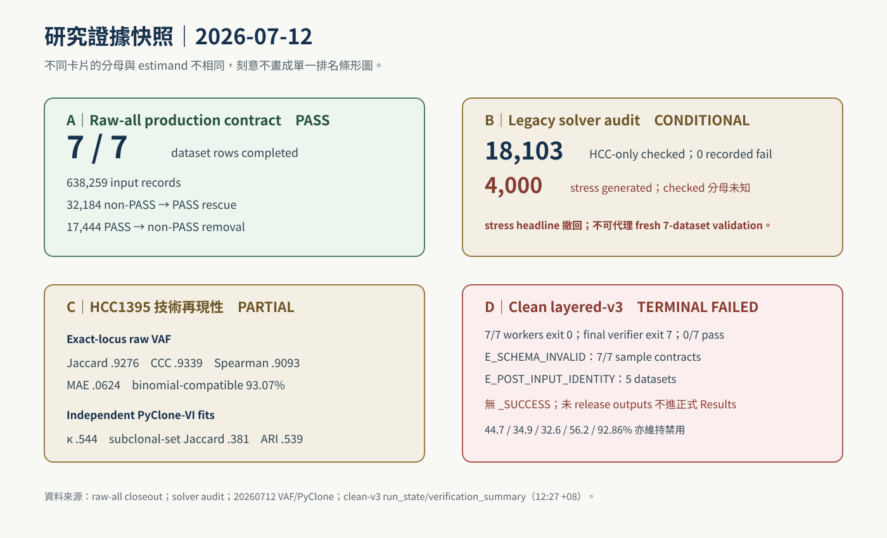
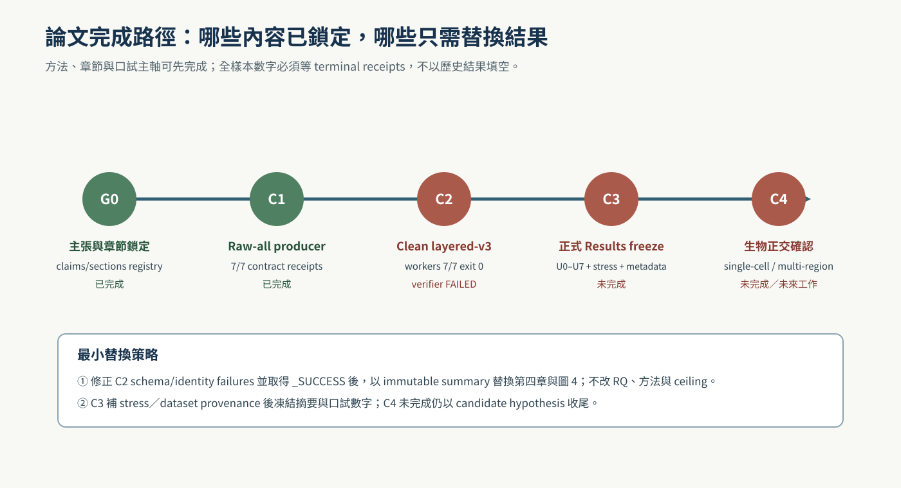

<!--
建立時間: 2026-07-12
目標: 鎖定資訊／工程科學取向碩士論文的研究主軸、證據邊界、寫作流程與完成 gate
處理範圍: Task type B；7 dataset rows／6 cell lines；論文、口試與 HTML 交付
關聯檔案: 20260712_碩士論文架構與重點_01.md；20260712_口試重點敘述講稿_01.md；20260712_碩士論文_01.md
-->

# 碩士論文重點流程計劃書

> **用 SCQA＋DECIDE：建立一篇以「可稽核區域突變狀態候選樹」為核心的工程型碩論；方法與主張可先鎖定，但 clean layered-v3 已 terminal FAILED，正式全樣本 tree 比例保持 NO-GO。（影響：高；信心：高）**

> **文件狀態：可審閱整合初稿／PARTIAL EVIDENCE。** 本計劃屬 Task type **B（Comprehensive validation）**，預設 scope 為 chr1–22、7 個 dataset rows、6 個 biological cell lines；不以 subset 或 historical truth-conditioned run 代理全量結果。

## 1. 一句話研究定位

本研究建構一套具備**輸入契約、資料守恆、域內完整候選解列舉、拒絕狀態與證據分層**的長讀生物資訊框架：由 paired ClairS 與 LongPhase-S 取得 read-level somatic haplotag evidence，在 homologous haplotype family 內利用 sSNV 單分子共現建立區域 mutation-state candidate trees，並把 copy number、read AF 與甲基化限制在各自可支持的輔助角色。

建議正式題名：

> **奈米孔長讀長資料之可稽核區域突變狀態候選樹重建：整合體細胞單倍型標記與單分子突變共現**

英文題名：

> **Auditable Regional Mutation-State Candidate-Tree Reconstruction from Nanopore Long Reads: Integrating Somatic Haplotagging and Single-Molecule Mutation Co-occurrence**

這個題名把可被審查的核心產物直接寫成 candidate tree，並刻意不使用「已重建 biological subclone phylogeny」。甲基化在本研究只有有界 characterization 與負向方法學結果，故不放在主標題；目前 evidence ceiling 只支持 candidate-tree hypothesis generation。

## 2. SCQA：為什麼需要重建論文框架

### Situation

癌症樣本由多個遺傳上不同的細胞族群混合而成。傳統 bulk sequencing 方法多由 VAF、purity 與 copy number 推估 cellular prevalence 或 mutation clusters；這類方法能利用全基因組統計訊號，但同一 DNA 分子上哪些突變實際共現，通常不是直接觀察量。

### Complication

ONT 長讀可同時承載序列、長距離相位與 modified-base tags，卻也容易造成四種語意混淆：

1. caller `PASS` 被誤當 ground truth；
2. HP family 被誤當 biological clone；
3. compatible candidate tree 被誤當唯一真實 lineage；
4. read AF 或 methylation 被誤當 CCF／獨立驗證。

此外，2026-07-11 的 contract audit 已確認舊 7/7 layered run 使用 upstream-mismatched、部分受 truth-BED 限制的 tags；舊 funnel、determinacy、multi-HP 與 selected-shape 比例不能作正式 Results。

### Question

如何把長讀單分子訊號轉成可被審核、可拒絕、不隱藏多解，且不超出生物證據的區域演化假說？

### Answer

以「**Problem → Contract → Formal model → Complete enumeration → Refusal → Engineering verification → Bounded interpretation**」為論文主軸；生物資訊是應用場域，資訊工程貢獻則落在資料契約、形式化物件、演算法、完整性驗證與可重現性。

## 3. 任務類型、目標與 scope

| 項目 | 決定 |
|---|---|
| Task type | **B — Comprehensive validation** |
| Genome scope | GRCh38 chr1–22；非 1–3 chr pilot |
| Data scope | 7 dataset rows、6 biological cell lines；HCC1395 與 HCC1395_DORADO 是同一 cell line 的技術資料 |
| 主要研究目標 | G1 LongPhase-S 整合；G2/G3 分層遺傳與 read-level epigenetic；G4 reproducibility；G5 外部可驗證工程 |
| Primary estimand | region × mutation-bearing HP1/HP2 family 在預先宣告資料／計算域內的全部最小可行 mutation-state candidate-tree set |
| Primary claim ceiling | hypothesis-generating regional reconstruction；不是 confirmed clone genealogy |
| 論文受眾 | 資訊工程／工程科學口試委員；兼顧生物資訊可理解性 |

## 4. 2026-07-12 證據現況

| 證據模組 | 最新狀態 | 可寫入正式正文 | 證據等級 |
|---|---|---|---|
| Raw-all LongPhase-S producer | **7/7 PASS**；638,259 records；32,184 rescue；17,444 removal；164,253,537 mapped alignments；未持久化 BAM | 工程契約與 record accounting | L2 工程證據 |
| Legacy solver audit | HCC1395 18,931 total；828 capped；18,103 checked／0 recorded fail；4,000 stress claim 因 counter flaw 撤回 | 只作 historical implementation audit；不可代理 fresh 7-dataset validation | L1／conflicted |
| HCC1395 raw-VAF reproducibility | union 82,705；shared 76,721；Jaccard .9276；CCC .9339；Spearman .9093；MAE .0624 | 技術來源間主要 VAF 結構可再現 | L3 技術證據 |
| PyClone-VI sensitivity | 14/14 fits PASS；獨立 fit κ .544、subclonal Jaccard .381、ARI .539 | 主幹可再現、minor assignment 僅中度一致 | L3 conditional 技術證據 |
| Dataset provenance table | biological/platform/CN role 已整理；accession、pair IDs、chemistry/basecaller、coverage/N50 與完整 runtime 表尚缺 | 可寫目前 artifact scope；不可稱 external-from-raw reproducible | BLOCKED metadata |
| Clean layered-v3 | **Terminal FAILED**；7/7 workers exit 0，verifier exit 7；`all_pass=false`、0/7 dataset pass | 可寫 fail-closed 驗證結果；不能填正式 topology rates | L2 failure evidence |
| Biological clone truth | 無 single-cell／multi-region／time-series truth | 只列限制與 future work | 未完成 |

數值來源：

- `InterSubMod/output/synthesis/research_rounds/20260711_longphase_s_raw_all_production_sidecars_v2/raw_all_receipt_closeout.json`
- `InterSubMod/docs/CURRENT_FOCUS.md`（只取 7/11 contract／claim context；latest runtime 已落後，不作 terminal SoT）
- `InterSubMod/docs/methodology/_assets/20260627_subclone_4axis_teaching/data/full_v4v5_verification_HCC1395.json`
- `InterSubMod/research/20260710_layered_reconstruction_v2/audit_notes/{02_layered_chain_audit.md,03_verification_risk_audit.md}`
- `InterSubMod/research/20260712_vaf_ccf_subclone_crosssoftware_validation/20260712_七樣本RawVAF技術再現與HCC1395配對驗證_01.md`
- `InterSubMod/research/20260712_vaf_ccf_subclone_crosssoftware_validation/20260712_PyCloneVI跨技術來源Subclone條件式分群完整執行紀錄_01.md`
- `InterSubMod/output/synthesis/research_rounds/20260712_layered_reconstruction_v3_raw_all_lps_pass_v2/run_state.json`
- `InterSubMod/output/synthesis/research_rounds/20260712_layered_reconstruction_v3_raw_all_lps_pass_v2/verification_summary.json`

## 5. Pre-decision audit

### 5.1 Cynefin 判定

本任務屬 **Complicated domain**：資料來源多、證據層次有衝突，但可由明確 SoT、claim registry 與 validation gates 收斂；不需要以臨場試錯取代完整設計。

### 5.2 關鍵假設與可否證條件

| 假設 | 風險 | 可觀察 falsifier | 處置 |
|---|---|---|---|
| `paper_claims.tsv` 與 7/11 contract audit 是語意 SoT | 舊稿覆寫新契約 | 新 registry 明確 supersede 目前 claim | 全文重新跑 claim diff |
| raw-all producer 7/7 只代表上游工程完成 | 被誤寫成全流程完成 | layered-v3 verifier 已 terminal FAILED，無 `_SUCCESS` | Results 保留未解鎖標記 |
| candidate set 比單一 heuristic tree 更誠實 | 多解仍被下游偷偷截斷 | `n_trees` 大於實際分析集合 | fail-closed，不報該單位 |
| read AF、CN、methylation 分工正確 | 輔助證據反過來產生 edge | 任一 tree edge 由上述層直接決定 | 視為方法偏離，阻止定稿 |
| 技術再現性不等於 biological accuracy | 口試敘述過度 | 使用「accuracy／true clone」但無 truth | 降級成 reproducibility |
| claim registry 的 4,000-stress wording 已被紅隊反證 | 舊 active claim 復活 | capped 未驗卻計 pass；checked/skipped 未保存 | 以紅隊 audit 降級，修 counter 重跑後再更新 registry |

### 5.3 主要失敗模式

1. **舊數字復活**：44.7%、34.9%、32.6%、56.2%、92.86% 被誤放入摘要或結論。
2. **estimand 漂移**：regional mutation-state tree 被改稱 whole-tumor clone phylogeny。
3. **來源循環**：用同一批 reads 的 AF 或 methylation 自稱正交 confirmation。
4. **樣本數誤寫**：7 datasets 被寫成 7 patients 或 7 biological replicates。
5. **理論過度延伸**：將一般 Steiner NP-hardness 直接套到本研究 rooted compatible enumeration。

### 5.4 Verdict

**GO_WITH_CAVEATS**：可以完成可審閱的工程型碩論全文、架構、口試講稿、圖組與 HTML；**NO-GO** 於「正式口試／submission-ready final Results」與「confirmed biological clone reconstruction」標籤。clean-v3 成功 terminal 後再執行一次 Result freeze 與送審判定。

## 6. 研究問題與貢獻鎖定

### RQ1｜資料契約

如何確保 paired ClairS raw-all、LongPhase-S recalibration、read tags 與 tree consumer 之間沒有 silent record loss、scope leakage 或 truth-conditioned contamination？

### RQ2｜形式模型與可識別性

如何把 region × HP-family 的 read–mutation matrix 形式化為 rooted monotone mutation-state partial order，並在資料不足時完整保留多解、recurrence-required、underdetermined 與 capped 狀態？

### RQ3｜工程正確性

如何用 golden cases、full verification、seeded stress、守恆式與 immutable receipts 驗證 implementation contract，而不把程式一致性誤寫成生物真實性？

### RQ4｜技術再現性與證據邊界

同一 HCC1395 cell line 的不同技術資料中，VAF 與 conditional subclone structure 可再現到何種程度；剩餘差異如何限制 tree/clone claim？

### 預期貢獻

1. 一套 lossless、fail-closed 的 caller → recalibration → read evidence → tree consumer 契約。
2. 明確的 HP family、region、mutation state、exact tree `T`、unlabeled topology `Topo` 與 refusal ontology。
3. 對通過預先宣告資料與計算界線的 non-capped unit，完整列舉所有最小可行候選樹；超出域者保留 capped reason，而非任選單解。
4. 分離 contract integrity、solver consistency、technical reproducibility 與 biological confirmation 的驗證階梯。
5. 將 CN、read AF 與 methylation 角色限制寫入 schema、分析與敘述，降低不可重現 overclaim。

## 7. 論文建置流程：Step → Verify

1. **鎖定 source-of-truth 與禁止 claim**  
   → 驗證：`paper_claims.tsv` 20 個 claim 均映射到正文；紅隊反證的 ISM-R02 stress wording 另列 conflict override；舊 23,810／35,332 backbone 與五個禁止比例在主結果為 0 次。

2. **建立資訊工程主軸與六章骨架**  
   → 驗證：每一章均回答一個 RQ 或 validation gate；第三章能獨立定義輸入、物件、演算法、拒絕與驗證。

3. **凍結現有可引用數據**  
   → 驗證：每個數字皆列來源路徑、分母、evidence tier 與限制；HCC1395/DORADO 明示 technical sources。

4. **建立原創圖組與相對連結**  
   → 驗證：5 個 SVG 均在 `InterSubMod/docs/thesis/20260712_碩士論文整合初稿_01/figures/`；Markdown/HTML 無 broken relative image link。

5. **撰寫口試講稿與固定三句邊界**  
   → 驗證：12 張主投影片、22–25 分鐘；每頁有 assertion、證據、轉場與不可說事項。

6. **建立 HTML 檢視版**  
   → 驗證：零 CDN、零外部 script、sticky TOC、print CSS；圖片保持比例；瀏覽器 console error=0。

7. **修正 clean-v3 verifier failure 後執行 Result freeze**  
   → 驗證：先排除 7/7 `E_SCHEMA_INVALID` 與 5-dataset `E_POST_INPUT_IDENTITY`；再取得 aggregate `_SUCCESS`、U0–U7 PASS、canonical/sensitivity receipts 與 immutable hashes，才替換第四章 placeholder。

8. **最終 reader/claim QA**  
   → 驗證：新讀者能在 5 分鐘回答「做了什麼、證明了什麼、沒有證明什麼、下一個 gate 是什麼」。

## 8. 章節與產物工作分解

| Work package | 內容 | 主要產物 | 完成定義 |
|---|---|---|---|
| WP1 Context lock | 舊論文盤點、SoT、文獻與術語 | 本計劃書 §2–§6 | claim registry 對齊 |
| WP2 Architecture | 六章 assertion-evidence map、RQ、圖表與 claim matrix | `20260712_碩士論文架構與重點_01.md` | 所有章節有輸入／證據／輸出 |
| WP3 Defense | 12-slide 口試逐頁講稿與 Q&A | `20260712_口試重點敘述講稿_01.md` | 22–25 min，可跳過 backup |
| WP4 Manuscript | 中英摘要、六章、參考文獻、附錄 | `20260712_碩士論文_01.md` | 可審閱全文，blocked 結果明示 |
| WP5 Visual/HTML | 5 SVG、離線 HTML、print styles | `figures/*`、`20260712_碩士論文_01.html` | link/browser/no-CDN QA PASS |
| WP6 Result freeze | clean-v3 數字注入與全文一致性 | 第四章與摘要終版 | terminal + U0–U7 + hashes |

## 9. 論文完成 gates

| Gate | 必備證據 | 狀態 | 對論文的影響 |
|---|---|---|---|
| G0 Claim lock | claim/section registry、current focus、contract audit | PASS | 題名、RQ、方法可鎖 |
| C1 Producer | 7/7 raw-all receipts、record accounting | PASS | 第四章可報工程契約 |
| C2 Clean layered-v3 | aggregate terminal receipt、canonical/sensitivity output | **FAILED**：workers 7/7 exit 0；verifier exit 7 | 全樣本 tree metrics 暫停 |
| C3 Result freeze | U0–U7、corrected stress、dataset provenance、immutable tables、number provenance | BLOCKED by C2 + metadata | 摘要與結論不得放 final rates |
| C4 Biological confirmation | single-cell/multi-region/time-series truth | FUTURE | 即使 C3 PASS 仍只能稱 candidate tree |

## 10. 口試與論文固定敘事

三句不可改寫的核心話術：

1. **Reads 限定相容候選；read AF 只在候選內作探索排序。**
2. **分析單位是 region × HP-family mutation-state tree，不是 cell-clone 家譜。**
3. **Selection 不等於 confirmation；工程零錯誤不等於 biological accuracy。**

一個適合資訊工程委員的 30 秒版：

> 傳統 bulk 方法從群體比例反推亞克隆，本研究改用長讀在同一 DNA 分子上直接觀察突變共現，再於 haplotype family 內，對通過宣告界線的單位列舉全部最小可行區域 mutation-state candidate trees。系統的關鍵不是強迫給一棵漂亮樹，而是以資料契約、守恆、域內完整解集合與拒絕狀態，清楚說明哪些結論可識別、哪些仍需正交生物證據。

## 11. 參考資料優先序

### 內部 SoT

1. `InterSubMod/docs/CURRENT_FOCUS.md`
2. `InterSubMod/research/20260710_layered_reconstruction_v2/00_INDEX.md`
3. `InterSubMod/research/20260710_layered_reconstruction_v2/20260711_ClairS_LongPhaseS_sSNV位點與ReadTag契約稽核_01.md`
4. `/big7_disk/liaoyoyo2001/external_validation/_schema/paper_claims.tsv`
5. `/big7_disk/liaoyoyo2001/external_validation/_schema/paper_sections.tsv`

### 背景 KB

- `/big8_disk/liaoyoyo2001/knowledge/05_tools/longphase-s.md`
- `/big8_disk/liaoyoyo2001/knowledge/05_tools/variant-callers.md`
- `/big8_disk/liaoyoyo2001/knowledge/03_file_formats/bam-format.md`
- `/big8_disk/liaoyoyo2001/knowledge/06_workflows/benchmark-workflow.md`
- `/big8_disk/liaoyoyo2001/knowledge/06_workflows/validation-by-output-type.md`

### 一手文獻核心

- ClairS, *Nature Methods* 2026, DOI: [10.1038/s41592-026-03152-4](https://doi.org/10.1038/s41592-026-03152-4)
- LongPhase-S preprint, DOI: [10.1101/2025.11.20.689492](https://doi.org/10.1101/2025.11.20.689492)
- LongPhase, *Bioinformatics* 2022, DOI: [10.1093/bioinformatics/btac058](https://doi.org/10.1093/bioinformatics/btac058)
- PyClone-VI, *BMC Bioinformatics* 2020, DOI: [10.1186/s12859-020-03919-2](https://doi.org/10.1186/s12859-020-03919-2)
- PhyloWGS, *Genome Biology* 2015, DOI: [10.1186/s13059-015-0602-8](https://doi.org/10.1186/s13059-015-0602-8)
- Gusfield 1991, DOI: [10.1002/net.3230210104](https://doi.org/10.1002/net.3230210104)
- MethPhaser, DOI: [10.1038/s41467-024-49588-0](https://doi.org/10.1038/s41467-024-49588-0)
- NanoMethPhase, DOI: [10.1186/s13059-021-02283-5](https://doi.org/10.1186/s13059-021-02283-5)

## 12. 最終判定

本計劃採**工程嚴謹性優先、生物主張有界**的路線。它能在 clean-v3 verifier failure 尚未修復時先交付完整且可讀的論文初稿，同時保證未來數據注入不會改變 estimand 或偷偷擴大結論。真正的終稿條件不是「文件寫完」，而是 C2 重跑取得 `_SUCCESS`、C3 number provenance 通過；即使如此，C4 未完成前仍不把候選樹升級為已確認的 biological clone tree。
