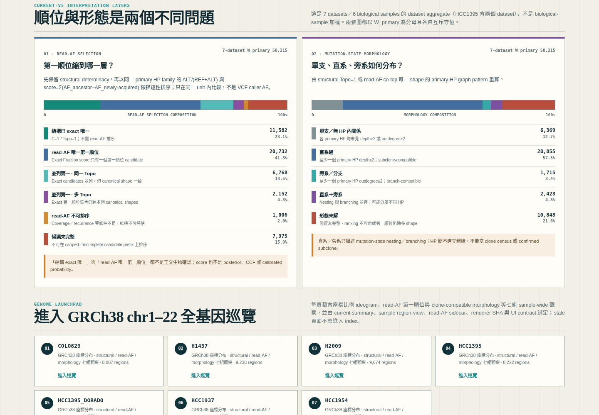
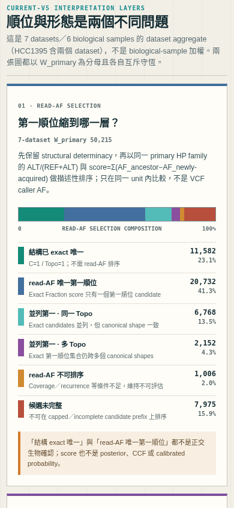
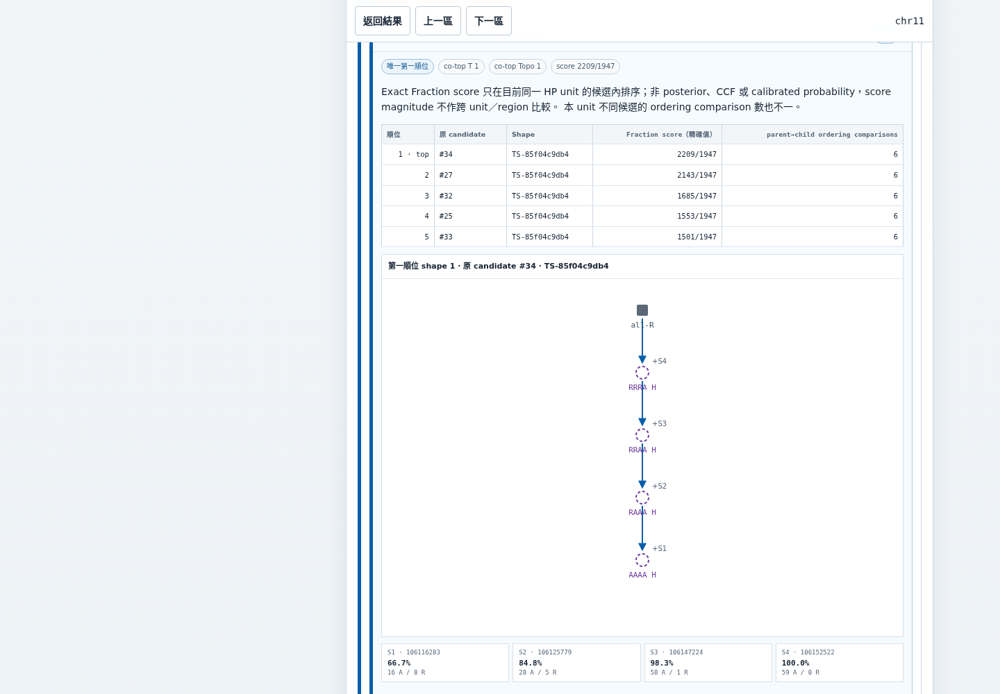
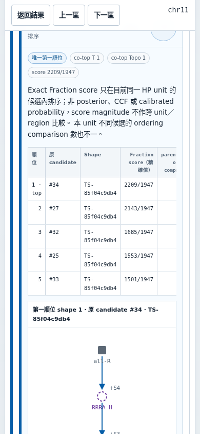

<!--
建立時間: 2026-07-15
目標: 記錄 current-v5 layered workstation 的 GRCh38 拓撲、read-AF 第一順位、mutation-state morphology、多選互動與桌面/手機視覺稽核
處理範圍: 7 datasets / 6 biological samples / GRCh38 chr1-22 / desktop 1440x1000 / mobile 390x844
關聯檔案:
  - InterSubMod/docs/methodology/_assets/layered_workstation/index.html
  - InterSubMod/docs/methodology/_assets/20260627_subclone_4axis_teaching/scripts/build_layered_workstation_v5.py
  - InterSubMod/research/20260715_layered_workstation_genome_topology_multiselect/implementation-notes.md
  - InterSubMod/research/20260715_layered_workstation_genome_topology_multiselect/qa/full/validation_receipt.json
-->

# GRCh38 拓撲、形態與多選工作站完整檢視

> **TL;DR**：7 個 current-v5 dataset 的 chr1–22 工作站已完成重建；全基因圖新增 structural determinacy、read-AF selection、單支／直系／旁系相容形態等七種模式，圖例支援聯集多選與再次點擊取消。最終 Chromium 稽核含 index 雙 viewport 共 16/16 runs、219/219 checks 通過；read-AF 是描述性順位，不是 VCF VAF、CCF、posterior 或已確認真樹。

## 1. 任務與範圍

- **Task type**：B Comprehensive validation；不是 subset demo。
- **完整範圍**：7 datasets、6 biological samples、GRCh38 chr1–22、W_tree=51,815、W_primary=50,215。
- **服務目標**：G3（read-level evidence 解讀）、G4（多資料集一致與可重生）、G5（可外部稽核的證據鏈）。
- **Claim ceiling**：regional mutation-state candidate topology。不可升格成 confirmed clone、true ancestry、CCF、cell fraction 或 calibrated likelihood。

## 2. 四個閱讀維度

| 維度 | 回答問題 | 顯示層級 | 不可解讀為 |
|---|---|---|---|
| Structural C／Topo | 完整 candidate universe 中 exact tree 與無標籤 shape 是否唯一？ | exact 唯一／shape 唯一／multi-shape／incomplete／N/A | biological truth 或唯一時間順序 |
| Read-AF selection | Family-specific read evidence 能把第一順位縮到 exact tree、單一 Topo，或仍跨多 Topo？ | 結構 exact／唯一第一／並列同 Topo／並列多 Topo／不可排序／incomplete | VCF caller VAF、posterior、CCF、最可能真樹 |
| Mutation-state morphology | 第一順位 shape 在 primary HP 內呈單支、直系、旁系或混合？ | 單支／直系／旁系／直系＋旁系／未解 | clone census、confirmed subclone 或跨 HP 親緣 |
| Genome position | 這些 region 在 chr1–22 的哪個座標？ | GRCh38 bp 比例 ideogram、chromosome grid、region detail | hotspot 或 enrichment；未校正 chromosome 長度與輸入密度 |

## 3. 權威資料與 fail-closed 綁定

| 輸入 | 角色 | 驗證 |
|---|---|---|
| `/big7_disk/liaoyoyo2001/InterSubMod/research/20260710_layered_reconstruction_v2/current_layered_topology_v3_raw_all_v1.json` | W、structural C／Topo、canonical run authority | schema、scope、7/7 PASS、summary SHA |
| `/big7_disk/liaoyoyo2001/big7_disk_output/synthesis/research_rounds/20260713_layered_reconstruction_v3_raw_all_lps_pass_v5/` | Current-v5 layered reconstruction、region-view、MLHP read counts | `_SUCCESS`、verifier、sample SHA、exact region join |
| `data/current_v5_read_af_topology/*.json` | Exhaustive read-AF ranking、exact ties、top representative edges、morphology | generator／solver／manifest／summary／region-view SHA；每樣本守恆 |
| `docs/methodology/_assets/20260627_subclone_4axis_teaching/scripts/build_layered_workstation_v5.py` | Standalone renderer | renderer SHA + UI contract `layered-workstation-v5-grch38-topology-multiselect-2` |

Structural exact universe 由 solver 以 `tree_cap=0` exhaustive 重算並和 current-v5 `n_trees`／`n_distinct_shapes_exact` 對帳。HTML structural browser 仍可只展開 stored display subset；read-AF panel 另保存 ranking preview 與 co-top shape representatives，因此第一順位落在舊 top-32 外也不會消失。

## 4. Read-AF 與 morphology 結果

排序使用同一 primary HP family 的精確 `ALT/(REF+ALT)`：

```text
score = Σ(AF_ancestor − AF_newly-acquired)
```

Fraction 完全相等才算 exact tie。Score 只比較同一 HP unit 內候選，不跨 unit／region 比大小。

| Dataset | W_primary | 結構 exact | read-AF 唯一 | 並列同 Topo | 並列多 Topo | N/A | incomplete | 單支 | 直系 | 旁系 | 直+旁 | 未解 |
|---|---:|---:|---:|---:|---:|---:|---:|---:|---:|---:|---:|---:|
| COLO829 | 7,878 | 1,471 | 1,991 | 2,315 | 1,286 | 65 | 750 | 1,296 | 4,443 | 26 | 32 | 2,081 |
| H1437 | 9,005 | 1,803 | 3,213 | 1,867 | 311 | 42 | 1,769 | 925 | 5,621 | 118 | 248 | 2,093 |
| H2009 | 9,538 | 1,145 | 2,988 | 1,378 | 154 | 148 | 3,725 | 431 | 4,473 | 110 | 575 | 3,949 |
| HCC1395 | 7,932 | 2,019 | 4,574 | 366 | 89 | 103 | 781 | 896 | 5,148 | 364 | 605 | 919 |
| HCC1395_DORADO | 7,665 | 1,847 | 3,957 | 466 | 217 | 573 | 605 | 1,348 | 4,588 | 169 | 230 | 1,330 |
| HCC1937 | 3,585 | 1,609 | 1,652 | 156 | 13 | 40 | 115 | 468 | 2,151 | 500 | 325 | 141 |
| HCC1954 | 4,612 | 1,688 | 2,357 | 220 | 82 | 35 | 230 | 1,005 | 2,431 | 428 | 413 | 335 |

7-dataset aggregate 的 read-AF 六類為 11,582／20,732／6,768／2,152／1,006／7,975，精確加總 50,215。Morphology 五類為 6,369／28,855／1,715／2,428／10,848，也精確加總 50,215。HCC1395 與 HCC1395_DORADO 是同一 biological sample 的兩個 dataset，因此這些是 dataset aggregate，不是 biological-sample 加權。

## 5. 介面與互動改版

每個樣本頁現在有七張全貌卡與七種 GRCh38 著色模式：

1. Structural determinacy
2. Read-AF selection
3. Clone/subclone-compatible morphology
4. Read-state evidence
5. Primary HP occupancy
6. Region retained-sSNV size
7. CN sidecar

圖例採互斥類別的聯集多選：

```text
空集合 → 全部
點 A    → A
再點 B  → A ∪ B
再點 A  → B
再點 B  → 空集合 → 全部
```

相同 mode 再點不會清空；真正切換 mode 才清空 selection，避免不同 ontology 的 key 混用。Overview bins 與 ideogram legend 共用相同 toggle contract，region browser 另外保留 read-AF／morphology facets。

Region detail 固定先顯示 Structural Topo、Read-AF selection、morphology、位置四維，再展開 observed evidence、ranking table、第一順位 network 與 structural candidate browser。所有 `.json` 連結只在預設收合的 provenance drawer，不插入主要閱讀數字。

## 6. 視覺稽核中發現並修正的問題

1. **手機 touch target**：read-AF overview bins 原為 40.6 px，已提高到至少 44 px。
2. **手機第一順位樹空白**：720 px SVG 的節點集中中央，scroller 原本從最左端開始，初始 `visible_nodes=0`。現在新 network DOM 只初始化一次到可捲範圍中心；使用者後續捲動不會被重設。
3. **桌面單樹半寬**：固定兩欄造成單一 top shape 只占一半。現在使用 auto-fit；單樹全寬，兩棵才分欄。
4. **0/0 誤讀**：`REF+ALT=0` 現在顯示 `N/A`，不再顯示 0.0%，也不進 read-AF 排序。
5. **Evidence scope 混淆**：aggregate site table 明示不是 family-specific ranking input；ranking 表另顯示每個 HP family 的 read counts。









## 7. Chromium／Playwright 最終驗證

執行命令：

```bash
python3 research/20260715_layered_workstation_genome_topology_multiselect/scripts/audit_layered_workstation_playwright.py \
  --workstation-dir docs/methodology/_assets/layered_workstation \
  --sidecar-dir research/20260715_layered_workstation_genome_topology_multiselect/data/current_v5_read_af_topology \
  --output-dir research/20260715_layered_workstation_genome_topology_multiselect/qa/full \
  --timeout-ms 180000
```

實際輸出：

- Chromium `147.0.7727.15`
- Index desktop/mobile 2 runs + 7 samples × desktop/mobile 14 runs
- 16/16 runs、219/219 checks PASS
- 18 張 screenshots
- console errors=0、page errors=0、body overflow=0 px
- mobile 最小 touch target=44 px
- 7/7 ranking fixtures 刻意選到原 candidate index >32
- 7/7 primary-HP 0/0 fixtures 顯示 N/A、沒有 0.0%
- 每棵第一順位 tree 初始 `visible_nodes≥5`
- HCC1395 desktop 單樹 `clientWidth=scrollWidth=750`；mobile `288/736`、`scrollLeft=224`
- Receipt：`qa/full/validation_receipt.json`
- Index meta SHA exact match；兩張 aggregate cards 各加總 50,215；17/17 `.json` links 全在 `<details>`
- Receipt schema／SHA-256：`1.1.0`／`7e915dec5224d062c89f64633cbbef8de58b9ac2efc5c944eef66e6b1e5fdfd3`
- Exit status=0；elapsed 2:08.30；max RSS 143,720 KB

既有 cross-workstation quick validator 另通過 8/8 runs、108/108 checks，涵蓋 index desktop/mobile、HCC1395 desktop/mobile 與 archived topology route。Claude Code 的唯讀第二審也未發現 blocker/high/medium：多選空集合、claim ceiling、SHA fail-closed、network 初始化 guard 四項均一致。

另執行 `test_current_v5_read_af_topology_contract.py -v`，5/5 tests、exit 0；覆蓋 canonical shape 的 sibling-order invariant、單支／直系／旁系／混合 synthetic cases、Fraction score、0/0 N/A，以及 HP1／HP2 只能 OR 聚合而不能建立跨 HP edge。

## 8. 重生順序

```bash
cd /big7_disk/liaoyoyo2001/InterSubMod

# 1. Exhaustive current-v5 read-AF / morphology sidecars
python3 research/20260715_layered_workstation_genome_topology_multiselect/scripts/build_current_v5_read_af_topology.py \
  --run-root /big7_disk/liaoyoyo2001/big7_disk_output/synthesis/research_rounds/20260713_layered_reconstruction_v3_raw_all_lps_pass_v5 \
  --input-manifest /big7_disk/liaoyoyo2001/big7_disk_output/synthesis/research_rounds/20260713_layered_reconstruction_v3_raw_all_lps_pass_v5/input_manifest.snapshot.json \
  --current-summary research/20260710_layered_reconstruction_v2/current_layered_topology_v3_raw_all_v1.json \
  --method-script-dir docs/methodology/_assets/20260627_subclone_4axis_teaching/scripts \
  --output-dir research/20260715_layered_workstation_genome_topology_multiselect/data/current_v5_read_af_topology

# 2. Seven standalone sample pages + cohort index
python3 docs/methodology/_assets/20260627_subclone_4axis_teaching/scripts/build_layered_per_sample.py

# 3. Fail-closed readback without rebuilding samples
python3 docs/methodology/_assets/20260627_subclone_4axis_teaching/scripts/build_layered_per_sample.py --index-only

# 4. Desktop/mobile product audit
python3 research/20260715_layered_workstation_genome_topology_multiselect/scripts/audit_layered_workstation_playwright.py
```

## 9. 結論與限制

這次改版已把使用者要看的「唯一／多拓撲」、「第一順位」、「單支／直系／旁系」、「基因體位置」分成可交叉切換但不互相冒充的維度。工程與數據契約均已通過全 7-dataset 守恆與桌面／手機稽核。

仍不可把直系鏈直接叫作已確認 subclone，也不可把 read-AF 第一順位叫作最可能真樹。若未來要提升 claim，需要 purity、CN multiplicity、CCF／cell fraction 校準與正交驗證；這不在本輪 descriptive workstation 的證據範圍。
