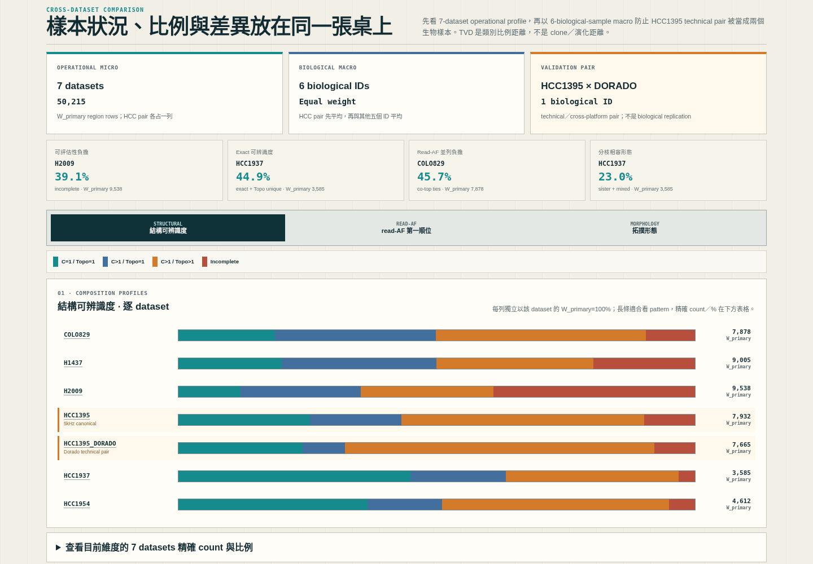
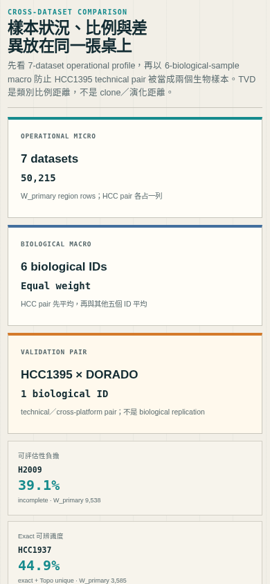
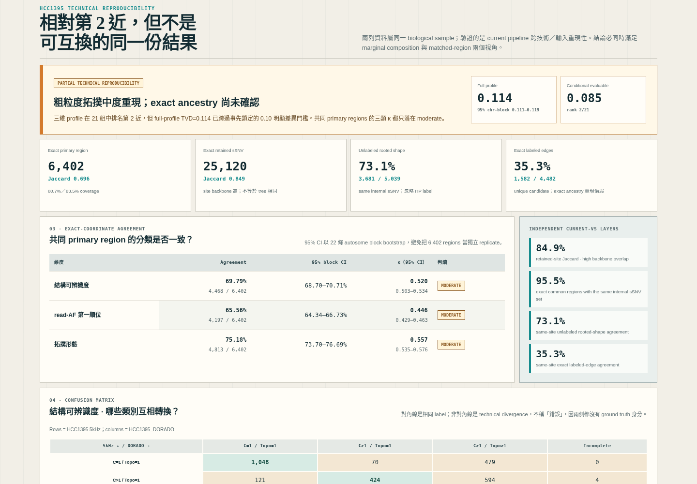
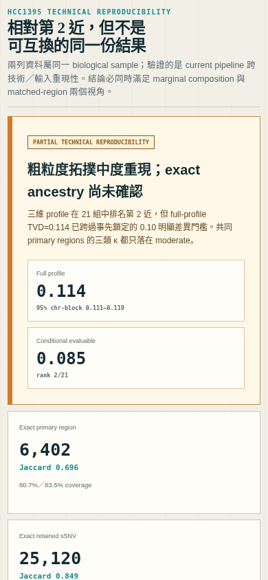

<!--
建立時間: 2026-07-15 17:43 +0800
目標: 完整整理 current-v5 七資料集的 regional topology 狀況、比例、跨樣本差異與 HCC1395 跨技術重現性。
處理範圍: GRCh38 chr1-22；7 datasets／6 biological samples；current canonical v5；Task type B comprehensive validation。
關聯檔案:
  - InterSubMod/docs/methodology/_assets/layered_workstation/index.html
  - InterSubMod/research/20260715_sample_topology_comparison/artifacts/sample_topology_comparison.json
  - InterSubMod/research/20260715_sample_topology_comparison/artifacts/hcc1395_exact_signature_validation.json
  - InterSubMod/research/20260715_sample_topology_comparison/qa/playwright/validation_receipt.json
  - InterSubMod/research/20260715_sample_topology_comparison/qa/full_regression/validation_receipt.json
-->

# 七資料集拓撲結構比較與 HCC1395 跨技術重現性驗證

> **TL;DR — 完成 7 datasets／6 biological IDs 的全 chr1–22 統計與互動展示；HCC1395／DORADO 在 21 組 profile 中相對第 2 近，但 full-profile TVD=0.114 已達事先鎖定的「明顯差異」，共同 primary regions 的三維 κ 只有 0.446–0.557，因此結論是「粗粒度 regional topology 中度重現、不可互換、exact ancestry 尚未確認」。（影響：高；信心：高）**

**敘述框架：SCQA + evidence ladder。** 先界定資料 grain，再回答 cohort 結構、樣本差異、HCC1395 技術重現性，最後列出可重跑證據與 claim ceiling。

## 1. 問題、範圍與判定單位

本分析回答的是：在同一 current-v5 pipeline 下，各 dataset 的 **regional mutation-state topology profile** 如何分布、哪些樣本在比例上接近，以及同一 HCC1395 biological sample 的 5kHz canonical 與 DORADO technical/cross-platform dataset 是否重現。

它不回答 biological clone 數、真實 clone tree、樣本身分或 caller accuracy。HCC1395 與 HCC1395_DORADO 是同一 biological sample 的兩個技術資料列，不是兩個 biological replicates；若要驗證樣本身分，需另做 germline SNP fingerprint。

| Grain | 數量 | 用途 |
|---|---:|---|
| Dataset | 7 | 每個輸入／技術流程各自一列，供 operational comparison |
| Biological ID | 6 | HCC pair 先平均，再讓六個 biological IDs 等權重 |
| `W_tree` | 51,815 regions | chr1–22 retained multilocus region universe |
| `W_primary` | 50,215 regions | 至少一個 mutation-bearing HP1/HP2 primary unit；本報告三個分類維度的分母 |
| Pairwise dataset pairs | 21 | 7 choose 2；用於相對距離排名 |

三個維度不可互相代稱：

1. **結構可辨識度**：exact+Topo 唯一／Topo 唯一但 exact 多解／Topo 多解／incomplete。
2. **read-AF 第一順位**：在 structural candidates 內以同一 primary HP family 的 ALT/(REF+ALT) 描述性排序；不是 VCF caller AF、posterior、CCF 或 calibrated probability。
3. **拓撲形態**：單支、直系、旁系、直系＋旁系、未解；只描述 HP 內 mutation-state nesting／branching，不等於 clone census。

## 2. Cohort 全貌：micro 與 biological macro

### 2.1 7-dataset micro（依 region 數加權）

| 維度 | 類別 | Count | 比例 |
|---|---|---:|---:|
| 結構 | exact 與 Topo 皆唯一 | 11,582 | 23.1% |
| 結構 | Topo 唯一、exact 多解 | 10,737 | 21.4% |
| 結構 | Topo 多解 | 19,921 | 39.7% |
| 結構 | incomplete | 7,975 | 15.9% |
| read-AF | structural exact unique | 11,582 | 23.1% |
| read-AF | read-AF 唯一第一順位 | 20,732 | 41.3% |
| read-AF | 並列第一、同一 Topo | 6,768 | 13.5% |
| read-AF | 並列第一、多 Topo | 2,152 | 4.3% |
| read-AF | 不可排序 | 1,006 | 2.0% |
| read-AF | incomplete | 7,975 | 15.9% |
| 形態 | 單支／無 HP 內關係 | 6,369 | 12.7% |
| 形態 | 直系鏈 | 28,855 | 57.5% |
| 形態 | 旁系／分支 | 1,715 | 3.4% |
| 形態 | 直系＋旁系 | 2,428 | 4.8% |
| 形態 | 未解 | 10,848 | 21.6% |

三個 partition 都精確回加 50,215；不可把 39.7% Topo 多解、41.3% read-AF 唯一第一順位與 57.5% 直系鏈當作同一概念。

### 2.2 6-biological-sample macro（每個 biological ID 等權重）

HCC technical pair 先平均，再與另外五個 biological IDs 平均。結構比例為：exact+Topo 唯一 26.2%、Topo 唯一但 exact 多解 21.7%、Topo 多解 37.9%、incomplete 14.2%。這個口徑避免 HCC1395 因兩個 dataset 被重複加權；它與 7-dataset micro 的差異也顯示 denominator／weighting 必須明示。

## 3. 各 dataset 的實際 profile

下表所有百分比都以該列自己的 `W_primary=100%`。`AF 並列`合併同 Topo 與多 Topo ties；`分枝相容`合併 sister branch 與 direct+sister。

| Dataset | W_primary | Exact+Topo 唯一 | Topo 唯一 | Topo 多解 | Incomplete | AF 唯一首位 | AF 並列 | 直系 | 分枝相容 | 形態未解 |
|---|---:|---:|---:|---:|---:|---:|---:|---:|---:|---:|
| COLO829 | 7,878 | 18.7% | 31.2% | 40.6% | 9.5% | 25.3% | **45.7%** | 56.4% | 0.7% | 26.4% |
| H1437 | 9,005 | 20.0% | 29.9% | 30.4% | 19.6% | 35.7% | 24.2% | 62.4% | 4.1% | 23.2% |
| H2009 | 9,538 | 12.0% | 23.3% | 25.6% | **39.1%** | 31.3% | 16.1% | 46.9% | 7.2% | **41.4%** |
| HCC1395 | 7,932 | 25.5% | 17.7% | 47.0% | 9.8% | **57.7%** | 5.7% | **64.9%** | 12.2% | 11.6% |
| HCC1395_DORADO | 7,665 | 24.1% | 8.1% | **59.9%** | 7.9% | 51.6% | 8.9% | 59.9% | 5.2% | 17.4% |
| HCC1937 | 3,585 | **44.9%** | 18.5% | 33.4% | **3.2%** | 46.1% | 4.7% | 60.0% | **23.0%** | **3.9%** |
| HCC1954 | 4,612 | 36.6% | 14.5% | 44.0% | 5.0% | 51.1% | 6.5% | 52.7% | 18.2% | 7.3% |

可操作的樣本摘要：

- **H2009 是可評估性壓力最大的 dataset**：incomplete 39.1%、形態未解 41.4%。這是 pipeline／evidence burden 的訊號，不應直接寫成 biology 更複雜。
- **HCC1937 的 exact 可辨識度最高**：44.9%，且分枝相容 23.0% 也是最高；它適合做「結構較豐富且可追查」的展示樣本。
- **COLO829 的 read-AF 並列負擔最高**：45.7%，說明 structural candidates 後仍有大量順位無法唯一縮減。
- **HCC1395 canonical 的 read-AF unique-first 最高**：57.7%，直系鏈 64.9%；DORADO 的 Topo 多解卻升至 59.9%，是兩技術資料不可互換的第一個明顯警訊。





## 4. 跨樣本比較：比例距離不是 biological distance

主畫面以 total variation distance（TVD）比較類別比例；0 代表兩列比例相同。三維 TVD 的平均只命名為 `profile_mean_tvd`，不稱 clone／演化／生物距離。事先鎖定的 operational band 為：≤0.05 接近、>0.05–0.10 中度差異、>0.10 明顯差異。

| Rank / 21 | Pair | Full profile mean TVD | Conditional-evaluable mean TVD | 判讀 |
|---:|---|---:|---:|---|
| 1 | HCC1937 × HCC1954 | 0.110 | 0.100（rank 3） | 相對最近，但仍跨過 0.10；不能宣稱同源 |
| 2 | **HCC1395 × HCC1395_DORADO** | **0.114** | **0.085（rank 2）** | 相對接近；full profile 仍屬明顯差異 |
| 3 | HCC1395 × HCC1954 | 0.132 | 0.126（rank 5） | 明顯差異 |
| 4 | COLO829 × H1437 | 0.142 | 0.122（rank 4） | 明顯差異 |

HCC pair 為 mutual nearest neighbor，但不是 21 組中的第 1 名；這正好避免「同一 biological sample 所以一定最像」的循環論證。conditional-evaluable 排除 incomplete／unavailable 類別後降至 0.085，表示一部分差異來自可評估性，但 structural conditional TVD 仍為 0.129；不能只挑較好看的 conditional 數字。

以 22 autosomes 作 block bootstrap（5,000 次）後，HCC full-profile TVD 的 95% CI 為 0.111–0.119，98.74% bootstrap replicate 仍排在前 2；leave-one-chromosome-out 範圍 0.1135–0.1155。相對排名穩定，但絕對差異也穩定高於 0.10。

## 5. HCC1395／DORADO：分層驗證結果

### 5.1 Marginal composition

| 維度 | TVD | 21 組排名 | Conditional-evaluable TVD | Conditional 排名 |
|---|---:|---:|---:|---:|
| 結構可辨識度 | 0.129 | 4 | 0.129 | 6 |
| read-AF 第一順位 | 0.094 | 2 | 0.041 | 1 |
| 拓撲形態 | 0.121 | 5 | 0.085 | 4 |
| 三維平均 | **0.114** | **2** | **0.085** | **2** |

### 5.2 Exact-coordinate matched regions

- 全 region exact-coordinate intersection：6,998；Jaccard=0.728。
- 兩側都有 primary unit 的 exact-coordinate intersection：6,402；Jaccard=0.696；coverage 為 HCC1395 80.7%、DORADO 83.5%。

| 維度 | Agreement | 95% chr-block CI | Cohen's κ | κ 95% CI | 判讀 |
|---|---:|---:|---:|---:|---|
| 結構可辨識度 | 4,468 / 6,402 = 69.79% | 68.70–70.71% | 0.520 | 0.503–0.534 | moderate |
| read-AF 第一順位 | 4,197 / 6,402 = 65.56% | 64.34–66.73% | 0.446 | 0.429–0.463 | moderate |
| 拓撲形態 | 4,813 / 6,402 = 75.18% | 73.70–76.69% | 0.557 | 0.535–0.576 | moderate |

raw agreement 會被 dominant class 抬高，所以必須與 κ、confusion matrix 一起讀。三個 κ 都沒有達到事先鎖定的 substantial（≥0.60）。

### 5.3 從 site backbone 到 exact ancestry 的 evidence ladder

| 證據層 | 結果 | 能支持什麼 |
|---|---:|---|
| Exact retained allele-site overlap | 25,120；Jaccard 84.87% | retained mutation backbone 高度重疊 |
| 相同 exact region 且 internal sSNV set 相同 | 6,682 / 6,998 = 95.48% | 大多數共同 region 內部位置集合一致 |
| 同 internal sSNV、兩側 shape 可解時的 unlabeled rooted-shape agreement | 3,681 / 5,039 = 73.05% | 忽略 HP label 後，粗粒度 shape 中度重現 |
| 再限制 primary unit 數相同 | 3,681 / 4,508 = 81.65% | 一部分 shape 差異由 unit count 不同解釋 |
| 同 internal sSNV、兩側 candidate unique 時的 exact labeled-edge agreement | 1,582 / 4,482 = **35.30%** | exact ancestry 重現仍弱，不可宣稱同一棵樹 |

資料口徑注意：exact-signature artifact 另以 `(chrom, position)` 計數 retained-position overlap，得到 25,121／84.88%；上表與 HTML 顯示的是較嚴格 `(chrom, position, REF, ALT)` allele-site key 25,120／84.87%。差異可精確定位至 `chr1:70439946`：HCC1395 為 C>A、DORADO 為 C>T；因此 position key 視為共同、allele key 不視為共同。比例結論不變，但 count 不應混用。





## 6. 結論與 claim ceiling

可支持的結論是：

> **同一 HCC1395 biological sample 的兩份資料在 retained-site backbone 與粗粒度 regional mutation-state profile 上有部分至中度跨技術重現；它們在 cohort 中相對接近，但 full-profile 差異、matched-label κ 與 exact labeled-edge agreement 顯示兩份輸出不可互換，且 exact ancestry 尚未確認。**

不可支持：

- 「兩個 dataset 得到相同真樹／clone tree」。
- 「已驗證 biological clone 或 clone K」。
- 「因 HCC pair 接近，所以 topology 是 accuracy ground truth」。
- 「HCC1937／HCC1954 比例最近，表示生物演化關係最近」。
- 「6,402 matched regions 是 6,402 個獨立 biological replicates」。

## 7. HTML 展示與互動設計

`InterSubMod/docs/methodology/_assets/layered_workstation/index.html` 已加入：

1. 7-dataset operational micro、6-biological-ID macro 與 HCC validation pair 三張 scope 卡。
2. 自動標記各 dataset 的 extreme／canonical observation，避免只靠主觀挑樣本。
3. structural／read-AF／morphology 三維切換；每維度都有 7 條 100% profile、精確 count 表與 7×7 TVD matrix。
4. 點 matrix 任意 pair 可看 relationship、距離與逐類差值；HCC pair 會明示 same biological sample technical pair，其他 pair 明示 different biological samples。
5. HCC 專區同時展示 marginal rank、exact-region overlap、matched agreement／κ／CI、confusion matrix 與 exact-signature evidence ladder。
6. 所有 `.json` 證據連結都放在預設關閉的 `<details>`，不干擾閱讀數字。
7. 原有 7 個樣本頁的 chr1–22 全基因圖、多選、再次點擊取消、未選即全部、region detail 與七種 overview panel 均保留。

## 8. 可重跑分析、輸入、輸出與實際驗證

### 8.1 主比較分析

**輸入**：

- `InterSubMod/research/20260715_layered_workstation_genome_topology_multiselect/data/current_v5_read_af_topology/`
- `InterSubMod/research/20260714_hcc1395_unknown_k_clone_state_consistency/results/unknown_k_consistency.json`
- `InterSubMod/research/20260715_sample_topology_comparison/artifacts/hcc1395_exact_signature_validation.json`

**命令**：

```bash
python3 InterSubMod/research/20260715_sample_topology_comparison/scripts/analyze_sample_topology_comparison.py \
  --sidecar-dir InterSubMod/research/20260715_layered_workstation_genome_topology_multiselect/data/current_v5_read_af_topology \
  --unknown-k InterSubMod/research/20260714_hcc1395_unknown_k_clone_state_consistency/results/unknown_k_consistency.json \
  --exact-signature InterSubMod/research/20260715_sample_topology_comparison/artifacts/hcc1395_exact_signature_validation.json \
  --output-dir InterSubMod/research/20260715_sample_topology_comparison/artifacts \
  --bootstrap-iterations 5000 --seed 20260715
```

**輸出**：

- `InterSubMod/research/20260715_sample_topology_comparison/artifacts/sample_topology_comparison.json`
- `InterSubMod/research/20260715_sample_topology_comparison/artifacts/sample_topology_profiles.tsv`
- `InterSubMod/research/20260715_sample_topology_comparison/artifacts/pairwise_profile_distances.tsv`
- `InterSubMod/research/20260715_sample_topology_comparison/artifacts/hcc1395_matched_by_chromosome.tsv`
- `InterSubMod/research/20260715_sample_topology_comparison/artifacts/validation_receipt.json`

**實際輸出片段**：receipt `status=PASS`；7 datasets、6 biological samples、21 pairs、三維 partition 守恆、pair matrix 對稱、HCC confusion denominator 守恆與 exact-signature checks 全部為 `true`。主 artifact SHA256=`6b1ec35faaf5badb5daa523f13e760368a3638c1da1a1e573a75274d8d97bc3f`。

### 8.2 HTML build

**輸入**：current summary、7 sample region-view JSON、7 read-AF/morphology sidecars、主比較 artifact、HCC exact-signature artifact。

**命令**：

```bash
python3 InterSubMod/docs/methodology/_assets/20260627_subclone_4axis_teaching/scripts/build_layered_per_sample.py --index-only
```

**輸出**：`InterSubMod/docs/methodology/_assets/layered_workstation/index.html`

**實際輸出片段**：`[COLO829] ... [HCC1954] VERIFIED hash-bound page`；`OK canonical index + 7/7 hash-bound sample pages`；exit=0；index SHA256=`fce3b88e71c1bc3063da732556637408be301eb208120fed38a0d3899555fd49`。

### 8.3 Chromium／Playwright

**Focused comparison QA 命令**：

```bash
python3 InterSubMod/research/20260715_sample_topology_comparison/scripts/audit_sample_topology_comparison_playwright.py \
  --index InterSubMod/docs/methodology/_assets/layered_workstation/index.html \
  --comparison InterSubMod/research/20260715_sample_topology_comparison/artifacts/sample_topology_comparison.json \
  --output-dir InterSubMod/research/20260715_sample_topology_comparison/qa/playwright \
  --timeout-ms 180000
```

**實際輸出**：desktop PASS、mobile PASS、30/30 checks、4 screenshots、exit=0。檢查包含 7/7 profile rows 可見、三維切換同步、7×7 對稱 matrix、HCC denominator、44px touch target、無 body overflow、JSON links 隱藏、無 console/page error，以及截圖捲動落點。

**全工作站回歸命令**：

```bash
python3 InterSubMod/research/20260715_layered_workstation_genome_topology_multiselect/scripts/audit_layered_workstation_playwright.py \
  --workstation-dir InterSubMod/docs/methodology/_assets/layered_workstation \
  --sidecar-dir InterSubMod/research/20260715_layered_workstation_genome_topology_multiselect/data/current_v5_read_af_topology \
  --output-dir InterSubMod/research/20260715_sample_topology_comparison/qa/full_regression \
  --timeout-ms 180000
```

**實際輸出**：16 page runs、219/219 checks、18 screenshots、exit=0；7 個樣本頁 × 桌面／手機與首頁 × 桌面／手機全通過。

### 8.4 單元測試

```bash
python3 -m unittest -v \
  InterSubMod/research/20260715_sample_topology_comparison/scripts/test_sample_topology_comparison.py \
  InterSubMod/research/20260715_sample_topology_comparison/scripts/test_hcc_exact_signature.py
```

實際輸出：14 tests，全部 `OK`。

## 9. Durable evidence map

| 用途 | 路徑 |
|---|---|
| 人類主介面 | `InterSubMod/docs/methodology/_assets/layered_workstation/index.html` |
| 完整機器資料 | `InterSubMod/research/20260715_sample_topology_comparison/artifacts/sample_topology_comparison.json` |
| 每樣本精確比例 | `InterSubMod/research/20260715_sample_topology_comparison/artifacts/sample_topology_profiles.tsv` |
| 21 pair 距離 | `InterSubMod/research/20260715_sample_topology_comparison/artifacts/pairwise_profile_distances.tsv` |
| HCC chromosome blocks | `InterSubMod/research/20260715_sample_topology_comparison/artifacts/hcc1395_matched_by_chromosome.tsv` |
| HCC exact shape／edge | `InterSubMod/research/20260715_sample_topology_comparison/artifacts/hcc1395_exact_signature_validation.json` |
| 分析 receipt | `InterSubMod/research/20260715_sample_topology_comparison/artifacts/validation_receipt.json` |
| Focused UI receipt | `InterSubMod/research/20260715_sample_topology_comparison/qa/playwright/validation_receipt.json` |
| Full regression receipt | `InterSubMod/research/20260715_sample_topology_comparison/qa/full_regression/validation_receipt.json` |

## 10. 尚未完成但已明確界定的外部驗證

1. 加入 germline SNP fingerprint，獨立回答「兩列是否同一樣本」；目前 topology 只回答輸出重現性。
2. 累積更多同樣本 technical pairs，才能校準 TVD／κ 的 empirical reproducibility range；目前門檻是事先鎖定的 operational band，不是 universal cutoff。
3. 加入 allele-specific CN、purity、LOH 與更合理的 PS／spatial block resampling，評估哪些差異源自 evidence／coverage，而非 topology solver。
4. 若要宣稱 biological clone／真樹，需要 cell-resolved 或 single-cell ground truth；bulk HP regional graph 本身不足以識別。
