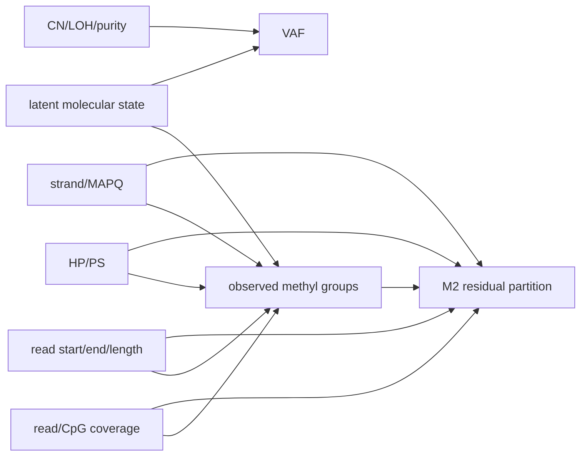

<!--
建立時間: 2026-07-18 23:45 +08:00
目標: 在 derivative report 實作前鎖定母體、假設、否證條件與 claim ceiling
處理範圍: positional-singleton focal-ALT methyl substructure 全量統計與 HCC1395 深入視覺化
關聯檔案:
  - InterSubMod/research/20260718_singleton_alt_methyl_substructure_validation/00_INDEX.md
-->

# Pre-decision audit

## Verdict

**GO（85/100）做完整 singleton derivative validation 與 HTML；NO-GO 將 M2 PASS 命名為已證實 clone/subclone。**

Cynefin：**Complicated**。母體與 source-attested audit 已完成，現在是 deterministic 重算、read-level exact join、
confound guardrail 詮釋與報告工程；生物 lineage 判定仍屬 Complex，因缺第二 genetic marker 與 CN/CCF。

## 啟動研究五問

1. Thread D（read-level epigenetic）相關？**是**。
2. Thread B 撤回範圍內？**否**；本任務不是已撤回的 global methyl-only caller filter claim。
3. KDE-corrected？**不適用**；本任務直接使用 focal-ALT per-read methylation probabilities 與 Bernoulli distance。
4. 需要 VCF caller AF？**是**，只作 locus burden/context；使用 frozen caller AF，不以 merged AF 取代，也不拿 AF 推導 methyl group。
5. 長計算／C++／搬移／NO-GO gate？**無新 C++、無檔案搬移、無重跑 469,849-site producer**；只讀既有完整 audit 與兩個 HCC1395 原始矩陣。

## 關鍵假設

- `LAT` 解讀為 `ALT`；若原意不是 ALT，這份報告的 focal allele scope 需另案重做。
- 8,279 是 HCC1395 positional-singleton dataset-sites，不是全部 HCC1395 sSNV、也不是 8,279 個 sSNV 在一個區域。
- M1 stable multigroup 是高敏感度 operational screen；M2 PASS 才能稱已測軸下的 residual partition。
- M2 `NOT_EVALUABLE` 是資訊不足，不等於 FAIL；M2 `NOT_RUN` 是 M1 未標記，不等於真陰性。
- 高 VAF 可相容 clonal burden、LOH、copy number、purity 等多種機制；不能獨立定義 subclone。

## DAG 與主要混淆

M2 對圖中的已測 read/HP/confound axes 做 guardrail；CN/LOH/purity 與 matched-normal 尚未閉合，
因此 M2 最多支援 read-level molecular substructure compatibility，不支援 cellular identity 或 ancestry。

## Fail-closed 條件

- 核心計數非 50,432 / 8,279 / 734 / 2。
- 任一 HCC1395 M2 PASS target 無法 exact join 全部 core reads。
- 上游 SHA-256 與 `_SUCCESS.json` 不一致。
- artifact validator 或 browser verification 不通過。

## 替代方案

- 更簡單：只做數字表，不畫 heatmap。缺點是無法讓讀者肉眼檢查 read-level block structure。
- 更完整：等待正式 cooccurrence + matched-normal + CN/CCF 鏈後再發布 clone-level報告。這是升級 biological claim 的必要後續，
  但不阻塞目前 singleton operational audit 的可重現報告。

