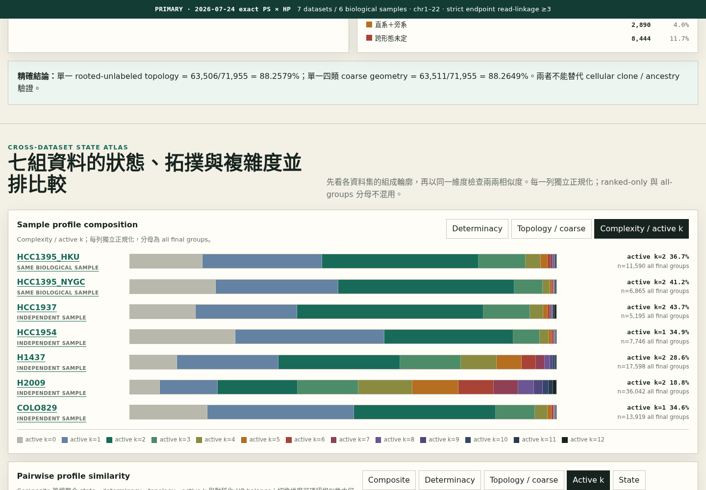
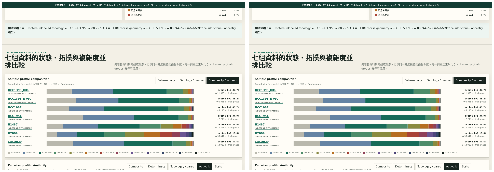
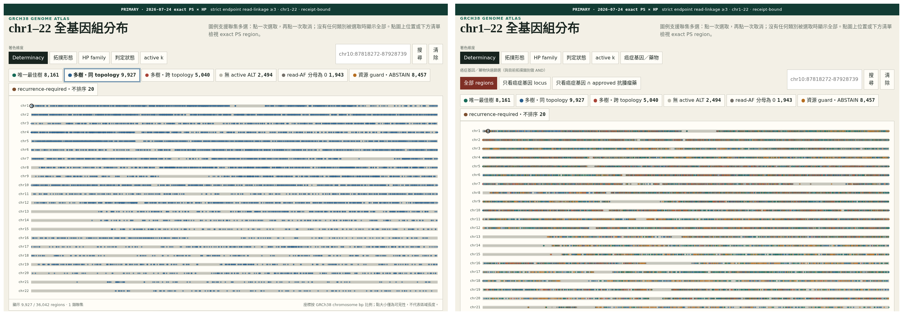
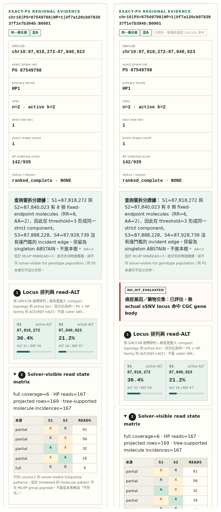
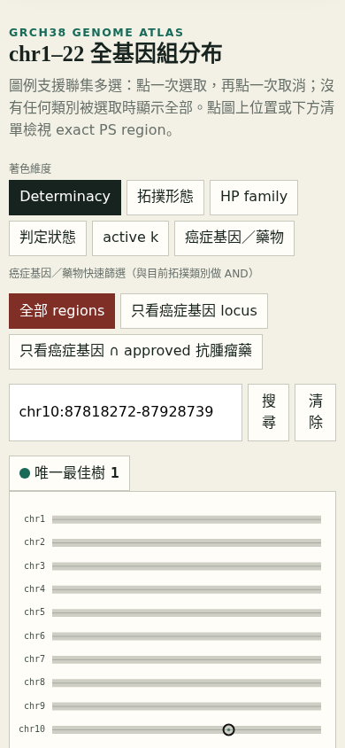

<!--
建立時間: 2026-07-24
目標: 將 exact-PS×HP 全七資料升為 layered_workstation 預設 authority，完成資料與 Chromium 視覺稽核
處理範圍: Task Type B / 7 datasets / 6 biological samples / GRCh38 chr1-22
關聯檔案:
  - InterSubMod/research/20260724_exact_ps_cpp_topology_signature_census/scripts/build_exact_ps_layered_workstation.py
  - InterSubMod/research/20260724_exact_ps_cpp_topology_signature_census/scripts/build_exact_ps_gene_drug_annotation.py
  - InterSubMod/research/20260724_exact_ps_cpp_topology_signature_census/tests/test_exact_ps_layered_workstation.py
  - InterSubMod/research/20260724_exact_ps_cpp_topology_signature_census/artifacts/exact_ps_workstation_audit_v3_all7_07/receipt.json
  - InterSubMod/docs/methodology/_assets/layered_workstation/index.html
-->

# exact-PS 分層拓撲工作站重建與視覺稽核

> **結論：新版已升為預設 authority，完整候選空間、跨樣本比較與
> exact-locus 癌症基因／藥物 context 均已接入；7/7 dataset 與
> 桌機/手機互動皆通過。**
> 舊 `adjacent_gap<=50000` 只留在 legacy 說明；不能再進入新版分母。
> 本任務服務 G4（多樣本 reproducibility）與 G5（外部可驗證證據鏈）。

## 1. 新版回答什麼

新版 region grain 是：

```text
exact nonmissing PS
× primary HP1 / HP2
× threshold-3 strict endpoint read-linkage component
× bounded block
```

它回答區域性的數學 topology 是否在目前 recurrence-allowed minimum graph
model 與 read-AF ordering score 下唯一或同形；不回答 cellular clone 身分、
真實 ancestry、CCF、CN/LOH 正確性或 calibrated posterior。

## 2. 權威分母

| 層 | 數量 | 用途 |
|---|---:|---|
| final topology groups | 98,955 | 全基因圖與 status universe |
| mutation-bearing | 85,941 | 有 active ALT 的 group |
| resource-limit ABSTAIN | 10,717 | 明示不可評估，不等於 negative |
| zero denominator | 3,224 | read-AF 不可排序 |
| recurrence-required | 45 | 不在 recurrence-compatible ranking |
| ranked complete | 71,955 | determinacy/signature 唯一分母 |
| global-best trees | 680,527 | 展開的 co-best tree 數；不是 region 分母 |

Ranked-complete 結果：

- `UNIQUE_TREE`：39,648（55.1011%）；
- `TIED_SAME_TOPOLOGY`：23,858（33.1568%）；
- `TIED_CROSS_TOPOLOGY`：8,449（11.7421%）；
- 單一 exact rooted-unlabeled shape：63,506（88.2579%）。

## 3. HTML 資訊層次

1. Cohort index 先顯示 authority、claim ceiling 與 evidence funnel。
2. 再顯示 7 dataset 的 determinacy、coarse morphology、active-k
   composition 與 7×7 profile-similarity matrix。
3. Sample 頁先分清 final/mutation/ranked/ABSTAIN 分母。
4. GRCh38 canvas 支援 Determinacy、形態、HP、狀態、active k 與
   癌症基因／藥物 annotation 六 mode 多選。
5. 圖例點一次選取、第二次取消；沒有選擇即全部。
6. 癌症基因／藥物 quick filter 與目前圖例採 AND；切 filter 後不存在的
   legend key 會清除，不留下零結果孤兒 selection。
7. Region detail 固定依序顯示 gene/drug context、locus rail、
   solver-visible read-state
   matrix、完整 minimum candidate edge union、AF-global-best edge union、
   deterministic selected tree、exact shape exemplar、minimum vertex-set
   carousel 與 determinacy。三者不可混成一棵樹。
8. 圖上 hidden states 用 `H:S1+S2` 等縮寫避免長 state 重疊；
   完整 state 仍保留在 hover、vertex set 與 edge census。
9. `.json` 與 receipt 路徑只在預設收合的 provenance 區。











## 4. chr10 邊界 regression

舊 `chr10:87818272-87928739` 四點區在新 authority 下不成立。

- HCC1395 final tree unit 只有 `{87818272, 87840023}`：
  exact PS=87549798、HP1、bridge support=8、
  `UNIQUE_TREE / Direct-only`、`ROOT → H_AR → H_AA`。
- 此 unit 有 3 個 minimum vertex sets、3 棵 minimum trees；完整 edge
  union 是 `ROOT→H:S1`、`ROOT→H:S2`、`H:S1→H:S1+S2`、
  `H:S2→H:S1+S2`；此區只有一棵 global-best tree，因此藍色
  global-best union 與綠色 selected tree 都是前者的直系路徑。
- read-state matrix 的 threshold-3 patterns 為
  `AX=32`、`RX=50`、`XA=18`、`XR=61`、`RR=6`；不能把 partial pattern
  當成 fixed-endpoint bridge。
- S3=87888228、S4=87928739 的相鄰 bridge support 都是 0，
  停在 source singleton abstain，不進 final tree input。
- actual loci 87,818,272 / 87,840,023 均在 PTEN GENCODE gene body
  87,862,638–87,971,930 之外；UI 必須顯示
  `NO_HIT_EVALUATED`，不能讓舊 search envelope 製造 PTEN hit。
- HCC1395_DORADO 的四個共同座標都沒有 final topology group；
  正確顯示是「不可比較」，不是 topology=0。

Regression test 同時鎖定位置集合、resolution、coarse class、代表 edges，
完整 candidate union／selected subset，並禁止 S3/S4 回流舊四點 unit。

## 5. 跨樣本比較與 HCC1395 technical pair

主頁顯示順序固定為：

```text
HCC1395_HKU → HCC1395_NYGC → HCC1937 → HCC1954
→ H1437 → H2009 → COLO829
```

這只是 presentation alias：

- `HCC1395_HKU` 的 authority key／檔名仍是 `HCC1395`；
- `HCC1395_NYGC` 的 authority key／檔名仍是 `HCC1395_DORADO`；
- 權威 receipt、hash、sidecar join 與 regression 一律使用內部 key。

HCC technical pair 的五維 cohort composition similarity 為
`0.926381`，在 21 pairs 排名第 1；chr-block bootstrap 95% CI 為
`0.912684–0.934393`。嚴格逐區比較必須先通過共同 ordered-locus key、
兩邊皆 ranked、active loci 相同與兩邊皆唯一最佳樹等 gate；最後
selected labeled tree 相同為 `443/564 = 78.5%`。

這支持 technical concordance，但**不證明**相同 cellular clone、
共同 biological ancestry 或可互換的 region tree。

## 6. 已執行命令

輸入：

```text
/big7_disk/liaoyoyo2001/big7_disk_output/synthesis/research_rounds/
20260724_exact_ps_cpp_topology_af_all_samples/all7_strict_guard1000_v1/

/big7_disk/liaoyoyo2001/big7_disk_output/synthesis/observation_workspaces/
20260724_exact_ps_cpp_topology_signature_census/all7_v1/

/big7_disk/liaoyoyo2001/big7_disk_output/synthesis/observation_workspaces/
20260725_exact_ps_candidate_factorization/all7_v2/

/big7_disk/liaoyoyo2001/big7_disk_output/synthesis/observation_workspaces/
20260725_exact_ps_cohort_similarity/all7_v1/cohort_similarity.v1.json

/big7_disk/liaoyoyo2001/big7_disk_output/synthesis/observation_workspaces/
20260725_exact_ps_gene_drug_annotation/all7_v2/
```

Sidecars（write-once；以下是正式建置時的實際目標）：

```bash
python3 \
  InterSubMod/research/20260724_exact_ps_cpp_topology_signature_census/scripts/build_exact_ps_candidate_factorization.py \
  --output-root \
  /big7_disk/liaoyoyo2001/big7_disk_output/synthesis/observation_workspaces/20260725_exact_ps_candidate_factorization/all7_v2

python3 \
  InterSubMod/research/20260724_exact_ps_cpp_topology_signature_census/scripts/build_exact_ps_cohort_similarity.py \
  --output \
  /big7_disk/liaoyoyo2001/big7_disk_output/synthesis/observation_workspaces/20260725_exact_ps_cohort_similarity/all7_v1/cohort_similarity.v1.json

python3 \
  InterSubMod/research/20260724_exact_ps_cpp_topology_signature_census/scripts/build_exact_ps_gene_drug_annotation.py \
  --gencode \
  /big7_disk/liaoyoyo2001/gene_annotation/gencode.v46.basic.annotation.gtf.gz \
  --cgc \
  /big7_disk/liaoyoyo2001/gene_annotation/Cosmic_CancerGeneCensus_v104_GRCh38.tsv.gz \
  --cosmic-genes \
  /big7_disk/liaoyoyo2001/gene_annotation/cosmic_v104/Cosmic_Genes_v104_GRCh38.tsv.gz \
  --dgidb \
  /big7_disk/liaoyoyo2001/gene_annotation/dgidb_interactions.tsv \
  --output-dir \
  /big7_disk/liaoyoyo2001/big7_disk_output/synthesis/observation_workspaces/20260725_exact_ps_gene_drug_annotation/all7_v2
```

先驗證、再重建：

```bash
python3 \
  InterSubMod/research/20260724_exact_ps_cpp_topology_signature_census/scripts/build_exact_ps_layered_workstation.py \
  --verify-only

python3 \
  InterSubMod/research/20260724_exact_ps_cpp_topology_signature_census/scripts/build_exact_ps_layered_workstation.py
```

實際輸出片段：

```text
OK exact-PS authority verified: samples=7 groups=98955 ranked=71955
INPUT_GENE_DRUG=.../20260725_exact_ps_gene_drug_annotation/all7_v2/annotation.v1.json
OUTPUT=InterSubMod/docs/methodology/_assets/layered_workstation/index.html
OUTPUT_SAMPLE_PAGES=7
GENE_DRUG_SHA256=148f74e9f958cccffe14a2297e9453e28b2346a424adcb30e350f79e91ae4f50
```

資料、候選空間、相似度與跨面板 regression：

```bash
python3 -m unittest \
  InterSubMod/research/20260724_exact_ps_cpp_topology_signature_census/tests/test_exact_ps_gene_drug_annotation.py \
  InterSubMod/research/20260724_exact_ps_cpp_topology_signature_census/tests/test_exact_ps_candidate_factorization.py \
  InterSubMod/research/20260724_exact_ps_cpp_topology_signature_census/tests/test_exact_ps_cohort_similarity.py \
  InterSubMod/research/20260724_exact_ps_cpp_topology_signature_census/tests/test_exact_ps_layered_workstation.py
```

實際輸出：

```text
Ran 34 tests
OK
```

Chromium：

```bash
python3 \
  InterSubMod/research/20260724_exact_ps_cpp_topology_signature_census/scripts/audit_exact_ps_workstation_playwright.py \
  --output-dir \
  InterSubMod/research/20260724_exact_ps_cpp_topology_signature_census/artifacts/exact_ps_workstation_audit_v3_all7_07
```

實際輸出：

```json
{
  "all_pass": true,
  "all_pages_audited": true,
  "no_console_errors": true,
  "no_external_requests": true,
  "no_horizontal_overflow": true,
  "screenshots_recorded": true
}
```

實際輸出為 16 page states、44 張 PNG 與 84 個 mode-level interaction
records；receipt 保存每張 PNG 的
尺寸、bytes 與 SHA-256。桌面圖框必須在預設位置完整可見；手機若需
內層水平捲動，audit 會實際捲到最右端確認內容可達。

## 7. 獨立審查

Claude Code 2.1.219 以 `claude-opus-5`、max effort、plan mode 與
唯讀 `Read/Grep/Glob` 審查 producer、builder、tests、browser audit 與
receipts，結論為 `AGREE_WITH_NOTES`：

- P0/P1：0，四項原 P1 全部關閉；
- all7 `3,554` CGC、`1,252` 同基因 CGC∩drug 與 PTEN negative
  control 均有資料／DOM 雙層 regression；
- 明示「合理，可提交」；
- 它留下的多選覆蓋 P2 已再擴為六個 mode、84 records 全 PASS；
- 其餘兩項僅是 DGIdb count key 命名與 browser expected 同源的
  maintenance notes，不影響 claim ceiling 或數值正確性。

其後 Codex 最終唯讀 diff audit 發現 tied rows 的綠線曾誤用
`global_best_edge_incidence`（多棵 global-best trees 的 edge union），
而非 deterministic selected tree。已改為灰＝minimum union、
藍＝global-best union、綠＝selected exemplar，並新增 H2009
`best_tree_ties=6` regression；此 P1 在最終重建前已關閉。

完整命令、審查文字與 P2 處置：
[Claude Code 分層工作站獨立審查](./20260725_ClaudeCode分層工作站獨立審查_01.md)。

## 8. 尚未跨越的證據邊界

- 10,717 resource-limit ABSTAIN 仍需更強 exact pruning/adaptive second pass。
- candidate sidecar 完整保存目前 canonical `ranked_complete` rows 的
  factorized minimum tree family，但繼承上游
  `all_mutation_bearing_families_complete=false`；不能拿來補造 ABSTAIN。
- HCC1395_HKU 與 HCC1395_NYGC 是同一 biological sample 的兩個
  technical datasets，不是兩個 biological samples。
- CN 在新版 final units 不可用，不能把舊 positional CN sidecar 直接貼回新 grain。
- profile similarity 是 cohort composition；不同細胞株 pair 只可作
  分布觀察，不能轉譯成相同 clone/tree。
- CGC／DGIdb 交集是 gene-level database context，不驗證 topology、
  driver status、藥物反應、適應症或 clinical actionability。
