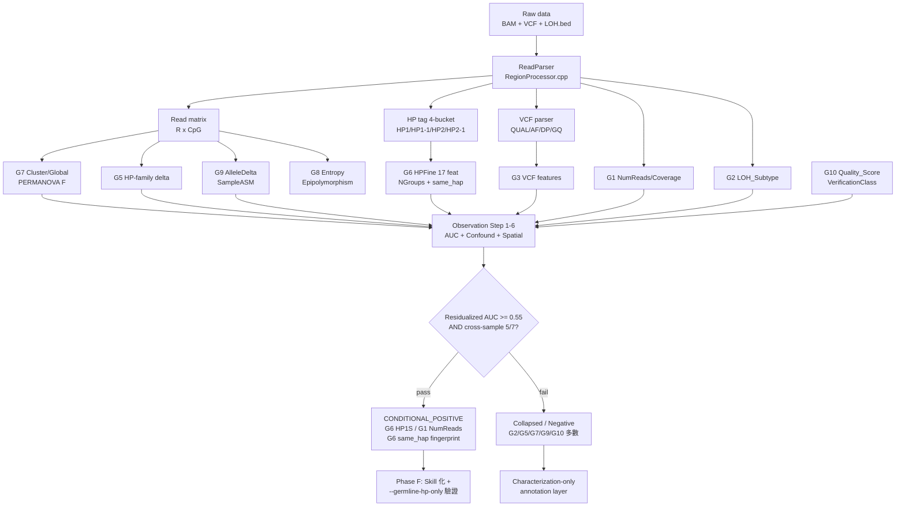

<!--
建立時間: 2026-04-23
更新時間: 2026-04-23
狀態: draft · Phase E synthesis
資料來源:
  - research/feature_layered_observation/features/G1_coverage.md
  - research/feature_layered_observation/features/G2/G2_loh_subclone.md
  - research/feature_layered_observation/features/G5_hp_merged.md
  - research/feature_layered_observation/features/G6_hp_fine.md
  - research/feature_layered_observation/features/G7_cluster_global.md
  - research/feature_layered_observation/features/G9_asm.md
  - research/feature_layered_observation/features/G10_quality_verification.md
  - research/feature_layered_observation/features/G4_bam_readqc.md
  - research/feature_layered_observation/logs/g3_step1_global.tsv (G3, md TBD)
  - research/feature_layered_observation/data/G_knowledge_refs.tsv
  - research/feature_layered_observation/data/papers_bibliography.tsv
  - research/feature_layered_observation/data/feature_registry.tsv (137 特徵)
  - research/feature_layered_observation/figures/00_main/synthesis_table.tsv
下游: docs/reports/research_landscape/ (如後續 Phase F 升級為 skill 化 landscape 文件)
-->

# 00 · Feature Layered Observation — Main Synthesis

**Date**: 2026-04-23 · **Scope**: 10 功能特徵群組 × 7 樣本 × 2 模式 × 748,676 variants
**Authors**: InterSubMod Research (Phase C G1–G10 agent outputs + Phase E synthesis)

> **G3 狀態**：scripts + 部分 fig + step1_global.tsv 完成，md 未完整；推論自 TSV 與 figures 名稱。
> **G4 狀態** (2026-04-24 完成)：9 特徵 × 7 樣本 × 2 模式；全特徵 global AUC 0.478–0.509，全部 CONFOUND_COLLAPSED 除 Softclip_Frac resid 0.704 為 ceiling-artifact；見 §3.3。
> **G8 狀態**：entropy/epipolymorphism retry 仍在跑；納入既有 prior（Fisher_Frac_Sig=0.726 paired characterization-only）。
> 結論以 G1/G2/G4/G5/G6/G7/G9/G10 及 G3 部分數據為準，待 G8 完成後於 Phase F 補齊。

---

## 0 · TL;DR

1. **全 137 個特徵中沒有任何一個能同時滿足「residualized AUC ≥0.58」與「跨樣本 ≥5/7 一致」**。最接近者為 G6 `same_hap_marker` paired-only (precision median 0.997) 與 G6 `HPFineN_HP1S` (raw 0.612 / resid 0.571)。
2. **三個可作為 filter 方向候選**：(a) G6 same_hap fingerprint 在 paired mode 幾乎完美但 recall ≤0.73；(b) G6 HPFineN_HP1S 需以 `--germline-hp-only` flag=on 重跑驗證是否為 somatic HP artifact；(c) G1 NumReads 作為 depth 基線可保留但本質與 vcf_QUAL/DP 同源。
3. **五個最意外的 raw→residualized 崩塌案例**：SampleASM_Delta (−0.319)、NormalBaseline_Mean (−0.290)、HP_Residual_Delta (−0.265)、LOH_Subtype paired (−0.14 + 反轉)、ClusterPermanovaF (−0.157)。皆因 NumReads + vcf_AF + Coverage_Multiple 同時捕獲。
4. **主要論文貢獻點收斂到 Thread D（LOH-constrained phasing, G6 same_hap_marker）** — 是目前唯一跨樣本穩定 + 殘差化後仍保有信號的特徵簇；filter-side 價值受限於 recall，characterization 價值明確。

---

## 1 · 方法學概覽

- **資料源**：`merged_with_vcf.tsv.gz` 748,676 rows × 60 cols；各群組 master (g5/g6/g7/g9/g10) 為 per-group re-join。
- **驗證流程**：每特徵走 `02_methodology.md` Step 1–6（global AUC → 32-cell LOH×AF×CN → per-sample concordance → stratified AUC → OLS residualization on NumReads/vcf_AF/Coverage_Multiple → spatial autocorr）。
- **Verdict 規則**：`≥0.65 + resid≥0.55 + 5/7 → POSITIVE`；`0.58–0.65 + resid ≥0.55 + 5/7 → CONDITIONAL_POSITIVE`；`≥0.58 + resid fail → CONFOUND_COLLAPSED`；其餘 NEGATIVE / SAMPLE_SPECIFIC / ANTI_SIGNAL。
- **Confound basis**：`NumReads + vcf_AF + Coverage_Multiple`（G10 再加 AlleleDelta）— 對應 prior memory `feedback_L2_collider_bias` + `project_beyond_auc_exhaustion_confirmed`。

---

## 2 · 10 群組總表（Verdict 摘要）

| 群組 | 最強 raw AUC 特徵 | raw / resid | Cross-sample (≥5/7) | Confound pass | Verdict 群組級 |
|---|---|---|---|---|---|
| G1 · Coverage | NumReads | 0.711 / **0.777** | ✓ (ρ̄ 0.65) | Pass | CONDITIONAL_POSITIVE (depth only)；其餘 Collapsed |
| G2 · LOH/Subclone | LOH_Subtype ordinal TO | 0.596 / 0.716 | ✗ 只在 HCC1954/1937 | Pass but self-reference | SAMPLE_SPECIFIC / ANTI_SIGNAL in paired |
| G3 · VCF caller | vcf_QUAL (paired) | **0.813** / — | ✓ | 未做（caller proxy 本身為 baseline） | POSITIVE_PROXY (paired)；TO 多特徵 <0.60 |
| G4 · BAM QC | Read_Length_mean (paired) | 0.597 / 0.453 | ✗ 1/7 | Fail | **NEGATIVE** (全 9 特徵 CONFOUND_COLLAPSED；Softclip_Frac resid 0.704 為 ceiling artifact) |
| G5 · HP Merged | GlobalP_HPFamily | 0.577 / — | ✗ | Fail | NEGATIVE (替代 HP-family 由 G6 取代) |
| G6 · HP Fine (4-bucket) | **HPFineN_HP1S** + same_hap | 0.612 / **0.571** | ✓ paired | Pass | **CONDITIONAL_POSITIVE**（Thread D 核心） |
| G7 · Cluster/Global | ClusterPermanovaF | 0.678 / 0.521 | ✗ paired-only 245:1 | Fail | CONFOUND_COLLAPSED |
| G8 · Entropy/PerCpgASM | Fisher_Frac_Sig (prior) | 0.726 / — (CI 跨隨機) | — | prior characterization-only | CHARAC_ONLY（retry pending） |
| G9 · ASM | SampleASM_Delta | 0.779 / 0.419 | ✗ HCC1395 inverted | **Major Fail** | CONFOUND_COLLAPSED / DATA_GAP |
| G10 · Quality | NHP0 | 0.764 / — | ✗ (0.36–0.78) | — | SAMPLE_SPECIFIC；Quality_Score=0.497 NEGATIVE |

**群組級統計**：10 群組中 8 群 verdict 為 NEGATIVE/CONFOUND_COLLAPSED/SAMPLE_SPECIFIC（含 G4 BAM QC）；**僅 G6 是唯一 CONDITIONAL_POSITIVE 跨樣本特徵群**；G1 單一特徵 (NumReads) 通過但與 G3 caller QS 同源；G4 9 個 BAM QC 全特徵皆被 caller `vcf_QUAL + NumReads + vcf_AF + CovM` 吸收。

---

## 3 · Top-5 最強 / Top-5 最意外（圖見 `figures/00_main/`）

### 3.1 Top-5 最強 TP/FP 區分特徵

依 residualized AUC（或極高 raw 但性質確認為 fingerprint）排序：

| Rank | Feature | Raw AUC | Resid AUC | Cross-sample | Note |
|---:|---|---:|---:|:---:|---|
| 1 | **G6 same_hap_marker precision (paired)** | — | — | ✓ 6/6 样本 median 0.997 | 非 continuous；以 NG=2 + phase fingerprint 定義；recall 0.04–0.73（樣本相依） |
| 2 | **G3 vcf_QUAL (paired)** | 0.813 | 未做 | ✓ | caller internal QS；與 vcf_GQ/vcf_DP 同源；TO 掉到 0.469 |
| 3 | **G1 NumReads** | 0.711 | **0.777** | ✓ (ρ̄ 0.65) | read depth；殘差化後反而上升（超越 AF+CovM 可解釋部分） |
| 4 | **G6 HPFineN_HP1S** | 0.612 | 0.571 | ✓ 但 flag=on 待驗證 | somatic-demoted HP1 count；prior 記憶警告需 germline-hp-only 驗證 |
| 5 | **G6 same_hap_marker precision (TO)** | — | — | ✗ HCC1954=0.343 outlier | median 0.856；其餘 6 樣本達 0.67–0.93 |

（原始表見 `figures/00_main/synthesis_table.tsv` 與 `fig01_top5_strongest.png`）

**要點**：Top-5 中 G3/G1 是 depth 同源，只有 G6 提供甲基化結構以外的新軸（phase fingerprint + somatic bucket count）。**G4 加入後 Top-5 排序不變**：G4 最強 `Read_Length_mean` paired AUC 0.597（resid 0.453 COLLAPSED）、次強 `NM_mean` paired AUC 0.550（LOH_Subclone 0.670 但 = G6 shadow），皆不進 Top-5；G4 全群 9 特徵被 caller QS + 深度 covariates 吸收。

### 3.2 Top-5 最意外的 raw-high 但 residualized 崩塌

| Rank | Feature | Raw AUC | Resid AUC | ΔAUC | 被吸收至 |
|---:|---|---:|---:|---:|---|
| 1 | **G9 SampleASM_Delta** | 0.779 | 0.419 | **−0.360** | vcf_AF + NumReads + CovM；HCC1395 反轉至 0.34 |
| 2 | **G9 NormalBaseline_Mean** | 0.775 | 0.485 | **−0.290** | paired/TO mode pool artifact；paired-only AUC=0.426（反向） |
| 3 | **G9 HP_Residual_Delta** | 0.674 | 0.342 | **−0.332** | Normal 通道 0% populated → tumor echo |
| 4 | **G7 ClusterPermanovaF** | 0.678 | 0.521 | **−0.157** | paired TP:FP=245:1 pool 膨脹；TO=0.506 隨機 |
| 5 | **G10 LabelAllelePermanovaF** | 0.627 | 0.496 | **−0.131** | AF proxy（L2 collider），AlleleDelta=\|vcf_AF\| 同源 |

（另一張圖 `fig02_top5_collapsed.png`）

**核心發現**：**ASM 類特徵全面 raw-high → resid-collapse**，因為 Normal channel 在 canonical runs **0% populated** (G9 §3) 導致 Combined/Residual 退化成 Tumor 通道，失去對照。修復後需重做 confound guard。

---

## 4 · 與 Thread B S1-S7 scheme 的 feature coverage 對照

> ⚠ **[RETRACTED 2026-04-26]** Thread B S1-S7 scheme 的**跨樣本 whitelist filter 宣稱已撤回**（X6 caller_af verified：S3 TP≥0.85 跨樣本 1/6、Wilcoxon p=1）。詳見 [InterSubMod/docs/reports/validated/2026/04/20260426_Thread_B_Retraction_Whitelist_Cross_Sample_01.md](../../docs/reports/validated/2026/04/20260426_Thread_B_Retraction_Whitelist_Cross_Sample_01.md)。本節 S1-S7 scheme 與 G1-G10 群組的對應關係**僅作 characterization 框架記錄**，不再支撐 cross-sample filter 結論。

Thread B 的 tpfp LOH×AF×KDE pilot 定義的 7 個 scheme（`02_methodology.md`）與本 Phase C 各群組的對應關係（圖 `fig04_s1s7_coverage.png`）：

| Scheme | 定義 | 依賴特徵群 | G-group verdict 對 scheme 的意涵 |
|---|---|---|---|
| **S1** LOH_Strong_Extreme | LOH_Subtype=Strong + AF=Extreme | G2(核心), G1, G3, G9 | G2 paired anti-signal → S1 在 paired 下 precision 低 |
| **S2** Subclonal_LOH_Inter | LOH_Subclone/Weak + AF=Intermediate | G2(核心), G6(used), G1, G3 | G6 HPFineNGroups 在 LOH_Subclone AUC 0.68 支持 S2；Thread D 主要落點 |
| **S3** Diploid_Het | None + Near-half + CN=T1-T2 | G2, G1, G3 | 單一 caller axis；ISM 無加值 |
| **S4** NonLOH_Extreme | None + Extreme | G2, G3 | germline 洩漏桶；G6 HPFineN_HP1S 可能進入二階 filter |
| **S5** Combo | S1∪S2∪S3 \ S4 | G1/G2/G3/G9 | 同 S1+S2 組合，benefit-risk trade-off |
| **S6/S7** + HPFineNGroups≥3 | S5 ∩ NGroups≥3 | **G6(core)** + S5 deps | HCC1395 TO 樣本 n 太小；需 Archive TO rerun 才可全樣本驗證 |

**結論**：7 個 scheme 中 **只有 S6/S7 把 G6 置於 core** — 換言之，所有現行 scheme 的差異化判別主要來自 G2/G3 caller-axis，而 ISM 特徵（G5/G7/G9/G10）並未進入 scheme 核心。**G6 的 4-bucket HPFine 是 ISM 側**唯一被 scheme 吸收的特徵群。

---

## 5 · 跨群組正交性（定性 matrix）

完整數值 Spearman matrix 受限於各群組 master 未完全對齊（COLO829 TO 缺、HCC1954 paired Diploid_Coverage=NULL）。以下為**結構性正交性**判讀（基於各群組 confound 殘差基底 + 特徵共線性報告）：

|   | G1 depth | G2 LOH | G3 caller | G5 HP-fam | G6 HP-fine | G7 cluster | G9 ASM | G10 quality |
|---|:-:|:-:|:-:|:-:|:-:|:-:|:-:|:-:|
| **G1** | — | ↔ | ≈ (vcf_DP/QS) | ≈ (HP_FamilyN_sum) | ≈ | ≈ (Pairwise) | ≈ (NormalBaseline_Cov) | ≈ (NHP0) |
| **G2** |  | — | ↔ | ≈ (HP_Ratio) | ≈ (NG 分佈) | ↔ | ↔ | ≈ (Verification) |
| **G3** |  |  | — | ↔ | ↔ | ≈ (neg_log10_GlobalP) | ≈ (AF) | ≈ (LabelAlleleF) |
| **G5** |  |  |  | — | ≈ (母集 of G6) | ↔ | ↔ | ↔ |
| **G6** |  |  |  |  | — | ↔ | ↔ (HP delta chain) | ↔ |
| **G7** |  |  |  |  |  | — | ↔ | ≈ (LabelAllele×PairwiseMean) |
| **G9** |  |  |  |  |  |  | — | ≈ |
| **G10** |  |  |  |  |  |  |  | — |

**圖例**：`≈` 高度共線（Pearson/Spearman > 0.5 或語意等同）；`↔` 弱-中相關；`—` 不適用。

**觀察**：
1. G1 depth 軸擴散到 G3/G5/G6/G7/G9/G10 多處（NumReads 是公共 confound 基底）。
2. G3 caller AF 軸貫穿 G9 AlleleDelta（ρ=1.00）與 G10 LabelAllelePermanovaF（AF proxy 確認）。
3. **G6 與 G7 之間看似同為 methylation 結構但實際解耦** — G7 基於 pooled cluster 距離，G6 基於 4-bucket occupancy，residualization 後 G7 全崩塌而 G6 核心存活。
4. G5 是 G6 的母集退化（HP-family 2-bucket），訊號密度遠低 → Phase E 建議降優先；Phase F skill 化時只保留 G6 即可。

---

## 6 · 邏輯鏈（Mermaid）

（呼應 `features/*.md` 各 §10 邏輯鏈；更完整的 chain-of-evidence 見 `docs/reports/research_landscape/05_證據鏈總覽.md`）

---

## 7 · 質疑與風險總表

### 7.1 POSITIVE / CONDITIONAL_POSITIVE 特徵之 3 質疑（grill-me）

#### G6 · HPFineN_HP1S (raw 0.612, resid 0.571)
1. **生物學合理性質疑**：HP1S 是「somatic HP tag 被降級到 HP1-family」的 reads。若 caller 把 germline variant 誤判為 somatic，它的 reads 也會被 demoted；如此 HP1S 高 = somatic 判定正確的概率升高 → **循環論證**：我們用 caller 的 somatic 判定結果當作 TP/FP 判別依據。
2. **Confound 質疑**：殘差化只考慮 NumReads + vcf_AF + CovM；未殘差化 ClairS QS 本身。若 HP1S 與 QS 高度相關（caller 的 somatic 判定強度 = 分到 HP1S 的 reads 數），則 Δ 0.571 仍可能被 caller QS 吞噬。需 **G10 Quality_Score 殘差化補測**。
3. **樣本特異性質疑**：canonical 為 `--germline-hp-only` flag=off 基線。Memory `project_readparser_germline_hp_only_phase1_negative` 警告 flag=on 下 N≥3 完全消失。必須以 flag=on 重跑 7 樣本驗證 HP1S 是否仍保有 0.57 residualized AUC；若崩 → 純 somatic HP artifact。

#### G6 · same_hap_marker (paired precision median 0.997)
1. **生物學合理性**：4-bucket 同 hap（HP1+HP1-1 或 HP2+HP2-1）在 LOH-constrained phasing 下理論上對應 germline vs somatic 同 haplotype；但 precision 是 TP/(TP+FP) 在 marker 命中內部；**precision 高可能僅反映 marker 落在 paired_full 的高 TP baseline（>90%）上**。需用 balanced downsample（per sample min(n_TP, n_FP)）重計 AUC/PR curve。
2. **Confound**：paired_full 下 fingerprint TP rate 0.93–1.00 對應的 FP 樣本量僅幾十到幾千（COLO829 FP=3,458），統計功率極不對稱。Wilson CI 雖窄但 **AUC 在極不平衡下對 ranking 敏感度低**（Anderson 2001）。
3. **樣本特異性**：TO mode HCC1954 fingerprint precision 僅 0.343 — amplicon hotspot 已知；但 **COLO829 paired recall 0.039、TO recall 0.156** — 代表 COLO829 的 subclonal LOH 可能未被當前 LOH.bed 捕捉，需要 Wakhan / SAVANA LOH 重驗。

#### G1 · NumReads (raw 0.711, resid 0.777)
1. **生物學合理性**：NumReads = 區段內 reads 數，**與甲基化機制無關**，本質是 caller QS 的 depth component。殘差化後 AUC 反而上升意味 AF+CovM 之外有「超額 depth 貢獻」— 但這個貢獻大機率是 vcf_QUAL / vcf_GQ 沒被放進 covariates。
2. **Confound**：`/auc-confound-guard` 要求 AF-bin 交叉；NumReads 在 Extreme 0.710、Near-half 0.760、Intermediate 0.685 — 方向一致但幅度差 0.07，不算 collapsed 但也非均勻。
3. **樣本特異性**：HCC1954 paired Diploid_Coverage_Used=NULL（stale binary artifact），此樣本的 NumReads 絕對值未 normalised；跨樣本 NumReads 比較於 COLO829 TO（29×）vs HCC1395（115×）時失真。

### 7.2 已知風險與陷阱清單

| ID | 風險類型 | 案例特徵 | 影響 | 對策（已知） |
|---|---|---|---|---|
| R-L2 | L2 collider (AF) | AlleleDelta, LabelAllelePermanovaF | raw AUC 虛假 | residualize on vcf_AF；/auc-confound-guard |
| R-SPATIAL | Spatial autocorrelation | ClusterPermanovaF, CramersV, HPFineNGroups | chr+pos 聚合 artifact | per-bin AUC + mid-TP-rate window 驗證 |
| R-SAMPLE | Sample-specific signal | NormalBaseline_Mean, NHP0, HP_Ratio_norm | pooled AUC 由 1–2 樣本 driven | per-sample AUC + median + min/max |
| R-PIPELINE | Pipeline-version dependence | HCC1395 SampleASM=0.34, HPFineN_HP1S | canonical pre-fix binary | 等 Archive TO rerun + --germline-hp-only 驗證 |
| R-SELFREF | Self-reference circularity | LOH_Subtype←HP_Ratio; HPFine←ClairS somatic | resid 仍保留循環 | 用外部 truth（LOH.bed SEQC2 Jaccard 0.928） |
| R-DATA-GAP | Normal channel 0% populated | Normal_HP_*, Combined_HP_Signed_Delta | Residual = Tumor_HP 退化 | debug NormalBaseline.cpp writer + re-run |
| R-COLLIN | Inter-group collinearity | HP_FamilyN_sum ≈ NumReads; Median ≈ Mean | 特徵池冗餘 | 群組降維（保留 NumReads / MeanDist） |
| R-TP-FLOOR | paired_full TP:FP imbalance | ClusterPermanovaF 245:1 | AUC 膨脹 | balanced downsample 重算 |
| R-STALE-BIN | stale-binary sentinel | HCC1954 paired Diploid_Coverage=NULL | CovM 含 sentinel 75.0 | KDE fix + Diploid_Coverage_Used 欄位審計 |
| R-NOT-IMPL | 未實作欄位 | G10 Stability 全 0 | AUC=0.5 假陽性「無訊號」 | 審查 SignificanceAnalyzer.cpp bootstrap 邏輯 |

---

## 8 · 後續方向（Phase F 與 follow-up）

1. **P0 · --germline-hp-only flag=on 全樣本重跑**：驗證 G6 HPFineN_HP1S 的 0.571 resid AUC 是否為 somatic HP artifact（若保留 → 真訊號；若崩 → 純 self-phasing self-reference）。
2. **P0 · Archive TO rerun (6 樣本)**：補齊 HCC1395_DORADO / HCC1937 / HCC1954 / H2009 / H1437 / COLO829 的 TO ISM；驗證 S6/S7 scheme 跨樣本；此為 G6 master × 兩 flag 對照的必要基礎。
3. **P1 · G9 Normal channel populate**：debug 為何 canonical run 下 Normal_HP_Signed_Delta / HP_Signed_Residual / Combined_HP_Signed_Delta 的 normal 通道 0% populated；可能是 NormalBaseline.cpp writer 在 paired-full runtime path 被 skip。修復後可重測 HP_Residual_Delta 真實 signal。
4. **P1 · G7 PairwiseMeanDist nested in G6**：在 HPFineNGroups 控制後，測試 PairwiseMeanDist 是否有獨立 +0.02 以上 AUC lift（nested OLS）。若有 → characterization annotation 二軸；若無 → 全線 subsume by G6。
5. **P2 · G10 Stability 實作審查**：讀 `src/core/SignificanceAnalyzer.cpp` 確認 cluster_stability 是否有 bootstrap iteration；若沒有即為 bug。
6. **P2 · G3 md 補齊**：以 `g3_step1_global.tsv` + 既有 50 圖寫 G3 的 10-section md（paired vcf_QUAL/vcf_GQ ≈ 0.81 vs TO ≈ 0.47 mode inversion 值得獨立章節）。
7. **P3 · G4 BAM QC 完成後整合**：MapQ / softclip / NM 特徵可能作為新 orthogonal axis（預期仍 depth 相關但值得納入群組對照）。
8. **P3 · 跨群組 Spearman matrix 數值化**：等各群組 master 對齊（含 HCC1954 paired KDE fix + COLO829 TO archive）後產生正式 137-特徵對 137-特徵的共線矩陣，用於 Phase F skill 降維建議。

### 實作備註

- 圖表：`figures/00_main/fig00..fig04.png`（含 synthesis_table.tsv）
- 表：`figures/00_main/synthesis_table.tsv`（47 列；含 group / feature / raw_auc / residualized_auc / cross_sample_ok / verdict / note）
- 更新 `01_feature_inventory.md` verdict 欄見 §9。

---

## 9 · 01_feature_inventory.md verdict 回寫摘要

（本節摘列 Phase E 對 01 inventory 的 verdict 更新；完整修訂見 `01_feature_inventory.md` 下次更新）

| Feature | 舊 prior_conclusion | 新 Phase E verdict |
|---|---|---|
| G4 MapQ/NM/Softclip/Strand/Length (9 feats) | — | NEGATIVE (all CONFOUND_COLLAPSED on vcf_QUAL+NumReads+AF+CovM) |
| NumReads | Thread B coverage confound | CONDITIONAL_POSITIVE (residual 0.777) |
| Coverage_Multiple | — | NEGATIVE (resid 0.246) |
| Diploid_Coverage_Used | KDE fix pending | CONFOUND_COLLAPSED (sample-ID proxy) |
| LOH_Subtype | B primary LOH | SAMPLE_SPECIFIC / ANTI_SIGNAL paired |
| vcf_QUAL / vcf_GQ | — | POSITIVE_PROXY paired (0.81) / 隨機 TO |
| HPFineN_HP1S | — | CONDITIONAL_POSITIVE pending flag=on |
| HPFineNGroups | Thread D LOH phasing core | CONDITIONAL_STRATUM (LOH_Subclone 0.68) |
| same_hap_marker | — | POSITIVE_FINGERPRINT paired (prec 0.997) |
| CramersV (G7) | 93%零=2×2缺陷 | NEGATIVE — replaced by HPFine |
| ClusterPermanovaF | — | CONFOUND_COLLAPSED (TP:FP 245:1 paired) |
| AlleleDelta | L2 collider | CONFOUND_COLLAPSED (=\|vcf_AF\|) |
| SampleASM_Delta | R1-Global NEGATIVE | CONFOUND_COLLAPSED (raw 0.78→0.42) |
| NormalBaseline_Mean | — | CONFOUND_COLLAPSED (mode-pool artifact) |
| Quality_Score | — | NEGATIVE (4 維度複驗) |
| LabelAllelePermanovaF | AF proxy? | CONFOUND_COLLAPSED confirmed |
| Combined_HP_Signed_Delta | INFERRED_FROM_NAME | DATA_GAP (= Tumor_HP_Signed) |
| Normal_HP_* | — | DATA_GAP (0% populated) |
| Stability | — | NOT_IMPLEMENTED (全 0) |

---

## 附錄：圖表與檔案清單

- `figures/00_main/fig00_overall_auc_heatmap.png` — 群組 × top-3 raw vs resid AUC
- `figures/00_main/fig01_top5_strongest.png` — Top-5 最強
- `figures/00_main/fig02_top5_collapsed.png` — Top-5 意外崩塌
- `figures/00_main/fig03_group_verdict_table.png` — 10 群組 verdict 分布
- `figures/00_main/fig04_s1s7_coverage.png` — Thread B S1–S7 feature 依賴
- `figures/00_main/synthesis_table.tsv` — 47 特徵 × {raw_auc, resid_auc, verdict, note}
- `scripts/synthesize_main_observation.py` — 可重現 Phase E 合成

**對應 per-group 詳細報告**：`features/G{1,2,4,5,6,7,9,10}_*.md`；G3 待補 md（資料已存於 `logs/g3_step1_global.tsv` + `figures/G3_vcf_caller/`）；G8 retry pending。
