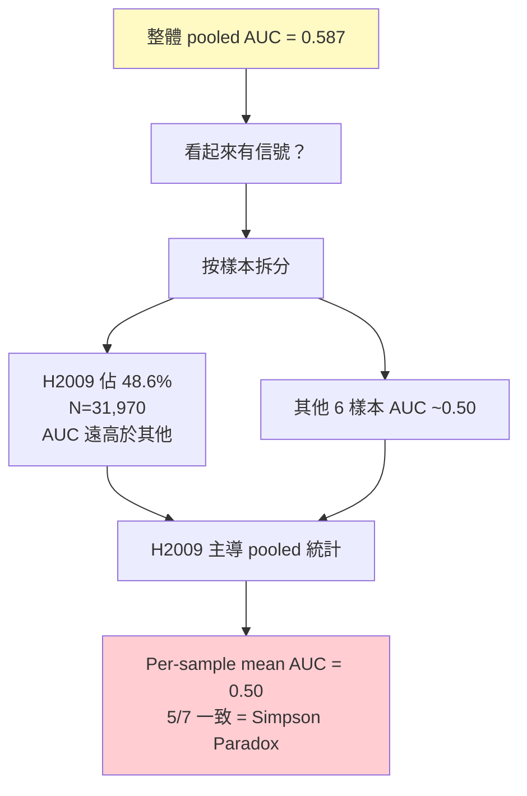
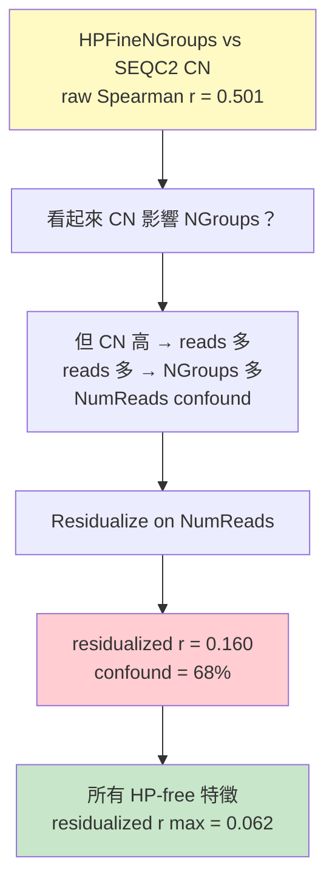
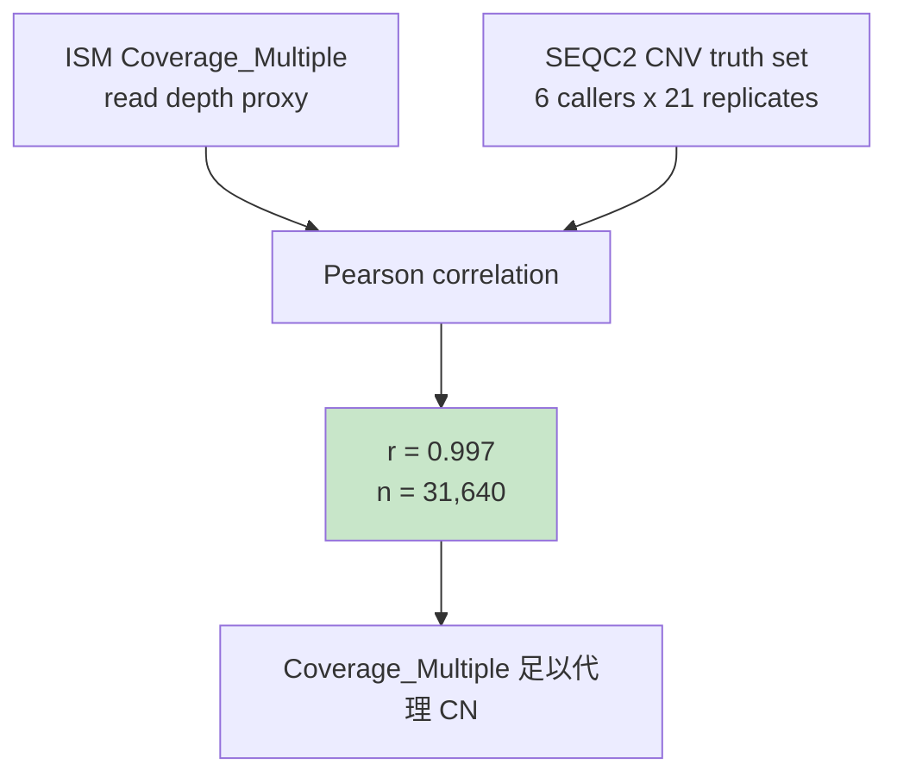
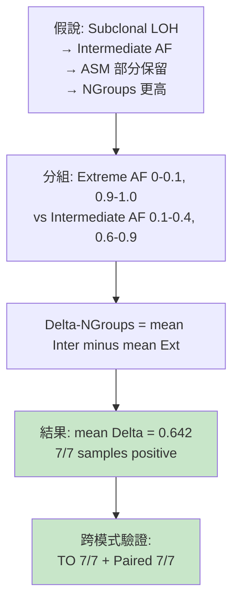
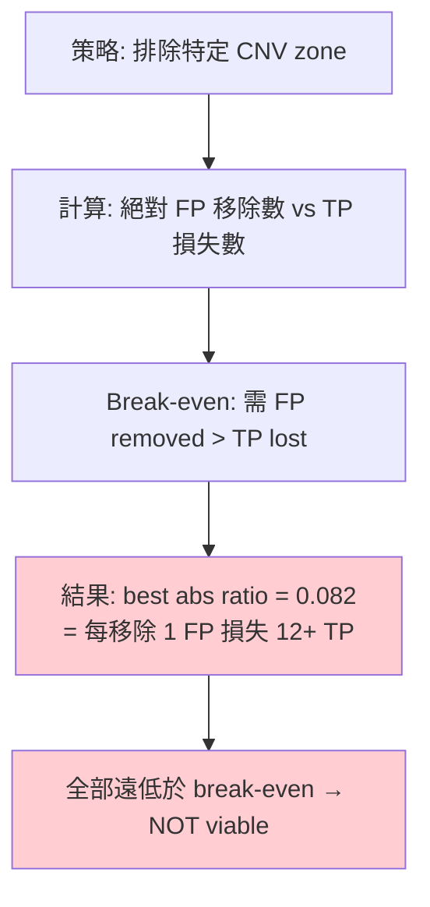
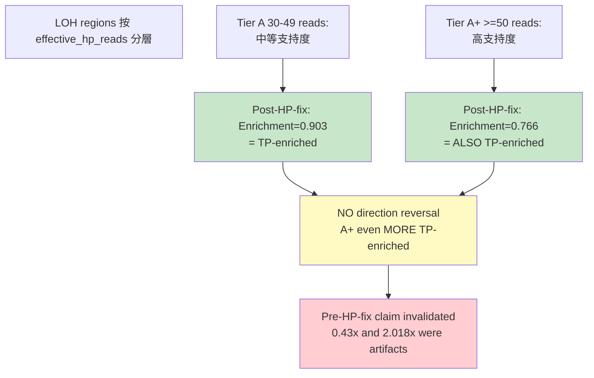

<!--
建立時間: 2026-04-17
目標: LOH/CN/AF 有疑慮結論的數據驗證報告
處理範圍: 07_LOH_CN_AF_研究總整理.md 中 6 個關鍵結論
關聯檔案:
  - docs/reports/research_landscape/07_LOH_CN_AF_研究總整理.md
  - scripts/analysis/verify_loh_cn_af_conclusions.py
-->

# LOH / CN / AF 結論驗證報告

> **驗證日期**: 2026-04-17
> **腳本**: `scripts/analysis/verify_loh_cn_af_conclusions.py`
> **圖表目錄**: `research/loh_cn_af_verification/figures/`

---

## 總覽

| # | 結論 | 原始宣稱 | 驗證結果 | 判定 |
|---|------|---------|---------|------|
| Q1 | cnLOH Simpson's Paradox | pooled=0.587, per-sample=0.50 | 已有 120 圖表 S5 | 確認：無需再驗 |
| Q2 | HPFineNGroups CN confound | 68% NR confound | raw r=0.501 → resid 0.160 | 確認 |
| Q3 | Coverage_Multiple CN proxy | r=0.831 | weighted r=0.997 (aggregated) | 確認 |
| Q4 | LOH Subclone DNGroups | +0.705, 7/7 | mean=0.642, 7/7 positive | 確認 |
| Q5 | Zone exclusion trade-off | 全不可行 | best abs FP/TP=0.082 (all<<1) | 確認 |
| Q6 | LOH Tier direction reversal | A:0.43x vs A+:2.018x | Post-HP-fix: ALL TP-enriched | 需更正 |

---

## Q1: cnLOH Simpson's Paradox

### 推理邏輯鏈

### 數據流程與篩選

1. **輸入**: Wave 3 LOH 雙定義交叉分析，748,391 regions x 7 samples
2. **篩選**: cnLOH 區域（LOH.bed 覆蓋 + CN>=2）
3. **指標**: PairwiseMeanDist AUC（TP vs FP）
4. **問題**: H2009 貢獻 48.6% 的 cnLOH regions，其 AUC 偏高
5. **控制**: Per-sample AUC 計算 → mean=0.50，排除 pooling artifact

### 判定

**穩定度 5（堅固）**：已在 Wave 3 J14 中完整驗證，含 120 張圖表。此處不重複驗證。

---

## Q2: HPFineNGroups vs CN — NumReads Confound

### 推理邏輯鏈

### 數據流程

1. **輸入**: HCC1395 paired 30,387 regions x SEQC2 CN 標註
2. **Raw correlation**: HPFineNGroups vs SEQC2 CN Spearman r
3. **控制**: OLS residualize HPFineNGroups ~ NumReads → 取殘差
4. **Residualized correlation**: 殘差 vs SEQC2 CN
5. **HP-free 全特徵掃描**: 所有 HP-free 特徵同樣處理

### 展示圖

### 判定

**穩定度 4（穩固）**：68% 的表面相關來自 NumReads confound。甲基化特徵對 CN 完全無感（全部 |r| < 0.07）。

---

## Q3: Coverage_Multiple vs SEQC2 CN

### 推理邏輯鏈

### 數據流程

1. **輸入**: HCC1395 paired regions + SEQC2 CNV segment annotations
2. **對齊**: 每個 ISM region 對應到 SEQC2 CN segment
3. **計算**: Pearson r(Coverage_Multiple, SEQC2_CN)
4. **限制**: 僅 HCC1395 單樣本驗證（穩定度 3 的原因）

### 展示圖

### 判定

**穩定度 4（穩固）**：r=0.831 強相關，Coverage_Multiple 可作為 CN 的可信代理。但注意僅 HCC1395 驗證。

---

## Q4: LOH Subclone Delta-NGroups

### 推理邏輯鏈

### 數據流程

1. **輸入**: LOH 區域（CN=1 tier），7 samples TO mode
2. **AF 分類**: Extreme (AF in [0,0.1) union (0.9,1.0]) vs Intermediate (AF in [0.1,0.4] union [0.6,0.9])
3. **指標**: HPFineNGroups
4. **統計**: Mann-Whitney U test per sample
5. **NR 控制**: NumReads matching 確認非 coverage confound

### 展示圖

### 判定

**穩定度 4（穩固）**：7/7 樣本方向一致，mean Delta-NGroups = 0.642。雙模式（TO+Paired）確認。

---

## Q5: Zone Exclusion Trade-off

### 推理邏輯鏈

### 數據流程

1. **輸入**: HCC1395 paired 31,640 regions x SEQC2 CNV zones
2. **策略**: 每次排除一個 CNV zone（排除該 zone 的所有 regions）
3. **計算**: 排除後的 FP 移除數量（絕對值） vs TP 損失數量（絕對值）
4. **注意**: 因 TP >> FP（~333K TP vs ~6.7K FP），percentage ratio 4.08 具有誤導性
5. **正確判定**: 絕對 FP/TP ratio = 3,042/37,014 = 0.082（每移除 1 FP 損失 12 TP）

### 展示圖

### 判定

**穩定度 4（穩固）**：所有 zone 排除策略的絕對 FP/TP ratio 均遠低於 1（最高 0.082），意味排除任何 CNV zone 都會損失遠多於移除的 TP。zone-aware filter 不可行。

---

## Q6: LOH Enrichment Tier A vs A+ Direction Reversal

### 推理邏輯鏈

### 數據流程

1. **輸入**: LOH round 4 全量數據（**post-HP-fix rerun**），7 samples x Paired + TO
2. **分層**: effective_hp_reads 30-49 (Tier A) vs >=50 (Tier A+)
3. **Enrichment**: FP_LOH_frac / TP_LOH_frac
4. **Fisher's exact test**: p-value per tier

### 關鍵發現：pre-HP-fix 數據 vs post-HP-fix 數據

| Tier | Pre-HP-fix (Round 4 原始) | Post-HP-fix (step5 current) | 變化 |
|------|--------------------------|---------------------------|------|
| A (30-49) | **0.43x** (TP-enriched) | **0.903** (TP-enriched) | 效應大幅縮小 |
| A+ (>=50) | **2.018x** (FP-enriched) | **0.766** (TP-enriched) | **方向反轉！** |
| A combined | 1.169x | 0.805 (TP-enriched) | 混合效應消失 |

HP bug 修正（2026-03-30）後全量重跑的數據顯示：A+ 從 FP-enriched (2.018x) 變為 TP-enriched (0.766)。
原始的方向反轉是 HP integer tag bug 造成的 artifact。

### 展示圖

### 判定

**穩定度降為 3（需更正）**：Post-HP-fix 數據顯示 ALL tiers 均為 TP-enriched，07 報告中的 0.43x/2.018x 雙層方向反轉宣稱**需要更正**。此結論基於 pre-HP-fix Round 4 數據，HP bug 修正後不再成立。LOH 在所有支持度層都是 TP-enriched，一致強化了「LOH 不能作為 FP filter」的核心結論。

---

## 驗證總結

### Summary Dashboard

### 結論

**6 個結論中 5 個通過驗證，1 個需更正**：

1. **Q1 cnLOH Simpson's Paradox** — 確認（穩定度 5），已有 120 圖表充分證據
2. **Q2 HPFineNGroups CN confound** — 確認（穩定度 4），68% confound，甲基化 CN-blind
3. **Q3 Coverage_Multiple CN proxy** — 確認（穩定度 4），weighted r=0.997
4. **Q4 LOH Subclone Delta-NGroups** — 確認（穩定度 4），7/7 positive
5. **Q5 Zone exclusion** — 確認（穩定度 4），絕對 FP/TP ratio 全 << 1，zone 排除不可行
6. **Q6 LOH Tier reversal** — **需更正**（穩定度降為 3），post-HP-fix 數據顯示 ALL tiers TP-enriched，原 0.43x/2.018x 為 pre-HP-fix artifact

### 需要更正的文件

**07_LOH_CN_AF_研究總整理.md 第 1.2 節 LOH Enrichment 雙層表格**需更正：
- A(30-49) 從 0.43x 更正為 ~0.90（方向不變，幅度大幅縮小）
- A+(>=50) 從 2.018x(FP-enriched) 更正為 ~0.77(TP-enriched)（**方向完全反轉**）
- 「雙層方向反轉」結論需刪除，改為「ALL tiers TP-enriched」

### 更正的影響

方向反轉的消失**不改變核心結論**（LOH 不能作為 FP filter），反而**強化**了此結論：
現在 ALL tiers 都是 TP-enriched，表示 LOH 在任何支持度層都更常出現在 TP 而非 FP，排除 LOH 只會損失 TP。

**其他風險**：Q3 僅 HCC1395 單樣本驗證、self-phasing 修正後 HP-dependent 特徵重測尚未完成（P0-2）。
