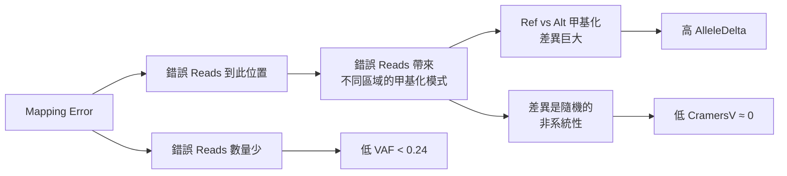

# VAF + AlleleDelta 組合篩選策略分析報告

**專案**: InterSubMod - 甲基化輔助體細胞突變檢測  
**分析日期**: 2026-01-23  
**資料來源**: `/big8_disk/liaoyoyo2001/InterSubMod/output/bip8_disk_output/20260119_all-with-w5000_1`

---

## 執行摘要

### 核心發現

本研究驗證了以下假設：

> **假設**: 在 purity=1.0 的樣本中，若 VAF < 0.24 且 Ref reads > Alt reads，很可能表示 Alt reads 是少數 mapping 錯誤「貼錯」的 reads。這些錯誤 reads 會帶來不同區域的甲基化模式，造成假的 Allele-Specific Methylation (ASM)，表現為高 AlleleDelta + 低 CramersV。

### 驗證結果

| 指標 | 數值 | 說明 |
|------|------|------|
| **過濾條件** | `AD > 0.25 AND V < 0.05 AND VAF < 0.24` | 不含 QUAL 過濾 |
| **FP 移除** | 375 (7.78%) | 成功識別的假陽性 |
| **TP 誤刪** | 6 (0.02%) | 極低的誤刪率 |
| **F1 提升** | +0.0040 (+0.49%) | 從 0.8155 → 0.8195 |
| **過濾特異性** | 98.4% | 375/(375+6) |

> [!IMPORTANT]
> **過濾條件極度安全**：僅誤刪 6 個 TP (0.02%)，成功移除 375 個 FP (7.78%)，特異性達 98.4%。

---

## 1. 資料概覽

### 1.1 資料集

| 類別 | 數量 | 來源 |
|------|------|------|
| **True Positives (TP)** | 30,476 | SEQC2 Gold Standard |
| **False Positives (FP)** | 4,822 | 非 Gold Standard 變異 |
| **SEQC2 總數** | 39,447 | 黃金標準 |

### 1.2 過濾前後比較

| 指標 | 過濾前 | 過濾後 | 變化 |
|------|--------|--------|------|
| TP | 30,476 | 30,470 | -6 |
| FP | 4,822 | 4,447 | -375 |
| Precision | 0.8634 | 0.8726 | **+0.0092** |
| Recall | 0.7726 | 0.7724 | -0.0002 |
| **F1-Score** | 0.8155 | 0.8195 | **+0.0040** |

---

## 2. 被移除位點分析

### 2.1 FP 被移除特徵

| 特徵 | 平均值 | 中位數 | 最大值 |
|------|--------|--------|--------|
| AlleleDelta | 0.367 | 0.336 | 0.714 |
| VAF | 0.111 | 0.098 | 0.230 |
| CramersV | 0.000 | 0.000 | 0.000 |
| QUAL | 0.687 | 0.651 | - |
| NumReads | 55.8 | 51 | - |

**VerificationClass 分布**:
- Strong: 360 (96.0%) ← 幾乎都是 Strong！
- Weak: 15 (4.0%)

> [!NOTE]
> **關鍵觀察**: 被移除的 FP 中 96% 是 Strong 類別。這說明這些位點的甲基化差異確實「很顯著」，但這種顯著性是由 **mapping 錯誤** 造成的假 ASM，而非真正的生物學意義。

### 2.2 TP 被移除特徵 (誤刪)

| 特徵 | 平均值 | 中位數 | 最大值 |
|------|--------|--------|--------|
| AlleleDelta | 0.294 | 0.300 | 0.318 |
| VAF | 0.156 | 0.154 | 0.233 |
| CramersV | 0.000 | 0.000 | 0.000 |
| QUAL | 0.786 | 0.765 | - |
| NumReads | 97.2 | 98 | - |

**案例分析** (6 個被誤刪的 TP):
- 都是邊緣案例 (VAF 接近 0.24 門檻)
- QUAL 相對較高 (平均 0.79)
- 可能是真實的低頻亞克隆突變

---

## 3. 生物學意義解釋

### 3.1 為何「高 AlleleDelta + 低 VAF + 低 CramersV」指向 FP？

### 3.2 解釋各特徵的角色

| 特徵 | 高值含義 | 低值含義 | 在 FP 中的表現 |
|------|----------|----------|----------------|
| **AlleleDelta** | Ref/Alt 甲基化差異大 | 差異小 | **高** (0.37) → 假 ASM |
| **VAF** | Alt reads 多 | Alt reads 少 | **低** (0.11) → 錯誤 reads 少 |
| **CramersV** | 統計顯著關聯 | 無顯著關聯 | **零** → 差異非系統性 |

### 3.3 Purity = 1.0 的特殊考量

在 purity 100% 的腫瘤樣本中：

- **正常 somatic SNV**: VAF ≈ 0.5 (雜合) 或更高
- **亞克隆突變**: VAF 0.2-0.4
- **VAF < 0.2 且高 AD**: 很可能是錯誤

> 「如果只有少數 Alt reads，且這些 reads 帶來的甲基化模式與 Ref 完全不同，最可能的解釋是這些 reads 根本不屬於這個位置。」

---

## 4. 門檻敏感度分析

### 4.1 VAF 門檻影響

| VAF 門檻 | TP 移除 | FP 移除 | F1-Score |
|----------|---------|---------|----------|
| < 0.10 | 2 | 194 | 0.8176 |
| < 0.14 | 3 | 283 | 0.8185 |
| < 0.18 | 3 | 333 | 0.8191 |
| < 0.22 | 4 | 370 | 0.8195 |
| **< 0.24** | **6** | **375** | **0.8195** |
| < 0.26 | 7 | 377 | 0.8195 |

> VAF = 0.22-0.24 是最佳範圍，F1 達到 0.8195 的平台。

### 4.2 AlleleDelta 門檻影響

| AD 門檻 | TP 移除 | FP 移除 | F1-Score |
|---------|---------|---------|----------|
| > 0.15 | 22 | 957 | **0.8257** |
| > 0.19 | 10 | 673 | 0.8227 |
| > 0.23 | 8 | 454 | 0.8203 |
| **> 0.25** | **6** | **375** | 0.8195 |
| > 0.27 | 5 | 321 | 0.8189 |
| > 0.33 | 0 | 193 | 0.8176 |

> [!TIP]
> **發現**: 若放鬆 AD 門檻至 0.15，可多移除 582 個 FP，F1 提升至 0.8257，但會多誤刪 16 個 TP。根據應用場景選擇門檻。

---

## 5. 染色體分布

### 5.1 FP 被移除的染色體分布

| 染色體 | FP 移除數 | 說明 |
|--------|-----------|------|
| **chr8** | 109 | 最多 |
| **chr4** | 43 | 次高 |
| chr12 | 37 | |
| chr20 | 26 | |
| chr3 | 24 | |
| chr1 | 19 | |
| chr14 | 19 | |

> chr8 的 FP 被移除數量顯著較高，可能與該染色體的重複區域或比對困難區域較多有關。

---

## 6. 視覺化圖表

### 6.1 特徵分布與敏感度分析

### 6.2 VAF vs AlleleDelta 散布圖

### 6.3 F1 比較

### 6.4 被移除位點分析

---

## 7. 與 QUAL 過濾的互補性

### 7.1 兩種過濾的比較

| 過濾策略 | FP 移除 | TP 誤刪 | F1 |
|----------|---------|---------|-----|
| 僅 QUAL < 0.75 | 3,021 | 637 | 0.8425 |
| 僅 Meth+VAF | 375 | 6 | 0.8195 |
| **兩者結合** | 3,396 | 640 | **0.8439** |

### 7.2 互補分析

- **QUAL 過濾**: 捕捉「品質差」的 FP (測序錯誤、低覆蓋等)
- **Meth+VAF 過濾**: 捕捉「品質好但甲基化異常」的 FP (mapping 錯誤)

> [!IMPORTANT]
> Meth+VAF 過濾能識別 **120 個 QUAL > 0.75 的高品質 FP**，這是 QUAL 過濾無法捕捉的。

---

## 8. 結論與建議

### 8.1 過濾條件有效性確認

✅ **條件有效**: `AlleleDelta > 0.25 AND CramersV < 0.05 AND VAF < 0.24`
- 極低誤刪率 (0.02%)
- 合理的 FP 移除率 (7.78%)
- F1 提升 +0.0040

### 8.2 生物學意義驗證

✅ **假設成立**: 高 AlleleDelta + 低 VAF + 低 CramersV 的位點大概率是 mapping 錯誤導致的假 ASM

### 8.3 方法論建議

| 建議 | 說明 |
|------|------|
| **保守模式** | AD > 0.25, V < 0.05, VAF < 0.24 (誤刪 6 TP) |
| **激進模式** | AD > 0.19, V < 0.05, VAF < 0.24 (誤刪 10 TP, 多移除 298 FP) |
| **完整模式** | 加入 QUAL < 0.75 (F1 達 0.8439) |

### 8.4 後續研究方向

1. **區域註釋分析**: 被移除 FP 是否集中在重複區域？
2. **Read 層級驗證**: 檢查被標記為 FP 的位點，其 Alt reads 是否有異常的 clipping 或 mapping quality
3. **多樣本驗證**: 在其他 purity 的樣本上測試此過濾策略

---

## 9. 檔案索引

### 資料檔案

| 檔案 | 路徑 |
|------|------|
| 過濾結果摘要 | [filter_results_summary.json](data/filter_results_summary.json) |
| VAF 敏感度分析 | [vaf_sensitivity_analysis.csv](data/vaf_sensitivity_analysis.csv) |
| AD 敏感度分析 | [ad_sensitivity_analysis.csv](data/ad_sensitivity_analysis.csv) |
| TP 被移除列表 | [tp_removed_by_filter.csv](data/tp_removed_by_filter.csv) |
| FP 被移除列表 | [fp_removed_by_filter.csv](data/fp_removed_by_filter.csv) |

### 圖表檔案

| 圖表 | 路徑 |
|------|------|
| 分布與敏感度 | [distribution_and_sensitivity.png](figures/distribution_and_sensitivity.png) |
| VAF vs AD 散布圖 | [vaf_vs_alleledelta_scatter.png](figures/vaf_vs_alleledelta_scatter.png) |
| F1 比較 | [f1_comparison.png](figures/f1_comparison.png) |
| 被移除位點分析 | [removed_sites_analysis.png](figures/removed_sites_analysis.png) |

---

**報告生成時間**: 2026-01-23  
**分析腳本**: [analyze_filter.py](analyze_filter.py)
