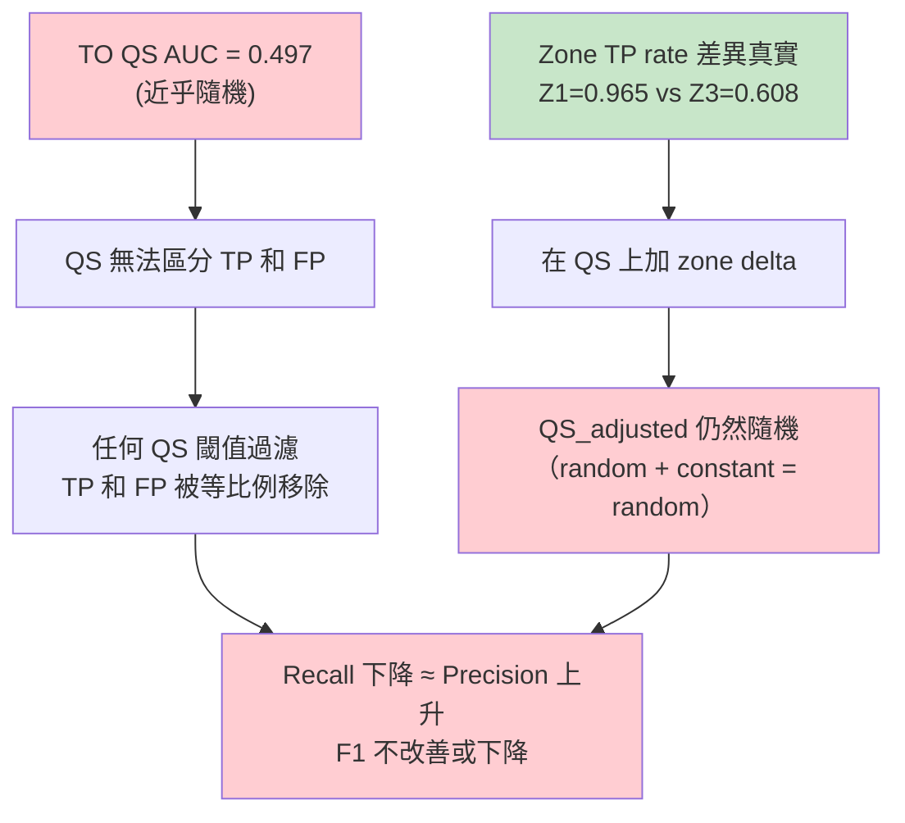

<!--
建立時間: 2026-04-17 23:00
目標: Zone-Aware QS 調整模擬 — 驗證是否能改善 TO F1
處理範圍: 7 samples TO mode × 5 zone-delta 配置 × 21 QS 閾值
關聯檔案:
  - docs/concepts/2026/04/20260417_Zone_Aware_Confidence_Framework_01.md
  - research/zone_aware_validation/20260417_H1_H3_Zone_Validation_Report_01.md
  - scripts/analysis/zone_aware_qs_simulation.py
-->

# Zone-Aware QS Adjustment Simulation — TO F1 Impact

> **結論**: ❌ **NEGATIVE** — Zone-Aware QS 調整無法改善 TO F1
> **根本原因**: TO QS AUC=0.497（隨機），調整隨機分數無法產生有效過濾
> **影響**: Zone-Aware 的價值確認僅在 characterization 而非 F1 改進

---

## 一、實驗設計

### 方法

```
For each region:
  QS_adjusted = QS_original + zone_delta[zone]

For each QS threshold T (0, 5, 10, ..., 100):
  Keep variants with QS_adjusted >= T
  Compute F1 = 2 * P * R / (P + R)
    where P = TP_kept / (TP_kept + FP_kept)
          R = TP_kept / truth_total
```

### Delta 配置

| 配置 | Z1 | Z2 | Z3 | Z4 | Z5 |
|------|:--:|:--:|:--:|:--:|:--:|
| No Adjustment | 0 | 0 | 0 | 0 | 0 |
| Conservative | +5 | +5 | -5 | 0 | -5 |
| Moderate | +10 | +10 | -10 | 0 | -10 |
| Aggressive | +15 | +15 | -15 | 0 | -15 |
| Asymmetric | +10 | +10 | -15 | 0 | -10 |

### Zone 定義（修正版 Z1）

- Z1: LOH + Intermediate AF + NGroups ≥ 2 (TO 4.6%, TP rate 0.965)
- Z2: NGroups ≥ 4 + NR ≥ 80 (TO 6.1%, TP rate 0.891)
- Z3: LOH + Extreme AF + NGroups ≤ 1 (TO 12.5%, TP rate 0.608)
- Z4: Normal Diploid, CovM [0.7, 1.3] (TO 44.6%, TP rate 0.694)
- Z5: CN Gain + Low NGroups (TO 4.3%, TP rate 0.667)

---

## 二、結果

### Optimal Threshold（每樣本最佳 F1）

| Sample | No Adj F1 | Best Adj F1 | Delta | Best Config | Best T |
|--------|:-:|:-:|:-:|:--|:-:|
| H2009 | 0.8210 | 0.8210 | +0.0000 | (all) | 0 |
| H1437 | 0.6102 | 0.6102 | +0.0000 | (all) | 0 |
| HCC1395 | 0.7165 | 0.7165 | +0.0000 | (all) | 0 |
| HCC1395_DORADO | 0.7225 | 0.7225 | +0.0000 | (all) | 0 |
| HCC1937 | 0.2958 | 0.2958 | +0.0000 | (all) | 0 |
| HCC1954 | 0.3637 | **0.3648** | **+0.0010** | Aggressive | 50 |
| COLO829 | 0.7190 | 0.7190 | +0.0000 | (all) | 0→15 |

**6/7 樣本的最佳 F1 在 T=0（不過濾）**。Zone 調整在 HCC1954 上僅提升 +0.001。

### F1 Curves


所有樣本的 F1 曲線隨 QS 閾值上升而單調下降（或近似單調下降）。Zone-aware 調整的曲線幾乎與無調整重疊。

### Cross-Config Summary

| 配置 | Mean F1 | Mean Delta | Positive Samples |
|------|:-:|:-:|:-:|
| No Adjustment | 0.6070 | +0.00000 | 1/7 |
| Conservative | 0.6070 | +0.00007 | 2/7 |
| Moderate | 0.6070 | +0.00007 | 2/7 |
| Aggressive | 0.6071 | +0.00015 | 2/7 |
| Asymmetric | 0.6071 | +0.00014 | 2/7 |

---

## 三、根因分析

### 為什麼 Zone-Aware QS 調整失敗



核心問題：**在隨機分數上做 zone-based 線性調整，結果仍是隨機分數**。Zone 差異化只有在底層分數有基本區分力時才能放大效果。

### 為什麼 HCC1954 微幅改善

HCC1954 是唯一正向樣本（+0.001）：
- HCC1954 TO FP:TP = 50,218:17,068 = 2.94:1（FP 佔 74.6%，7 樣本中最高）
- Zone Z3 在 HCC1954 的 TP rate 僅 0.050（幾乎全 FP）
- Aggressive 配置 Z3 -15 將大量 Z3 FP 推到閾值下方
- 但效果極微（Δ=+0.001）因為同時也損失 Z3 中 5% 的 TP

### 與已知結論的一致性

| 已知結論 | 本次驗證 | 一致性 |
|---------|---------|-------|
| TO QS AUC=0.497 隨機 | QS 過濾全面使 F1 下降 | ✅ |
| caller_af 是唯一有效判別器 | Zone 用 ISM 特徵定義，無法超越 caller | ✅ |
| ISM TO 甲基化增益為負 | QS 調整（甲基化衍生）在 TO 無效 | ✅ |
| LOH 不能作為 FP filter | Zone-based LOH 調整也無法過濾 FP | ✅ |

---

## 四、Zone-Aware Framework 角色重新定位

### ❌ 不適用

- **TO F1 改進**：QS 調整無效（本報告確認）
- **Post-hoc FP 過濾**：Zone 不能作為 binary filter（之前已確認）

### ✅ 適用

- **Characterization annotation**：Zone 提供 region-level biological context
  - Z1 = subclonal LOH with active ASM
  - Z3 = complete LOH with artifact risk (in TO)
  - Z2 = high somatic heterogeneity marker

- **Paired mode 微調**（未測試）：Paired QS 有區分力，zone 調整可能放大效果
  - 但 Paired TP:FP=24:1，改進空間極小

- **論文 evidence layer**：「ISM 不只 call TP/FP，更提供 epigenetic zone context」
  - 即使不改 F1，zone annotation 對生物學解讀有價值

- **未來 QS 重設計的輸入**：如果重建 TO QS（用 zone 作為 primary feature 而非 adjustment），zone 的 TP rate 差異可能成為有效信號

---

## 五、Next Steps

1. ~~QS 調整模擬~~ ← 已完成，NEGATIVE
2. **考慮 Zone 作為 primary classification feature**：不是調整 QS，而是直接用 zone assignment 作為 TP/FP 預測特徵（需要 ML 重訓練）
3. **Paired mode QS 調整測試**：Paired QS 有區分力，zone 調整可能有效（但 TP:FP=24:1 限制改進空間）
4. **聚焦 characterization 價值**：Zone annotation 作為論文的 evidence layer，不追求 F1

---

## 六、輸出檔案

| 檔案 | 說明 |
|------|------|
| `zone_aware_qs_simulation.tsv` | 完整模擬結果（7 samples × 5 configs × 21 thresholds） |
| `zone_aware_optimal_thresholds.tsv` | 每樣本每配置最佳閾值 |
| `figures/zone_aware_qs_f1_curves.png` | F1 vs Threshold 曲線圖 |
